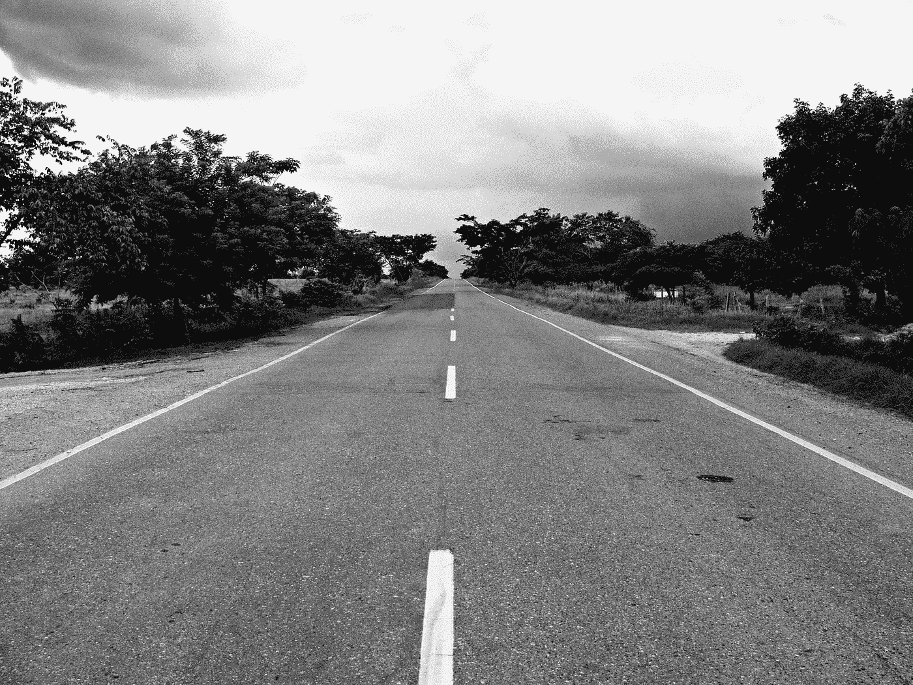
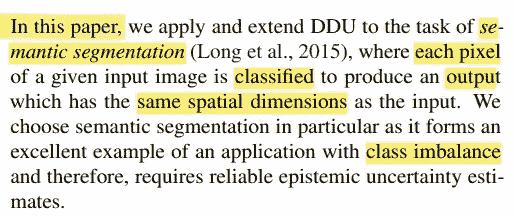
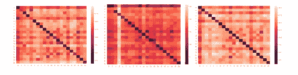
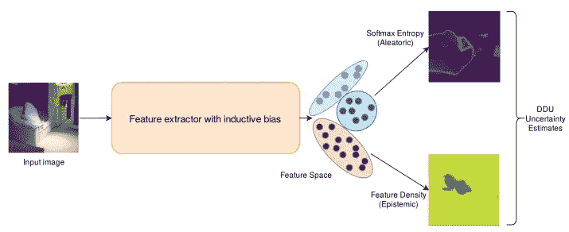
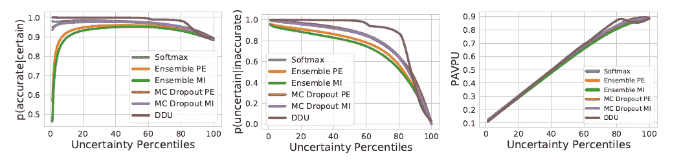
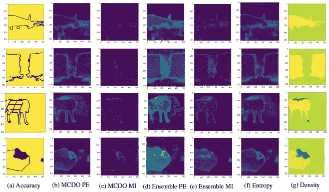
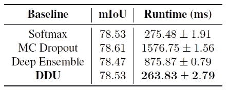

# 论文摘要[语义分割的深度确定性不确定性]

> 原文：<https://medium.com/mlearning-ai/paper-summary-deep-deterministic-uncertainty-for-semantic-segmentation-6ab6d2029c8c?source=collection_archive---------3----------------------->

> **请注意，这篇帖子是为了我将来可能的研究在没有完全阅读** [**论文**](https://arxiv.org/pdf/2111.00079) **的情况下，回看和复习关于这个题目的材料。**

source is [here](https://www.pexels.com/photo/grayscale-photography-of-concrete-road-during-daytime-68272/)

深度确定性不确定性(DDU)使得计算和分离模型中的随机不确定性变得可行。在这种情况下，主要关注的是同一类中不同位置的像素的特征表示的熟悉程度。其结论是，有可能独立使用 DDU 位置。与像素相关的像素相比，这种 DDU 将导致消耗的存储器显著减少。研究人员使用 [DeepLab-v3+架构](https://arxiv.org/abs/1802.02611v3)，并在 Pascal VOC 2012 上应用，以展示他们在 MC 丢失和深度集成方面的改进。

# 介绍

除了部署深度学习模型中的预测，不确定性可靠性对于安全关键型应用(例如自动驾驶、医疗诊断等)至关重要。).在这个问题上已经提出了许多方法，要求通过该模型向前传递几次。

有几种方法可以获得向前传球的不确定性，如 [DUQ](https://proceedings.mlr.press/v119/van-amersfoort20a.html) 和[ANP](https://arxiv.org/abs/2006.10108)；然而，尽管这两种方法是合适的，但是它们需要对结构和训练设置进行全面的改变，并且需要对额外的超参数进行微调。

**DDU:**

*   可以利用具有适当归纳偏差的特征空间密度
*   防止功能崩溃问题

由于要素折叠，样本(非分布(OoD))被映射到要素空间中的非分布区域，使得模型对输入数据过于自信。因此，模型上适当的归纳偏差对于捕捉特征空间密度的不确定性是必要的。

有两种类型的不确定性:

1.  ***认知不确定性:*** ******捕捉到什么模式不知道
    ***** 对于看不见的或 OoD 输入为高，并且可以随着更多的训练数据而降低*
2.  ****随机不确定性***
    ***** 捕捉分布内样本中的模糊性和观测噪声*

**

*本研究使用 DDU 进行语义分割，以生成与分类输入相同维度的输出。之所以选择语义分割，是因为它对阶级不平衡有好处。*

# *语义分割中的 DDU*

## *DDU 简介:*

*当我们训练模型时(使用[双 Lipschitz 约束](https://en.wikipedia.org/wiki/Lipschitz_continuity))，我们可以使用对所有训练样本的一次遍历来计算每个类别的特征空间均值和协方差。这两个将被用来拟合一个[高斯判别分析(GDA)](https://towardsdatascience.com/gaussian-discriminant-analysis-an-example-of-generative-learning-algorithms-2e336ba7aa5c) 。*

## *独立于像素的类均值和协方差:*

*在语义分割中，每个像素都有自己的预测和相应的分布。在这项研究中，我们可以计算均值和协方差矩阵，而不需要像素，就像在多类分类中一样。*

**

*Figure 1\. L2 distances between the feature space mean of different classes for a pair of distant pixels on the Pascal VOC 2021\. vals set: (left) Pixels (10,255) and (500,225), (middle) Pixels (234,349) and (36,22) and (right) Pixels (300,500) and (400,255)*

*在该图中，作者绘制了所有对的特征空间平均值之间的 L2 距离。结果是**同等级**的平均值**比其他等级**更接近。很明显，卷积核在整个特征空间表示中是共享的。*

## *计算特征密度:*

*作者拟合了一个 GDA，假设像素是自主样本。有两个动作同时执行:*

1.  *获得每个类别(非像素)的一个平均值和一个协方差，然后应用 GDA。*
2.  *获得来自该模型的每像素 softmax 熵。*

*因此，作者可以在语义分割中用单一的确定性模型来释放任意的和认知的不确定性。从下图可以看出:*

**

*Applying DDU in the context of semantic segmentation*

# *E实验*

*为了评估 DDU 在语义分割上的可靠性，研究人员使用 Pascal VOC 数据集，并将其与其他三种不确定性基线(softmax 熵、MC Dropout 和 Deep Ensembles)进行比较。*

## ****架构和培训设置:****

*用于本研究的超参数可描述如下:*

*   *纪元= 50*
*   *优化器= SGD(动量=0.9，重量衰减=5e-4)*
*   *lr = 0.007*

## ***基线和不确定性指标:***

1.  *[软最大熵](https://towardsdatascience.com/softmax-and-uncertainty-c8450ea7e064)*
2.  *[MC 辍学(MCDO)](https://arxiv.org/abs/2110.03260)*
3.  *[深度合奏](https://arxiv.org/pdf/2007.08792)*

## *评估指标:*

*为了评估每种方法，作者使用了 *p(准确—确定)、p(不确定—不准确)、*和 *PAPU，如下所示:**

*   ****p(准确—确定)*** *:* 假设模型对预测有信心，预测准确的概率*
*   ****p(不确定—不准确)*** *:* 模型在不准确预测上不确定的概率。*
*   ****PAPU****:*模型对准确预测有信心或对不准确预测不确定的概率。*

*这三个可以形象化如下:*

**

*Fig 3\. Evaluation metrics on various baselines*

*四个样本的不确定性估计值可以如下所示:*

**

*(a) shows pixel-wise accuracy with bright signifying accurate and dark, inaccurate. (b) and (c) show predictive entropy (PE) and mutual information (MI) obtained from the MC Dropout (MCDO) baseline respectively, (d) and (e) show the PE and MI from deep ensembles. (f) maps per-pixel softmax entropy. Finally, (g) is feature density*

*下表提供了对 Pascal VOC 2012 验证集准确性的评估及其所需时间:*

**

*Table 2\. Pascal VOC validation set and runtime in milliseconds of a single forward pass for each above-mentioned baselines*

**注意:*单次向前传球:*

1.  *MC 辍学:它包括 5 个随机向前传球。*
2.  *集合:它从 3 个集合成分得到预测。*

## *观察:*

*   *DDU 和 normal softmax 的运行时间优于其他软件。(表 1)*
*   *DDU 在这三项指标上都有较高的值。(图 3)*
*   *DDU 特征密度捕捉认知的不确定性，而 softmax 熵捕捉随机的不确定性。(图 4)*

# *结论:*

**

*最后，我们发现 DDU 在 FCNN 架构下可以很好地完成语义切分任务。它可以独立于像素执行。*

*结论是，DDU 比其他同龄人表现得更好。*

**NB。深度/机器学习中可能包含的不确定性可以帮助我们* [*调试模型*](https://becominghuman.ai/using-uncertainty-to-interpret-your-model-67a97c28fea5) *并使它们更加健壮。**

**

*source is [here](https://unsplash.com/photos/PXB7yEM5LVs)*

> *如果发现任何错误，请发电子邮件到 rezayazdanfar1111@gmail.com 找我。同时，在我的推特 [*这里*](https://twitter.com/reza__yazdanfar) *关注我，在我的领英* [*这里*](https://www.linkedin.com/in/reza-yazdanfar-b69055156/) [*访问我。*](https://rezayazdanfar.medium.com/) *最后，如果你有任何想法或建议，我对此持开放态度，你只需要在*[*LinkedIn*](https://www.linkedin.com/in/reza-yazdanfar-b69055156/)*上给我发消息。🙂**

* [## Mlearning.ai 提交建议

### 如何成为 Mlearning.ai 上的作家

medium.com](/mlearning-ai/mlearning-ai-submission-suggestions-b51e2b130bfb)*