# 论文摘要:屏蔽自动编码器是可扩展的视觉学习者

> 原文：<https://medium.com/mlearning-ai/paper-summary-masked-autoencoders-are-scalable-vision-learners-2dea8cdb1884?source=collection_archive---------4----------------------->

## 由于有限的 GPU，对于我们来说，用论文中提到的大型模型或长时间计划进行训练确实是一个挑战。

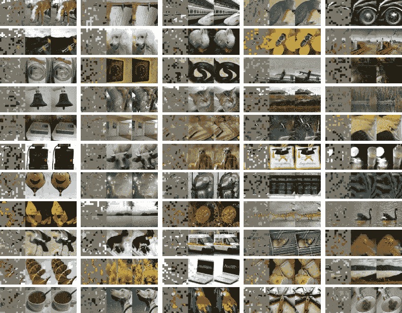

Source: [[1]](https://arxiv.org/pdf/2111.06377)

这篇论文是可以在现实世界中实际应用的令人兴奋的研究之一；换句话说，这篇论文提出**屏蔽自动编码器** (MAE)是**可扩展的**自我监督学习器。通过掩蔽输入(这里是图像)的随机补丁并重建丢失的像素来证明这一点是非常有趣的。

研究人员获得了两个巧妙的设计:

1.  开发**非对称编码器-解码器架构**
2.  屏蔽大部分输入产生了一个不平凡且有意义的自我监督任务**。**

此外，获得上述两种设计表明，我们可以用**大型训练数据集**高效且有效地训练我们的模型。表示**加速训练**加速了**3 倍或更多**，并且**精度**提高了**。**

**这种可扩展的方法使得学习泛化能力好的高容量模型变得可行(这可以在实验结果中看到)。**

# **介绍**

**有许多架构是不可停止的，扩展了它们的能力和容量；此外，随着硬件模型的进步，可以很容易地适应数百万张图像。**

**这就承认了大量的数据可以在 *NLP* s 中轻松看到。基于 **GPT** 中的*自回归语言建模*和 **BERT** 中的*屏蔽自动编码*的答案并不复杂:它们删除一定比例的数据，并学习预测被删除的内容。这些方法使得 *NLPs 模型*的训练，包括数十亿亿的参数都是可行的。**

**这篇论文提到，屏蔽自动编码器作为通用去噪自动编码器的想法可以毫无问题地在计算机视觉中实现。**

*****是什么让蒙版自动编码在视觉和语言上有所不同？*** 为了回答这个问题，作者带来了以下观点:**

*   **在过去的十年中，CNN 一直被认为是一个强有力的模型。一般来说，它们在规则的网格上执行，并且不能直接集成“指示器”(掩码标记、位置嵌入等)。这个差距不再被考虑，因为 2021 年的研究([一张图像抵得上 16x16 个字:大规模图像识别的变形金刚](https://arxiv.org/pdf/2010.11929))。**
*   **信息密度:语言是人类制造的信号(高度语义和信息密集)。图像是自然生成的信号(大量的空间冗余)。为了应对这种不同，作者将展示一种优于计算机视觉的简单策略:*屏蔽大多数路径。***
*   **自动编码器的解码器(将潜在表示映射回输入)对图像和文本的作用不同。在 vision 中:*像素*被重建(因此，输出具有较低的语义级别)。相比之下，在语言中，该模型预测包含丰富语义信息的缺失单词。**

**本研究中提出的 **MAE** (屏蔽自动编码器):**

1.  **屏蔽输入图像中的随机面片**
2.  **在像素空间中重建缺失的面片**

**有一种*非对称编码器-解码器*设计，其中编码器仅在补丁的可见子集上运行(没有掩码令牌)。解码器从潜在表示连同掩码标记一起重建输入。**

**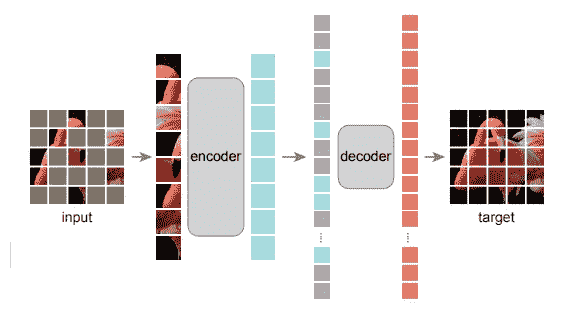**

**Fig 1\. The architecture of the proposed **MAE** in this research. Source: [[1]](https://arxiv.org/pdf/2111.06377)**

**通过将掩码标记转移到小型解码器，可以减少计算量。因此，我们可以实现高屏蔽率(例如 75%)，因此，我们可以优化精度，同时，在少数小块(例如 25%)上训练模型。此外，预训练时间可以减少 3 倍或更多(同样，可以减少存储器消耗)。**

# **相关著作**

## **蒙面语言建模(+同行如[伯特](https://arxiv.org/pdf/1810.04805)、 [GPT](https://towardsdatascience.com/gpt-3-a-complete-overview-190232eb25fd) 等。)**

*   **这些是成功的模型，已用于 **NLP** 中的**预训练**。这些为**顺序输入**提供信息，以预测缺失的**内容。**此外，这些也是可扩展的。**

## **自动编码**

*   **这个经典方法包括两个主要部分:**编码器**(将输入映射到潜在表示)和**解码器**(重建输入)。比如 ***PCA*** ， ***K-means*** ，***DAE****(去噪自动编码器)等。***

## ***掩蔽图像编码方法***

*   ***这些从图像中学习表征。***

## ***自我监督学习***

*   ***在这里，工程师们往往会集中精力做各种文本任务进行前期训练，比如[对比学习](https://towardsdatascience.com/understanding-contrastive-learning-d5b19fd96607#:~:text=Contrastive%20learning%20is%20a%20machine,points%20are%20similar%20or%20different%20.&text=In%20essence%2C%20contrastive%20learning%20allows,to%20do%20the%20same%20thing.)；这模拟了两个或多个视图之间的图像相似性和不相似性。这些都与[数据增强](https://towardsdatascience.com/tagged/data-augmentation)紧密相连。***

# ***方法***

***本研究中提出的 **MAE** 并不复杂；一个**简单的自动编码器**，它使用**局部观察**(输入图像不完整)，然后结果图像是**完整的** ( *见图 1* )。这种自动编码器几乎和以前的(经典)自动编码器一样，除了它的*非对称架构*不同于其他。这种设计让模型不在图像的所有像素上训练。***

## ***掩饰***

***研究人员将一幅图像分割成**规则的非重叠小块，**然后对小块的子集进行采样，并掩盖其余部分(例如移除)。本研究中使用的策略(*)是直接的:**随机抽样**小块(无替换)，遵循 [**均匀分布**](https://en.wikipedia.org/wiki/Continuous_uniform_distribution) (避免了潜在的中心偏差)。****

****高遮蔽率(补片移除率)的结果会显著消除大量补片，因此产生了一个无法通过从可见的相邻补片外推来简单解决的任务(*见图 2–4*)。****

****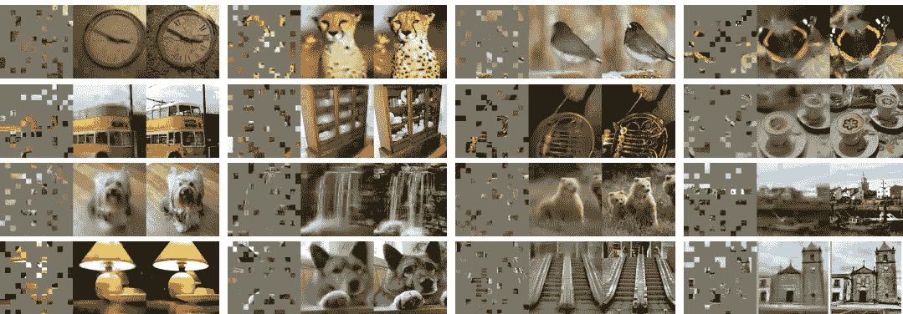****

****Fig. 2\. Example results on **ImageNet** validation images, the left is the **masked image** the middle is **MAE reconstruction** and, the right is the **ground-truth.** Source: [[1]](https://arxiv.org/pdf/2111.06377)****

****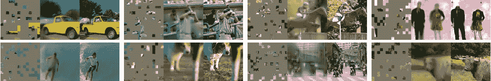****

****Fig. 3\. Example results on **COCO** validation images, using an **MAE** **trained** on ImageNet. Source: [[1]](https://arxiv.org/pdf/2111.06377)****

****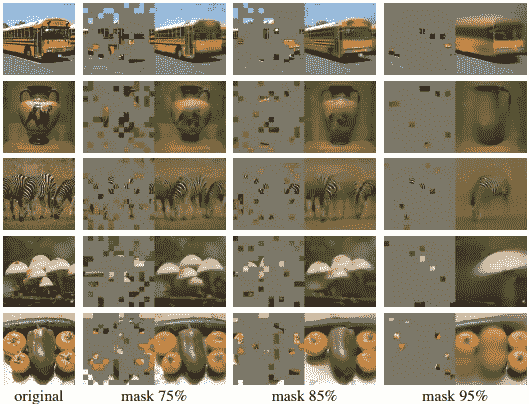****

****Fig. 4\. Reconstructions of **ImageNet** validation images, using an **MAE pre-trained** (masking ratio 75–95%). Source: [[1]](https://arxiv.org/pdf/2111.06377)****

## ****MAE 编码器****

****这里的编码器是 **ViT** ( [*视觉转换器*](https://arxiv.org/pdf/2010.11929) )并且仅仅应用于*可见的、未被遮盖的补丁*。本研究中的编码器通过使用具有*位置嵌入的*来嵌入补丁，然后通过一系列 ***变换块*** 来操作结果集。顺便说一下，在这项研究中，编码器只对全部数据的 25%进行了处理。由于这个原因，**屏蔽补丁**被消除了，没有使用 make 令牌，这让我们只用大数据集的很小一部分来训练非常大的编码器。******

## ****MAE 解码器****

****解码器的输入是全套的**令牌，**包括(i) **编码的可见补丁**。掩码令牌可以被描述为显示要预测的 ***缺失补丁*** 的存在的**共享倾斜向量**。由于将**位置嵌入**添加到记号，掩模记号将具有关于它们在图像中的位置(位置)的**信息。******

*   *******解码器*** 仅用于**预训练**时进行图像重建， ***编码器*** 仅用于**生成图像表示**进行识别。****

## ****重建目标****

****解码器的输出是代表一个小块的像素值的矢量，解码器的最后一层是一个*线性投影。*使用的损失函数是在*像素空间*中的**重建的**和**原始图像**之间的 *MSE* ( [**均方误差**](https://en.wikipedia.org/wiki/Mean_squared_error) **)** 。****

## ****简单实现****

****实施 *MAE 预培训非常简单，步骤如下:*****

1.  ******为每个补丁生成**一个**令牌**(怎么做？通过具有附加位置嵌入的线性投影)****
2.  ******随机洗牌**令牌列表 ***随机*** 然后，**删除**列表的最后一部分(基于屏蔽比率)****

*   ****这一过程生成*一小部分令牌*(没有替换的采样补丁)****

****3.在编码之后，掩码标记的列表被添加到编码补丁的列表中，并且*去混洗*这个完整的列表(颠倒随机混洗操作)以与它们的目标相等。****

*   ****不需要特定的任务(*，例如稀疏操作*)。这使得我们的工作更快。****

# ****ImageNet 实验****

****作者在 **ImageNet-1K (IN1K)** 上做了**自我监督预训练**，用**端到端微调**或**线性探测来评估表示。******

******基线:**[**ViT-Large**](https://arxiv.org/pdf/2010.11929)**(Vision Transformer(ViT)模型在 ImageNet-21k (14M 图像，21，843 类)上以 224x224 的分辨率预训练，并在 ImageNet 2012 (1M 图像，1，000 类)上以 384x384 的分辨率微调)用作脊线。******

## ******主要属性******

## ********掩蔽比:********

******从图 5 中我们可以理解掩蔽比的影响作用。微调和线性探测的比率都是 75%(与 BERT 相反，掩蔽比率为 15%)。******

******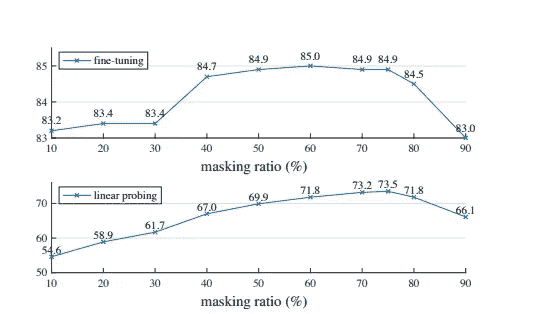******

******Fig.5 **Masking ratio.** Source: [[1]](https://arxiv.org/pdf/2111.06377)******

******从*图 5* 中，我们可以得出结论，线性探测和微调结果遵循*不同的*趋势。对于微调，它更像一个对比率不太敏感的倒 U 形，而对于线性探测，精度逐渐上升，直到达到最佳百分比。******

## ******解码器的设计******

******我们可以灵活地设计解码器的结构。******

******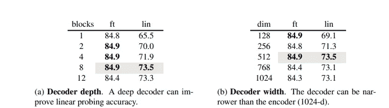******

******Source: [[1]](https://arxiv.org/pdf/2111.06377)******

*******(一)足够深的解码器对于线性探测是严重的。我们可以将它解释为像素重建任务和识别任务之间的空白空间:自动编码器中的最后几层更专门用于重建，但与识别更不相关。合适的深度解码器可以计算重构特殊化，将潜在表示留在更抽象的层次上。*******

********(b)解码器宽度是通道的数量。作者使用了在微调和线性探测下工作良好的 512-d。不太宽(窄)的解码器也可以很好地配合微调。********

## *******掩码令牌*******

*******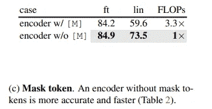*******

*******Source: [[1]](https://arxiv.org/pdf/2111.06377)*******

*******MAE 设计的关键是**跳过**编码器**中的**掩模 toke，然后将其应用于**轻量解码器**。这种跳过大大降低了训练计算成本。整体 FLOPs 减少 3.3 倍 ***(c)*** 。*******

****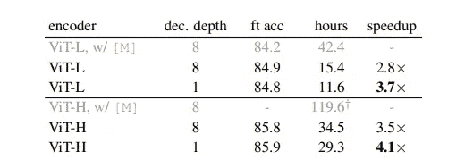****

****Table 2\. **Wall-clock time** of the MAE training (800 epochs). Source: [[1]](https://arxiv.org/pdf/2111.06377)****

****挂钟时间加速比一个模块(较小的解码器)、一个 ViT-H(较大的编码器)或两者都大。****

## ****重建目标****

****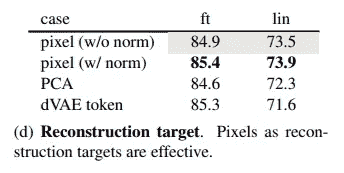****

****Source: [[1]](https://arxiv.org/pdf/2111.06377)****

****多种结构用于比较。结果是在**像素**上用**没有归一化**。这提高了局部对比度**。******

## ******数据扩充******

******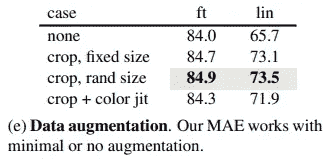******

******Source: [[1]](https://arxiv.org/pdf/2111.06377)******

******在这里，我们可以实现*的**对模型的影响。研究人员在两种状态下都使用了**固定*或*随机大小*。**********

## ****掩模取样****

****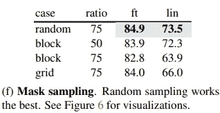****

****Source: [[1]](https://arxiv.org/pdf/2111.06377)****

****下面是不同掩码采样策略的比较结果。简单随机抽样优于 MAE 它允许更高的掩蔽比(这提供了显著的**加速**和良好的**精度**)。****

# ****结论****

******计算成本**是 **NLP** 和**计算机视觉**任务的一个基本因素。**不复杂的模型**是**可扩展的**是工程师和科学家的**主要关注点**。**在 NLP** ，**简单的自我监督学习算法**从指数缩放模型中获益。**在计算机视觉**中，**实际预训练样本**被有效监督。****

****在这个**研究**中，研究人员提出了一个变通方法，随机消除**补丁** ( **不是**消除**对象**)，也就是**最有可能** *不是*形成一个语义段。此外，提出的 MAE **重建**像素(这些像素是*而不是*语义实体)。这种主动方法在现实世界的计算机视觉任务中是有益和实用的，特别是对于复杂程度为**的**繁重任务**。通过消除随机补丁，该模型需要**更少的能量**和**更少的输入**用于**预训练**。******

****参考资料:****

1.  ****He，k .等人，*掩蔽自动编码器是可伸缩视觉学习器。arXiv 预印本 arXiv:2111.06377，2021。*****

> ******请注意，这篇帖子是为了我将来可能的研究在没有完全阅读** [**论文**](https://arxiv.org/pdf/2111.06377) **的情况下，回看和复习关于这个题目的材料。本文使用的所有图片来源均为** [**原文**](https://arxiv.org/pdf/2111.06377) **。******
> 
> ****如果发现任何错误，请告诉我。同时，你可以在 Twitter [这里](https://twitter.com/reza__yazdanfar)或者 LinkedIn [这里](https://www.linkedin.com/in/reza-yazdanfar-b69055156/)联系我。最后，如果你有任何想法，我都愿意讨论，你唯一需要的就是在 LinkedIn 或 twitter 上给我发消息。🙂****

**** [## Mlearning.ai 提交建议

### 如何成为 Mlearning.ai 上的作家

medium.com](/mlearning-ai/mlearning-ai-submission-suggestions-b51e2b130bfb)****