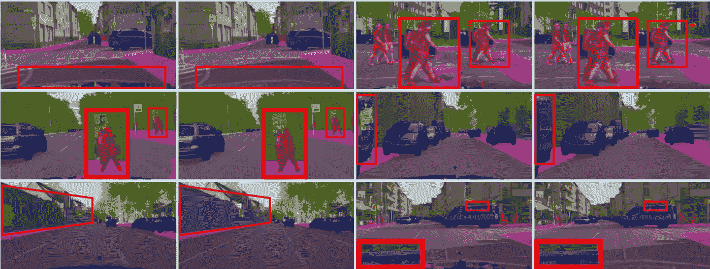
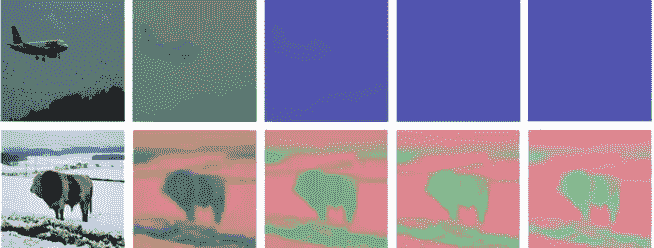
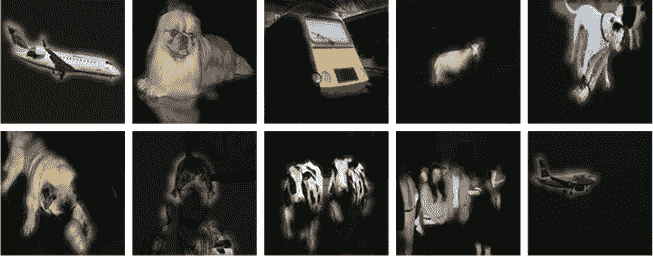
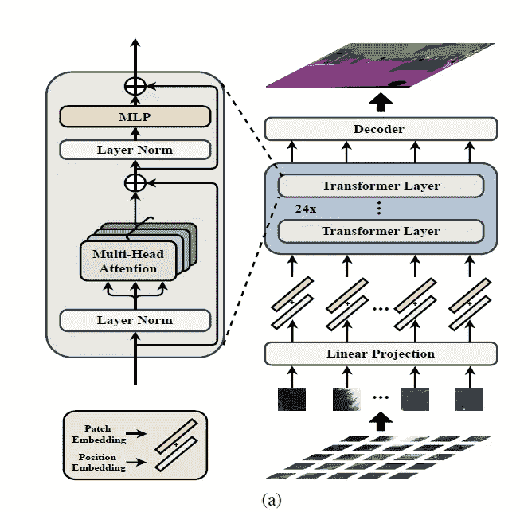
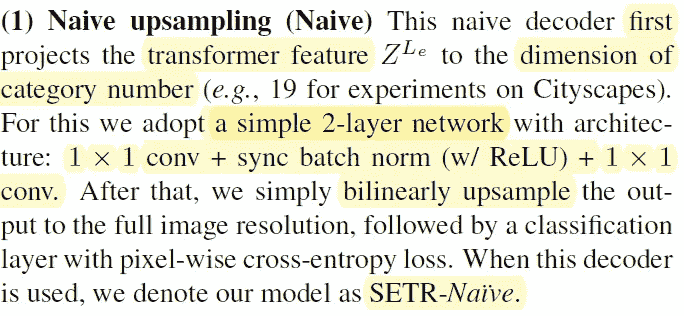
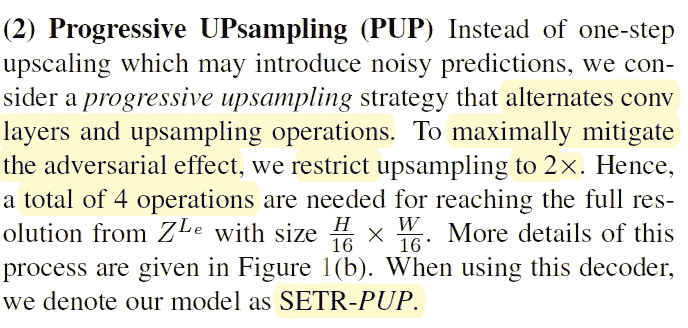
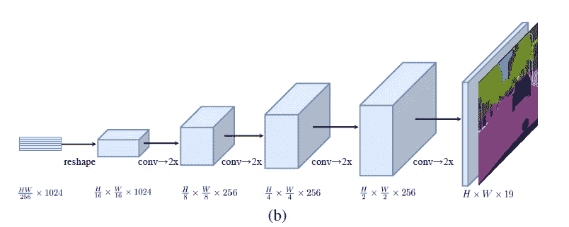
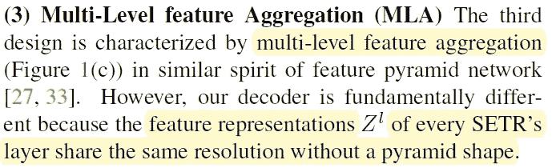
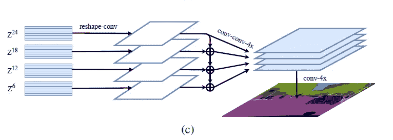

# 论文摘要[从序列到序列的角度用转换子重新思考分段]

> 原文：<https://medium.com/mlearning-ai/paper-summary-rethinking-segmentation-from-a-sequence-to-sequence-perspective-with-transfromers-26868efacc52?source=collection_archive---------2----------------------->

> **请注意，这篇帖子是为了我将来可能的研究在没有完全阅读** [**论文**](https://arxiv.org/pdf/2012.15840) **的情况下，回看和复习关于这个题目的材料。**

大多数分段方法采用全卷积网络(FCN)。编码器降低空间分辨率，并学习具有更大感受域的更抽象/语义的视觉概念。由于上下文建模对分割至关重要，增加感受野成为关注的核心。然而，架构保持不变(基于编码器-解码器的 FCN)。

作者试图通过将语义分割视为一种顺序预测来实现本文中的替代。开发了纯变换器(没有卷积或分辨率降低)来将图像编码为一系列片。由于在所有层中建模的全局上下文，该编码器可以与简单的解码器混合以提供分段转换器(SETR)。最终，这个模型在几个流行的数据集上运行( [ADE20K](https://groups.csail.mit.edu/vision/datasets/ADE20K/) 、 [Pascal Context](https://www.cs.stanford.edu/~roozbeh/pascal-context/) 和 [Cityscapes](https://www.cityscapes-dataset.com/) )。

# 介绍

标准 FCN 分割模型具有编码器-解码器架构:

*   *编码器*:用于特征表示学习
*   *解码器*:对编码器产生的特征表示进行像素级分类

编码器在这两者(编码器/解码器)中起着最关键的作用。编码器(如 CNN)是为图像理解而设计的。由于计算成本，我们降低了特征图的分辨率；因此，随着感受域的不断缩小，编码器可以学习更多的抽象/语义视觉概念。这有两个好处:1。翻译等值和局部性。

一些问题限制了模型预测长期相关性的性能，而这是至关重要的。有一些努力来解决这个问题，例如改变卷积(扩展内核大小、atrous 卷积和图像/特征金字塔)的操作，或者将注意力模块集成到 FCN 架构中。标准编码器-解码器 FCN 模型的体系结构不会因采用前面提到的每一种/两种方法而改变。因此，研究人员决定消除卷积的基础来解决这个问题，并开发了单独注意力模型(你可以看到我以前的两篇文章，题为'[Axial-deep lab:Stand-Alone Axial-Attention for panopic Segmentation '，](/mlearning-ai/paper-summary-axial-deeplab-stand-alone-axial-attention-for-panoptic-segmentation-bae2d8f35015)，[注意力增强卷积网络](/mlearning-ai/paper-summary-attention-augmented-convolutional-network-ca6e8ee50469)和'[非局部神经网络](https://rezayazdanfar.medium.com/non-local-neural-network-f8b3f9b888e))然而，FCN 模型的本质并没有改变。

本文的三个贡献可以总结如下:

1.  改造图像语义分割问题
2.  利用转换器框架
3.  介绍三种不同的解码器设计

# 方法

## 1.基于 FCN 的语义分割

FCN 编码器包括一叠卷积层。输入层捕获输入图像。此外，张量在随后层中的位置是基于先前层的张量位置计算的，这些层是连接的(定义为感受野)。其他一些研究人员已经表明，FCN 和注意力的结合可以表现得很好。因此，这些模型将注意力学习限制在具有较小输入大小的较高层，因为其二次复杂度与特征张量的像素数量有关。在这项研究中，SETR(分段变压器)作为一个纯粹的自我关注为基础的编码器已经开发出来，以打击这种限制。

## 分段变压器(SETR)

输入-输出结构与 1D 序列之间的 NLP 相同(因此，在 2D 图像和 1D 序列之间存在不匹配)。因此，我们必须使图像序列采用 SETR，这可以通过将图像像素值展平成 1D 向量来实现。SETR 可以如下图所示:

**Schematic illustration of the proposed SEgmentation TRansformer (SETR);** Authors first split an image into fixed-size patches, linearly embed each of them, plus position embeddings, and fee the resulting sequence of vectors to a standard Transformer encoder.

通过给定 1D 嵌入序列 E(输入)，使用纯变换器。换句话说，每一层都有一个全局感受野(解决了 FCN 编码器的限制)。

## 解码器设计

以下解码器的主要目的是在原始 2D 图像空间(HxW)中产生分割结果。

*   朴素上采样(朴素)
*   渐进式上采样(PUP)
*   多级特征聚合

主要特点是采用了简单的二层网络，其架构是 1×1 conv+同步批量标准(w/ReLU)+1×1 conv。作者将这种解码器命名为“SETR 天真”。

该解码器替代卷积层和上采样操作。作者将这种解码器命名为“SETR-PUP ”,如下所示:

**Progressive upsampling**

这种解码器的特点是多级特征聚合。由于每个模型图层的要素表示共享相同的分辨率，而没有金字塔形状，因此它完全不同，如下图所示:

**Multi-level feature aggregation (a variant known as SETR-MLA)**

> **请注意，本文中没有提到“实验”这一节。本节提供了所提出的模型在各种数据集上的几次尝试。**

# 结论:

总之，作者表示，他们改变了建筑的层次，以完全消除对 FCN 的依赖，解决有限感受野的挑战。然后，在几个数据集( [ADE20](https://groups.csail.mit.edu/vision/datasets/ADE20K/) 、 [Pascal Context](https://www.cs.stanford.edu/~roozbeh/pascal-context/) 和 [Cityscapes](https://www.cityscapes-dataset.com/) )上使用现代提出的模型，并取得了令人喜爱的结果(尤其是在 ADE20K 上)。

> 如果发现任何错误，请发电子邮件到 rezayazdanfar1111@gmail.com 找我。同时，在我的 Twitter [这里](https://twitter.com/reza__yazdanfar)关注我，在这里访问我的 LinkedIn [。最后，如果你觉得它有用，并想继续写文章，请在](https://www.linkedin.com/in/reza-yazdanfar-b69055156/)[媒体中关注我。](https://rezayazdanfar.medium.com/)最后，如果你有任何想法或建议，我很乐意接受，你只需要在 LinkedIn 上给我发消息。🙂

参考:

1.  郑，s .等人*用变形金刚从序列到序列的角度重新思考语义分割*。在*IEEE/CVF 计算机视觉和模式识别会议论文集*中。2021.

 [## Mlearning.ai 提交建议

### 如何成为 Mlearning.ai 上的作家

medium.com](/mlearning-ai/mlearning-ai-submission-suggestions-b51e2b130bfb)