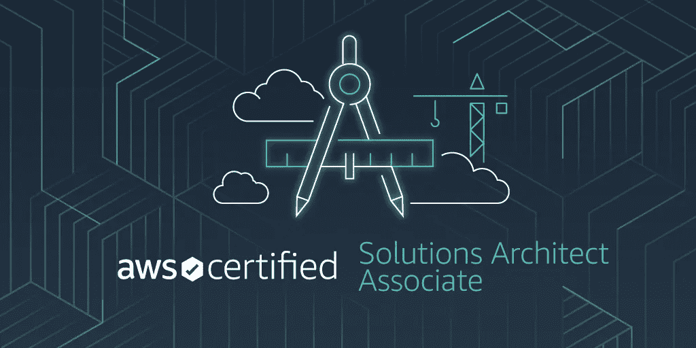

# 第 3 部分:S3、Cloudfront 和数据迁移服务(AWS SAA 注释)

> 原文：<https://medium.com/mlearning-ai/part-3-s3-cloudfront-data-migration-services-ead6106b0ac4?source=collection_archive---------1----------------------->

*这是一个博客系列，记录 AWS 解决方案架构师助理考试(SAA C02)的备考笔记，以帮助任何准备考试的人。这是该系列的第三部分。在这一部分中，我们将讨论著名的 AWS 对象存储服务 S3、CloudFront、Global accelerator 以及其他用于将数据从内部迁移到 AWS 的数据迁移选项。*