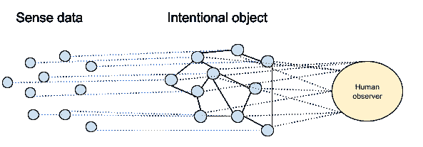
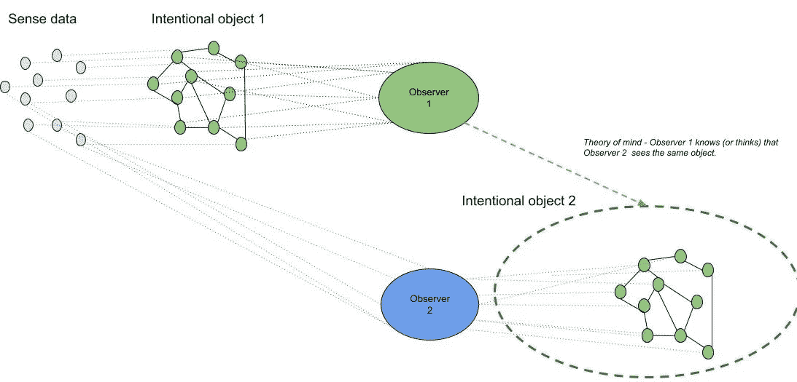

# 哲学和人工智能# 2——意向性

> 原文：<https://medium.com/mlearning-ai/philosophy-and-artificial-intelligence-2-715d173583b2?source=collection_archive---------0----------------------->

Credit to ThisIsEngineering @ Pexels

*见上一篇* [*此处*](https://haecceitas.medium.com/philosophy-and-artificial-intelligence-1-471eb002ec2d) *。*

**作为突现现象的意识**

如果你花些时间观察白蚁、蜜蜂或蚂蚁，你会惊讶于它们每天经历的复杂过程。尤其是像阿蒂娜这样的蚂蚁，它们以种植真菌为食。这很了不起，不是吗？他们不明白他们在做什么。一群无知的昆虫在合作着让我们惊叹的项目——有大脑的人类。

诸如此类的现象可以导致一个结论，即我们正在经历的只是我们大脑中(或者就此而言，我们身体中)数十亿无知细胞合作的一个紧急过程。从这个角度来看，进化将比我们聪明得多，我们的意识将只是一个工具，用来对已经完成的事情进行事后合理化。人类的思维和一群白蚁没有本质的区别。

然而，涌现并不能真正解释意识和理解的现象。如果意识只是一种涌现的现象，为什么我们需要*理解*事物？

**为什么你需要对某件事无所不为？**

许多人都提出了最后一个问题，包括罗杰·彭罗斯爵士和他的量子意识理论:理解和意识本质上是不可计算的——与白蚁或蚂蚁正在做的事情相反，即使结果看起来是理性推理的产物。

这是因为精神现象总是*关于*某事。当火山爆发时，它“无缘无故地爆发”——有一些过程导致了爆发，它就这样发生了。即使你给物理现象加上某种神学解释，事件本身也只是它本来的样子。当你思考、交谈或只是看着某样东西时，这些事件总是与其他事情有关。德国哲学家弗朗茨·布伦塔诺称这种精神力量为意向性。所有人类行为都是有意的——指向某个目标。

**意义、感觉和同一性**

人类的头脑感知物理对象，然后构建一个抽象概念，然后组织感知。理解是使整个抽象系统保持一致的过程，因此我们的大脑可以在需要时快速获取信息。

抽象给了我们显著的进化优势。当我们生活在丛林中，寻找食物和躲避捕食者时，对我们感知的分析不能基于复杂的计算。我们的生存能力取决于我们能多快做出正确的决定(主要是是否逃跑)。我们今天所说的智力也是基于快速思考的能力，识别环境中的模式，并对我们感知和理解的事物做出相应的反应。

然而，基本的抽象与我们对时间的感知和我们的社会环境有关——它是我们的*身份*。我们觉得过去的自己和现在的自己是同一个人。我们可以从错误中吸取教训，改善我们的现实模型，因为我们期待过去发生的事情会在未来发生。最重要的是:我们知道我们的时间是有限的。我们都将变老，在某个时候死去，我们认识的每个人也一样，包括我们未来的孩子。

基于[移情和心理理论](https://en.wikipedia.org/wiki/Theory_of_mind)的社会关系，让我们能够问“为什么”这个问题。我们不仅可以观察正在发生的事情，还可以对他人的观点进行抽象——这给了我们一个视角来质疑我们所看到的，并更深入地理解它。

**机器能知道什么**

让我们回到关于思维机器的问题。机器学习与人类思维的学习方式非常不同。我们在这方面做得越来越好，每天都有新的 ML 模型需要越来越少的数据来做出更准确的决策。但是他们仍然[在不理解](http://cogprints.org/7150/1/10.1.1.83.5248.pdf)的情况下操作语法。他们不需要有意识地工作，也不需要比人类更好地完成一些智力任务——但他们没有能力去寻找意义和问*为什么*的问题。

如果我们将一台机器发送到一个具有不同物理定律或地球上未知的不同生命形式的外星星球，它可能能够适应并生存下来——然而，机器没有理由提出问题，制定科学理论并理解这个新世界。

换句话说，机器知道的一切都是基于人类的知识——即使在机器学习的过程中我们发现了新事物。以这种方式发现的事物之所以重要，只是因为在它背后有一个人类观察者。