# PPO——最新强化学习的直观指南

> 原文：<https://medium.com/mlearning-ai/ppo-intuitive-guide-to-state-of-the-art-reinforcement-learning-410a41cb675b?source=collection_archive---------0----------------------->

# 介绍

(这个故事也可以作为一个 [Colab 笔记本](https://colab.research.google.com/drive/1u7YTohPaQFJPud8289pV6H65f9ZqSKWp?usp=sharing))。

**P** 近似 **P** 策略 **O** 优化( **PPO** )自从在论文 [**近似策略优化算法**](https://arxiv.org/abs/1707.06347)(Schulman et al .艾尔。, 2017).这种优雅的算法可以并且已经被用于各种任务。最近，它也被用于 ChatGPT 的训练，这是目前最热门的机器学习模型。

PPO 不仅在 RL 社区中被广泛使用，而且它还是通过深度学习(DL)模型解决 RL 问题的优秀入门。

在这篇文章中，我给出了强化学习领域的快速概述，解决 RL 问题的算法的分类，以及在[论文](https://arxiv.org/abs/1707.06347)中提出的 PPO 算法的评论。最后分享一下[我自己在 PyTorch 中对 PPO 算法的实现](https://github.com/BrianPulfer/PapersReimplementations)，对得到的结果进行评论，并以结论结束。

# 强化学习

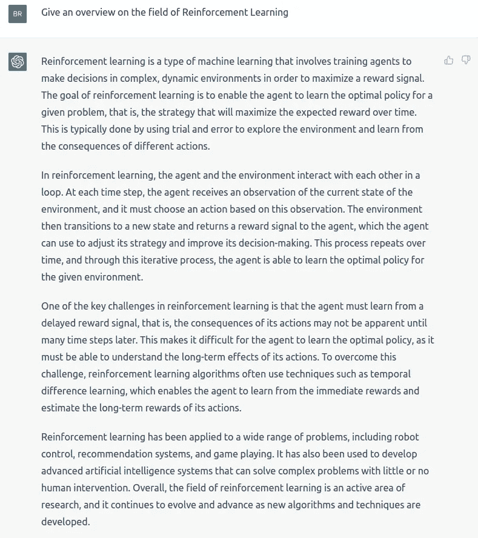

ChatGPT’s answer to the prompt: “Give an overview on the field of Reinforcement Learning”. While I asked help to ChatGPT for the introduction to the field of RL which was used to train ChatGPT itself (quite meta), I promise that everything in this article apart from this picture is written by me.

首先向接近 RL 的人展示的经典图片如下:

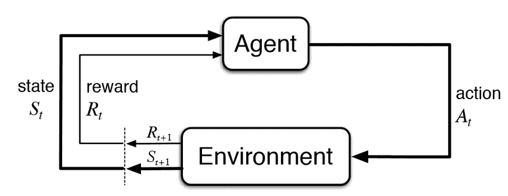

Reinforcement Learning framework. Image from [neptune.ai](https://neptune.ai/blog/reinforcement-learning-agents-training-debug)

在每个时间戳，环境向代理提供奖励和对当前状态的观察。给定这些信息，代理在环境中采取行动，并以新的奖励和状态等做出响应。这个非常通用的框架可以应用于各种领域。

我们的目标是创造一个能最大化所获回报的代理人。特别是，我们通常对折扣奖励的总和最大化感兴趣

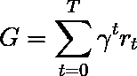

其中，γ是折扣因子，通常在[0.95，0.99]范围内，r_t 是时间戳 t 的奖励。

# 算法

那么我们如何解决 RL 问题呢？有多种算法，但它们可以(针对马尔可夫决策过程或 MDP)分为两类:**基于模型的**(创建环境的模型)和**无模型的**(只需了解给定一个状态要做什么)。

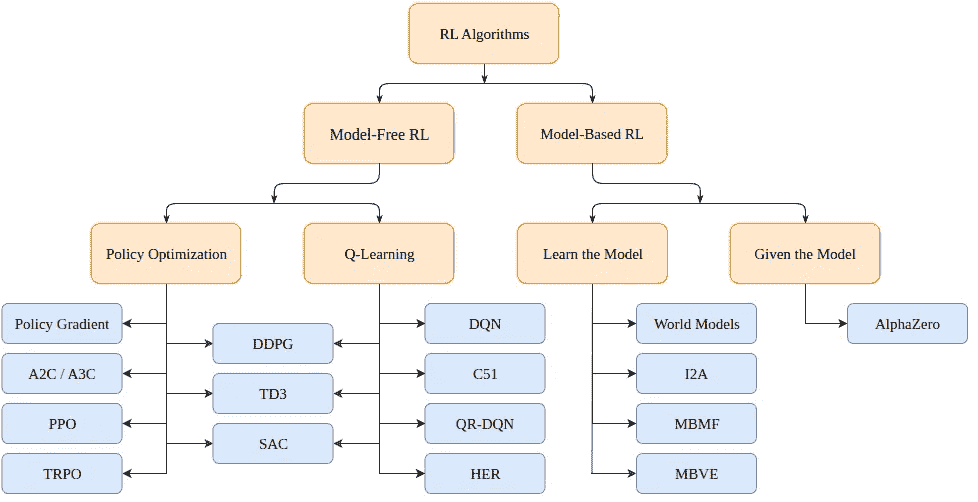

Taxonomy of Reinforcement Learning algorithms (from [OpenAI spinning up](https://spinningup.openai.com/en/latest/spinningup/rl_intro2.html))

**基于模型的**算法使用一个环境模型，并使用这个模型来预测未来的状态和奖励。该模型要么是给定的(例如棋盘)，要么是学习的。

**无模型**算法取而代之的是，直接学习如何针对训练中遇到的状态采取行动(策略优化或 PO)，哪些状态-行动对产生良好的回报(Q-Learning)，或者两者同时进行。

**PPO** 属于 PO 算法家族。因此，我们不需要环境模型来学习 PPO 算法。PO 和 Q-Learning 算法之间的主要区别在于，PO 算法可以用于具有连续动作空间的环境中(即，我们的动作具有真实值的环境中)，并且可以找到最优策略，即使该策略是随机的(即，概率性地动作)，而 Q-Learning 算法不能做这些事情。这是更喜欢 PO 算法的另一个原因。另一方面，Q 学习算法往往更简单、更直观、更好训练。

## 策略优化(基于梯度)

PO 算法尝试直接学习策略。为此，他们要么使用无梯度算法(如遗传算法)，要么使用更常见的基于梯度的算法。

对于基于梯度的方法，我们指的是所有试图估计所学政策相对于累积回报的梯度的方法。如果我们知道这个梯度(或它的近似值)，我们可以简单地将政策的参数向梯度的方向移动，以使回报最大化。

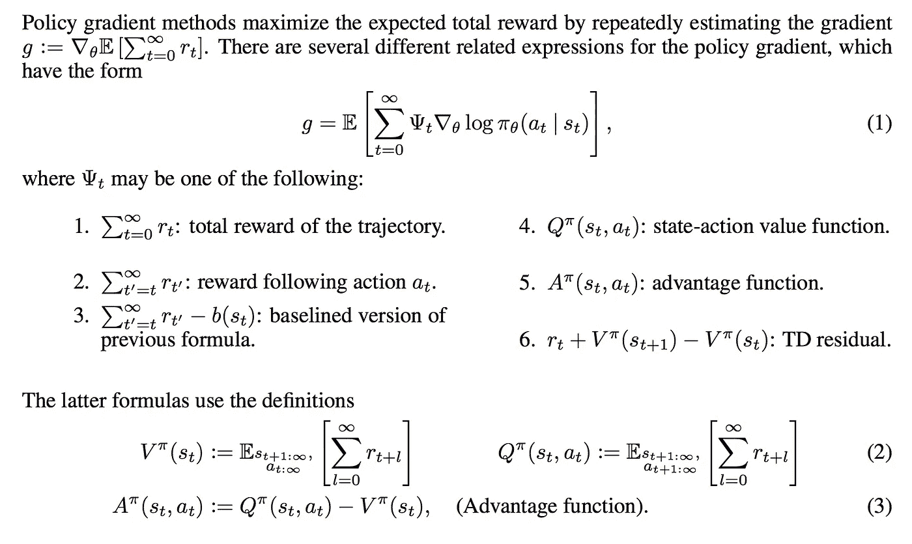

Objective to be maximized with PO algorithms. Image from [Lil’Log’s blog.](https://lilianweng.github.io/posts/2018-04-08-policy-gradient/)

请注意，有多种方法可以估算梯度。在这里，我们发现列出了 6 个不同的值，我们可以选择它们作为我们的最大化目标:总回报、一次行动后的回报、减去基线版本的回报、状态-行动值函数、优势函数(在最初的 PPO 论文中使用)和时间差(TD)残差。原则上，它们都提供了我们感兴趣的真实梯度的估计。

# 聚苯醚（Polyphenylene Oxide 的缩写）

**PPO** 是一种(无模型)策略优化的基于梯度的算法。该算法旨在学习一种策略，在训练期间给定经验的情况下，最大化所获得的累积奖励。

它由一个**演员** **πθ(。| st)** ，其输出给定时间戳 t 的状态下的下一个动作的概率分布，以及由**评论家** **V(st)** ，其估计来自该状态(标量)的预期累积回报。因为演员和评论家都将状态作为输入，所以可以在提取高级特征的两个网络之间共享主干架构。

PPO 的目的是使政策更有可能选择具有高度“优势”的行动，也就是说，具有比批评家所能预测的高得多的衡量累积回报。同时，我们不希望在一个步骤中更新策略太多，因为这可能会导致优化问题。最后，如果该策略具有高熵，我们将为其提供奖金，以激励探索而不是开发。

总损失函数(将被最大化)由三项组成:削波项、价值函数(VF)项和熵奖励。

最终目标如下:

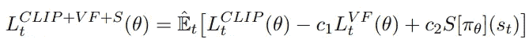

The loss function of PPO to be maximized.

其中，c1 和 c2 是超参数，分别衡量策略的批评准确性和探索能力的重要性。

## 剪辑术语

正如我们所说的，损失函数促使产生优势的行动的概率最大化(或者，如果行动产生负面优势，则使概率最小化):

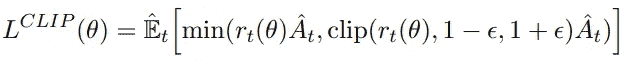

First loss term. We maximize and minimize the probability of picking

其中:

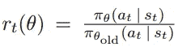

Coefficient rt(θ). This is the term that gradients are going to go through.

是一个比率，用于衡量我们现在(使用更新的策略)相对于以前执行以前的操作的可能性。原则上，我们不希望这个系数太高，因为这意味着政策突然改变。这就是为什么我们取它的最小值和[1+ϵ1-ϵ]之间的剪辑版本，其中ϵ是一个超参数。

优势计算如下:

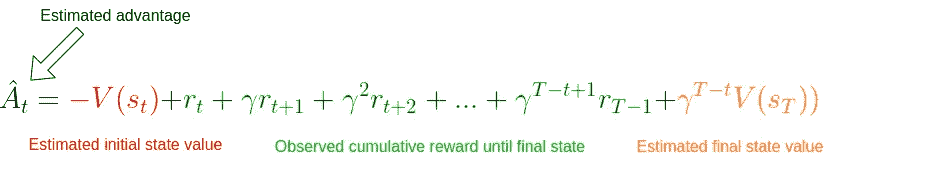

Advantage estimate. We simply take a difference between what we estimated the cumulative reward would have been given the initial state and the real cumulative reward observed up to a step t plus the estimate from that state onward. We apply a stop-gradient operator to this term in the CLIP loss.

我们看到，它只是简单地衡量了批评者对给定状态 st 的错误程度。如果我们获得了更高的累积奖励，优势估计将为正，我们将更有可能在这种状态下采取行动。反之亦然，如果我们期望更高的回报，而我们得到了更低的回报，优势估计将是负的，我们将减少在这一步采取行动的可能性。

请注意，如果我们一直到最后的状态 sT，我们不需要依赖批评家本身，我们可以简单地将批评家与实际的累积回报进行比较。在这种情况下，对优势的估计就是真正的优势。这就是我们在实现车杆问题时要做的事情。

## 价值函数项

然而，为了对优势有一个好的估计，我们需要一个可以预测给定状态的值的评论家。该模型是以监督的方式学习的，具有简单的 MSE 损失:

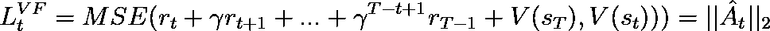

The loss function for our critic is simply the Mean-Squared-Error between its predicted expected reward and the observed cumulative reward. We apply a stop-gradient operator only to the observed reward in this case and optimize the critic.

在每次迭代中，我们也更新 critic，这样随着训练的进行，它将为我们提供越来越精确的状态值。

## 熵项

最后，我们鼓励探索，对政策的产出分布的熵有一点奖励。我们考虑标准熵:

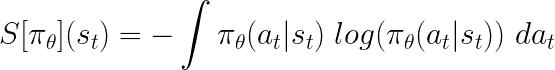

Entropy formula for the output distribution given by the policy model.

# 履行

不要担心这个理论是否仍然有点可疑。这个实现有望让一切变得清晰。

## 独立于 PPO 的代码

让我们从进口开始:

```
from argparse import ArgumentParser

import gym
import numpy as np
import wandb

import torch
import torch.nn as nn
from torch.optim import Adam
from torch.optim.lr_scheduler import LinearLR
from torch.distributions.categorical import Categorical

import pytorch_lightning as pl
```

PPO 的重要超参数是*数量的演员*、*视野*、*ε*、每个优化阶段的*次数*、学习率*、折现因子*γ*以及对不同损失项 *c1* 和 *c2* 进行加权的常数。我们通过程序参数收集这些信息。*

```
def parse_args():
    """Pareser program arguments"""
    # Parser
    parser = ArgumentParser()

    # Program arguments (default for Atari games)
    parser.add_argument("--max_iterations", type=int, help="Number of iterations of training", default=100)
    parser.add_argument("--n_actors", type=int, help="Number of actors for each update", default=8)
    parser.add_argument("--horizon", type=int, help="Number of timestamps for each actor", default=128)
    parser.add_argument("--epsilon", type=float, help="Epsilon parameter", default=0.1)
    parser.add_argument("--n_epochs", type=int, help="Number of training epochs per iteration", default=3)
    parser.add_argument("--batch_size", type=int, help="Batch size", default=32 * 8)
    parser.add_argument("--lr", type=float, help="Learning rate", default=2.5 * 1e-4)
    parser.add_argument("--gamma", type=float, help="Discount factor gamma", default=0.99)
    parser.add_argument("--c1", type=float, help="Weight for the value function in the loss function", default=1)
    parser.add_argument("--c2", type=float, help="Weight for the entropy bonus in the loss function", default=0.01)
    parser.add_argument("--n_test_episodes", type=int, help="Number of episodes to render", default=5)
    parser.add_argument("--seed", type=int, help="Randomizing seed for the experiment", default=0)

    # Dictionary with program arguments
    return vars(parser.parse_args())
```

请注意，默认情况下，参数设置如本文所述。理想情况下，如果可能的话，我们的代码应该在 GPU 上运行，所以我们创建了一个简单的实用函数。

```
def get_device():
    """Gets the device (GPU if any) and logs the type"""
    if torch.cuda.is_available():
        device = torch.device("cuda")
        print(f"Found GPU device: {torch.cuda.get_device_name(device)}")
    else:
        device = torch.device("cpu")
        print("No GPU found: Running on CPU")
    return device
```

当我们应用 RL 时，我们通常有一个缓冲区来存储当前模型遇到的状态、动作和奖励。这些用于更新我们的模型。我们创建一个效用函数`run_timestamps`，它将在给定的环境中运行给定的模型，运行固定数量的时间戳(如果剧集结束，则重新设置环境)。我们还使用了一个选项`render=False`,以防我们只是想看看经过训练的模型表现如何。

```
@torch.no_grad()
def run_timestamps(env, model, timestamps=128, render=False, device="cpu"):
    """Runs the given policy on the given environment for the given amount of timestamps.
     Returns a buffer with state action transitions and rewards."""
    buffer = []
    state = env.reset()[0]

    # Running timestamps and collecting state, actions, rewards and terminations
    for ts in range(timestamps):
        # Taking a step into the environment
        model_input = torch.from_numpy(state).unsqueeze(0).to(device).float()
        action, action_logits, value = model(model_input)
        new_state, reward, terminated, truncated, info = env.step(action.item())

        # Rendering / storing (s, a, r, t) in the buffer
        if render:
            env.render()
        else:
            buffer.append([model_input, action, action_logits, value, reward, terminated or truncated])

        # Updating current state
        state = new_state

        # Resetting environment if episode terminated or truncated
        if terminated or truncated:
            state = env.reset()[0]

    return buffer
```

该函数的输出(不呈现时)是一个缓冲区，包含每个时间戳的状态、采取的动作、动作概率(logits)、估计的评论家值、奖励和所提供策略的终止状态。注意，这个函数使用了装饰器 **@torch.no_grad()，**，所以我们不需要存储在与环境交互过程中所采取的动作的渐变。

## PPO 的代码

既然我们已经解决了琐碎的事情，是时候实现核心算法了。

理想情况下，我们希望我们的**主**函数看起来像这样:

```
def main():
    # Parsing program arguments
    args = parse_args()
    print(args)

    # Setting seed
    pl.seed_everything(args["seed"])

    # Getting device
    device = get_device()

    # Creating environment (discrete action space)
    env_name = "CartPole-v1"
    env = gym.make(env_name)

    # Creating the model, training it and rendering the result
    # (We are missing this part 😅)
    model = MyPPO(env.observation_space.shape, env.action_space.n).to(device)
    training_loop(env, model, args)
    model = load_best_model()
    testing_loop(env, model)
```

我们已经拿到大部分了。我们只需要定义 PPO 模型、训练和测试功能。

PPO 模型的架构不是这里有趣的部分。我们只需要两个在环境中表演的模特(演员和评论家)。当然，模型架构在更困难的任务中起着至关重要的作用，但是有了 cart pole，我们可以确信一些 MLP 将完成这项工作。

因此，我们可以创建一个包含演员和评论家模型的 MyPPO 类。可选地，我们可以决定两者之间的部分架构是共享的。当对某些状态运行 forward 方法时，我们返回参与者的抽样动作、每个可能动作的相对概率(logits)以及评论家对每个状态的估计值。

```
class MyPPO(nn.Module):
    """Implementation of a PPO model. The same backbone is used to get actor and critic values."""

    def __init__(self, in_shape, n_actions, hidden_d=100, share_backbone=False):
        # Super constructor
        super(MyPPO, self).__init__()

        # Attributes
        self.in_shape = in_shape
        self.n_actions = n_actions
        self.hidden_d = hidden_d
        self.share_backbone = share_backbone

        # Shared backbone for policy and value functions
        in_dim = np.prod(in_shape)

        def to_features():
            return nn.Sequential(
                nn.Flatten(),
                nn.Linear(in_dim, hidden_d),
                nn.ReLU(),
                nn.Linear(hidden_d, hidden_d),
                nn.ReLU()
            )

        self.backbone = to_features() if self.share_backbone else nn.Identity()

        # State action function
        self.actor = nn.Sequential(
            nn.Identity() if self.share_backbone else to_features(),
            nn.Linear(hidden_d, hidden_d),
            nn.ReLU(),
            nn.Linear(hidden_d, n_actions),
            nn.Softmax(dim=-1)
        )

        # Value function
        self.critic = nn.Sequential(
            nn.Identity() if self.share_backbone else to_features(),
            nn.Linear(hidden_d, hidden_d),
            nn.ReLU(),
            nn.Linear(hidden_d, 1)
        )

    def forward(self, x):
        features = self.backbone(x)
        action = self.actor(features)
        value = self.critic(features)
        return Categorical(action).sample(), action, value
```

请注意，`Categorical(action).sample()`创建了一个带有动作逻辑的分类分布，并从中抽取了一个动作样本(针对每个州)。

最后，我们可以在`training_loop`函数中处理实际的算法。正如我们从论文中所知，函数的实际签名应该是这样的:

```
def training_loop(env, model, max_iterations, n_actors, horizon, gamma, 
epsilon, n_epochs, batch_size, lr, c1, c2, device, env_name=""):
  # TODO...
```

下面是本文中为 PPO 培训程序提供的伪代码:

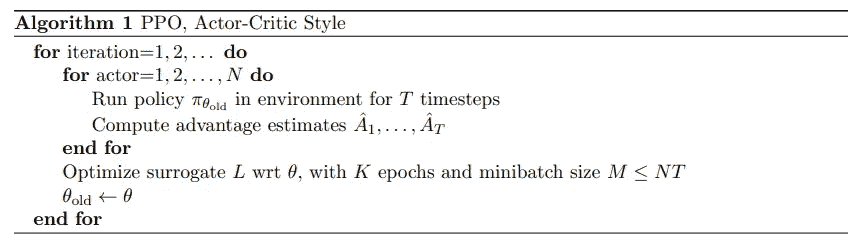

Pseudo code for PPO training provided in the [original paper](https://arxiv.org/abs/1707.06347).

PPO 的伪代码相对简单:我们简单地通过我们的策略模型的多个副本(称为行动者)收集与环境的交互，并使用先前定义的目标来优化行动者和批评者网络。

由于我们需要衡量我们实际获得的累积奖励，我们创建了一个函数，给定一个缓冲区，用累积奖励替换每个时间戳的奖励:

```
def compute_cumulative_rewards(buffer, gamma):
    """Given a buffer with states, policy action logits, rewards and terminations,
    computes the cumulative rewards for each timestamp and substitutes them into the buffer."""
    curr_rew = 0.

    # Traversing the buffer on the reverse direction
    for i in range(len(buffer) - 1, -1, -1):
        r, t = buffer[i][-2], buffer[i][-1]

        if t:
            curr_rew = 0
        else:
            curr_rew = r + gamma * curr_rew

        buffer[i][-2] = curr_rew

    # Getting the average reward before normalizing (for logging and checkpointing)
    avg_rew = np.mean([buffer[i][-2] for i in range(len(buffer))])

    # Normalizing cumulative rewards
    mean = np.mean([buffer[i][-2] for i in range(len(buffer))])
    std = np.std([buffer[i][-2] for i in range(len(buffer))]) + 1e-6
    for i in range(len(buffer)):
        buffer[i][-2] = (buffer[i][-2] - mean) / std

    return avg_rew
```

请注意，最后，我们将累积奖励标准化。这是一个标准的技巧，可以使优化问题更容易，训练更流畅。

现在我们可以获得一个包含状态、采取的行动、行动概率和累积回报的缓冲区，我们可以编写一个函数，给定一个缓冲区，计算我们最终目标的三个损失项:

```
def get_losses(model, batch, epsilon, annealing, device="cpu"):
    """Returns the three loss terms for a given model and a given batch and additional parameters"""
    # Getting old data
    n = len(batch)
    states = torch.cat([batch[i][0] for i in range(n)])
    actions = torch.cat([batch[i][1] for i in range(n)]).view(n, 1)
    logits = torch.cat([batch[i][2] for i in range(n)])
    values = torch.cat([batch[i][3] for i in range(n)])
    cumulative_rewards = torch.tensor([batch[i][-2] for i in range(n)]).view(-1, 1).float().to(device)

    # Computing predictions with the new model
    _, new_logits, new_values = model(states)

    # Loss on the state-action-function / actor (L_CLIP)
    advantages = cumulative_rewards - values
    margin = epsilon * annealing
    ratios = new_logits.gather(1, actions) / logits.gather(1, actions)

    l_clip = torch.mean(
        torch.min(
            torch.cat(
                (ratios * advantages,
                 torch.clip(ratios, 1 - margin, 1 + margin) * advantages),
                dim=1),
            dim=1
        ).values
    )

    # Loss on the value-function / critic (L_VF)
    l_vf = torch.mean((cumulative_rewards - new_values) ** 2)

    # Bonus for entropy of the actor
    entropy_bonus = torch.mean(torch.sum(-new_logits * (torch.log(new_logits + 1e-5)), dim=1))

    return l_clip, l_vf, entropy_bonus
```

注意，在实践中，我们使用一个*退火*参数，它被设置为 1，并在整个训练过程中向 0 线性衰减。这个想法是，随着训练的进展，我们希望我们的政策改变越来越少。还要注意的是，*优势*变量是张量之间的简单差异，我们不跟踪梯度，不像 *new_logits* 和 *new_values* 。

既然我们已经有了与环境交互和存储缓冲区、计算(真实)累积回报和获得损失项的方法，我们就可以编写最终的训练循环了:

```
def training_loop(env, model, max_iterations, n_actors, horizon, gamma, epsilon, n_epochs, batch_size, lr,
                  c1, c2, device, env_name=""):
    """Train the model on the given environment using multiple actors acting up to n timestamps."""

    # Starting a new Weights & Biases run
    wandb.init(project="Papers Re-implementations",
               entity="peutlefaire",
               name=f"PPO - {env_name}",
               config={
                   "env": str(env),
                   "number of actors": n_actors,
                   "horizon": horizon,
                   "gamma": gamma,
                   "epsilon": epsilon,
                   "epochs": n_epochs,
                   "batch size": batch_size,
                   "learning rate": lr,
                   "c1": c1,
                   "c2": c2
               })

    # Training variables
    max_reward = float("-inf")
    optimizer = Adam(model.parameters(), lr=lr, maximize=True)
    scheduler = LinearLR(optimizer, 1, 0, max_iterations * n_epochs)
    anneals = np.linspace(1, 0, max_iterations)

    # Training loop
    for iteration in range(max_iterations):
        buffer = []
        annealing = anneals[iteration]

        # Collecting timestamps for all actors with the current policy
        for actor in range(1, n_actors + 1):
            buffer.extend(run_timestamps(env, model, horizon, False, device))

        # Computing cumulative rewards and shuffling the buffer
        avg_rew = compute_cumulative_rewards(buffer, gamma)
        np.random.shuffle(buffer)

        # Running optimization for a few epochs
        for epoch in range(n_epochs):
            for batch_idx in range(len(buffer) // batch_size):
                # Getting batch for this buffer
                start = batch_size * batch_idx
                end = start + batch_size if start + batch_size < len(buffer) else -1
                batch = buffer[start:end]

                # Zero-ing optimizers gradients
                optimizer.zero_grad()

                # Getting the losses
                l_clip, l_vf, entropy_bonus = get_losses(model, batch, epsilon, annealing, device)

                # Computing total loss and back-propagating it
                loss = l_clip - c1 * l_vf + c2 * entropy_bonus
                loss.backward()

                # Optimizing
                optimizer.step()
            scheduler.step()

        # Logging information to stdout
        curr_loss = loss.item()
        log = f"Iteration {iteration + 1} / {max_iterations}: " \
              f"Average Reward: {avg_rew:.2f}\t" \
              f"Loss: {curr_loss:.3f} " \
              f"(L_CLIP: {l_clip.item():.1f} | L_VF: {l_vf.item():.1f} | L_bonus: {entropy_bonus.item():.1f})"
        if avg_rew > max_reward:
            torch.save(model.state_dict(), MODEL_PATH)
            max_reward = avg_rew
            log += " --> Stored model with highest average reward"
        print(log)

        # Logging information to W&B
        wandb.log({
            "loss (total)": curr_loss,
            "loss (clip)": l_clip.item(),
            "loss (vf)": l_vf.item(),
            "loss (entropy bonus)": entropy_bonus.item(),
            "average reward": avg_rew
        })

    # Finishing W&B session
    wandb.finish()
```

最后，为了查看最终模型的效果，我们使用下面的`testing_loop`函数:

```
def testing_loop(env, model, n_episodes, device):
    """Runs the learned policy on the environment for n episodes"""
    for _ in range(n_episodes):
        run_timestamps(env, model, timestamps=128, render=True, device=device)
```

我们的主要计划很简单:

```
def main():
    # Parsing program arguments
    args = parse_args()
    print(args)

    # Setting seed
    pl.seed_everything(args["seed"])

    # Getting device
    device = get_device()

    # Creating environment (discrete action space)
    env_name = "CartPole-v1"
    env = gym.make(env_name)

    # Creating the model (both actor and critic)
    model = MyPPO(env.observation_space.shape, env.action_space.n).to(device)

    # Training
    training_loop(env, model, args["max_iterations"], args["n_actors"], args["horizon"], args["gamma"], args["epsilon"],
                  args["n_epochs"], args["batch_size"], args["lr"], args["c1"], args["c2"], device, env_name)

    # Loading best model
    model = MyPPO(env.observation_space.shape, env.action_space.n).to(device)
    model.load_state_dict(torch.load(MODEL_PATH, map_location=device))

    # Testing
    env = gym.make(env_name, render_mode="human")
    testing_loop(env, model, args["n_test_episodes"], device)
    env.close()
```

而这一切都是为了实现！如果你能走到这一步，恭喜你。您现在知道如何实现 PPO 算法了。

# 结果

权重和偏差日志让我们可以直观地看到记录的指标和损失。特别是，我们可以访问损失图及其项，以及每次迭代的平均回报。

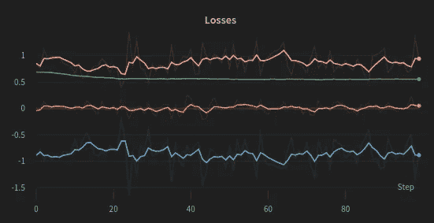

Training losses through training iterations. The total loss (blue) is the sum of L_CLIP (orange) minus the L_VF (pink) plus a small constant times the entropy bonus (green)

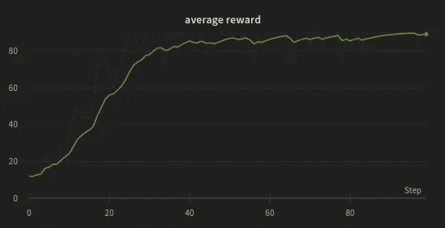

Average reward through iterations. PPO quickly learns to maximize the cumulative reward.

由于推车杆环境并不极具挑战性，我们的算法很快就找到了问题的解决方案，在大约 20 步后最大化了平均奖励。此外，由于环境只有两种可能的行为，熵项基本上保持不变。

最后，如果我们将最终策略付诸实施，我们会得到以下结果！

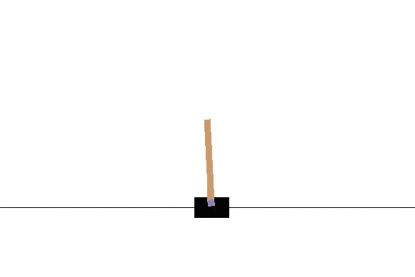

Trained PPO model balancing the cart pole

# 结论

PPO 是一种最先进的 RL 策略优化(因此是无模型的)算法，因此，它几乎可以在任何环境中使用。此外，PPO 具有相对简单的目标函数和相对较少的待调节的超参数。

如果你想玩这个动态算法，这里有一个链接指向 [Colab 笔记本](https://colab.research.google.com/drive/1u7YTohPaQFJPud8289pV6H65f9ZqSKWp?usp=sharing)。你可以在 [GitHub 库](https://github.com/BrianPulfer/PapersReimplementations)下找到我个人最新的 PPO 算法的重新实现(作为. py 文件)。您可以随意使用它或将其应用到您自己的项目中！

如果你喜欢这个故事，请告诉我！请随时联系我们进行进一步的讨论。祝你和 PPO✌️一起快乐黑客

# 更深入的链接:

舒尔曼等人。艾尔。■原文[](https://arxiv.org/abs/1707.06347)

*OpenAI 的 [" *旋转上升导至深度 RL* "](https://spinningup.openai.com/en/latest/index.html)*

*莉莲翁的[*一(长)窥强化学习*](https://lilianweng.github.io/posts/2018-02-19-rl-overview/)*

*翁莉莲的[*政策梯度算法*](https://lilianweng.github.io/posts/2018-04-08-policy-gradient/)*

*[](/mlearning-ai/mlearning-ai-submission-suggestions-b51e2b130bfb) [## Mlearning.ai 提交建议

### 如何成为 Mlearning.ai 上的作家

medium.com](/mlearning-ai/mlearning-ai-submission-suggestions-b51e2b130bfb)*