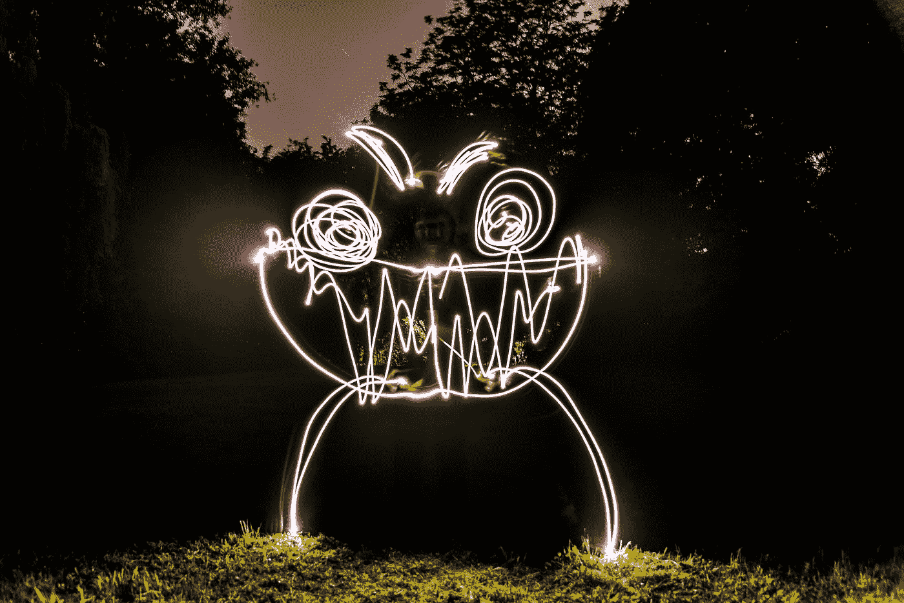

# 用深度学习回归算法预测外层空间威胁

> 原文：<https://medium.com/mlearning-ai/predict-an-outer-space-threat-with-deep-learning-regression-algorithms-26ac7cd00d2e?source=collection_archive---------3----------------------->


Photo by [SpaceX](https://unsplash.com/@spacex?utm_source=medium&utm_medium=referral) on [Unsplash](https://unsplash.com?utm_source=medium&utm_medium=referral)

# 什么是深度学习？


ML vs DL (Source: KD Nuggets)

深度学习是先进的机器学习算法，需要最少的人力，可以分析复杂的数据结构，以进行预测和产品开发。

深度学习包括:

*   *打开简历。*
*   *卷积神经网络。*
*   *神经网络。*
*   递归神经网络。
*   长短期记忆网络。
*   堆叠式自动编码器。
*   深层玻尔兹曼机(DBM)。
*   深度信仰网络(DBN)。

所有算法都用于不同的目的，从对象检测到情感分析甚至统计预测。

# 我们如何获得预测外层空间威胁的数据？



Photo by [🐣 Luca Iaconelli 🦊](https://unsplash.com/@luxdamore?utm_source=medium&utm_medium=referral) on [Unsplash](https://unsplash.com?utm_source=medium&utm_medium=referral)

在大多数情况下，我们可以使用空间监测机构的数据，如美国国家航空航天局、巴基斯坦空间和上层大气研究委员会、ISRO-印度空间研究组织、CNSA-中国国家航天局和 FSA 俄罗斯联邦航天局等。

数据集可包含异常情况的图像或视频，可按空间威胁类型归档。(非结构化)

数据集可以是关于空间活动的电子表格形式的表格，主要是在地球附近发现的小行星数量(结构化)。

# 项目代码——预测所有黑洞周围空间物体的结构化数据集的威胁


Photo by [Mingwei Lim](https://unsplash.com/@cmzw?utm_source=medium&utm_medium=referral) on [Unsplash](https://unsplash.com?utm_source=medium&utm_medium=referral)

```
Dataset source: [https://www.kaggle.com/datasets/brsdincer/space-objects-around-black-holes-esa](https://www.kaggle.com/datasets/brsdincer/space-objects-around-black-holes-esa)Credits to Dataset custodian **Baris Dincer
kaggle profile:** [https://www.kaggle.com/brsdincer](https://www.kaggle.com/brsdincer)
```

Project hosted on GitHub and Kaggle (You may use the code for your own needs too)

# 总结和结论

这个项目实际上是非常基础的，因为你需要实现更高级的转换和预测精度，但它也需要更高级的数据。

永远不要忘记黄金法则 GIGO(垃圾进垃圾出)，只有当我们拥有高质量的数据时，我们才能在任何机器学习和数据科学项目中表现出色，因此任何数据科学家都需要研究业务问题，并需要在进入任何转换和建模阶段进行分析之前确定所需的正确数据，同时担任数据分析师和机器学习工程师。

[](/mlearning-ai/mlearning-ai-submission-suggestions-b51e2b130bfb) [## Mlearning.ai 提交建议

### 如何成为 Mlearning.ai 上的作家

medium.com](/mlearning-ai/mlearning-ai-submission-suggestions-b51e2b130bfb)