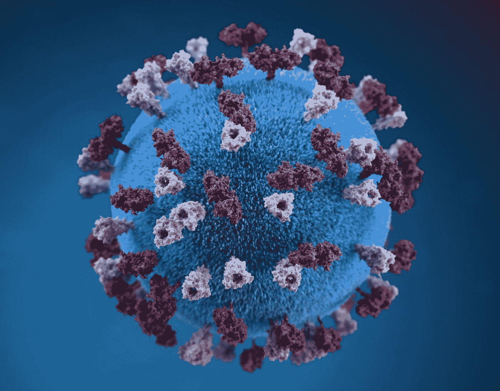

# 预测和模拟新冠肺炎

> 原文：<https://medium.com/mlearning-ai/predicting-and-modeling-covid-19-disease-spread-using-rstudio-6bac9cb71b32?source=collection_archive---------2----------------------->

使用 Rstudio 对新冠肺炎疫情早期进行统计建模。

Photo by [CDC](https://unsplash.com/@cdc?utm_source=medium&utm_medium=referral) on [Unsplash](https://unsplash.com?utm_source=medium&utm_medium=referral)

# 介绍

本文的目的是展示统计模型如何用于预测疾病传播。在最初的 3 个月里，将被研究的疾病是新冠肺炎。报告中使用的数据是累计病例数、死亡数和死亡率的时间序列数据