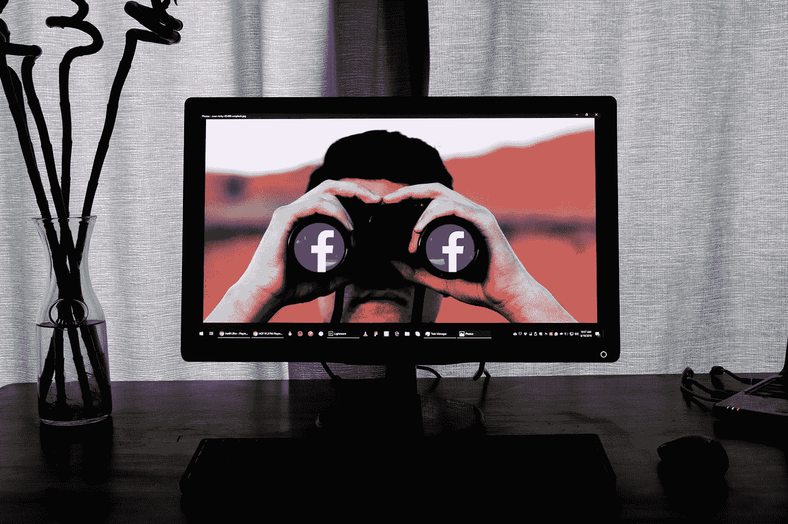

# 机器学习中的隐私:1-什么是隐私？

> 原文：<https://medium.com/mlearning-ai/privacy-in-machine-learning-1-what-is-privacy-336b4dff50ed?source=collection_archive---------3----------------------->

Photo by [Glen Carrie](https://unsplash.com/@glencarrie?utm_source=medium&utm_medium=referral) on [Unsplash](https://unsplash.com?utm_source=medium&utm_medium=referral)

在这一系列课程中，我将写关于机器学习中的隐私，回答一些关于数字时代最基本概念的困惑问题。

# 什么是隐私？

许多法律制度保护隐私权，但是隐私仍然是一个难以捉摸和有争议的概念。