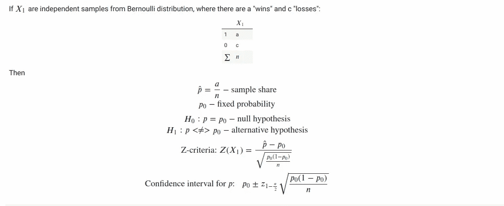
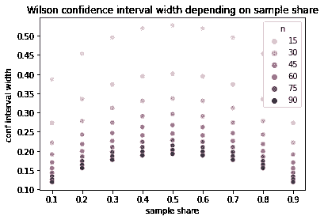
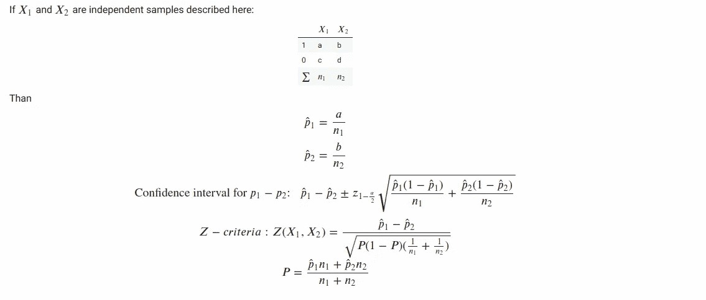

# Monty Hall 问题数值实验中的比例 Z-检验统计量

> 原文：<https://medium.com/mlearning-ai/proportions-z-tests-statistics-in-numerical-experiment-for-monty-hall-problem-d3d9c50a345b?source=collection_archive---------8----------------------->


> 欲了解完整解决方案，请访问我的 [GitHib](https://github.com/NataliaTarasovaNatoshir/NataliaTarasovaNatoshir/blob/main/Monty_Hall_z_stat_for_shares.ipynb)

[天魔堂问题](https://en.wikipedia.org/wiki/Monty_Hall_problem)是一个概率难题，也被称为“三门问题”。它以其反直觉的解决方案而闻名，这听起来可能很荒谬，但却是真实的。

> *假设你在参加一个游戏节目，你有三扇门可供选择:一扇门后是一辆汽车；在其他人后面，山羊。你选了一扇门，比如说№1，知道门后是什么的主人打开了另一扇门，比如说№3，里面有一只山羊。然后他对你说，“你想选 2 号门吗？”改变你的选择对你有利吗？*

**这篇文章有两个目标:**

*   展示统计学在处理 0 和 1 的有限样本中的比例的应用([伯努利分布](https://en.wikipedia.org/wiki/Bernoulli_distribution))。该任务的经典示例包括:
    -定义新的广告横幅是否比旧的横幅吸引更多的点击
    -估计提供统计显著性结论所需的 A/B 实验的长度
    -检查具有来自两个类别的对象的样本是否具有显著偏斜的类别分布
*   运行数值实验来支持蒙蒂霍尔问题的反直觉解决方案

# 解析

史蒂夫·塞尔文在 1975 年描述了正确的解决方案。答案是参赛者应该**换到另一扇门。**

切换策略有 2/3 的概率赢得汽车，而保持最初选择的策略只有 1/3 的概率。

理解解决方案的方法之一是将最初未被选择的两扇门放在一起考虑。塞西尔·亚当斯说:“蒙蒂实际上是在说:你可以保留你的一扇门，也可以拥有另外两扇门。”找到汽车的 2/3 的机会并没有因为打开其中一扇门而改变，因为蒙蒂知道汽车的位置，肯定会发现一只山羊。因此，在主持人打开一扇门后，玩家的选择与主持人向玩家提供从最初选择的门切换到其余两扇门的选项没有什么不同。这种情况下的切换显然给了玩家 2/3 的概率选择汽车。

# 数值实验

看看有没有可能用数值实验来确认解析解！

首先，我们必须定义一个充当节目主持人的函数:

*   随机选择后面有汽车的门(门名为 0、1 或 2)
*   通过“策略”选门
*   主人打开另一扇门，门后有一只山羊
*   “战略”做了最后的猜测
*   主持人揭示这个最终猜测是正确的(返回 1)还是错误的(返回 0)

我们分析的第一个策略是“等待门”策略，在另一扇门打开后，它不会改变它的第一个猜测

```
**def** hold_strategy(first_guess**=-**1, empty_door_num**=None**):
  **if** first_guess **>=** 0:
    **return** first_guess
  **else**:
    **return** random**.**randint(0, 2)
```

另一种策略是“换门”策略，它总是在另一扇门打开后改变它的第一次猜测

```
**def** change_strategy(first_guess**=-**1, empty_door_num**=None**):
  **if** first_guess **>=** 0:
    s **=** {0, 1, 2} **-** {first_guess} **-** {empty_door_num}
    **return** s**.**pop()
  **else**:
    **return** random**.**randint(0, 2)
```

# 获胜概率的置信区间

当我们运行一系列游戏时，我们获得了该策略的**样本获胜份额**。这只是对真实获胜概率的估计。我们可以用一个固定的α值来定义这个估计的置信区间。这意味着真正的获胜概率在这个区间之外的概率小于α。我们玩的游戏越多，置信区间就越小，我们对真实获胜概率值的估计就越精确。

计算二项比例置信区间的有效方法之一是[威尔逊评分](https://en.wikipedia.org/wiki/Binomial_proportion_confidence_interval)法。

让我们用威尔逊评分法来衡量“换门”策略

```
**import** scipy
**from** statsmodels.stats.weightstats **import** *****
**from** statsmodels.stats.proportion **import** proportion_confintconf_interval_change **=** proportion_confint(sum(res_change), len(res_change), method **=** 'wilson')

print("Change door strategy:\n95% confidence interval for win probability = [{0:.2f}, {1:.2f}]"**.**format(
    conf_interval_change[0], conf_interval_change[1]))Change door strategy:
95% confidence interval for win probability = [0.31, 0.83]
```

我们比较的两个策略(“守住门”-策略和“改变门”-策略)是互斥的。意思是在一种策略输掉比赛的情况下，另一种策略会赢得比赛。如果我们要支持一个假设，即“换门”——策略优于“守住门”——策略，我们需要比较“换门”——策略的获胜概率，取值为 0.5。

请注意，在上面的示例中，当“改变门”策略的成功率超过 50%时，置信区间包括 0.5 的值。对于这种策略的 10 场比赛还不足以得出结论，即“换门”策略比另一种“守门”策略更好。

# 概率得分的 z 统计

当主人打开一扇门，山羊在门后，我们有两扇门(一扇门后面有一辆汽车，另一扇门是一只山羊),因此猜出正确门的概率是 0.5，这听起来可能是合理的。

让我们应用一个统计标准来比较固定概率为 0.5 的“换门”策略的样本成功份额



```
**def** share_z_stat(sample, p_0):
    n **=** len(sample)
    p **=** float(sum(sample)) **/** n

    **return** (p **-** p_0) **/** np**.**sqrt((p_0 ***** (1 **-** p_0)) **/** n)**def** share_p_value(z_stat, alternative **=** 'two-sided'):
    **if** alternative **not** **in** ('two-sided', 'less', 'greater'):
        **raise** ValueError("Invalid alternative\n"
                         "Possible options: 'two-sided', 'less' or 'greater'")

    **if** alternative **==** 'two-sided':
        **return** 2 ***** (1 **-** scipy**.**stats**.**norm**.**cdf(np**.**abs(z_stat)))

    **if** alternative **==** 'less':
        **return** scipy**.**stats**.**norm**.**cdf(z_stat)

    **if** alternative **==** 'greater':
        **return** 1 **-** scipy**.**stats**.**norm**.**cdf(z_stat)**def** shares_diff_confint_ind(sample, p_0, alpha **=** 0.05):    
    z **=** scipy**.**stats**.**norm**.**ppf(1 **-** alpha **/** 2.)

    p **=** float(sum(sample)) **/** len(sample)

    left_boundary **=** p_0 **-** z ***** np**.**sqrt(p_0 ***** (1 **-** p_0)**/** len(sample))
    right_boundary **=** p_0 **+** z ***** np**.**sqrt(p_0 ***** (1 **-** p_0)**/** len(sample))

    **return** (left_boundary, right_boundary)
```

让我们用 50 个游戏进行实验，并计算统计数据:

```
Started series of 50 experiments
Experiment finished
31 wins out of 50 trials. Success share = 62.00%

Z-statistics = 1.70

H_0 hypothesis: Win probability = 0.5

H_1 hypothesis: Win probability != 0.5
p-value for two-sided test = 0.0897
Meaning: possibility to obtain in an experiment this sample win share while true win probability = 0.5 is equal to 8.97%

Use the suggestion that 'change door'-strategy is more effective than 0.5
H_1 hypothesis: Win probability > 0.5
p-value for right-sided test = 0.0448
Meaning: possibility to obtain in an experiment this or greater win share while true win probability = 0.5 is less than 4.48%
```

# 评估 A/B 测试的长度

在 A/B 测试之前，我们经常需要估计这个测试需要多长时间。在我们的例子中，问题是:“在我们可以说“改变门”策略的获胜概率高于 0.5 之前，应该玩多少游戏？”

例如，我们可以如下进行:

1.  使用我们对这种策略的真实获胜概率的假设，计算选定游戏数 N 的置信区间
2.  假设我们得到了“最坏的情况”——我们得到了置信区间的左边缘作为样本获胜概率估计
3.  使用“最坏情况”样本赢得份额估计 H1 假设的 p 值
4.  检查估计的 p 值是否低于目标 p 值，这意味着建议的游戏数 N 是足够的

N=10 场比赛是不够的，因为在我们的样本中，我们可能会获得小于 0.5 的获胜份额:

```
estimate_p_value(p_true**=**2**/**3, p_0**=**1**/**2, N**=**10, alternative **=** 'two-sided', p_value_goal**=**0.05)Confidence interval includes 0.5\. Try a bigger number of trials
```

N=50 场比赛更好，但在最坏的情况下，我们将达不到统计显著性:

```
estimate_p_value(p_true**=**2**/**3, p_0**=**1**/**2, N**=**50, alternative **=** 'two-sided', p_value_goal**=**0.05)Using the worst case scenario:
    p = 0.52Estimated p-value for 50 trials = 0.7607
Goal p-value 0.0500 is smaller that estimated p-value 0.7607
Try a bigger number of trials
```

N=150 应该足够了

```
estimate_p_value(p_true**=**2**/**3, p_0**=**1**/**2, N**=**150, alternative **=** 'two-sided', p_value_goal**=**0.05)Using the worst case scenario:
    p = 0.59Estimated p-value for 150 trials = 0.0313
Goal p-value 0.0500 is greater that estimated p-value 0.0313
Number of trials should be enough to test the hypothesis that win probability is higher than 1/2
```

让我们运行一个上面选择的 N=150 的实验，并且看到我们成功地达到了目标 p 值< 0.05 的统计显著性

```
Started series of 150 experiments
Experiment finished
90 wins out of 150 trials. Success share = 60.00%Experiments result:
Z-statistics for win share compared with 0.5 = 2.45p-value for two-sided test = 0.0143
Meaning: possibility to obtain in an experiment this or greater absolute win share (while true win probability = 0.5) equals 1.43%
```

# 评估策略的成功概率

那么，我们能精确估计一个选择的策略获胜的概率吗？

我们所能做的是获得足够的样本，以便有一个我们认为足够小的置信区间

当我们获得样本份额= 0.5 时，威尔逊得分区间最宽(见下图)



这意味着我们可以首先定义获得小于所选宽度的置信区间所需的样本数 N

```
**def** max_wilson_conf_interval_width(N, alpha**=**0.05):
  conf_interval **=** proportion_confint(int(0.5*****N), N, method **=** 'wilson', alpha**=**alpha)
  **return** conf_interval[1] **-** conf_interval[0]**def** estimate_wilson_conf_interval(N, goal_width**=**0.2, alpha**=**0.05):
  max_width **=** max_wilson_conf_interval_width(N, alpha**=**alpha)
  print("Maximum Wilson score interval width for N={0} is {1:.2f}"**.**format(N, max_width))
  **if** max_width **>** goal_width:
    print("Wilson score interval may be wider than goal width {}\nTry a bigger N"**.**format(goal_width))
  **else**:
    print("Wilson score interval is smaller than goal width {}\nN is sufficient"**.**format(goal_width))
```

N=100 可能不足以获得足够小的置信区间:

```
estimate_wilson_conf_interval(N**=**100, goal_width**=**0.1, alpha**=**0.05)Maximum Wilson score interval width for N=100 is 0.19
Wilson score interval may be wider than goal width 0.1
Try a bigger N
```

N=400 似乎足以得到小于 0.1 的置信区间:

```
estimate_wilson_conf_interval(N**=**400, goal_width**=**0.1, alpha**=**0.05)Maximum Wilson score interval width for N=400 is 0.10
Wilson score interval is smaller than goal width 0.1
N is sufficient
```

让我们对“换门”策略进行 N=400 次试验，并检查我们是否确实获得了期望宽度的置信区间:

```
Started series of 400 experiments
Experiment finished
279 wins out of 400 trials. Success share = 69.75%Change door strategy:
95% confident interval for win probability = [0.65, 0.74]
Interval width = 0.09
```

# 份额差异的 z 统计

“改变之门”策略和“保持之门”策略是相互排斥的:当一个策略失败了，就意味着另一个策略赢了。在这种情况下，为了比较这些策略，将这些策略之一的获胜概率与 0.5 进行比较就足够了。

但是如果我们有两种不同的独立策略呢？如何检查两个策略是否有不同的获胜概率？我们可以对独立样本使用 Z 标准:



考虑另一种策略，坚持最初的猜测或随机改变主意(概率相等):

```
**def** random_switch_strategy(first_guess**=-**1, empty_door_num**=None**):
  **if** first_guess **>=** 0:
    s **=** random**.**choice(list({0, 1, 2} **-** {empty_door_num}))
    **return** s
  **else**:
    **return** random**.**randint(0, 2)
```

定义函数来计算独立样本之间比例差异的 Z 统计量和置信区间:

```
**def** shares_diff_z_stat(sample1, sample2):
    n1 **=** len(sample1)
    n2 **=** len(sample2)

    p1 **=** float(sum(sample1)) **/** n1
    p2 **=** float(sum(sample2)) **/** n2 
    P **=** float(p1*****n1 **+** p2*****n2) **/** (n1 **+** n2)

    **return** (p1 **-** p2) **/** np**.**sqrt(P ***** (1 **-** P) ***** (1\. **/** n1 **+** 1\. **/** n2))**def** shares_diff_confint_ind(sample1, sample2, alpha **=** 0.05):    
    z **=** scipy**.**stats**.**norm**.**ppf(1 **-** alpha **/** 2.)

    p1 **=** float(sum(sample1)) **/** len(sample1)
    p2 **=** float(sum(sample2)) **/** len(sample2)

    left_boundary **=** (p1 **-** p2) **-** z ***** np**.**sqrt(p1 ***** (1 **-** p1)**/** len(sample1) **+** p2 ***** (1 **-** p2)**/** len(sample2))
    right_boundary **=** (p1 **-** p2) **+** z ***** np**.**sqrt(p1 ***** (1 **-** p1)**/** len(sample1) **+** p2 ***** (1 **-** p2)**/** len(sample2))

    **return** (left_boundary, right_boundary)
```

为每种策略运行两个系列的 100 场游戏，并评估结果:

```
Started series of 100 experiments
Experiment finished
44 wins out of 100 trials. Success share = 44.00%
Started series of 100 experiments
Experiment finished
60 wins out of 100 trials. Success share = 60.00%

Number of trials for each strategy: 100

Random switch win share = 44.00%
Change strategy win share = 60.00%
Win shares difference = -0.16
95% confident interval for strategies win probability difference = [-0.30, -0.02]
Z-statistics for win shares difference = -2.26

p-value for two-sided test = 0.0235
Meaning: possibility to obtain in an experiment this or greater absolute difference in win shares while true win probabilities are equal is less than 2.35%

Use the suggestion that 'change door'-strategy is more effective than 'random switch'-strategy
p-value for left-sided test = 0.0118
Meaning: possibility to obtain in an experiment this or more negative difference in win shares while true win probabilities are equal is less than 1.18%
```

该测试表明，“改变门”策略在统计上明显比“随机切换”策略更有效。请注意，不能保证该测试长度的统计显著性。

# 结论

为了支持 Monty Hall 问题的反直觉分析解决方案，我们成功地使用了:

1.  模拟不同策略的长系列博弈的数值实验
2.  统计仪器来评估这些发现的统计意义
3.  调查相关任务，如

*   a/B-达到统计显著性的测试长度估计
*   比较 0 和 1 的独立样本份额的统计标准

[](/mlearning-ai/mlearning-ai-submission-suggestions-b51e2b130bfb) [## Mlearning.ai 提交建议

### 如何成为 Mlearning.ai 上的作家

medium.com](/mlearning-ai/mlearning-ai-submission-suggestions-b51e2b130bfb) 

🔵 [**成为作家**](/mlearning-ai/mlearning-ai-submission-suggestions-b51e2b130bfb)