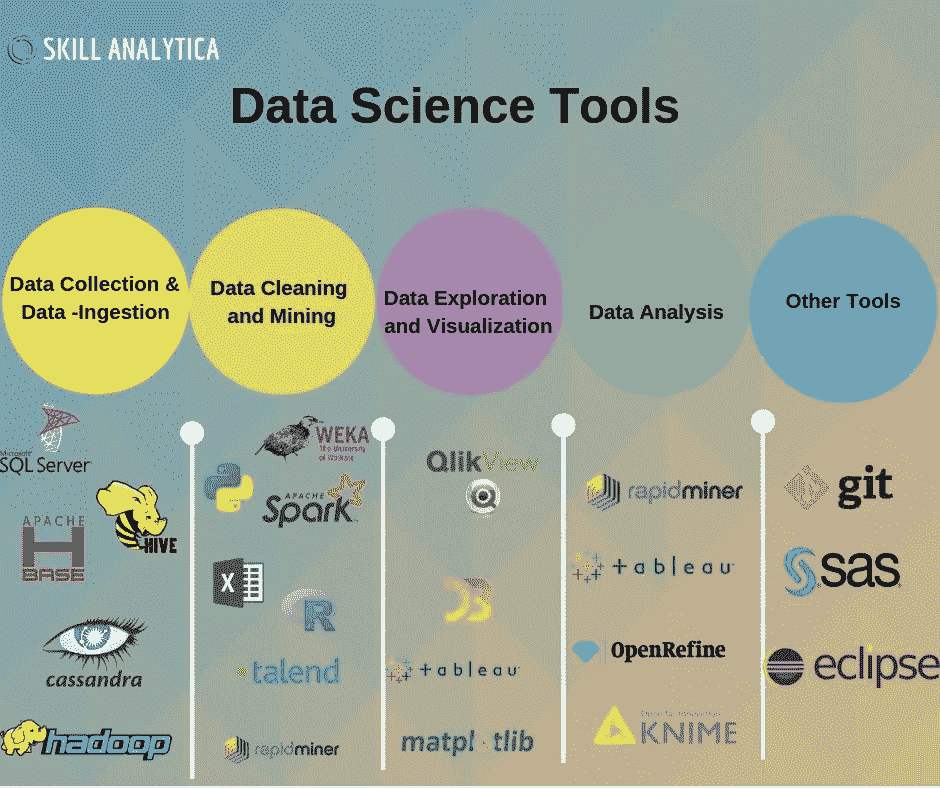

# 15 分钟或更短时间内完成 Python 编码——最少的数据科学设置

> 原文：<https://medium.com/mlearning-ai/python-coding-in-15-minutes-or-less-the-minimal-data-science-setup-5f11ebc3c809?source=collection_archive---------4----------------------->



对于中小型数据科学团队来说，组建新团队或简化项目工作流程可能会非常麻烦，特别是对于那些 Windows 防火墙后面的团队。有了各种可用的工具，你甚至可能在运行第一个之前就遇到错误。最重要的是，像开箱即用的 pip 和 Conda 这样的打包工具可能会让你失望(还记得那些坐在座位边缘等着看 Conda 是否能解决环境问题的时刻吗？——剧透警报 **:** 它没有)。

时间太宝贵了，不能浪费在系统设置和配置上。本指南将帮助您和您的团队创建一个最小的环境来快速开始探索、预测和展示数据科学见解。我们将重点关注以下内容:

1.  Visual Studio 代码
2.  Python(通过 pyenv-win)
3.  预提交(可选，但有帮助)
4.  诗意
5.  饭桶

Ethan Rosenthal 的这篇[文章](https://www.ethanrosenthal.com/2022/02/01/everything-gets-a-package/)已经成为我的团队的标准，对 Windows 机器做了一些小的调整，特别是防火墙后的 *Windows 机器。他为每个项目创建一个包提出了一个很好的论点，无论项目是大是小。*

# 从头开始设置:

**1。** [**下载**](https://code.visualstudio.com) **并安装 VSCode。**

这是唯一需要管理用户干预的步骤。

**2。通过**[**pyenv**](https://github.com/pyenv/pyenv)**安装 Python(或者**[**pyenv-win**](https://github.com/pyenv-win/pyenv-win)**)。**

这不仅是安装 pyenv 的最佳方式，也是标准 Python 安装的一种方便的变通方法——它不需要管理用户。Windows 与 Linux/macOS 的安装略有不同:

*视窗:*

```
Invoke-WebRequest -UseBasicParsing -Uri "https://raw.githubusercontent.com/pyenv-win/pyenv-win/master/pyenv-win/install-pyenv-win.ps1" -OutFile "./install-pyenv-win.ps1"; &"./install-pyenv-win.ps1"
```

*Linux/macOS(下面是家酿的替代方案):*

```
curl -L [https://github.com/pyenv/pyenv-installer/raw/master/bin/pyenv-installer](https://github.com/pyenv/pyenv-installer/raw/master/bin/pyenv-installer) | bash
```

pyenv 安装完成后，安装全局 Python 并将其设置为适合您需求的版本。

```
pyenv install 3.10.4
pyenv global 3.10.4
```

**3。安装** [**预提交**](https://pre-commit.com/#install) **(可选，但有帮助)。**

通过用[黑色](https://github.com/psf/black)或[其他](https://pre-commit.com/hooks.html)标准化代码，预提交可以最小化 jupyter 笔记本的差异(这非常令人讨厌)。通过 pipx 安装是避免在 Linux/macOS 上使用 brew 的最简单方法。

```
pip install pipx
pipx ensurepath
pipx install pre-commit
```

**4。安装** [**诗词**](https://python-poetry.org/docs/#installation) **。**

*Windows (Powershell):*

```
(Invoke-WebRequest -Uri [https://install.python-poetry.org](https://install.python-poetry.org) -UseBasicParsing).Content | py -
```

*Linux/macOS:*

```
curl -sSL https://install.python-poetry.org | python3 -
```

**5。安装**[**git**](https://git-scm.com/downloads)**。**

Windows 用户必须通过[这个链接](https://git-scm.com/download/win)直接下载，这可能也需要管理权限。

Linux/macOS 用户很容易做到:

```
git --version
```

6。最小、有用的配置更新

诗提供了多种多样的[配置设置选项](https://python-poetry.org/docs/configuration/#available-settings)。以下是我们工作流程中至关重要的两项。第一个在当前项目文件夹中创建新的虚拟环境(与在单独的诗歌特定文件夹中相比)。第二个在初始化诗歌环境时使用当前的 Python 版本(如果设置了 pyenv local，它将使用本地版本而不是全局版本)。

```
poetry config virtualenvs.in-project true
poetry config virtualenvs.prefer-active-python true
```

# 结论

这个设置已经为我们工作了 6 个月左右。数据科学将会发展，很可能使这个工作流程变得无用(👀朱莉娅…？).然而，现在，你可以依靠这个工作流程在 15 分钟或更短的时间内让你开始编码。

# 临时演员

*   pip 是单个项目的优秀包管理器，使用 pipenv，您甚至可以相对轻松地维护多个项目。当您管理多个项目并试图管理所有的子-子-子(等等)依赖关系时，真正的问题就来了。诗做包安装/卸载比较好:[“卸载包的时候直接卸载隔离的子依赖，不需要像 Pipenv"](https://python.plainenglish.io/poetry-a-better-version-of-python-pipenv-561611a029d1) 一样再次执行 `[pipenv clean](https://python.plainenglish.io/poetry-a-better-version-of-python-pipenv-561611a029d1)` [。](https://python.plainenglish.io/poetry-a-better-version-of-python-pipenv-561611a029d1)
*   VSCode(与 Conda/Jupyter 笔记本电脑相比)在创建新环境时允许更少的开销包。新环境对于为所有东西创建一个包是必不可少的。如果你仍然不相信，看看这篇文章。
*   尽管 Jupyter 笔记本的缺点和替代物在这里[描述](/geekculture/why-i-stopped-using-jupyter-notebook-and-why-you-should-too-f5a3b00e90a6)，对于大多数中小型数据科学团队来说，Jupyter 笔记本对于从数据- > EDA - >洞察至关重要。

# 解决纷争

苹果个人计算机

*   pyenv — clang:错误:无效版本号-->[描述](https://emilwypych.com/2020/11/23/pyenv-problem-macosx_deployment_target11-0/?cn-reloaded=1&cn-reloaded=1)，[解决方案](https://stackoverflow.com/questions/34617452/how-to-update-xcode-from-command-line)
*   诗歌— zsh:命令未找到:诗歌-> [描述，解答](https://github.com/python-poetry/poetry/issues/507#issuecomment-1157103570)

[](/mlearning-ai/mlearning-ai-submission-suggestions-b51e2b130bfb) [## Mlearning.ai 提交建议

### 如何成为 Mlearning.ai 上的作家

medium.com](/mlearning-ai/mlearning-ai-submission-suggestions-b51e2b130bfb)