# Pytorch 适合初学者💫

> 原文：<https://medium.com/mlearning-ai/pytorch-for-beginners-62c3fcd75f69?source=collection_archive---------3----------------------->

## 第一部分:张量的基本运算


> 本文将向您介绍 Pytorch 的基本概念，并逐步指导您如何使用 Pytorch 在张量中实现一些基本操作(这是必须学习的)。

本文将涵盖以下主题:
1 .什么是张量
2。基本数组和张量的区别
3。如何创建张量
4？使用张量的基本数学运算


# Pytorch 是什么？

PyTorch 是基于 Torch 库的开源机器学习库，用于计算机视觉和自然语言处理等应用，主要由脸书的人工智能研究实验室开发

# Numpy 和 Pytorch 有什么区别？

简单地说，Numpy 创建的数组将在您的 CPU 内存上工作。使用 Pytorch，您可以创建能够使用 GPU 进行快速处理的张量。

张量有一些额外的功能，如自动梯度，这将有助于以更简单的方式实现神经网络。

这两个框架最重要的区别是命名。Numpy 称之为张量(高维矩阵或向量)数组，而在 PyTorch 中只称之为张量。其他的都挺像的。

# 为什么是 PyTorch？

即使您已经知道 Numpy，仍然有几个理由转而使用 PyTorch 进行张量计算。主要原因是 GPU 加速。正如你将看到的，使用 PyTorch 的 GPU 是超级容易和超级快。如果你做大型计算，这是有益的，因为它加快了很多事情。

# 为什么是 Numpy？

Numpy 是线性代数最常用的计算框架。Numpy 的一个很好的用例是快速实验和小型项目，因为与 PyTorch 相比，Numpy 是一个轻量级框架。

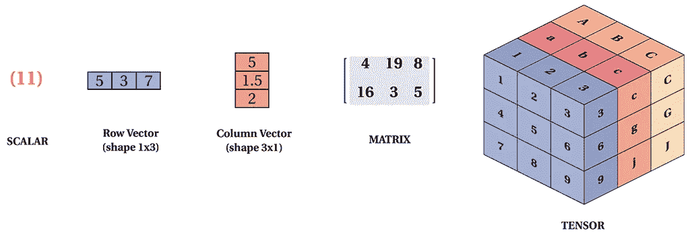

> 注意:如果您的机器上没有安装 PyTorch。尝试使用谷歌联合实验室或 Kaggle 笔记本。

 [## 在线运行数据科学和机器学习代码

### Kaggle 笔记本是一个计算环境，支持可重复的协作分析。

www.kaggle.com](https://www.kaggle.com/code) [](https://colab.research.google.com/?utm_source=scs-index) [## 谷歌联合实验室

### 编辑描述

colab.research.google.com](https://colab.research.google.com/?utm_source=scs-index) 

我们开始吧！

```
import torch 
import numpy as np
```

# 使用 Torch 创建张量


张量是一种多维数据结构。向量是一维数据结构，矩阵是二维数据结构。张量表面上与这些其他数据结构相似，但区别在于它们可以存在于从零到 n 的维度中

## 从简单列表和 Numpy 数组创建张量

```
data = [[1 , 2 ] , [3 , 4]]
np.array(data)
data = torch.tensor(data)
```

## 要检查数据类型，只需编写

```
data.dtype
```

## 创建一个大小为 3 行×4 列的空张量

```
a = torch.empty(size =(3,4))
a
```

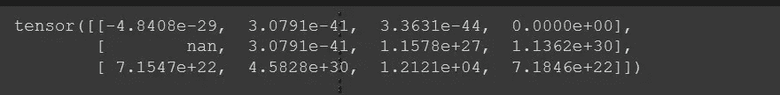

> 注意:在你的张量中应该有一些随机值，但是不要担心空的张量会被创建，这样你就可以在其中存储一些新的张量值，这样你就可以覆盖这些值了

## 创建一个大小为(3 行×4 列)的空二维张量

```
b = torch.empty(size=(2 , 3 ,4))
b
```

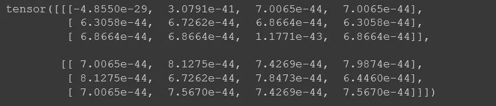

## 创建大小为(3 行 x 4 列)的张量，并将所有值初始化为 1

```
a =torch.ones(size = (3,4))
print(a)
print(a*3)
```

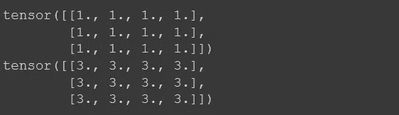

## 创建一个包含一系列数字的张量

```
print(torch.arange(10))
print(torch.arange(10).shape)
```

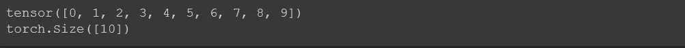

```
torch.linspace(start = 1 , end = 10 , steps  = 20)
```

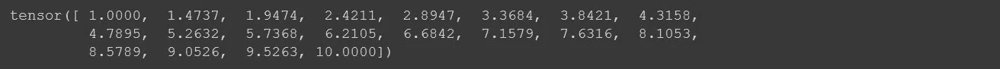

## 使用 Numpy 数组创建张量

```
arr = np.arange(10)
torch.tensor(arr)
```

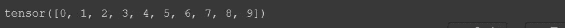

## 要改变张量的数据类型，只需写

```
torch.tensor(arr , dtype = torch.float32)
```


## 将张量转换为 Numpy 数组写入

```
t.numpy()
```


## 创建具有对角线值的张量

```
torch.eye(3)
```

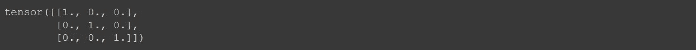

```
t1 = torch.diag(torch.arange(5))
t1
```

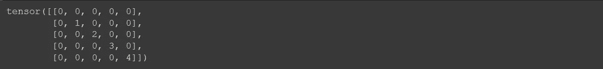

```
torch.diag(t1)
```


## 创建一个大小为 3 行 4 列的随机数数组

```
torch.rand(size = (3 ,4))
```

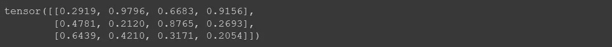

```
x = torch.ones(size = (3 , 4))
y = torch.ones(size = (3 , 4))*4
print(x ,"\n\n", y)
```

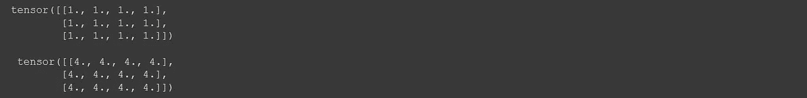

## 添加两个张量

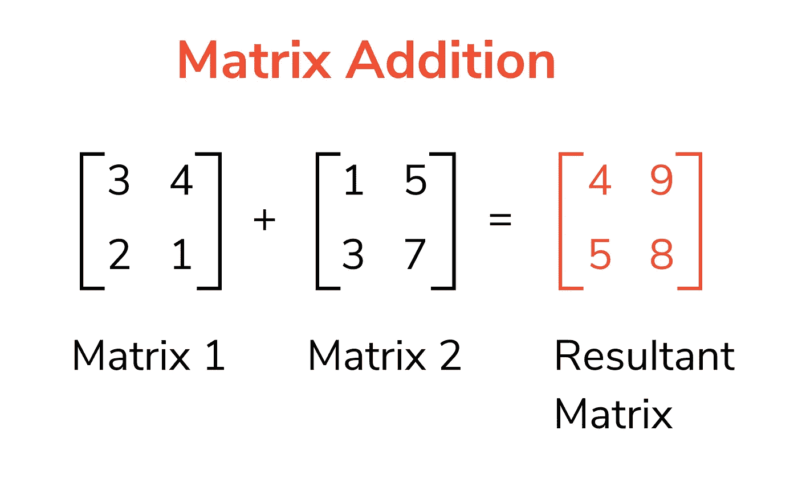

有不同的方法来添加张量

```
#1
z = torch.empty(size = (3,4))
torch.add(x,y ,out=z)
```

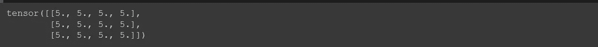

```
#2
z = torch.add(x ,y)
z
```

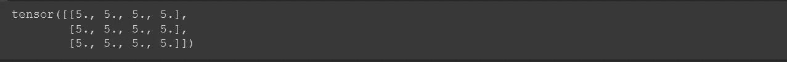

```
#3
z = x+y
z
```

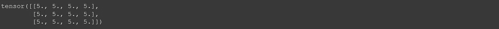

创建不同的变量来存储值会占用内存，为了避免这种情况，可以添加两个变量，并将总和存储在一个变量中。

```
#x+=y
x.add_(y) ## to save memory
```

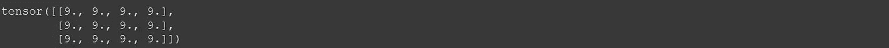

## 两个张量之间的乘法

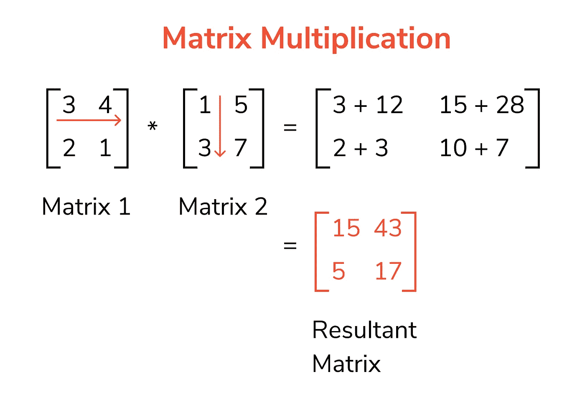

两个张量相乘有不同的方法

```
#1
x = torch.ones(size = (3 , 4))
y = torch.ones(size = (4, 5))*3
torch.matmul(x,y)
```

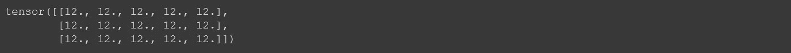

```
#2
torch.mm(x , y)
```


## 批量倍增

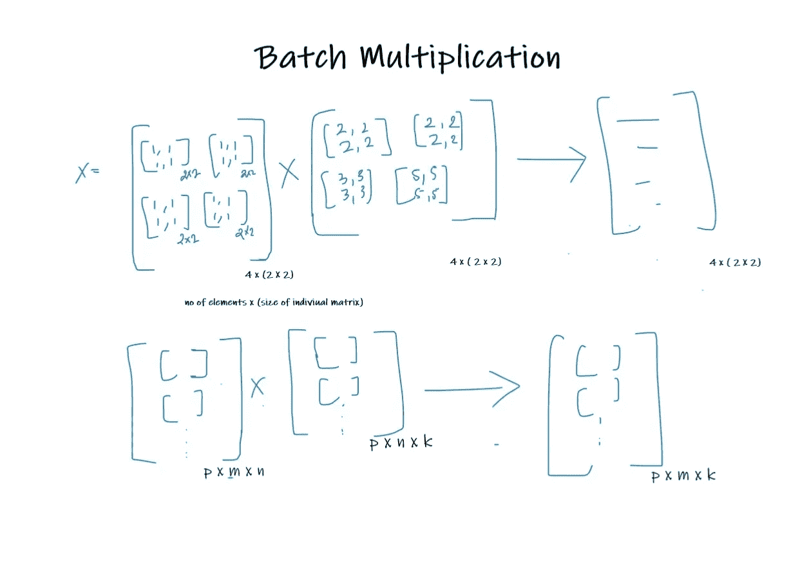

```
batch = 10m = 30
n = 20
k = 10
x = torch.rand(size =(batch , m , n ))
y = torch.rand(size =(batch , n , k ))
torch.bmm(x,y).shape
```

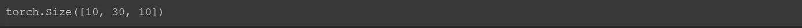

## 改变张量的形状和大小

```
t = torch.arange(15)
t
```

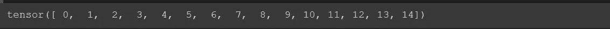

```
t.shape
```


```
t.unsqueeze(axis = 0 ).shape #row
```


```
t.unsqueeze(axis = 1)
```

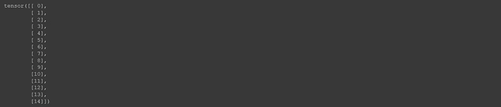

您还可以使用查看和整形方法更改特定行和列中的张量。

```
t.view(3,5)
```


```
t1 = torch.linspace(0 , 15 , 24)
t1
```

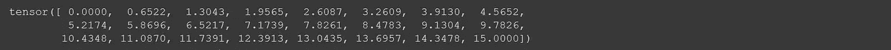

```
t1.shape
```

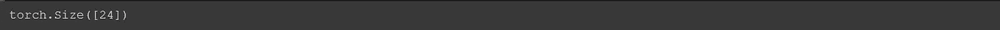

```
t1.view(2 , 3 ,4 )
# 2 dimensions , 3 rows , 4 columns
```

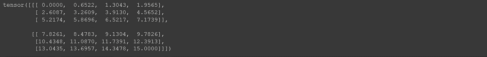

```
t1.reshape(2 , 3 , 4)
# 2 dimensions , 3 rows and 4 columns
```

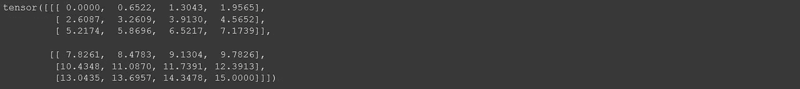

如果你想开始使用 Pytorch，以上是一些基本的操作。在本文的第二部分，我将向您展示如何使用这些基本操作来从头创建一个神经网络。如果你还有疑问，请随时联系我。

复制并编辑本 Kaggle 笔记本进行练习:

[](https://www.kaggle.com/aakashjoshi123/pytorch-for-beginners) [## Pytorch 初学者✨

### 使用 Kaggle 笔记本探索和运行机器学习代码|使用来自[私有数据源]的数据

www.kaggle.com](https://www.kaggle.com/aakashjoshi123/pytorch-for-beginners) 

在这里看看这个系列的第二部分！👇

[](/mlearning-ai/pytorch-for-beginners-d759cb85ff1a) [## Pytorch 适合初学者💫

### 第 2 部分:神经网络基础及其从头实现

medium.com](/mlearning-ai/pytorch-for-beginners-d759cb85ff1a) [](/mlearning-ai/mlearning-ai-submission-suggestions-b51e2b130bfb) [## Mlearning.ai 提交建议

### 如何成为 Mlearning.ai 上的作家

medium.com](/mlearning-ai/mlearning-ai-submission-suggestions-b51e2b130bfb) 

[成为 ML 写手](/mlearning-ai/mlearning-ai-submission-suggestions-b51e2b130bfb)