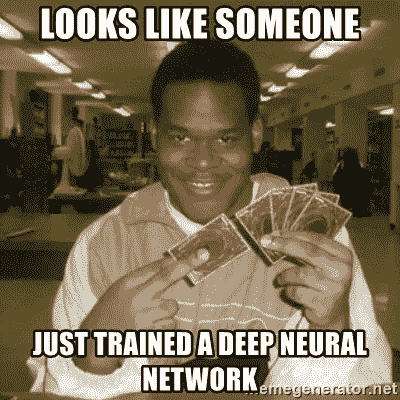

# Beginners✨火炬报

> 原文：<https://medium.com/mlearning-ai/pytorch-for-beginners-efb19e529dc3?source=collection_archive---------6----------------------->

## 第 3 部分:使用 Pytorch 内置方法构建神经网络

如果你正在阅读这个系列，那么无论我们今天要做什么对你来说都是小菜一碟，因为我已经在我的上一篇文章中向你解释了关于神经网络的每一个概念。

 [## Pytorch 适合初学者💫

### 第 2 部分:神经网络基础及其从头实现

medium.com](/@akashjoshirm.aj/pytorch-for-beginners-d759cb85ff1a) 

如果您是一个完全的初学者，并且对 Pytorch 或神经网络一无所知，我建议您从第 1 部分开始。

 [## Pytorch 适合初学者💫

### 第一部分:张量的基本运算

medium.com](/@akashjoshirm.aj/pytorch-for-beginners-62c3fcd75f69) 

如果你对这两篇文章有任何疑问。请在评论区提出您的疑问或疑问。

所以让我们开始吧！

我们将创建一个具有 1000 个样本、2 个类别(0 和 1)和 4 个特征的数据集，我们将使用 [*标准缩放器*](https://scikit-learn.org/stable/modules/generated/sklearn.preprocessing.StandardScaler.html) 进行缩放，而不是从头开始执行归一化。

对于拆分数据，我们将使用 [sklearn train_test_split](https://scikit-learn.org/stable/modules/generated/sklearn.model_selection.train_test_split.html) 。在这里，我们希望我们的测试数据大小为整个数据集的 30 %,这就是为什么 test_size = 0.3，在 random_state 中，您可以给出您想要的任何值。

我假设您已经理解了我在本系列第 2 部分教您的所有概念。如果没有，这部分对你来说会有点复杂，所以请首先检查第 2 部分。

 [## Pytorch 适合初学者💫

### 第 2 部分:神经网络基础及其从头实现

medium.com](/@akashjoshirm.aj/pytorch-for-beginners-d759cb85ff1a) 

> 在第二个标签中打开这个链接，一旦你完全理解了神经网络的基础知识和它的实现，试着比较两个代码。

1.  首先，我们必须创建一个类，你可以给任何你想要的类名，我们将继承(nn。Module)类，因为我们想要使用 nn 中存在的方法。模块(希望你了解 Python 中基本的 OOPs 概念)。
2.  在构造函数中，我们将传递 super(class_name，self)。__init__()。

> 到这里为止，你必须记住这几行代码，因为每当你为你的神经网络创建一个类的时候，你都必须写这几行。

3.现在，我们将定义神经网络，而不是将输入乘以权重，然后将偏差加到整体中。Linear()，其中我们将输入样本的大小和输出样本的大小作为参数。

4.`self.linear.weight.detach().zero_()`和`self.linear.bias.detach().zero_()` 这两条线用于为权重和偏差分配零值。

5.现在我们将定义 forward，它接受输入 x，我们将把它给我们在 self.linear 变量中定义的神经网络，它将执行`torch.add(torch.mm(x,self.weight),self.bias)`操作，我们将返回值。(视图只是改变张量的方向)

> 如果你不知道神经网络的基础知识，或者你不知道神经网络背后的数学，这将是非常混乱的。这就是为什么我让你们比较第二部分的代码和这段代码，因为从头开始的代码会让你们对神经网络背后的东西有一些基本的了解。

这段代码和第 2 部分的代码非常相似。但是有一些不同之处，如下所示

1.  优化器:优化器是修改神经网络属性的函数或算法，例如权重和学习速率。因此，它**有助于减少总损耗和提高精度。**这里我们使用 SGD optimizer，它代表随机梯度下降。我将在其他一些文章中用非常简单的语言向你解释不同的优化器，但现在，请阅读这篇由 Analytics Vidhya 撰写的文章。

 [## 深度学习优化器综合指南-分析 Vidhya

### 在训练深度学习模型时，我们需要修改每个历元的权重，并最小化损失函数。安…

www.analyticsvidhya.com](https://www.analyticsvidhya.com/blog/2021/10/a-comprehensive-guide-on-deep-learning-optimizers/) 

## **你敢！跳过它**

**了解不同的优化器非常重要**

**2。**我们使用内置的 torch.nn.functional.mse_loss()来计算损失，而不是定义不同的函数

**3。使用 optimizer.zero_grad 是因为我们通常希望在开始反向传播之前将梯度显式设置为零**

**4。** optimizer.step()用于更新偏差和权重的值。

休息一切都是一样的

每个历元的绘图误差

为了计算的准确性

如果你有任何疑问或疑问，你知道去哪里问！

分享、关注和喜欢❤

 [## Mlearning.ai 提交建议

### 如何成为 Mlearning.ai 上的作家

medium.com](/mlearning-ai/mlearning-ai-submission-suggestions-b51e2b130bfb) 

[成为 ML 写手](/mlearning-ai/mlearning-ai-submission-suggestions-b51e2b130bfb)