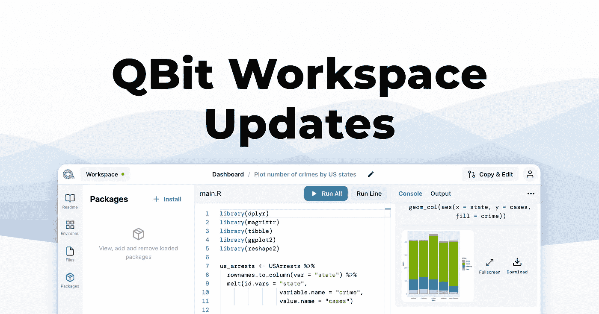
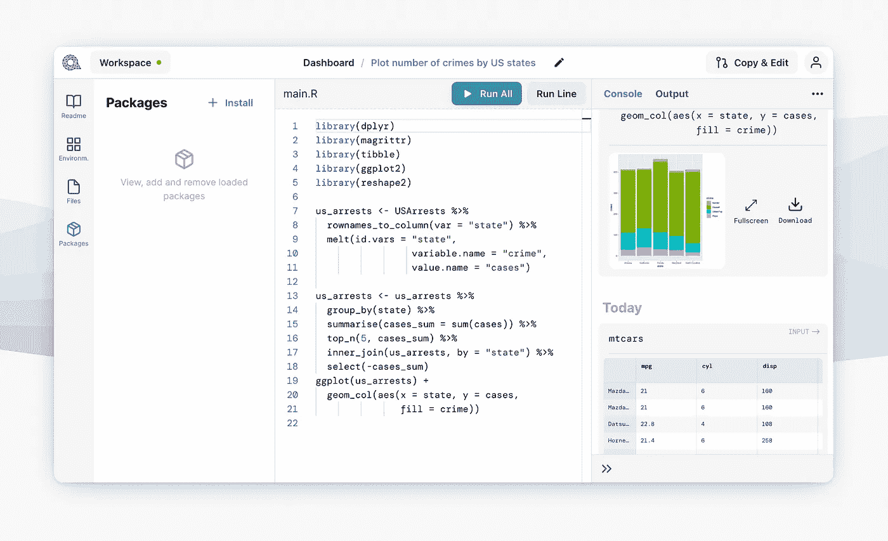
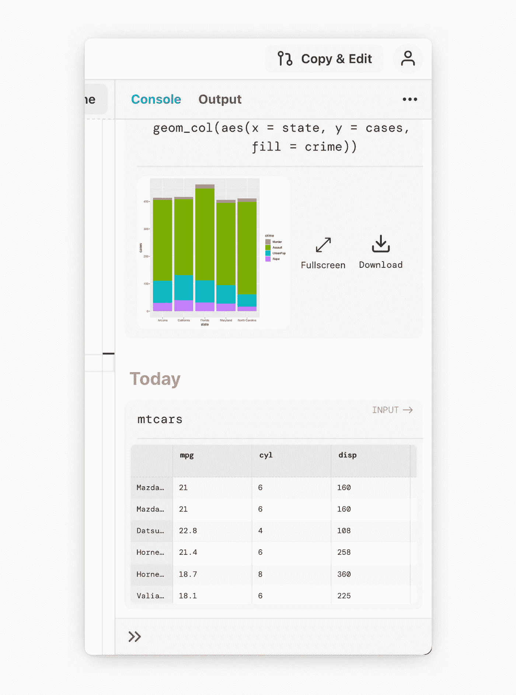
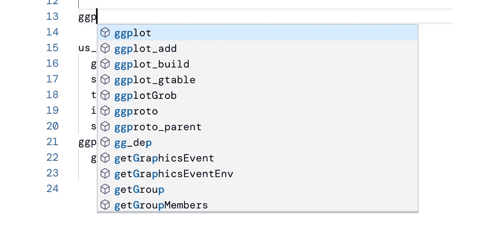
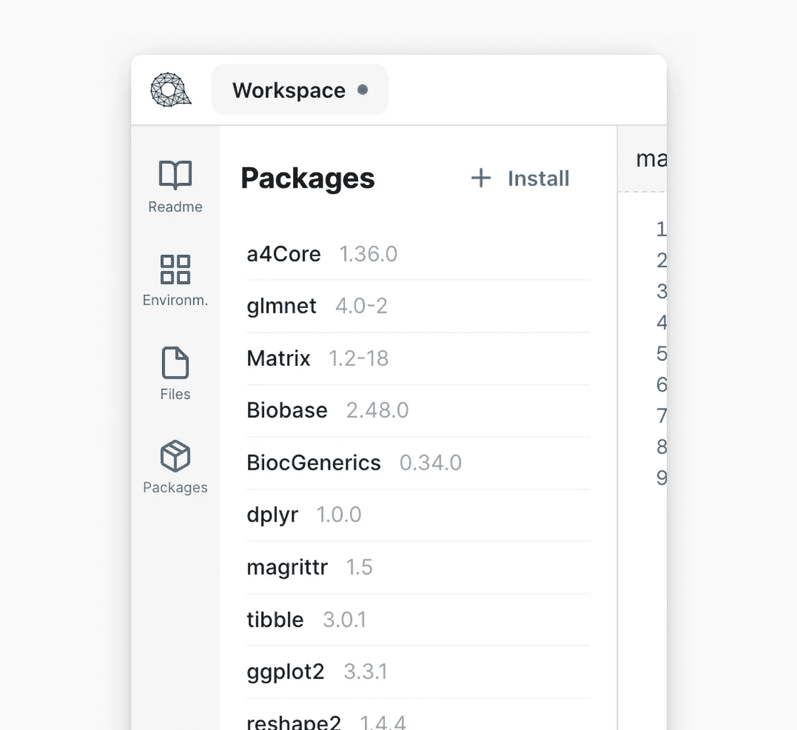

# 量子比特工作空间更新:迈向下一代数据科学编辑器

> 原文：<https://medium.com/mlearning-ai/qbit-workspace-updates-towards-the-next-generation-data-science-editor-aa832f9a086a?source=collection_archive---------1----------------------->

我们的使命是让数据科学的入门变得尽可能简单，消除你有想法和有第一个结果之间的任何摩擦。虽然 QBit Workspace 仍处于早期阶段，但已经有很多事情可以做了。

传统上，创建、管理和共享数据科学项目的周转既不快速也不高效。开发人员需要经历许多障碍，即使是简单的事情也是如此:难以共享的设置、繁琐的软件包管理或昂贵的云基础设施，等等。QBit Workspace 解决了所有这些问题——让共享项目变得像复制 URL 一样简单。

自[首次发布](https://www.quantargo.com/blog/2020-05-27-introducing-qbits-editor)以来，我们在浏览器中实现简单快速的数据科学工作流程方面取得了重大进展:

# 未来的控制台

拥有一个快速的反馈回路是非常重要的，控制台在这里扮演着至关重要的角色。我们决定放弃对控制台的经典解释，实现完全自定义的体验，包括在线预览、自动同步、过滤器等功能。

## 丰富的嵌入式预览

此次更新扩展了我们的内嵌预览，现在包括新的类型:除了图像，我们现在在控制台中以格式化表格的形式显示数据框(和 tibles ),并且可以扩展以快速显示完整的数据集。我们将在以后的帖子中更详细地讨论数据框查看器及其所有功能，如全文搜索、排序和过滤，敬请关注。

新的控制台也支持 HTML 小部件。我们支持所有发出 HTML 输出的库，不需要配置。它们的输出显示在控制台中，也可以在新的选项卡中打开。现在也可以从控制台直接访问帮助页面和生成的文件。输入字段现在保存您的命令，并可用于循环显示您过去使用过的命令。按箭头`up` / `down`键循环投掷。

QBit 工作空间是为浏览器做的。这使我们能够实现一些非常独特的功能，并在所有 web 产品的基础上进行构建。目前，上面描述的整个控制台体验与你的帐户同步，并可在任何设备上使用——你甚至可以在手机上运行代码！

## 快速过滤器

有了许多丰富的预览，它可以很快变得势不可挡，所以我们还增加了快速过滤控制台中显示的内容的能力。[下拉列表的图像]

# 下一步是什么

我们准备了一些你不想错过的东西，不要忘记注册以获得未来通知。QBit Workspace 目前免费供公众使用，但还不能用于生产。

让我们快速总结一下在接下来的几周和几个月里你可以期待什么。

## 一流的市场支持

对于我们的 RMarkdown 支持，我们感到非常兴奋，这已经在幕后酝酿了。能够快速创建报告并与互联网上的任何人实时共享是非常重要的。我们还可以选择定期生成报告(即每周一次)

## 实时协作

这在我们的清单上非常重要。我们很快会分享更多。

您可以立即试用 QBit Workspace，并向我们提供反馈。你怎么想呢?在推特、[脸书](https://www.facebook.com/quantargo)和 [LinkedIn](https://www.linkedin.com/company/quantargo/) 上联系我们。或者给我们发电子邮件到[info@quantargo.com](mailto:info@quantargo.com)！

这是一个很好的课程设置，可以让你第一次了解 R 的工作方式，并满足你更多的欲望——可能性似乎是无穷无尽的。非常愉快的经历，谢谢！

提供产品和服务，帮助您释放数据科学的力量。

*最初发表于*[*https://www.quantargo.com*](https://www.quantargo.com/blog/2021-03-13-qbit-workspace-updates)*。*