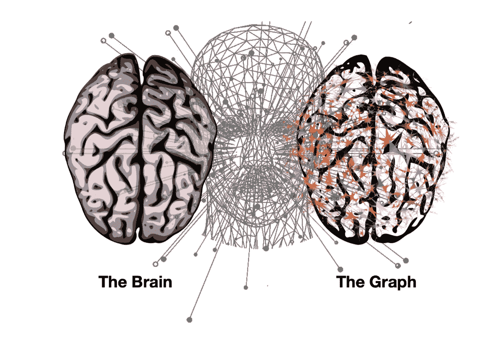
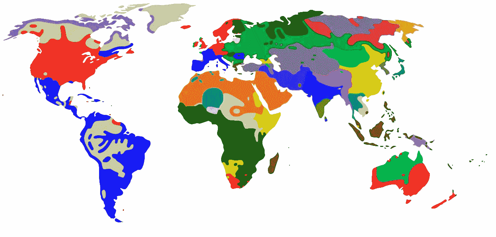
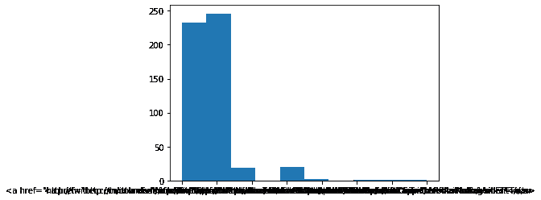

# 来自社交媒体数据的实时洞察—数据科学案例研究

> 原文：<https://medium.com/mlearning-ai/real-time-insights-from-social-media-data-data-science-case-study-69f6f82dc213?source=collection_archive---------3----------------------->



# 在这篇博客中:

*   本地和全球思维模式
*   美化输出
*   寻找共同趋势
*   探索热门趋势
*   深入挖掘
*   频率分析
*   围绕趋势的活动
*   一张能说出 1000 个单词的桌子
*   分析使用的语言
*   最后的想法

# 本地和全球思维模式

虽然我们可能不是 twitter 的粉丝，但我们不得不承认它对世界有着巨大的影响。Twitter 数据不仅在洞察力方面是多倍的，而且 Twitter 风暴可用于近乎实时的分析。这意味着我们可以了解世界各地出现的思想和情绪的大浪潮。

就像任何一个充满财富的地方一样，Twitter 有安全警卫*阻止我们马上拿到数据，⛔️需要一些认证步骤(真的很简单)来调用他们的 API 进行数据收集。由于我们今天的目标是学习从数据中提取见解，我们已经获得了✅安全部的绿色通行证，我们的数据已经可以在数据集文件夹中使用了，我们可以专注于有趣的部分了！🕵️‍♀️🌎*

Twitter 提供全球和本地趋势。让我们加载并检查查询时全球和美国热门话题的数据——对 Twitter 的 GET trends/place API 调用的 JSON 响应的快照。

**注意:** [这里](https://developer.twitter.com/en/docs/twitter-api/v1/trends/trends-for-location/api-reference/get-trends-place)是这次通话的文档，这里[是 Twitter API 的完整概述。](https://developer.twitter.com/en/docs/api-reference-index)

```
import json # Load WW_trends and US_trends data into the the given variables respectivelyWW_trends = json.loads(open('/content/WWTrends.json').read())US_trends = json.loads(open('/content/USTrends.json').read())
```

# 美化输出

我们的数据很难阅读！幸运的是，我们可以借助 jason.dumps()方法将其格式化为一个漂亮的 JSON 字符串。

```
# Pretty-printing the results. First WW and then US trends.
print("WW trends:", WW_trends)print("\n", "US trends:", US_trends)
```

# 寻找共同趋势

🕵️‍♀️从漂亮打印的结果(前一个任务的输出)中，我们可以观察到:

*   我们有一个趋势对象数组，其中包含:趋势主题的名称、可用于在 Twitter-Search 上搜索主题的查询参数、搜索 URL 和过去 24 小时的推文量(如果可用)。(趋势每 5 分钟更新一次。)
*   在查询时间 ***#BeratKandili、#GoodFriday*** 和***# we love the earth***是趋势 WW。
*   *“tweet _ volume”*告诉我们*# welovethearth*是三者中最受欢迎的。
*   结果没有按照*“tweet _ volume”*排序。
*   有些趋势是美国独有的。

浏览两组趋势并找出共同趋势是很容易的，但是我们不要做“手工”工作。我们可以使用 Python 的 set 数据结构来寻找共同的趋势——我们可以遍历两个 trends 对象，将名称列表转换为集合，并调用 intersection 方法来获得两个集合之间的共同名称。

```
# Extracting all the WW trend names from WW_trends
world_trends = set([trend['name'] for trend in WW_trends[0]['trends']])# Extracting all the US trend names from US_trends
us_trends = set([trend['name'] for trend in US_trends[0]['trends']])# Getting the intersection of the two sets of trends
common_trends = world_trends.intersection(us_trends)# Inspecting the data
print(world_trends, "\n")
print(us_trends, "\n")
print (len(common_trends), "common trends:", common_trends)
```

# 探索热门趋势

🕵️‍♀️从交集(最后一个输出)我们可以看到，在两组趋势(每组大小为 50)中，我们有 11 个重叠的主题。特别是，有一个听起来非常有趣的共同趋势:***# we love the Earth***——很高兴看到*推特网友*一致谈论热爱地球母亲！💚

***注意*** *:我们本来可以没有重叠或者有更高的重叠；当我们查询趋势时，美国人可能已经对只与他们相关的话题如火如荼了。*

```
# Extracting all the WW trend names from WW_trends
world_trends = set([trend['name'] for trend in WW_trends[0]['trends']])# Extracting all the US trend names from US_trends
us_trends = set([trend['name'] for trend in US_trends[0]['trends']])# Getting the intersection of the two sets of trends
common_trends = world_trends.intersection(us_trends)# Inspecting the data
print(world_trends, "\n")
print(us_trends, "\n")
print (len(common_trends), "common trends:", common_trends)
```


*Image Source:Official Music Video Cover:* [*https://welovetheearth.org/video/*](https://welovetheearth.org/video/)

我们发现了一个流行趋势，#我们爱地球。现在来看看它尖叫着要告诉我们什么故事！
如果我们用这个 hashtag 作为查询参数查询 Twitter 的搜索 API，我们会得到与之相关的实际 tweets。我们将搜索 API 的响应存储在 datasets 文件夹中，名为*‘welovethearth . JSON’*。因此，让我们加载这个数据集，并深入研究这一趋势。

```
# Loading the data
tweets = json.loads(open('/content/WeLoveTheEarth.json').read())# Inspecting some tweets
tweets[0:2]
```

# 深入挖掘

🕵️‍♀️打印的前两条推文让我们意识到，一条推文比我们通常认为的推文有更多的内容——不仅仅是一篇短文！

但是，让我们不要被一个 tweet 对象中的所有信息淹没！让我们关注几个有趣的领域，看看我们是否能在那里找到隐藏的见解。

```
# Extracting the text of all the tweets from the tweet object
texts = [tweet['text'] for tweet in tweets]# Extracting screen names of users tweeting about #WeLoveTheEarth
names = [user_mention['screen_name'] for tweet in tweets for user_mention in tweet['entities']['user_mentions']]# Extracting all the hashtags being used when talking about this topic
hashtags = [hashtag['text'] for tweet in tweets for hashtag in tweet['entities']['hashtags']]# Inspecting the first 10 results
print (json.dumps(texts[0:10], indent=1),"\n")
print (json.dumps(names[0:10], indent=1),"\n")
print (json.dumps(hashtags[0:10], indent=1),"\n")
```

# 频率分析

仅仅从🕵️‍♀️最后提取的前几个结果中，我们就可以推断出:

*   我们正在谈论一首关于热爱地球的歌曲。
*   许多大艺术家是这股 Twitter 浪潮背后的力量，尤其是 Lil Dicky。
*   艾德·希兰是歌曲中可爱的考拉——“EdSheeranTheKoala”标签！🐨

观察感兴趣领域的前 10 项给了我们对数据的感觉。我们现在可以通过做一个简单但非常有用的练习——计算频率分布——来进一步了解。从频率开始通常是一个好方法；这有助于获得如何进一步发展的想法。

```
# Importing modules
from collections import Counter# Counting occcurrences/ getting frequency dist of all names and hashtagsfor item in [names, hashtags]:
    c = Counter(item) # Inspecting the 10 most common items in c
    print (c.most_common(10), "\n")
```

# 围绕趋势的活动

🕵️‍♀️根据最近的频率分布，我们可以进一步建立我们的扣除:

*   我们可以更有把握地说，这是一个关于地球的音乐视频(标签为“EarthMusicVideo”)，作者是 Lil Dicky。
*   迪卡普里奥不是音乐艺术家，但他也参与其中*(利奥是一名环保主义者，所以看到他的名字出现在这里并不奇怪)*。
*   我们也可以说视频是在某个星期五发布的；很有可能是 4 月 19 日。

*我们已经能够提取如此多的洞见。挺厉害的吧？！*

让我们进一步分析数据，找出推文周围的活动模式— **是否所有的转发都发生在特定推文周围？**

如果一条推文被转发，那么*‘retweed _ status’*字段会给出许多关于原始推文本身及其作者的有趣细节。

我们可以通过分析 ***retweetcount*** 和 ***favoritecount*** 字段来衡量一条推文的受欢迎程度。但是让我们也提取一下推特粉丝的数量——我们有很多名人，所以**我们能知道他们对#WeLoveTheEarth 的倡导是否影响了很大一部分粉丝吗？**

***注****:retweet _ count 给出了原始推文被转发的总次数。在最初的推文和所有后续的转发中应该是一样的。摆弄一些样本推文和官方文档是让你了解 mnay 领域的方法。*

```
retweets = [ (tweet['retweet_count'], tweet['retweeted_status']['favorite_count'], tweet['retweeted_status']['user']['followers_count'], tweet['retweeted_status']['user']['screen_name'], tweet['text']) for tweet in tweets if 'retweeted_status' in tweet]
```

# 一张能说出 1000 个单词的桌子

让我们进一步操作数据，并以更好、更丰富的方式将其可视化— *“看起来很重要！”*

```
# Importing modules
import matplotlib.pyplot as plt
import pandas as pd# Create a DataFrame and visualize the data in a pretty and insightful format
df = pd.DataFrame(retweets, columns['Retweets','Favorites','Followers','ScreenName','Text']).groupby(['ScreenName','Text','Followers']).sum().sort_values(by=['Followers'], ascending=False)df.style.background_gradient()
```

# 分析使用的语言

🕵️‍♀️我们的表告诉我们:

*   Lil Dicky 的粉丝反应最大——42.4%的粉丝喜欢他的第一条推文。
*   即使像凯蒂·佩里和艾伦这样的名人有很多推特粉丝，他们的粉丝也几乎没有反应，例如，只有 0.0098%的凯蒂粉丝喜欢她的推特。
*   虽然 Leo 在计数方面获得了最多的喜欢和转发，但他的第一条推文只有 2.19%的粉丝喜欢。

反应的巨大差异可以用这是 Lil Dicky 的音乐视频来解释。里欧仍然比凯蒂或艾伦更受关注，因为他在这个项目中扮演了重要角色。

我们能在数据中找到一些更有趣的模式吗？从推文的文本中，我们可以发现不同的语言，所以让我们为语言创建一个频率分布。

```
# Extracting language for each tweet and appending it to the list of languages
tweets_languages = []
for tweet in tweets:
    tweets_languages.append(tweet['lang'])tweets_sources = []
for tweet in tweets:
    tweets_sources.append(tweet['source'])# Plotting the distribution of languages
%matplotlib inlineplt.hist(tweets_languages)
```

# 寻找想法

🕵️‍♀️最后的直方图告诉我们:

*   大多数推特都是英文的。
*   波兰人、意大利人和西班牙人紧随其后。
*   有很多推文使用了与 Twitter 完全不同的语言。

为什么这类信息有用？因为它可以让我们了解对这个话题感兴趣的人的“类别”(聚类)。我们还可以分析推特用户使用的设备类型，`tweet['source']`，来回答类似于**“拥有苹果和安卓相比，会影响人们对这一趋势的倾向吗？”**。我会把它留给你作为进一步的练习。



这是一次多么令人兴奋的旅行啊！我们开始几乎一无所知，现在我们在这里..见解丰富。

从基于位置的比较到分析推文周围的活动，再到从语言和设备中寻找模式，我们今天已经讨论了很多——让我们给自己一个受之无愧的鼓励吧！ ✋

***神奇公式=数据+ Python +创造力+好奇心***


```
plt.hist(tweets_sources)
```



data

笔记本 GitHub 链接:[https://GitHub . com/VD new/Real-Time-Insights-from-Social-media-Data-Data-Science-Case-Study](https://github.com/vdnew/Real-Time-Insights-from-Social-media-Data---Data-Science-Case-Study)

推特账号:

[https://twitter.com/datarishi](https://twitter.com/datarishi)

[](https://twitter.com/vishvdeep18) [## JavaScript 不可用。

### 编辑描述

twitter.com](https://twitter.com/vishvdeep18) 

Linkedin:

 [## Vishvdeep Dasadiya -助理软件工程师-埃森哲| LinkedIn

### 查看 Vishvdeep Dasadiya 在全球最大的职业社区 LinkedIn 上的个人资料。Vishvdeep 列出了 3 个职位…

www.linkedin.com](https://www.linkedin.com/in/vishvdeep-dasadiya-65770312b/) 

GitHub:

[https://github.com/vdnew/](https://github.com/vdnew/Real-Time-Insights-from-Social-media-Data---Data-Science-Case-Study)