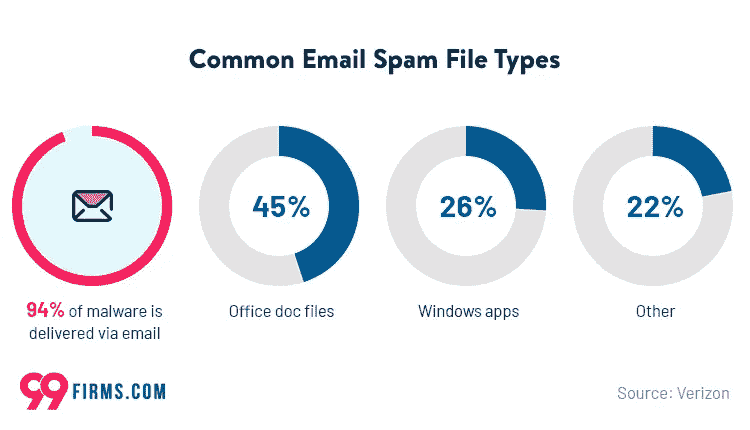
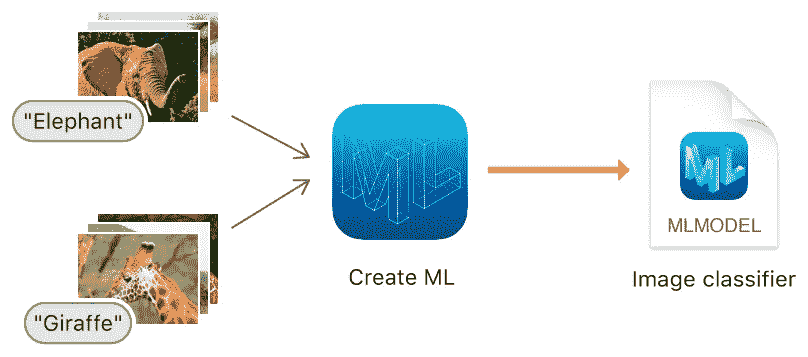
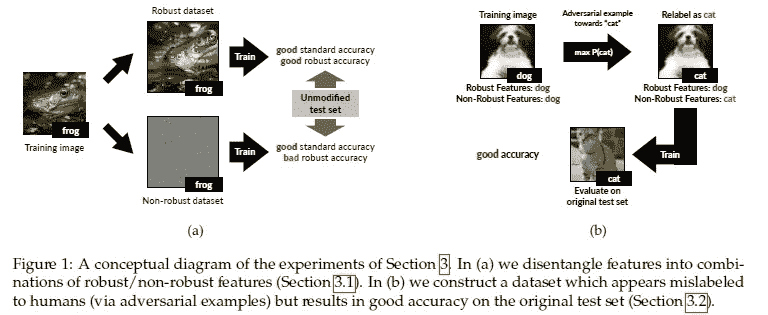
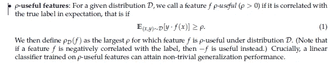
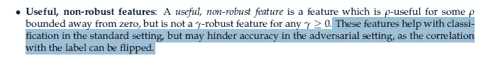
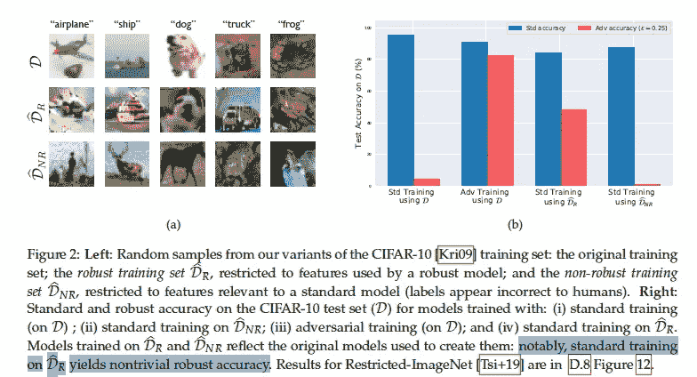
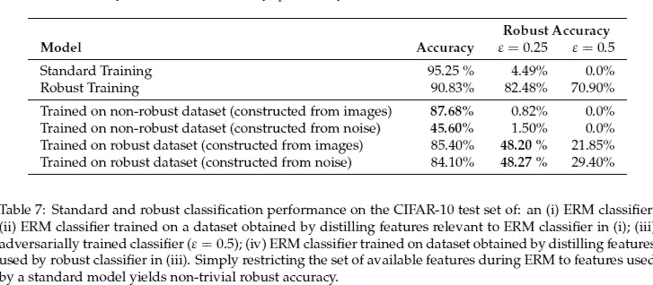
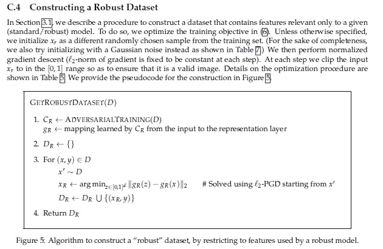
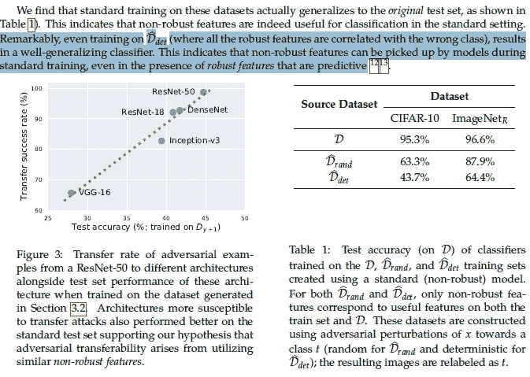

# 研究人员发现对抗性干扰起作用的可能原因

> 原文：<https://medium.com/mlearning-ai/researchers-discover-possible-reason-why-adversarial-perturbation-works-f65e64d9eb7?source=collection_archive---------2----------------------->

## 这是一篇有趣的论文

我对人工智能鲁棒性领域非常感兴趣。随着技术解决方案的扩大和变得更受欢迎，我们将看到更多的人试图利用它们。一个流行的例子是垃圾邮件。垃圾邮件通常以我们察觉不到的方式嵌入了许多病毒和木马。这就产生了问题。

There’s a reason that people put so much money into spam filters

人们使用机器学习来应对这一点(垃圾邮件过滤器最初是基于朴素贝叶斯算法构建的)。骗子试图绕过这一点。这就造成了骗子和工程师之间的军备竞赛。

How Image Classification works normally

下面是一个对抗性学习的例子，我们试图欺骗图像分类器(Youtube 视频介绍了这个概念[这里](https://www.youtube.com/watch?v=oMYPdw4TcQ0))。对立的例子是设计用来愚弄 ML 模型的输入。这是如何工作的？以上面的图像分类器为例。它获取一幅图像并返回一个带有概率的标签。假设我们希望长颈鹿图片输出大象标签。我们将拍摄长颈鹿图片，并开始调整像素数据。我们将继续这样做，以尽量减少与大象图片的分歧。最终，我们得到了一张奇怪的图片，它以长颈鹿图片为基础，但对代理来说看起来像一头大象。这个过程被称为对抗性扰动。人类通常看不到这些扰动，这就是它们如此危险的原因。

Example of something that fools Deep Learning Classifiers.

**“对抗性例子不是错误，它们是特征”**由麻省理工学院的一个研究团队发表的一篇论文试图回答为什么对抗性扰动有效。他们发现图像的预测特征可以分为两种类型，健壮的和不健壮的。本文探讨了对抗性干扰如何影响每一种特征。这篇文章将回顾报纸上一些有趣的发现。

A picture tells a thousand words

# 外卖食品

既然你们已经了解了对抗性学习的背景以及它的重要性，这里有一些来自论文的见解，将对你们的机器学习之旅有用。

## 健壮与不健壮的特征

Definition

鲁棒特征是简单有用的特征，在应用某种对抗扰动后仍然有用。非稳健特征是在扰动之前有用但现在甚至可能导致错误分类的特征。

## 强大的功能已经足够了

作为一个提倡低成本训练的人(我是一个 80-20 岁的大块头)，这可能是最让我垂涎的一点。这篇论文的作者做了一些有趣的事情。他们使用原始数据集创建 2 个新数据集:1) DR:由健壮特征构成的数据集。2) DNR:非鲁棒特征的数据集。

他们发现在 DR 集合上训练标准分类器提供了良好的准确性。没什么太令人震惊的，这就是健壮特性的定义。他们在受到对抗性干扰后表现出色。没什么好惊讶的。让我感兴趣的是稳健数据集在正常训练中的表现。通过挖掘阑尾，我们找到了这张多汁的桌子。

引用本文作者的话来说，“结果(图 2b)表明，使用新数据集学习的分类器在标准和对抗设置中都获得了良好的准确性。”对我来说，这是一个有趣的解决方案。如果您的组织没有资源投资于大量的对抗性训练/检测，一种替代方法可能是识别健壮的特征并专门针对它们进行训练。这将保护您免受对抗性输入，同时在正常使用中提供良好的准确性。

How to build a robust dataset. We are essentially minimizing disagreement.

## 对立的例子攻击非健壮的特征

这是本文的假设。作者很好地证明了这一点。他们指出，“*将数据集限制为只包含鲁棒模型使用的特征，标准训练会产生明显更鲁棒的分类器。这表明，当在标准数据集上训练时，非鲁棒特征在所得到的学习分类器中起很大作用。在这里，我们开始表明，这种作用不仅仅是偶然的或由于有限样本过度拟合。特别是，我们证明了非鲁棒特征本身就足以满足标准推广——即，仅在非鲁棒特征上训练的模型可以在标准测试集上表现良好。*“简而言之，非鲁棒特征具有高度预测性，甚至可能在实际预测中发挥更大的作用。

这就是有趣的地方。作者用对立的例子测试了多种架构，发现它们都同样容易受到攻击。这非常符合他们的假设。引用他们的话

> 回想一下，根据我们的主要论点，对立的例子可以作为扰乱良好概括但脆弱的特征的结果而出现。假设这些特征是数据分布所固有的，在来自该分布的独立样本上训练的不同分类器很可能利用相似的非鲁棒特征。因此，通过利用由一个分类器学习的非鲁棒特征而构建的对抗示例将以类似的方式转移到利用这些特征的任何其他分类器。

# 关闭

这是一篇颇有见地的论文。我对几个问题/延伸很感兴趣:

1.  用非二进制数据集对此进行测试，看看这种方法可以扩展到什么程度。更多的类会使决策边界变得模糊，因此健壮的数据集可能不会工作得很好(我仍然抱有希望)。
2.  所有对立的例子都是通过攻击非健壮的特征来运作的吗，或者这是一个子集？

让我知道你的想法。我很想听听你对这篇论文的看法。

如果你喜欢这篇文章，看看我的其他内容。我定期在 Medium、YouTube、Twitter 和 Substack 上发帖(所有链接都在下面)。我专注于人工智能、机器学习、技术和软件开发。如果你正在准备编码面试，请查看:[编码面试变得简单](https://codinginterviewsmadesimple.substack.com/)。

为一次性支持我的工作，以下是我的 Venmo 和 Paypal。任何数额都值得赞赏，并有很大帮助:

https://account.venmo.com/u/FNU-Devansh

贝宝:【paypal.me/ISeeThings 

# 向我伸出手

如果那篇文章让你对联系我感兴趣，那么这一部分就是为你准备的。你可以在任何平台上联系我，或者查看我的其他内容。如果你想讨论家教，发短信给我。如果你想支持我的工作，请使用我的免费 Robinhood 推荐链接。我们都有免费的股票，对你没有风险。因此，不使用它只是失去免费的钱。

查看我在 Medium 上的其他文章。:[https://rb.gy/zn1aiu](https://rb.gy/oaojch)

我的 YouTube:[https://rb.gy/88iwdd](https://rb.gy/88iwdd)

在 LinkedIn 上联系我。我们来连线:[https://rb.gy/m5ok2y](https://rb.gy/f7ltuj)

我的 insta gram:[https://rb.gy/gmvuy9](https://rb.gy/gmvuy9)

我的推特:[https://twitter.com/Machine01776819](https://twitter.com/Machine01776819)

如果你正在准备编码/技术面试:[https://codinginterviewsmadesimple.substack.com/](https://codinginterviewsmadesimple.substack.com/)

获得罗宾汉的免费股票:[https://join.robinhood.com/fnud75](https://www.youtube.com/redirect?redir_token=QUFFLUhqa0xDdC1jTW9nSU91WXlCSFhEVkJ0emJvN1FaUXxBQ3Jtc0ttWkRObUdfem1DZzIyZElfcXVZNGlVNE1xSUc4aVhSVkxBVGtHMWpmei1lWWVKNzlDUXVJR24ydHBtWG1PSXNaMlBMWDQycnlIVXNMYjJZWjdXcHNZQWNnaFBnQUhCV2dNVERQajFLTTVNMV9NVnA3UQ%3D%3D&q=https%3A%2F%2Fjoin.robinhood.com%2Ffnud75&v=WAYRtSj0ces&event=video_description)

 [## Mlearning.ai 提交建议

### 如何成为 Mlearning.ai 上的作家

medium.com](/mlearning-ai/mlearning-ai-submission-suggestions-b51e2b130bfb)