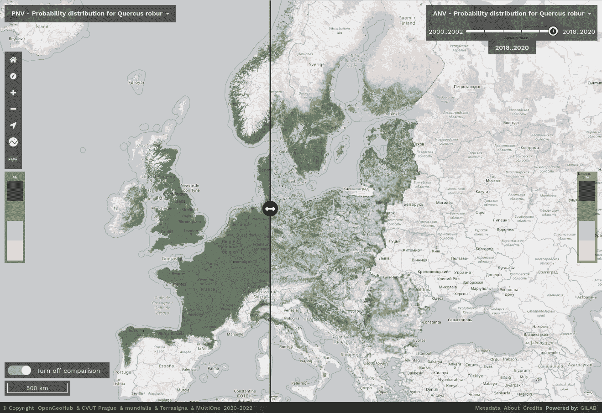
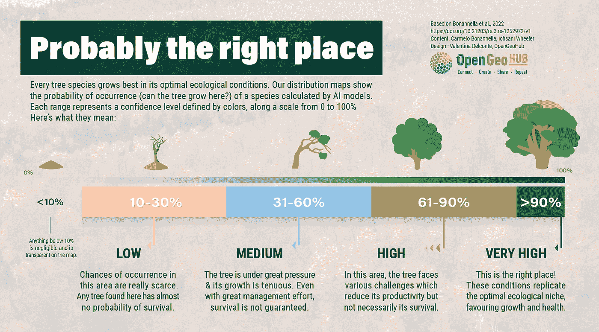
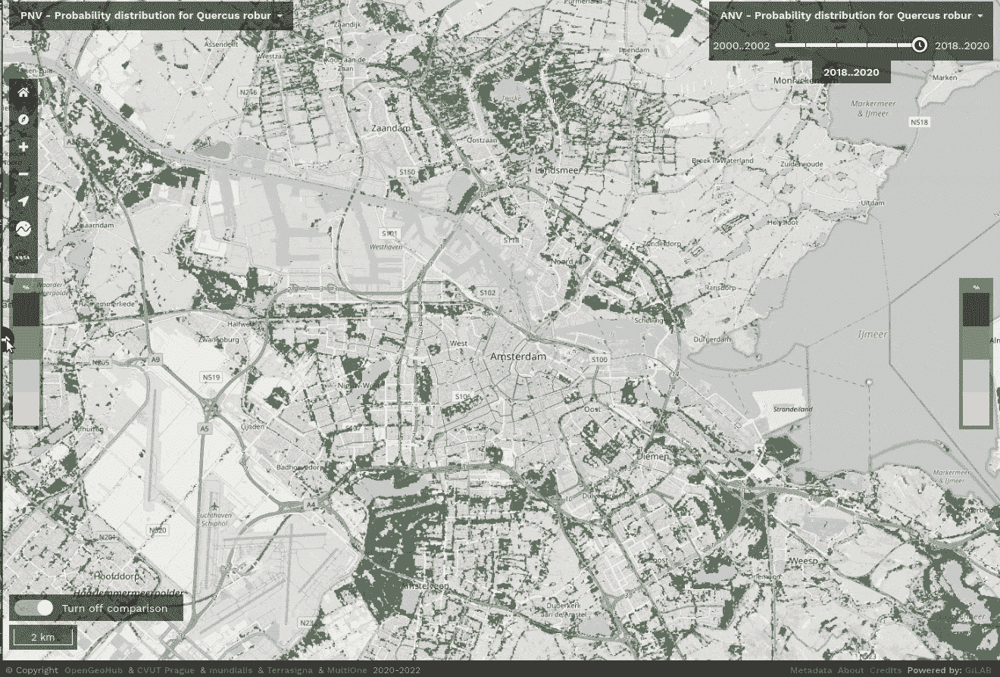

# 正确的树，正确的地方:用人工智能重新设计欧洲的森林

> 原文：<https://medium.com/mlearning-ai/right-tree-right-place-redesigning-europes-forests-with-ai-7632eea35321?source=collection_archive---------2----------------------->

*编写人:Carmelo Bonannella (OpenGeoHub)、Valentina Delconte (OpenGeoHub)、ich Sani Wheeler(OpenGeoHub/EnvirometriX)和 Tom Hengl(OpenGeoHub/EnvirometriX)*

> 人们对气候变化及其带来的潜在威胁越来越感兴趣，因此对解决全球最大环境问题的工具和解决方案的需求也越来越大。森林是解决方案的一部分，但我们只有一个很小的窗口可以采取行动:今天再生的森林将不得不应对未来至少几十年，往往甚至超过 100 年的气候条件。我们如何面对这一挑战？AI 可以帮忙。

# 植树项目:炒作多于解决方案？

[重新造林和森林恢复被认为是应对气候变化的关键策略。由于森林在固碳方面的巨大潜力，在过去的二十年里，世界各地开展了几个重新造林项目，从拉丁美洲的](/nerd-for-tech/restoration-culture-what-is-land-degradation-how-to-measure-it-and-what-can-you-do-to-reverse-341e448994da)[倡议“20x 20”](https://initiative20x20.org)到撒哈拉以南非洲的[绿色长城](https://www.greatgreenwall.org/about-great-green-wall)。欧洲也开始播种:欧盟最近承诺在 27 个成员国种植[30 亿棵树](https://ec.europa.eu/environment/3-billion-trees_en)作为 [**欧洲绿色协议**](https://ec.europa.eu/info/strategy/priorities-2019-2024/european-green-deal_en) 和 [**欧盟 2030**](https://ec.europa.eu/environment/strategy/forest-strategy_en) 森林战略的一部分。

*Potential distribution for the* [*pedunculate oak*](https://www.gbif.org/species/2878688) *(left) compared with its actual distribution (right) over Europe at 30m resolution. Open Data Science Europe (ODSEurope) Viewer:* [https://maps.opendatascience.eu](https://maps.opendatascience.eu)*.*

尽管有伟大的全球再造林倡议和政府承诺，种植和成功种植树木已经挑战了许多实践社区，比实际的树干生长更多的关注。不幸的是，忽视或忽略哪棵树在哪里长得好已经导致许多植树项目失败的次数比成功的次数多。自从 20 世纪 80 年代开始，[在撒哈拉以南非洲种植的价值数十亿美元](https://www.smithsonianmag.com/science-nature/great-green-wall-stop-desertification-not-so-much-180960171/)4000 英里长*【绿色长城】*的树木有 80%已经死亡；最近发表在《自然》杂志上的一项研究调查了印度北部的造林工作，发现该地区几十年来昂贵的植树计划已经被证明是无效的。这两个造林失败的例子强调了一个明显但被忽视的模式:在这些项目中，树木往往种植在次优条件下，很少或没有科学证据证明它们在种植区的存活机会，而且往往没有足够的资源来监测和确保它们的长期生长。

科学家、企业、神秘主义者和电影明星让世界各地的政策制定者相信，大规模的植树运动应该是全球气候政策的一个基本要素。公众对话强调了植树的潜在好处，同时淡化了社会和生态研究已经确定的缺陷和限制。”— Forrest Fleischman，明尼苏达大学自然资源政策副教授，2020 年

大规模植树是最受欢迎的恢复计划，所有政府承诺中有 45%涉及种植大型单一作物以获取利润，这引起了保护界对其在固碳和恢复弹性生态系统方面的实际价值的严重关注。这些项目的影响可以超越森林的界限，影响附近的生态系统和当地社区:在印度[特伦甘纳邦](https://doi.org/10.1093/biosci/biaa094)政府控制的土地上种植了两年的桉树，削弱了当地的生物多样性，加剧了火灾风险，改变了水文和土壤条件，限制了当地人的进出，破坏了社区生计。尽管这种负面影响在科学界广为人知，但政策制定者仍然很难认识到[设计不良的植树活动的危害](https://doi.org/10.1093/biosci/biaa094)，我们仍然在寻求这个问题的答案:哪棵树应该种在哪里？

正如 Patrick Worms(世界复合农林业的高级科学政策顾问和国际复合农林业联盟的财务主管)在 LinkedIn 上所说的那样:*“景观恢复绝不仅仅是植树造林。是关于种树的。正确的树，为了正确的目的，在正确的地方。这么想吧。种一棵树就像生一个孩子。不是工作什么时候停止，而是工作什么时候开始。”*

# 人工智能支持生态系统

在这种背景下，OpenGeoHub 利用人工智能与卫星数据相结合的力量来确定生态要求(温度、降水、海拔等)。)的一系列 keystone 森林树种(列在[欧洲森林树种图集](https://forest.jrc.ec.europa.eu/en/european-atlas/)中)，覆盖欧洲大陆，分辨率为 30 米。为了说明比例，我们地图的一个像素覆盖了一个标准足球场面积的⅛。

我们为每个树种分析了这些变量之间的微妙关系，并翻译成 [**潜在分布图**](https://doi.org/10.7717/peerj.5457) ，显示出现的几率(树在吗？)对于每个单个像素中的每个树种。

听起来很简单，只需将光标悬停在地图上，就可以了解某个感兴趣的物种是否能够出现在该区域，这取决于其生态需求。虽然有可能在我们的模型估计的低概率值的区域找到树木，但这些区域可能不适合该物种，在那里找到的树木可能不健康。

*Ecological guidelines to interpret the probability values reported in our distribution maps. It is important to interpret these values alongside uncertainty maps, which estimate how reliable the probability value predicted by the model is.*

然而，这还不足以理解该领域正在发生的事情:欧洲森林在历史上一直受到巨大的人类压力，因为整个大陆的环境都是由人类活动塑造的。虽然现在欧洲大陆的森林覆盖面积[超过⅓](https://ec.europa.eu/eurostat/web/products-eurostat-news/-/edn-20210321-1)，而且这一面积还在持续增长，但是[由于人为和自然的干扰，欧洲的树木死亡率也在以惊人的速度增长](https://www.sciencedirect.com/science/article/pii/S259033222100227X)。树木死亡率的进一步上升可能会改变欧洲的森林人口结构，使其偏向年轻森林，对森林的自然再生产生连锁负面影响。在具有一定数量树种的新形成的森林斑块中，幼树竞争不断减少的资源。这导致更多有竞争力的物种主宰环境，导致生物多样性丧失和生态系统功能受损。

为了更好地了解现实，我们教会了我们的 AI 不同物种如何相互影响，以及人类住区和活动如何影响物种生存，从而产生了生态学家所谓的**现实分布图**。这些地图明显不同于我们开始时的潜在分布图；比较它们揭示了一个物种目前占据的区域和它可能繁荣的区域之间的差异。

例如，我们观察了欧洲各地潜在的和已实现的有柄橡树分布图( [*栎*，L.](https://www.gbif.org/species/2878688) )，一种在其生态系统中发挥[关键作用的大陆物种，因其保持森林健康和与不同昆虫和野生动物相关而受到重视。人类非常了解这种树，在凯尔特人之前就与它有着悠久的关系:几个世纪以来，这种树一直为家具、建筑和船只提供木材。](https://ies-ows.jrc.ec.europa.eu/efdac/download/Atlas/pdf/Quercus_robur_petraea.pdf)

我们看了一下阿姆斯特丹市目前占据的区域:注意这个区域是如何拥有繁荣的橡树林的，令人惊讶的是，城市中心是最适合居住的区域之一！当然，这并不意味着整个城市都应该被树木所取代，但这让我们知道了某个特定物种在欧洲的什么地方可以生长。

*The “compare tool” available on the Open Data Science Europe viewer allows to quickly visualize the differences between potential (left) and realized (right) distribution of the* [*pedunculate oak*](https://www.gbif.org/species/2878688) *in the area around Amsterdam (Netherlands).*

# 规划 30 亿棵树

我们现在能更好地回答问题*“哪棵树在哪里？”* —极有可能是！我们的模型表明，有可能在对操作实践有用的详细程度上为不同物种绘制潜在的合适区域。这些地图不是一个独立的工具，而是已经可以被专家和决策者在规划造林项目时使用。

尽管世界上有太多的地理空间数据，但我们仍在努力应对它们在现实世界中的应用。现在正是时候:[新开发的机器学习算法](https://opengeohub.github.io/spatial-prediction-eml/)让我们以前所未有的准确度和成本节约率预测分布图。当展示分析和决策就绪产品时，这些类型的数据驱动工具可以在景观设计和重新造林项目中打开新的大门。想想看:(至少就我们所知)**现在还没有软件**可以用来重新设计生态系统，如果没有整合的设计和用户的参与，构建生态系统是不会成功的。

您有兴趣成为开发可访问的农场级工具的早期测试用户吗？如果是这样，联系 [OpenGeoHub](https://opengeohub.org/contact-us/) 。我们是一个独立的非营利研究基金会，致力于促进开源和开放数据解决方案。我们正在寻找土地所有者，他们目前正在评估植树或农林选项，并愿意作为早期用户在欧洲提供真实的测试案例。

我们有足够的信息为世界上所有的物种做这件事吗？—大概不会；至少现在还没有。这只是欧洲树种的一个例子，但是这种潜力可以扩展到几乎所有已知大洲的所有已知树种。这些地图的制作多亏了无数社区的努力，才得以在国际数据库中识别和记录物种的出现，如自然学家的[**【GBIF】**](https://www.gbif.org/)和**。每个人都可以参与，每个数据点都很重要。所以如果你热爱自然，考虑为你附近的公民科学项目做贡献吧！**

**我们相信，在规划像在我们的土地上种植 30 亿棵树这样重大的事情时，客观、可自由访问和易于使用的信息是对计算哪棵树去哪里的宝贵贡献。农民和林农[需要借助科学能够提供给他们的最佳数据](/nerd-for-tech/restoration-culture-what-is-land-degradation-how-to-measure-it-and-what-can-you-do-to-reverse-341e448994da)来领导这些决策，这样我们才能以实用、可持续和有利可图的方式实现我们的社会目标。**

# **获取森林树种分布数据**

**要访问上述地图，请访问[Open Data Science Europe viewer](https://maps.opendatascience.eu/)。地图以 4.0 许可证在 CC 下分发，并可从 [Zenodo](https://doi.org/10.5281/zenodo.5821865) 免费下载。用于准备地图的输入训练点、代码和说明可在[这里](https://opengeohub.github.io/spatial-prediction-eml/spatiotemporal-interpolation-using-ensemble-ml.html)获得。有关欧盟森林树种实际和潜在预测的更多信息，请参考:**

*   **Bonannella，c .、Hengl，t .、Heisig，j .、Parente，l .、Wright，M.N .、Herold，m .、de Bruin，s .，**“欧洲森林树种分布 2000–2020:利用时空机器学习绘制潜在和实际分布图”**，2022 年 1 月 12 日，提交给 PeerJ，预印本(第 1 版)可在研究广场[https://doi.org/10.21203/rs.3.rs-1252972/v1](https://doi.org/10.21203/rs.3.rs-1252972/v1)查阅**

**[OpenDataScience.eu 项目](https://opendatascience.eu)由欧盟( [CEF 电信项目 2018-EU-IA-0095](https://ec.europa.eu/inea/en/connecting-europe-facility/cef-telecom/2018-eu-ia-0095) )共同资助，作为电信计划中连接欧洲设施(CEF)的一部分，该设施是欧盟的一个重要工具，通过部署数字服务基础设施(DSIs)和宽带网络来促进公共行政部门、企业和公民之间的跨境互动。**

** [## Mlearning.ai 提交建议

### 如何成为 Mlearning.ai 上的作家

medium.com](/mlearning-ai/mlearning-ai-submission-suggestions-b51e2b130bfb)**