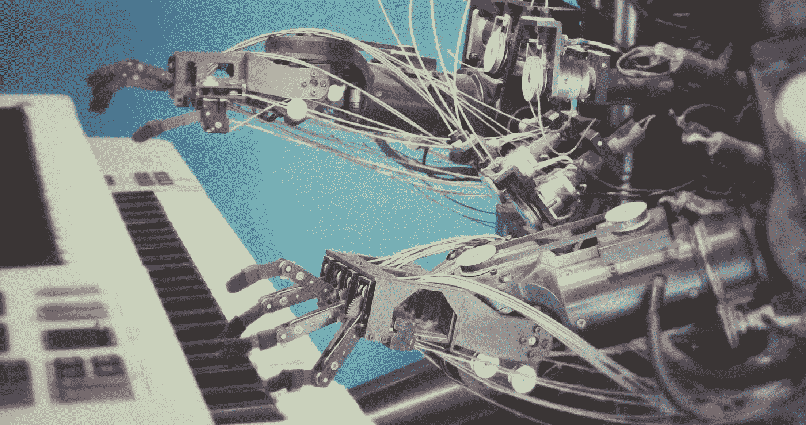

# 机器人伦理 2.0，第 6 章:熟练感知、真实性和反对自动化的案例；大卫·佐勒

> 原文：<https://medium.com/mlearning-ai/robot-ethics-2-0-e0bfee44650f?source=collection_archive---------2----------------------->

大卫·佐勒提出了一个反对自动化的案例，他认为在自动化过程中被取代的一项技能不仅仅是一份工作、一项义务或一项杂务。这可能是我们的本质。我们如何看待周围的世界。我们的身份可能比我们愿意承认的更多地依赖于我们的知识。技能活动允许(或迫使)我们通过一种特殊的注意力模式，一种特殊的态度，与这个世界接触。

> “在 **Automania** ，我们是各行各业的千斤顶，无需任何培训就能适应和胜任任何情况。去市中心你最喜欢的咖啡店吗？人行道上的虚拟箭头会指引你的脚步。或者，当你在脑子里玩网络游戏时，你的鞋子会把你推向正确的方向，避开障碍。有人说了什么让人困惑的话吗？轻扫翻译器，你会听到用你能理解的方式翻译的。不用说，你是乘坐由机器人维修的自动化汽车来到这里的。这是一个没有限制的世界，因此不需要技能来应对它们。”*(林，p .，k .，&詹金斯，r .(编辑。).，2017)*

佐勒描绘了一个不费力的世界，在那里生活本身似乎是自动化的。纪律和训练似乎已经成为过去。但是代价是什么呢？为了阐明佐勒的观点，重要的是要摆脱这样一种常识性的态度，即世界只是空间中物体的集合。根据观察者的特殊技能，同样的物体看起来会有很大的不同。根据工程师、赛车手、人类学家等是否看到跑车，跑车将是一个非常不同的东西。其原因是，人类的凝视配备了一个可理解的无意识网格，不仅*在空间上看到*某些东西，而且*通过各种能力和潜力感知*它。我们经常以透视的方式“看”事物，并且主观地“用它能做什么”。不同的人被训练成对事物有不同的看法。这就是为什么木匠和植物学家在看一棵红枫时会看到两个完全不同的物体。自动化威胁着将这些差异瓦解为一个单一、统一和同质的世界观，在这个世界观中，人类身份本身变得算法化和乏味。

佐勒将这种独特的人类特质称为“熟练的注意力”。他认为，熟练的注意力具有内在价值，并且/或者它有助于获得(也)具有内在价值的事物。根据佐勒的说法，熟练注意力的丧失将对我们的生活产生有害影响。为了说明他的观点，佐勒为我们提供了一个熟练和非熟练注意力的现象学。

完全自动化的世界会导致不熟练的注意力。我们对世界的体验会变得“去技能化”，可以这么说。这对佐勒提出了一个严重的问题，因为他认为熟练的注意力是过好生活的必要条件之一。

> 因此，在我面前放一张桌子不仅仅是一个平面的视觉图像，恰好与我记忆中的一张小图片卡相匹配，上面标着“桌子”。“实际上，让我面前的东西“成为”一张桌子，是让我的感官与一个邀请我(和我的身体)走向某种最佳体验的对象相关联。”(林，p .，k .，&詹金斯，r .(编辑).，2017)

从这段引文中我们可以看出，也正如上面已经讨论过的，感知是一种高度复杂的解释性活动。现象学分析揭示了感知的负载和参与性质。我们从来都不是西方科学史希望我们成为的那种无私的旁观者。观察已经是一种行动，一种干预。熟练的注意力决定了一个人对另一个人感知的独特性。

随着我们获得更多处理特定对象的技能，我们变得专业化，然后那个特定领域的事物*以一种非常不同的方式向我们展示它自己*。如果我不会弹钢琴，那么这种乐器带给我的感觉会与专业音乐家的感觉截然不同，它甚至会让我感到害怕，并不祥地提醒我音乐能力不足。然而对于一个训练有素的音乐家来说，它是一个更熟悉的对象，一个允许更广泛和更愉快的熟练注意力视野的对象。

通过训练和训练，我们使自己按照我们变得熟练的方式来感知“客观”的现实。生活世界的不同方面要么被夸大，要么被缩小，要么被放在最前面，要么被隐藏起来，这一切都取决于我们的能力，取决于我们的专业知识。我们熟练的部署。正是这种“利基”形式的感知和注意力证明了我们的自由。一个自动化的世界本质上将是一个异化的世界，在那里没有任何东西被区分，一切都变成了*算法。没有对世界的任何直观或定性的熟悉，所有的行动都将成为计算的问题。拖地板和拉大提琴会涉及相同的认知过程。*

**参考**

1.  林，p，，k，&詹金斯，r .(编辑。).(2017).*机器人伦理 2.0:从自动驾驶汽车到人工智能*。牛津大学出版社。