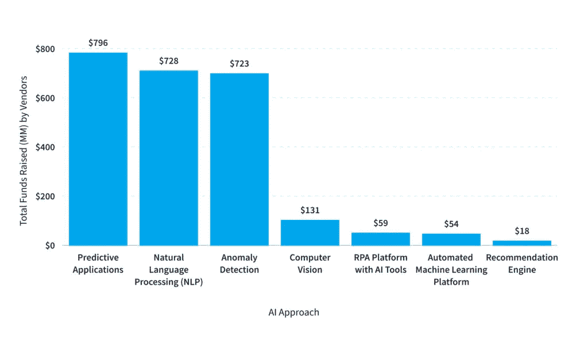
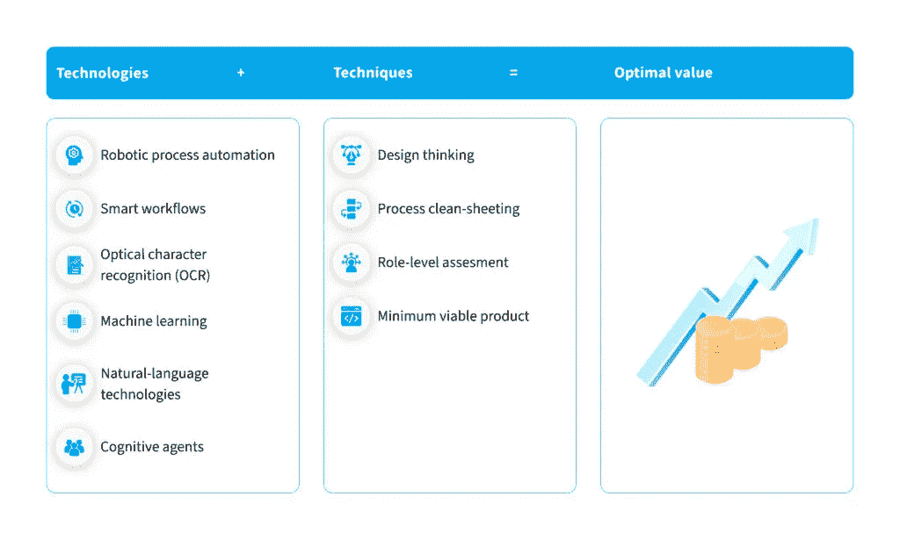

# 金融和银行业中的 RPA:使用案例和实施— NIX United

> 原文：<https://medium.com/mlearning-ai/rpa-in-finance-and-banking-use-cases-and-implementation-nix-united-d37a39a72cae?source=collection_archive---------4----------------------->

机器人真的比人类更有效率吗？他们执行特定任务的速度[比](https://www.cnbc.com/2018/02/17/construction-robotics-bricklaying-robot-five-times-faster-than-human.html)快五倍，消除了出错的可能性，全天候工作，并允许团队专注于更具战略性的工作。这就是为什么机器人过程自动化(RPA)在包括金融和银行部门在内的各行各业越来越受欢迎的原因。

RPA 的快速渗透影响了全球各行业。因此，到 2030 年底，RPA 的整体市场规模预计将达到 239 亿美元。

在过去的几年里，银行和金融业一直呈指数级增长。深受技术进步和疫情余波的影响，这些行业正在加强其在线业务，并实施突破性技术以适应不断变化的环境。

金融领域的 RPA 被认为是机构通过提高运营效率和提升客户体验来获得竞争优势的强大工具。具体来说，银行业的 RPA 预计到 2025 年将达到[11.2](https://automationedge.com/blogs/robotic-process-automation-rpa-in-banking-industry/)亿美元。

金融服务行业的 RPA 如何帮助公司应对挑战，他们如何实施这些解决方案以实现最大的繁荣？本文试图找到答案。

# 机器人过程自动化的基础

机器人过程自动化软件的显著特征是，它通过访问用户界面来自动化活动，而不影响底层程序。它允许以最小的投资从系统集成中获益。

当前可用的技术使不同领域的多种工作自动化。值得注意的是，只有少数职业可以被技术解决方案完全取代，而大多数工作都有一系列可以自动化的特定活动。因此，60%的职业至少有 30%的技术自动化过程。

让我们继续探索 RPA 在金融和银行部门意味着什么。

# 什么是银行业的机器人流程自动化？

银行中的 RPA 包括旨在自动化单调、大量的日常业务流程并帮助银行节省时间、费用和资源的解决方案。各自的银行技术和 [CRM 集成服务](https://nix-united.com/services/enterprise-it-integration-and-customization-services/)允许客户处理支付、取款和存款，并提供其他银行活动，而无需人工干预。这种 RPA 提升了消费者体验，增加了银行的投资回报率。

此外，银行可以将自动化与人工智能相结合，从而取代更多类型的重复性工作。人工智能能力增加了价值，并对业务运营产生了惊人的影响。

随着技术的不断进步，RPA 在银行业获得了越来越多的应用。人们沉浸在数字银行、移动支付、加密货币和 Web 3.0 的其他机遇中。RPA 和 AI 在银行业中的这些和其他影响继续刺激着该领域的技术增长。

让我们来看一下在银行业应用的人工智能 RPA 解决方案类型在筹集的资金总额方面的细分情况。

从图表中可以明显看出，需求最高的是与预测、沟通、合规和风险管理相关的应用程序。

# 什么是金融领域的机器人流程自动化？

金融服务包含广泛的功能，从常规的数字处理到高价值、目标导向的商业思维。财务中的 RPA 适用于所有这些流程，因为它可以节省最宝贵的资源-时间。

虽然财务部门可能缺少时间和资源，但其他部门总是需要结构化的财务信息和敏锐的分析，以做出明智而及时的业务决策。

金融机器人不断从特定任务自动化发展到推动金融分析和预测准确性的整个流程自动化。如果与智能自动化技术相结合，金融服务中的 RPA 有望实现最大收益。这是一种反对竞争和应对不断发展的金融市场所带来的挑战的方式。高级 RPA 解决方案允许组织自动执行日常任务，减少错误，最大限度地降低成本，提高准确性，满足法规遵从性要求，并提高整体运营效率。

# RPA 在银行和金融领域的优势

机器人流程自动化可以带来的具体改进包括:

*   **使企业能够在需要时无缝扩展运营。**机器人可以不间断连续工作。他们可以处理越来越多的工作量，并高效地大规模执行。
*   **节省时间。**机器人应用程序将花费在具体业务操作上的时间减少了多达 [90%](https://www.accenture.com/us-en/services/intelligent-automation-index) 。
*   **节约资源。**金融领域的机器人流程自动化可以让公司降低至少 [30%](https://www2.deloitte.com/content/dam/Deloitte/hr/Documents/cfo-survey/hr_3_cfo2018_Petr%20Kavalek.pdf) 的成本，而特定的任务可以将费用降低惊人的 [80%](https://www.accenture.com/us-en/services/intelligent-automation-index) 。
*   **优化 IT 部门干预。机器人助手允许员工执行某些 IT 任务，减少 IT 团队的参与。**
*   **最大限度降低基础设施成本。**金融和银行业中 RPA 的部署基本上依赖于现有应用程序，不需要对基础架构进行重大更改。
*   **提高人类员工的效率。**通过比人更快地工作，机器人节省了员工的时间和精力来完成更有意义的任务，从而提升了整体工作满意度和金融服务水平。
*   **避免人为失误。**金融和银行 RPA 采用系统的方式执行其分配的工作。通过消除人性中的典型错误，机器人提高了整体输出质量。

# 金融和银行部门的自动化领域

如前所述，只有少数业务流程可以实现完全自动化。在金融行业，有些任务可以在很大程度上依赖机器人；其他的不能用现有的技术自动化。让我们看看哪些操作类型最有可能实施 RPA。

如您所料，平凡而乏味的任务，如一般会计程序和现金支出，构成了 RPA 的最大领域。然而，自动化也广泛应用于分析、计划、控制和报告领域。即使像商业发展和对外关系这样的战略职能也可以部分地由技术来完成，尽管其比例远远低于以前的类别。

# 银行和金融行业中的 RPA 使用案例

财务组织及其会计和采购部门有多个业务职能，这些职能以重复且耗时的任务而闻名，如数据输入、报告、交叉检查和记录管理，这些都是 RPA 工具的绝佳选择。此外，大多数流程都是结构合理、基于规则的，因此不需要例外或人为干预。

如果在金融运营中应用适当的使用案例，利用 RPA 的目标自动化可以提供相当大的价值。下面的列表介绍了一些最有价值的例子。

# 联络中心优化

随着有限的物理通信和数字渠道的广泛渗透，金融机构面临着大量打给其支持中心的电话。银行中的 RPA 可以帮助处理这种流量。例如，机器人可以处理日常请求，而更复杂的查询将被转移到适当的人类专家。

# 贸易融资业务

通过实施 RPA 解决方案，银行可以扩大其贸易运营规模，并促进其在金融供应链中的存在。因此，银行业的 RPA 自动化了与签发、管理和关闭信用证相关的工作，信用证是流行的贸易融资工具。自动化提高了整体周转时间，提升了流程可见性，并降低了运营成本。

# 客户入职

金融机构的客户入职程序可能会令人望而生畏。特别耗时的任务包括人工验证身份证件。“了解你的客户”( KYC)程序是入职程序中必不可少的。

对于一些机构来说，执行合规程序和客户尽职调查的成本每年可达数亿美元。智能自动化工具可以节省大量成本和精力，并消除人为错误。

# KYC 与反洗钱

这些流程对金融机构来说是强制性的，具有数据密集型和消耗资源的特点。但是，这使它们成为 RPA 的完美候选。诸如检测可疑的银行交易、执行验证程序或执行许多其他手动任务之类的活动可以成功地实现自动化。

银行业机器人流程自动化的一个典型例子是整个反洗钱调查的自动化。该任务涉及大量手动操作，每个案例可能需要 40 分钟。由于该流程非常单调且基于规则，因此使用 RPA 很容易实现自动化，从而减少周转时间。

# 银行对账流程

银行对账是一项非常耗时的任务，需要知识工人收集大量包含多家银行的交易数据并平衡数据。相反，经过适当编程的机器人可以有效地替代人工。基于规则的自动化将允许根据其他记录快速核实每笔付款，并在匹配时核对记录。如果出现差异，机器人将传送各自的记录进行额外验证。

# 贷款申请管理

金融机构和银行可以通过 RPA 简化贷款申请流程。通常，贷款和评估请求在累积时会以大量文档的形式出现。团队必须从这些应用程序中提取数据，对照大量身份文档进行验证，并手动评估信用度。更不用说这项工作需要多少时间和精力。支持人工智能的 RPA 解决方案可以自动执行一系列这些程序，如果不是全部的话。

# 开户和销户

随着金融服务中机器人流程自动化的实施，开户和销户变得更加简单、快速和准确。自动化消除了潜在的错误，提高了系统的数据质量。

机器人成功地执行文件可用性检查，发送电子邮件，更新系统中的信息，并完成其他多项任务。因此，知识型员工有更多时间专注于生产运营。

# 抵押贷款

这一过程是许多金融机构活动不可或缺的一部分。像与文档处理相关的许多其他任务一样，抵押贷款非常耗时。银行中的 RPA 可以替代该过程中的一系列手动工作，包括贷款启动、数据处理、质量控制等。最终，公司将加快任务完成并提高客户满意度。

# 自动报告

报告在银行业中占据了相当大的份额。机构可以利用 RPA 来取代与报告生成相关的人工工作，包括从内部和外部系统收集数据、整合数据聚合流程、开发报告模板以及协调报告。

# 处理信用卡申请

信用卡申请处理是银行业中 RPA 可以带来巨大好处的另一个用例。由于有效的自动化，组织能够在数小时内发行信用卡。机器人可以快速浏览系统，验证数据，执行所需的背景调查，并最终批准或拒绝申请。

# 采购订单处理

下采购订单是一项平凡但不可或缺的活动，需要花费员工大量的时间。人工智能驱动的软件机器人可以接受训练，以扫描订单中的关键数据，在系统中进行相应的输入，并建立批准请求。

# 发票处理

发票的处理对员工来说是个挑战，尤其是当这些发票的格式差异很大时。金融领域的机器人流程自动化可以减轻后台员工的负担，因为机器人简化了重复性和基于规则的任务。

# 贷款处理

一个非常繁琐的程序，贷款处理已经成为 RPA 的候选人了。然而，随着技术的发展，任务可以进一步自动化。由于自动化程度不断提高，金融机构将继续减少处理时间，减轻员工负担，取悦消费者。

# 客户服务

银行和金融行业的参与者通常会处理大量常见的客户查询。快速处理这些请求对支持团队来说是一个挑战。通过应用自动化，公司缩短了周转时间，优化了内部工作流程。

反过来，客户也是赢家，因为他们可以在联系机构时得到即时回复。

# 在金融行业部署机器人流程自动化的步骤

考虑到 RPA 解决方案的惊人潜力，公司应该如何实施它们以实现价值最大化？

领先企业的案例研究表明，自动化技术与特定应用技术的结合尤其富有成效。

以下四项技术在 RPA 采用流程中证明是有益的:

*   **设计思维**。通过以人为本和基于旅程的方法优化流程。
*   **处理干净床单**。从头开始开发一个高效的流程，而不是改变现有的程序。
*   **角色级别评估**。考虑机构中角色的类型和等级，以评估自动化的全部潜力。
*   **最小可行产品**。通过敏捷冲刺和发布，定期建立符合基本标准的新流程，以便在市场中检查和调整。

一旦我们陈述了技术和技巧的强大使用案例，让我们来描绘一下 RPA 在银行和金融领域的部署流程。它可以分为四个基本步骤。

# 步骤 1:发现和评估

分析您公司的运营和职能，确定哪一项将从 RPA 实施中受益最大。发现您的组织面临的问题，以及哪些问题可以在自动化的帮助下得到解决。根据问题对业务流程的影响程度和 RPA 实施的潜在影响，确定问题的优先级。

# 步骤 2:业务用例创建

根据之前概述的 RPA 在银行中的使用案例，您可以了解自己的优秀案例研究。将这些示例与您的公司相关联，并估计 RPA 将带来的投资与收益。研究您特定情况下的 RPA 要求，并评估实施所需的时间、资源和工作。

# 第三步:全面战略发展

虽然前面的两个步骤正在为您的自动化之路塑造背景，但是在这个阶段，您应该根据收集到的信息开始创建一个策略。

为您的 RPA 任务选择运营模式和劳动力，并根据您的公司进行调整以实现无缝实施。您可以考虑与[软件开发专家](https://nix-united.com/blog/what-is-rpa-and-how-can-businesses-use-it-for-their-benefit/)合作，以获得全面的方法和优化的投资。

# 第 4 步:系统实施

现在是时候让你的机器人开始工作了。让自动化解决方案开始带来期待已久的投资回报。您的团队还需要适应新的流程，以便所有利益相关者都能享受更高的效率和更快的任务完成速度。

通过分析结果，您将确定未来的需求、扩大规模的机会以及进一步发展业务的能力。

先进的技术解决方案已经成为金融业不可或缺的一部分。如果不实施适当的软件工具，现代组织很难保持竞争优势。银行业中的机器人流程自动化可以优化多项操作，丰富企业及其客户。

公司需要的是明智地对待实施过程，进行深思熟虑的分析和评估。

在可靠的[软件工程合作伙伴](https://nix-united.com/blog/what-is-rpa-and-how-can-businesses-use-it-for-their-benefit/)的帮助下，您可以简化您的自动化掌握之旅，并庆祝您的业务取得令人难以置信的成果。

# 为什么 RPA 在金融中很重要？

机器人流程自动化提高了生产率，提高了员工的效率，提升了客户满意度，同时保持了低成本。财务运营包含大量重复性、乏味且基于规则的工作，这些工作非常适合 RPA。通过实施自动化工具，公司消除了人为错误的机会，加快了流程，并释放了资源。最后，RPA 提供了高可扩展性，可推动业务发展并扩大其增长机会。

# RPA 在金融领域的前景如何？

RPA 已经在重塑金融和银行业，它为未来带来了更广阔的机会。随着技术的不断进步，更多突破性的功能将改变做生意的方式。智能自动化将影响流程和工作流，并丰富那些跟上的人的体验。

# RPA 对应付账款有什么影响？

由于有机会更快地处理发票，您的组织还可以利用提前付款折扣。你可以通过在最后期限到来之前支付发票来避免延误。因此，您的组织可以削减运营成本。

# RPA 能代替人类会计吗？

自动化可以极大地改变会计操作；然而，它几乎不能替代人类。有了自动化程序，财务团队可以从事务性数据处理等常规任务转向更具战略性的任务，如高价值的财务分析和预测，以做出更明智的业务决策。

*原载于 2022 年 10 月 5 日*[*【https://nix-united.com】*](https://nix-united.com/blog/rpa-in-finance-and-banking-effective-use-cases-and-implementation/)*。*

 [## Mlearning.ai 提交建议

### 如何成为 Mlearning.ai 上的作家

medium.com](/mlearning-ai/mlearning-ai-submission-suggestions-b51e2b130bfb)