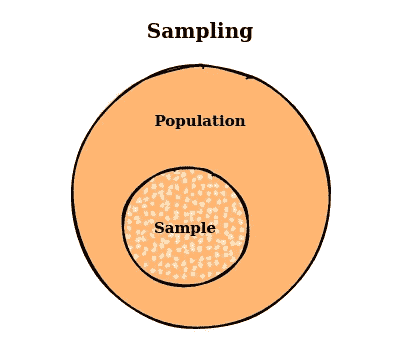
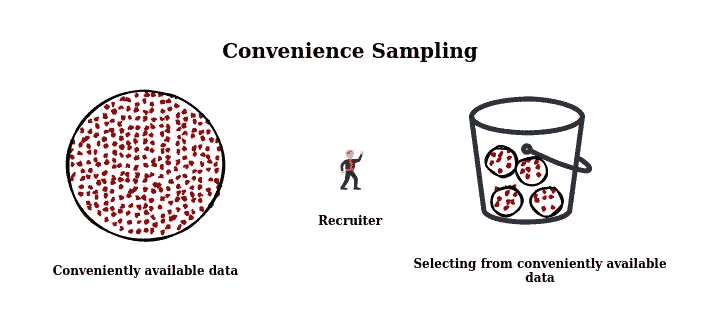
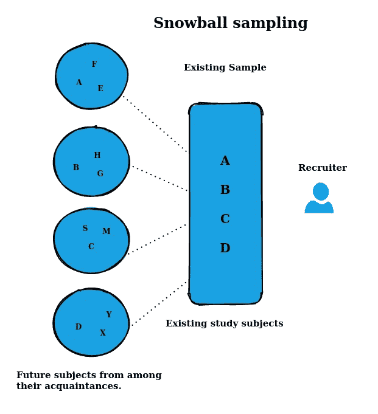
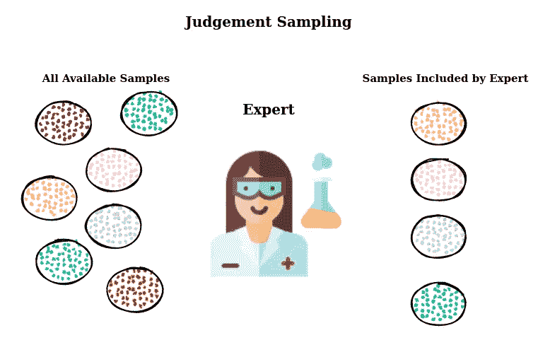
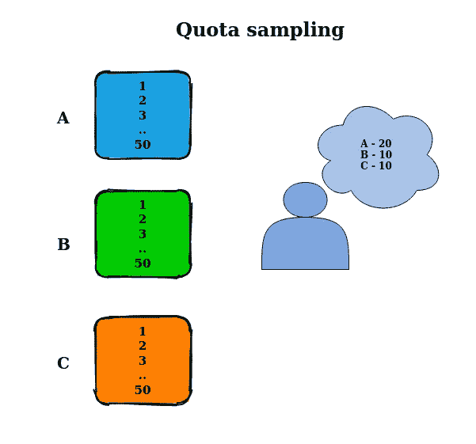
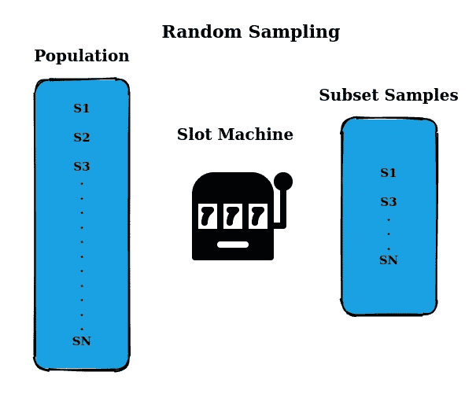
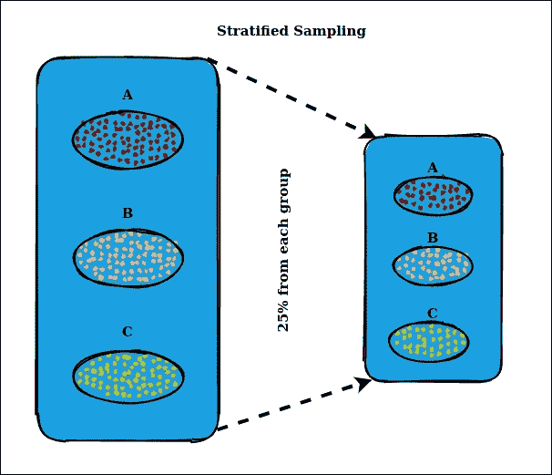
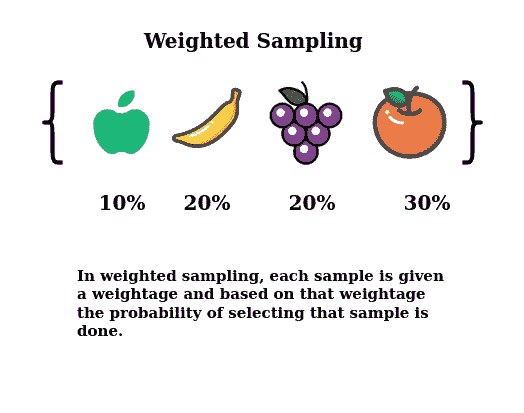

# 取样介绍

> 原文：<https://medium.com/mlearning-ai/sampling-3042ccdd4621?source=collection_archive---------4----------------------->

## 这是一种选择最好的艺术


Photo by [Patrick Tomasso](https://unsplash.com/@impatrickt?utm_source=unsplash&utm_medium=referral&utm_content=creditCopyText) on [Unsplash](https://unsplash.com/s/photos/books?utm_source=unsplash&utm_medium=referral&utm_content=creditCopyText)

在这篇博文中，我们将讨论采样及其相关组件。与贝叶斯、频率、分布等其他花哨的统计术语相比，这个主题通常不太重要。

采样这个话题很枯燥，需要用户付出特别的努力来阅读。我这篇博客的目的是以一种更直观的形式分享采样主题。

在机器学习中，采样指的是来自总体的数据子集，其中总体意味着任务可用的每一个可能的数据，这是无限的，因为在现实世界的任务中，我们不断地为模型收集数据以进行训练和验证。



**Sampling**

## 取样类型

*   非概率抽样
*   随机或概率抽样

## 非概率抽样

我们在这里选择的子集是基于个人或用户的，他们是不可能的。既然它基于用户或个人，它就带有**偏差**。有各种非概率抽样的例子如下

**方便的抽样:**子集选择是基于可用性进行的。这样就方便了。



**Convenient Sampling**

**滚雪球抽样:**现有子集有助于寻找下一组子集。它从样本子集滚动到其他子集。



**Snowball Sampling**

**判断取样:**根据专家的建议进行子集选择，专家对任务的样本进行判断。



**Judgement Sampling**

**配额抽样:**子集选择按照预先确定的顺序从可用配额中进行，没有任何随机化。



**Quota Sampling**

作为最大似然法的候选，我们可以认为在选择数据时有偏见对模型训练是不利的，但这是可用的最佳选择，因为最大似然法的数据是方便可用的，而不是随机生成的。

## 非概率抽样的实例

*   在亚马逊上写评论，可以访问互联网或愿意写作的人被捕获为数据。
*   训练语言模型，维基百科或 reddit 数据的可用性，这不是互联网上所有可能的数据，选择偏差。
*   当前疾病的患者记录。

## 随机或概率抽样



**Random or Probability Sampling**

在随机抽样中，从总体中选择每个样本的概率相等。考虑一个吃角子老虎机，其中每个转轮代表一组项目或数字，假设每个转轮有 10 个项目，每个转轮中每个项目的机会是 1/10，选择是随机进行的。

实现上面的采样非常容易，但是考虑一下这样的情况，我们想要选择所有样本的 10%。如果有一些稀有类只出现在 0.1%的人口中，那么就有很大的机会完全漏掉这个稀有类中的样本。在这种选择过程中训练的模型可能认为稀有类是不可用的。

## 分层抽样



**Stratified Sampling**

假设我们有 10 个不同的类要预测，每个类都有一些代表该类的数据点。现在，当我们执行随机抽样时，比如从每门课中选择 10%,我们不可能完全漏掉一门课。这被称为分层抽样。

在分层抽样中，我们根据一些共同的联系对样本进行分组，并相应地进行选择。例如，我们可以根据性别分组，并从每个组中选择 10%，保持样本的变化不变。每一组称为地层。

分层抽样的缺点是当我们不能从可用的样本中创建子组，或者一个样本可以属于多个子组。当您有一个多标签任务并且一个样本可以既是 A 类又是 b 类时，这是一个挑战。例如，在实体分类任务中，一个名称可能既是一个人又是一个地点。

## 加权抽样



**Weighted Sampling**

在加权抽样中，每个样本都有一个权重，这个权重决定了它被选中的概率。例如，如果您希望一个样本有 30%的机会被选中，则赋予它权重 0.3。这种方法允许你嵌入主题的专业知识。例如，如果您知道最近的数据对您的模型更有价值，您可以赋予最近的数据更大的权重。

当我们的可用数据来自与真实数据不同的分布时，这也是有帮助的。例如，在我们的数据中，红色样本仅占 25%，蓝色样本占 75%，但我们知道在现实世界中，红色和蓝色发生的概率相等，因此我们会给红色样本三倍于蓝色样本的权重。

## 重要性抽样

重要性抽样是一种用于估计特定分布性质的技术，它只具有从不同分布产生的样本，而没有感兴趣分布的样本。

*来自 Wiki:重要性抽样是一种* [*方差缩减*](https://en.wikipedia.org/wiki/Variance_reduction) *技术，可用于* [*蒙特卡罗方法*](https://en.wikipedia.org/wiki/Monte_Carlo_method) *。重要性抽样背后的思想是，在一个* [*模拟*](https://en.wikipedia.org/wiki/Simulation) *中，输入* [*随机变量*](https://en.wikipedia.org/wiki/Random_variables) *的某些值比其他值对被估计的参数有更大的影响。如果这些“重要的”值通过更频繁的采样得到强调，那么* [*估计量*](https://en.wikipedia.org/wiki/Estimator) *方差就可以减少。因此，重要性抽样的基本方法是选择一个“鼓励”重要值的分布。*

重要性抽样的挑战是找到鼓励重要值的分布。[重要抽样在 RL 中有广泛的应用](https://jonathan-hui.medium.com/rl-importance-sampling-ebfb28b4a8c6)

深入探讨重要性抽样: [RL —重要性抽样](https://jonathan-hui.medium.com/rl-importance-sampling-ebfb28b4a8c6)(许宗盛)

## 储层取样

储层取样之间的动机:假设我们看到一系列项目，一次一个。我们希望在内存中保存 10 个项目，并且希望从序列中随机选择它们。如果我们知道项目总数 ***n*** *并且可以任意访问项目，那么解决方法就很简单:在 1 和* ***n*** *之间选择 10 个不同的索引* ***i*** *和****n****n，保留第***【T6 问题是我们并不总是事先知道确切的**。****

> *****这里的关键是我们想从一个未知的样本量 n 中随机选择 k 个项目，每个项目具有相同的概率*****

***想象一下，我们必须从传入的 tweet 流中抽取 k 条 tweet。你不知道有多少条推文，但你知道你无法将它们都放入内存，这意味着你不知道一条推文被选中的概率。你想:***

*   ***确保每条推文都有同等的被选中概率，***
*   ***您可以随时停止算法并获得所需的样本。***

***一个解决办法是油藏取样。算法是这样的:***

1.  ***首先将 k 元素放入容器中。***
2.  ***对于每个输入的第 I 个元素，生成一个介于 1 和 I 之间的随机数 j***
3.  ***如果 1≤j≤k；用 ith 替换储层中的 jth***

***每个输入的第 I 个元素有(k / i)个概率在储层中。你也可以证明油藏中的每一个元素都有(k / i)的概率在那里。***

******

*****Reservoir sampling*****

```
*#Reservoir Sampling**(* S has items to sample, R will contain the result *)
ReservoirSample(S[1..n], R[1..k])
  // fill the reservoir array
  for i := 1 to k
      R[i] := S[i]

  // replace elements with gradually decreasing probability
  for i := k+1 to n
    (* randomInteger(a, b) generates a uniform integer from the inclusive range {a, ..., b} *)
    j := randomInteger(1, i)
    if j <= k
        R[j] := S[i]***
```

****例如，我们将处理一个包含三个元素的流，如下所示:****

1.  ****储存第一个元素。****
2.  ****以 1/2 的概率存储第二个元素。现在这两种元素在水库中的概率相等。****
3.  ****以 1/3 的概率存储第三个元素。前面的两个元素也有一个最终的概率(1/2)÷(2/3)= 1/3 被选中。****

***感谢阅读。如果你喜欢阅读我的文章，请查看更多文章。***

## ***在 [LinkedIn](https://www.linkedin.com/in/mayur-jain-ds) 和 [Twitter](https://twitter.com/mayur__22) 上与我联系🐅 ✋***

## ***参考***

*   *****CS 329S:机器学习系统设计**由[芯片胡延](https://huyenchip.com)、[迈克尔·库帕](https://michaeljohncooper.com/)***