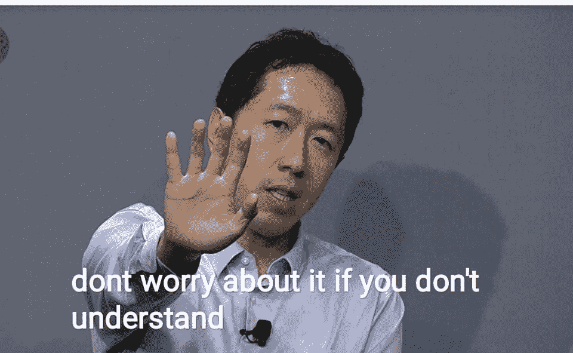

# 向深度学习第二部分问好

> 原文：<https://medium.com/mlearning-ai/saying-hello-world-to-deep-learning-part-2-2aaf60a7482d?source=collection_archive---------2----------------------->

## 在本文的第二部分，我们使用 PyTorch 为 MNIST 数据集创建了一个神经网络。


Photo by [Farzad](https://unsplash.com/@euwars?utm_source=medium&utm_medium=referral) on [Unsplash](https://unsplash.com?utm_source=medium&utm_medium=referral)

在前一部分中，我们学习了 PyTorch 的基础知识，了解了什么是 MNIST 数据集。现在让我们建立一个神经网络来正确地分类每幅图像。

您可以在此处查看第 1 部分:

[](/@saffand03/saying-hello-world-to-deep-learning-part-1-cb6ac50c5768) [## 向深度学习第 1 部分问好

### 在这个深度学习系列的第一部分，我们让自己熟悉 MNIST 数据集和 PyTorch。

medium.com](/@saffand03/saying-hello-world-to-deep-learning-part-1-cb6ac50c5768) 

## 数据集:

MNIST 是一个受欢迎的数据集，您可以使用 PyTorch 本身将它转换成工作形式:

```
import torchvision
from torchvision import datasets
from torchvision.transforms import ToTensor

train_data = datasets.MNIST(
    root="data", # where download data to?
    train=True, # get training data
    download=True,
    # images come as PIL format, we want to turn into Torch tensors
    transform=ToTensor()
)
test_data = datasets.MNIST(
    root="data",
    train=False, # get test data
    download=True,
    transform=ToTensor()
)
```

让我们快速检查一下这是否是我们所知道和喜爱的相同数据:

```
image, label = train_data[0]
print(f'Dimensions of image: {image.shape}')
print(f'Label of the image: {label}')
```

```
Dimensions of image: torch.Size([1, 28, 28])
Label of the image: 5
```

## 火炬. nn .线性:

你可能还记得 ***y = m.x + c*** ，一条直线的方程。PyTorch 的特色是 Linear 类，它对输入张量执行类似的变换。比方说，我们可以用它将一个 28×28 的矩阵简化为一个 1×10 维的向量，其中每个向量值代表图像属于特定类别的概率。举个例子。

```
import torch
import torch.nn as nn

input_tensor = torch.randn(128, 20) #128x20 Matrix....
print(input_tensor.shape)
linear_transform = nn.Linear(in_features=20, out_features=10)
output_tensor = linear_transform(input_tensor) #...converted into 128x10 Matrix
print(output_tensor.shape)
```

```
torch.Size([128, 20])
torch.Size([128, 10])
```

这段代码实际上模拟了将一个 128x20 维的矩阵乘以一个 20x10 的矩阵来创建一个 128x10 的矩阵。

## 火炬. nn .展平:

在前一部分中，我们看到我们有 28x28 = 784 个像素。我们可以用**的 *nn。Flatten()*** 将多维数据转换成一维。

## 火炬. nn.Sequential:

Sequential 是一个容器，是一种可以组合多个层的方式，可以是线性的，也可以是其他方式，这样输出就可以从顶层传递到下一层，一直传递到底层。

```
import torch
import torch.nn as nn

linear_transforms = nn.Sequential(
    nn.Flatten(),
    nn.Linear(28*28,10)
)
output_vector = linear_transforms(image) 
#Remember 'image' from the dataset section?
print(output_vector.shape)
```

```
torch.Size([1, 10]) #A 1x10 dim vector.
```

当我们调用***linear _ transforms***时，28x28 张量被展平成一个 784 维的线性向量，然后通过一个线性层，最终缩减成一个 1x10 的向量。而且，你刚刚创建了你的第一个**神经网络。**

## 但那不是它(著名的遗言)

如果你把*输出向量*打印出来，你会发现它不像任何角度的概率向量(它们被称为逻辑)。要将其转换成概率向量，我们需要使用 ***softmax*** 函数。Softmax 是一个数学函数，它将一组值推到 0 和 1 之间，因此它们类似于概率。

```
#print(output_vector)
softmax = nn.Softmax(dim =1) #instantiate softmax object for 1 dimensional tensor
probabilities = softmax(output_vector)
print(f'Sum of probabilities is {probabilities.sum().item()}')
print(f'According to this model, the label of the image is: {probabilities.argmax().item()}')
#print(probabilities)
```

```
Sum of probabilities is 1.0
According to this model, the label of the image is: 9
```

argmax 是返回 ***最大值的*索引*的函数调用。***

太好了！我们做了一个神经网络，我们有了概率。但是图像的标签是 5，模型显示标签是 9。事实上，对相同的数据再次调用 *linear_transforms* 函数，您将获得非常不同的结果。问题在于线性层。

> 模型需要训练。

它的权重(也称为 28*28x10 维矩阵)是随机初始化的，我们的目标是拥有能够正确预测给定图像张量的类别的权重。为此，模型必须经过**训练。**

# 训练模型:

在我们开始训练模型之前，让我们为我们的模型创建一个稍微复杂和形式化的版本。

```
class Model(nn.Module):
    def __init__(self):
        super().__init__()
        self.layer_stack = nn.Sequential(
            nn.Flatten(), # flatten inputs into single vector
            nn.Linear(in_features=28*28, out_features=300),
            nn.ReLU(),
            nn.Linear(in_features=300, out_features=10)
        )

    def forward(self, x: torch.Tensor):
        return self.layer_stack(x)
```

*类* ***模型*** 很好地包装了模型中我们想要的一切。现在我们调用*模型(输入)* 时会隐式调用 forward 方法。如果你有一些面向对象编程的知识，你会注意到我们继承了 *torch.nn.Module* 类。

如果你不确定这意味着什么:简单地认为这是简单的 *nn 的一个更好更漂亮的版本。Sequential()* 我们一直使用至今。



Andrew Ng has a plethora of great courses on Deep Learning you can view on Coursera.

在我们创建模型之前，也就是创建一个类型为 *Model* 的对象，我们需要[指定我们的设备，并将模型发送到那个设备。](/@saffand03/saying-hello-world-to-deep-learning-part-1-cb6ac50c5768)

```
import torch
device = "cuda" if torch.cuda.is_available() else "cpu"
print(device)
```

```
model_1 = Model().to(device)
```

## nn。ReLU():

你可能注意到的一个问题是 nn。Linear()就是那个，线性。只有线性映射是没有用的，因为我们遇到的大多数真实生活数据(包括 MNIST)都有非线性关系。为了补救，我们需要增加非线性。ReLU 是我们模型中包含的非线性函数。 [**了解更多激活功能。**](/@cmukesh8688/activation-functions-sigmoid-tanh-relu-leaky-relu-softmax-50d3778dcea5)

## 让我们得到正确的数据:

我们需要将数据输入数据加载器。数据加载器…为我们的模型加载数据。它有一个超参数: ***batch_size，*** 将数据集转换成长度为 *batch_size* 的可迭代块。

```
from torch.utils.data import DataLoader

# Setup the batch size hyperparameter
BATCH_SIZE = 32

# Turn datasets into iterables (batches)
train_dataloader = DataLoader(train_data, # dataset to turn into iterable
    batch_size=BATCH_SIZE, # how many samples per batch? 
    shuffle=True # shuffle data every epoch?
)

test_dataloader = DataLoader(test_data,
    batch_size=BATCH_SIZE,
    shuffle=False # don't necessarily have to shuffle the testing data
)
```

数据集被分成多个块，每个块中有 32 幅图像。这 32 个图像的组，或者称为一批，将一次被输入到模型中。批处理是数据加载器的主要功能。我们的模型一次处理 32 幅图像，而不是一次处理一幅图像。那会使事情变得更快。

我们还需要一个助手函数，返回我们的模型得到正确的类的百分比。

```
def classification_accuracy(y_true, y_pred):
    correct = torch.eq(y_true, y_pred).sum().item() 
    # torch.eq() calculates where two tensors are equal
    vector_length = len(y_pred)
    acc = (correct / vector_length) * 100
    return acc
```

## 训练模型(这次是真的):

权重需要更新。我们这样做的过程叫做训练模型。这个过程是迭代的。每个训练步骤都需要更新权重，以便减少损失。这分 5 步完成:

1。 **正向传递:**模型将输出返回给训练数据。输出=模型(输入)

2。 **损失:**将模型的输出与实际值进行比较，并评估它们的误差。使用损失函数。

3。 **反向传播**:为每个权重计算损失的[梯度](/@saffand03/saying-hello-world-to-deep-learning-part-1-cb6ac50c5768)。

4。 **Zero_grad 优化器:**优化器是最终将更新权重的函数。它的渐变设置为 0。

5。 **步进优化器(梯度下降):**权重更新。为此，我们使用一个称为优化器的对象。

基于这五个步骤，我们仍然缺少两个功能。损失函数和优化器。

```
loss_fn = nn.CrossEntropyLoss()
optimizer = torch.optim.SGD(params=model_1.parameters(),lr=0.1)
```

有许多不同的损失函数和优化可用。事实上，选择正确的功能本身就是一个超参数。另一个超级参数是优化器的学习率(lr)。反复试验，仔细阅读 PyTorch 官方文档，将有助于做出正确的设计选择。

然而，有了它，现在训练就像:

```
output = loss(input) <- Step 1
loss = loss_fn(output,real_values) <- Step 2
optimizer.zero_grad() <- Step 3
loss.backward() <- Step 4
optimizer.step() <- Step 5
```

让我们将这几行代码打包成一个漂亮的 python 函数:

```
def train_step(model,data_loader,loss_fn,optimizer,accuracy_fn,device):
    train_loss, train_acc = 0, 0

    for batch, (X, y) in enumerate(data_loader):

        # Send data to GPU
        X, y = X.to(device), y.to(device)

        # 1\. Forward pass
        y_pred = model(X)

        # 2\. Calculate loss
        loss = loss_fn(y_pred, y)
        train_loss += loss
        train_acc += accuracy_fn(y_true=y,
                 y_pred=y_pred.argmax(dim=1)) # Go from logits -> pred labels

        # 3\. Optimizer zero grad
        optimizer.zero_grad()

        # 4\. Loss backward
        loss.backward()

        # 5\. Optimizer step
        optimizer.step()

    # Calculate loss and accuracy per epoch and print out what's happening
    train_loss /= len(data_loader)
    train_acc /= len(data_loader)
    print(f"Train loss: {train_loss:.5f} | Train accuracy: {train_acc:.2f}%")
```

同样，为了测试模型:

```
def test_step(model,data_loader,loss_fn,accuracy_fn,device):
    test_loss, test_acc = 0, 0

    model.eval() # put model in eval mode

    # Turn on inference context manager
    with torch.inference_mode(): 
        for X, y in data_loader:
            # Send data to GPU
            X, y = X.to(device), y.to(device)

            # 1\. Forward pass
            test_pred = model(X)

            # 2\. Calculate loss and accuracy
            test_loss += loss_fn(test_pred, y)
            test_acc += accuracy_fn(y_true=y,
                y_pred=test_pred.argmax(dim=1) # Go from logits -> pred labels
            )

        # Adjust metrics and print out
        test_loss /= len(data_loader)
        test_acc /= len(data_loader)
        print(f"Test loss: {test_loss:.5f} | Test accuracy: {test_acc:.2f}%\n")
```

*model.eval()* 和 *model.inference_mode()* 向 PyTorch 表明，我们使用这个模型是为了预测，而不是训练。预测的返回速度要快得多。这些命令被视为最佳实践。

现在，我们需要做的就是反复训练这个模型。请记住，训练模型是一个迭代过程。我们将根据数据训练我们的模型 3 次，即**3 个时期**。

```
from tqdm.auto import tqdm #Colorful progress bar

epochs = 3
for epoch in tqdm(range(epochs)):

    print(f"Epoch: {epoch}\n---------")

    train_step(data_loader=train_dataloader, 
        model=model_1, 
        loss_fn=loss_fn,
        optimizer=optimizer,
        accuracy_fn=classification_accuracy,
        device = device

    )
    test_step(data_loader=test_dataloader,
        model=model_1,
        loss_fn=loss_fn,
        accuracy_fn=classification_accuracy,
        device = device
    )
```

```
Epoch: 0
---------
Train loss: 0.33264 | Train accuracy: 90.70%
Test loss: 0.16921 | Test accuracy: 95.15%

Epoch: 1
---------
Train loss: 0.14738 | Train accuracy: 95.73%
Test loss: 0.11719 | Test accuracy: 96.64%

Epoch: 2
---------
Train loss: 0.10253 | Train accuracy: 97.03%
Test loss: 0.09454 | Test accuracy: 97.22%
```

在第三部分，我们将讨论卷积和迁移学习。从 MNIST 的数据集中毕业。

考虑关注我:[LinkedIn](https://www.linkedin.com/in/syed-affan-38b378216/)| |[GitHub](https://github.com/sulphatet)

[](/@saffand03) [## 赛义德·阿凡培养基

### 阅读赛义德·阿凡在媒介上的作品。印度的学生。我写的是机器学习等等。联系我关于…

medium.com](/@saffand03) [](/mlearning-ai/mlearning-ai-submission-suggestions-b51e2b130bfb) [## Mlearning.ai 提交建议

### 如何成为 Mlearning.ai 上的作家

medium.com](/mlearning-ai/mlearning-ai-submission-suggestions-b51e2b130bfb)