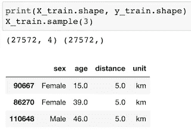
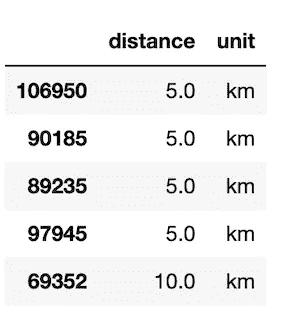
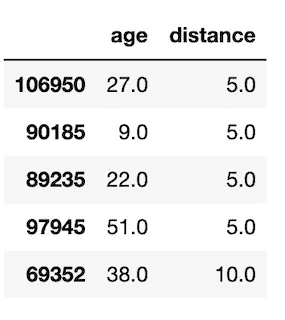
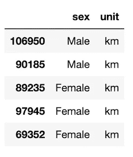
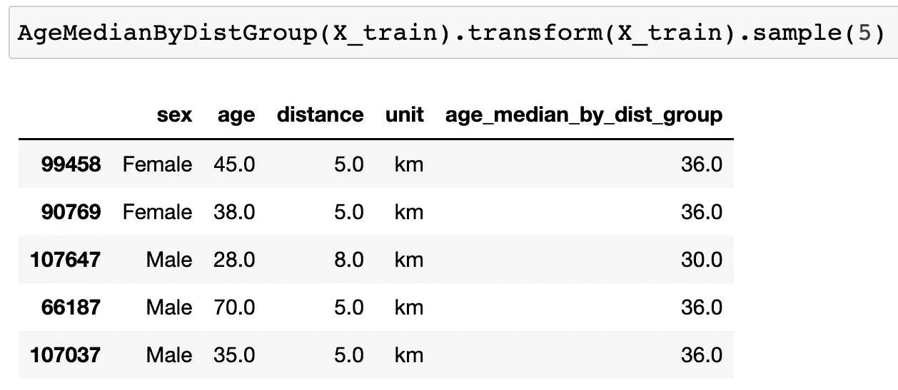
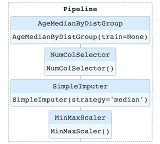
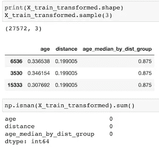

# 使用代码示例在 ML 管道中选择列并添加新列

> 原文：<https://medium.com/mlearning-ai/select-columns-and-add-new-columns-in-an-ml-pipeline-with-code-example-bd90ccba1891?source=collection_archive---------3----------------------->


Photo by [Alessandro Erbetta](https://unsplash.com/@alessandroerbetta?utm_source=medium&utm_medium=referral) on [Unsplash](https://unsplash.com?utm_source=medium&utm_medium=referral)

在这篇文章中，我们将讨论如何创建类来选择特定的列/特性，添加新的列/特性，并使用 Python 和 Sklearn 将它们组合在一起以构建一个整洁的管道。在后面的文章中，我将继续管道主题，用代码示例展示如何使用`ColumnTransformer`和`FeatureUnion`。

事不宜迟，我们来深究一下。

# **0。准备数据**

首先，我们来准备数据。在这里，我将使用我最近的跑步比赛排名预测项目中的一个小数据样本来创建一个小数据集进行说明。这里的 *X_train* 只有 4 列/特征，包括参与者的性别、年龄、距离、距离单位。目标变量 y_train 是导出的比赛持续时间(以分钟为单位)。

```
# get the X,y
X = train_df.drop('time', axis=1)
y = train_df['time']

# Split the data into training and test datasets
X_train, X_test, y_train, y_test = train_test_split(X, y,test_size=0.5,random_state=0)
print(X_train.shape, y_train.shape)
X_train.sample(3)
```



raw X_train data frame samples

# **1。选择自定义列**

准备好数据后，让我们创建一个简单的`ColumnSelector`类，从给定的数据集中定制选择一个列子集。这样做的好处是，一旦我们建立了类，它就可以直接用作管道中的一个步骤。我们将在本文后面看到它。

```
# first, create a custom column selector to select specific columns 
from sklearn.base import BaseEstimator, TransformerMixin

class ColumnSelector(BaseEstimator, TransformerMixin):
    '''select specific columns of a given dataset'''
    def __init__(self, subset):
        self.subset = subset

    def fit(self, X, y=None):
        return self

    def transform(self, X, y=None):
        return X.loc[:, self.subset]

customized_cols = ['distance','unit']

## test the ColumnSelector class
selected_cols = ColumnSelector(customized_cols)
selected_cols.transform(X_train).head()
```



transformed output samples from ColumnSelector

很好，我们已经成功地选择了我们感兴趣的列/特性，并准备好对减少的数据执行其他转换。

但是等等，如果我们对不同的数据类型需要不同的转换呢？例如，单位列的一键编码和距离列的缩放？一种解决方案是创建两个类来区分数据类型。

# **2。选择所有数字和所有分类列**

接下来，让我们创建一个`NumColSelector`类来选择所有数字列，并创建另一个类来选择训练数据中的所有分类列。

```
# second, create a numeric-column selector and a categorical-column selector
class NumColSelector(BaseEstimator, TransformerMixin):
    '''select all numeric columns of a given dataset'''        
    def fit(self, X, y=None):
        return self

    def transform(self, X, y=None):
        return X.select_dtypes(include='number')

class CatColSelector(BaseEstimator, TransformerMixin):
    '''select all categorical columns of a given dataset'''        
    def fit(self, X, y=None):
        return self

    def transform(self, X, y=None):
        return X.select_dtypes(include='object')

## test the NumericColSelector class
NumColSelector().transform(X_train).head()
# CatColSelector().transform(X_train).head()
```



transformed output samples from NumColSelector



transformed output samples from CatColSelector

很好。我们可以使用这两个类轻松地将分类列和数字列分开，并在以后对它们进行不同的数据转换。

如果我们想要包含原始训练数据中没有的新列/特征，该怎么办？例如，我们希望创建一个新要素来描述每个距离组的中值年龄，这可能有助于预测目标可变时间。

# **3。添加新列**

现在，让我们创建另一个类`AgeMedianByDistGroup`来添加这个新的列/特性。

```
# create a class to add a new feature AgeMedianByDistGroup
class AgeMedianByDistGroup(BaseEstimator, TransformerMixin):
    '''get the median age of each distance group''' 
    def __init__(self, train):
        self.age_median_by_dist_group = train.groupby('distance').apply(lambda x: x['age'].median())
        self.age_median_by_dist_group.name = 'age_median_by_dist_group'

    def fit(self, X=None, y=None):
        return self

    def transform(self, X, y=None):
        new_X = pd.merge(X, self.age_median_by_dist_group, 
                         left_on = 'distance', right_index=True, how='left')        
        X['age_median_by_dist_group'] = new_X['age_median_by_dist_group']
        return X
```



transformed output samples from AgeMedianByDistGroup

我们可以看到，跑 5 公里的年龄中位数是 36 岁，跑 8 公里的年龄中位数是 30 岁。

# **4。设置最终管道**

最后，让我们通过使用我们之前创建的类将所有的连接在一起来构建一个`**pipeline**`。基本上，我们将对训练数据执行以下步骤:

*   步骤 1:用`AgeMedianByDistGroup`添加一个新的列/特征
*   步骤 2:用`NumColSelector`选择所有数字列/特征
*   第三步:用`SimpleImputer`将所有 nan 值固定到中间值
*   第四步:用`MinMaxScaler`将数值归一化到[0，1]范围

```
# build the final pipeline
from sklearn.pipeline import Pipeline
from sklearn.impute import SimpleImputer
from sklearn.preprocessing import MinMaxScaler

pipe = Pipeline([
                ('add_new_col', AgeMedianByDistGroup(X_train)),
                ('get_num_cols', NumColSelector()),
                ('fix_nan', SimpleImputer(missing_values=np.nan, strategy='median')),
                ('scale_data', MinMaxScaler())
])

pipe.fit(X_train)
```

最终的管道看起来很简单，对吗？使用管道的最大优势之一是它自动化了这个过程，并保持我们的代码整洁有序。



pipeline diagram

通过这一系列步骤，测试数据集和维持数据集也可以使用同一管道轻松转换，而无需重复编码。如下所示，最终转换后的训练数据是一个归一化的数据框，在我们选择的列/要素中没有任何 NaN 值。



transformed X_train data frame & NaN values sum output

瞧啊。我们建立了几个变压器，并结合在一个优雅的管道！我们可以将准备好的训练数据用于以后的建模。

感谢阅读我的文章！我希望这个演练对您当前或下一个项目有所帮助。我的下一篇文章将讨论如何在管道中使用`**ColumnTransformer**`和`**FeatureUnion**`进行列转换。

关注我，敬请期待！😺 🍁 ☃️

[](/mlearning-ai/mlearning-ai-submission-suggestions-b51e2b130bfb) [## Mlearning.ai 提交建议

### 如何成为 Mlearning.ai 上的作家

medium.com](/mlearning-ai/mlearning-ai-submission-suggestions-b51e2b130bfb)