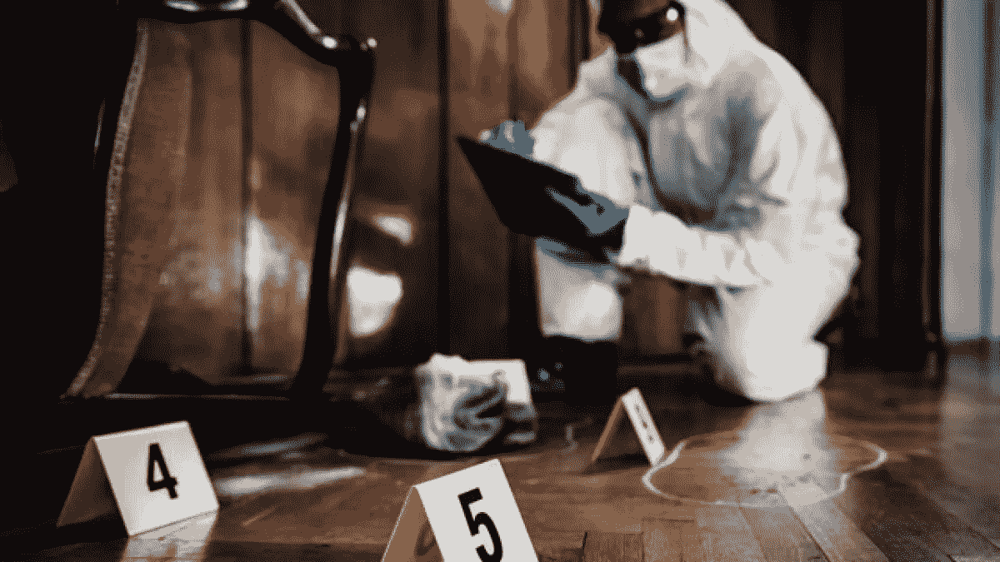
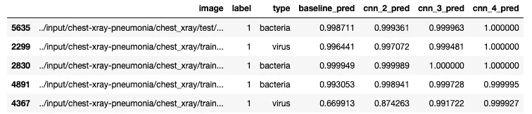

# 【自言自语】CNN 错误分析:让错误为你指路

> 原文：<https://medium.com/mlearning-ai/self-talk-cnn-error-analysis-let-the-errors-show-you-the-way-8bd60e5fd506?source=collection_archive---------5----------------------->

Source: [https://asuevents.asu.edu/](https://asuevents.asu.edu/)

我在 Flatiron Bootcamp 旅程中养成的一个习惯是，当我从事我的项目时，我会打开一个 Google doc，主要用于集思广益，跟踪参考资料，最重要的是记录我的学习过程(和挫折)。这篇博客是我的**自言自语**系列的第一篇，它包含了更多来自我的数据科学期刊的结构片段，或者我的一些项目实际上是如何产生的“幕后场景”(前视图可在我的 [GitHub](https://github.com/chibui191) 上获得)。我希望你发现这些短文在某些方面是有用的；对我个人来说，通读它们让我意识到**有时候问更多的问题就是答案**。

我给你介绍第一个——**CNN 错误分析:让错误为你指路**。

最近，我正在使用正面胸部 x 光片进行[肺炎与正常分类器的对比研究](https://github.com/chibui191/pneumonia_detection_resnet50)。我建立的第一个卷积神经网络(CNN)的结果相当惊人:1 层卷积，1 层最大池和 ta-da！90%的准确率。然后，我创建了另一个模型，它稍微复杂一些，有两个卷积层和两个最大池，能够达到 90.12%的准确率。然而，我非但没有感到高兴，反而感到害怕——我是否在任何地方有数据泄露？为什么这些模型已经这么好了？我该何去何从？

我花了接下来的两个小时来确保数据被正确地分成训练/验证和测试集。然后我花了接下来的 2 分钟分析学习曲线——培训对比验证损失。它们确实有助于我们弄清楚模型是过度拟合还是欠拟合，并看到偏差/方差的权衡。他们还告诉我们是否应该增加纪元的数量并进一步延长训练，或者我们应该提前停止。这一切都很好，但是在所有这些小时之后，我仍然不太确定如何以一种更系统的方式来处理模型迭代，而不是继续一层一层地堆叠，直到性能下降。低可解释性是神经网络通常被称为黑盒模型的原因。它们是如此强大，并且经常能够产生非常准确的结果，但是我们并不总是知道它们在做什么，或者我们知道吗？

我想到迭代的全部目的是逐渐提高模型的预测能力。然而，我不知道第二个模型是否真的能够"**修复**第一个模型所犯的任何错误。基于 0.12%的增长，它肯定犯了更少的错误，但是这些错误与模型#1 犯的错误重叠吗，或者它们完全不同？这些问题的答案就在我的模型**误标为**的 10%中。

# 误差分析

错误分析有助于我们理解模型错误的潜在原因，并就如何处理它们提供一些指导。它应该作为模型开发过程的一部分来完成，以帮助我们评估每一步的情况，并随着模型的发展逐步纠正错误。

所以我决定将每个模型的概率预测附加到所有图像路径的原始数据帧(作为字符串)和它们的目标标签上，(我仍然认为它是我一生中 10 大决策的竞争者)。这样，我就能识别出两个模型都贴错标签的图像，并挑出每个模型都失败的图像。虽然我不是放射学专家，但能够直观地检查错误有助于我更好地了解模型可能需要更多暴露于什么类型的数据图像，以及如何增加数据集或以可能有助于它的方式构建下一个模型。

以下是一些常见的错误原因，可通过对错误标签集进行简单的探索性数据分析来识别:

# 标签不正确的数据

迄今为止，大多数数据标注工作仍由人工完成，这意味着它们仍会出现人为错误。根据项目和我们的领域知识水平，手动分析错误可以帮助我们识别可能被错误标记的数据点。如果我们正在做一个狗/猫分类器，在错误集中，有一张狗的照片被模型正确地识别为狗，但是原来的标签是猫，我们知道我们的模型没有错。只要被错误标记的数据点是随机的，并且它们不占整个数据集的很大比例，我们就不需要花费太多时间来修复它们。另一方面，如果我们数据集中所有的吉娃娃图像都被标记为猫，我们的模型将学习这种模式。

# 不平衡数据

如果我们注意到一些错误分类的图像或多或少地被旋转到一边，这可能是数据集本身的一个更系统的缺点。因此，我们可以尝试将数据扩充添加到图像数据生成器中，并为模型合成更多的图像进行训练。然而，要记住的一件重要的事情是，如果我们选择对训练集做一些改变，我们需要确保**而不是**改变验证和测试集，因为它们仍然应该代表实际的群体。这会使训练和验证/测试数据现在来自稍微不同的分布，并可能扩大训练和验证/测试性能度量之间的差距，这在某种程度上是没问题的。

# 过度拟合/欠拟合

由于我从事的具体项目是创建一个图像分类器，它可以帮助加快肺炎的诊断速度，因此在我进行模型迭代时，优先考虑高回忆分数并减少假阴性(或被分类为正常的实际肺炎病例)的数量是我的主要目标。在这个项目中，肺炎被标记为 1，正常为 0。然而，当我逐渐给我的模型添加更多层时，我注意到一些共享假阴性图像的概率预测开始下降而不是上升。换句话说，他们开始越来越接近 0，而不是 1，这与我想要的相反。这可能是过度拟合的迹象，模型现在正在图像中拾取随机噪声。我们有多种方法可以减少过度拟合，例如向模型添加丢弃层，或者包括早期停止回调，以便模型在停止取得进展时停止训练。这完全取决于数据集和我们正在处理的业务问题。

# 其他原因

上面的列表是一些常见的原因，也是我在项目中经历过的原因。请记住，我们可以通过错误分析发现错误的其他原因。

# 结论

就像失败比成功教会我们更多一样，错误比准确告诉我们更多关于下一步的事情。他们不仅仅给我们关于模型的信息，还有关于数据本身的信息。在我看来，这类似于法医工作——我们追踪和调查模型留下的错误。一旦我们开始分析错误，从一个模型到另一个模型进行比较和对比，下一步该做什么的路线图就会显现出来。