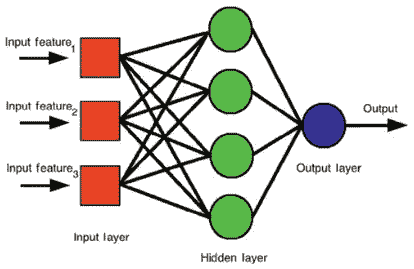
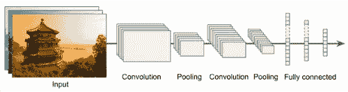
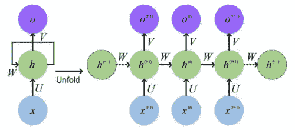
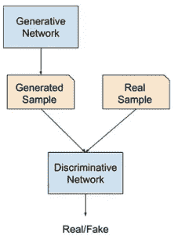

# 你应该知道的几种人工神经网络结构

> 原文：<https://medium.com/mlearning-ai/several-types-of-artificial-neural-networks-architecture-that-you-should-know-c169a5e22ec7?source=collection_archive---------1----------------------->

## 神经网络的定义、几种类型的神经网络结构及其用法

Photo by [Pixabay](https://www.pexels.com/photo/close-up-photography-of-yellow-green-red-and-brown-plastic-cones-on-white-lined-surface-163064/)

在我详细介绍几种类型的神经网络架构之前，如果我们首先了解深度学习，这将是有帮助的。

总的来说，**深度学习**是人工智能中机器学习(ML)的一个子领域(人工智能处理受大脑生物结构和功能启发的算法，以帮助机器获得智能)(Moolayil，2019)。

什么时候应该使用深度学习？深度学习用于解决机器学习方法无法解决的复杂问题，如对音频、视频、图像等进行分类。深度学习是使用神经网络架构设计的，该架构使用反向传播算法进行训练。直到现在，深度学习还有很多应用是我们日常生活的一部分，比如自动驾驶汽车、机器翻译、语音识别、人脸检测等。

*请记住，我将尽可能简单地解释，不会包括神经网络架构背后的数学计算。*

# **1。多层感知器(MLP)**

你应该知道的第一个神经网络架构是多层感知器(MLP)。多层感知器又名经典神经网络是一种神经网络架构，旨在估计任何连续函数，并可以解决非线性可分的问题。多层感知器由三个主要层组成，即输入层、隐藏层和输出层。

Multilayer perceptron architecture (Menzies et al., 2015)

**输入层**将接收输入信号进行处理，并将其转发至隐藏层。**隐藏层**是 MLP 的主要计算引擎，它从输入层接收输入，并在反向传播期间将其转发到输出层，反之亦然。而**输出层**基于从隐藏层传递的输入数据执行预测或分类。

多层感知器广泛应用于几种情况，如模式分类、预测、识别和逼近。

# 2.**卷积神经网络(CNN)**

你应该知道的第二个神经网络架构是卷积神经网络(CNN)。卷积神经网络是一种神经网络架构，旨在解决图像分类或图像检测等计算机视觉问题。这种神经网络结构包括 3 个主要层，即卷积层、池层和全连接层。

Convolutional neural networks architecture (Géron, 2019)

**卷积层**是 CNN 架构最重要的积木块，根据所要解决问题的复杂程度，由几层组成。卷积层的第一层不直接连接到输入图像中的每个像素，而是仅连接到输入图像的接收特征。卷积层的第一层专门用于捕获基本的(低级特征),如颜色、线条、边缘等。此外，还有一个**池层**，它通过减少来自卷积层的输入图像的大小来提高计算效率。最后还有一个**全连接** **层**，用来连接一层中的每一个神经元和另一层中的所有神经元。

卷积神经网络有许多应用，它们是我们日常生活的一部分，例如自动驾驶汽车中的对象检测、社交媒体人脸识别、医疗领域中的图像分析等。

# **3。递归神经网络(RNN)**

你应该知道的第三个神经网络架构是递归神经网络(RNN)。递归神经网络是一种神经网络架构，在处理序列数据(如自然语言处理和时间序列数据)时非常有效。一般来说，递归神经网络的结构与多层感知器几乎相同，不同的是有递归层。

Recurrent neural network architecture (Abirami & Chitra, 2020)

**递归层**接受输入，产生输出，并将输出发送回自身。然而，在处理长序列时，递归神经网络可能会遇到不稳定的梯度问题。为了解决这个问题，我们必须用能够处理这个问题的长短期记忆(LSTM)细胞和门控循环单元(GRU)细胞来代替循环神经网络中的神经元细胞。

递归神经网络的许多应用是我们日常生活的一部分，例如机器翻译、情感分析、文本摘要、文档生成、聊天机器人等。

# **4。生成对抗网络(GAN)**

最后，你应该知道的神经网络架构是生成性对抗网络(GAN)。生成式对抗网络是一种神经网络架构，可以生成与训练期间提供的数据具有相同特征的新数据。这种神经网络结构具有两个相对放置的网络，即生成器和鉴别器。每个网络都有不同的角色。

Generative adversarial networks architecture (Abirami & Chitra, 2020)

**生成器**将从随机分布(通常为高斯分布)中学习并生成逼真的假图像作为输入，而**鉴别器**将从生成器中获取假图像或从训练集中获取真实图像作为输入，并猜测输入图像是真是假。随着模型训练迭代的进行，生成器将生成更真实的图像，可以欺骗鉴别器。你可以访问这个[网站](https://thispersondoesnotexist.com/)，看看模型生成的对抗网络生成的图像。

生成对抗网络有许多应用，是我们日常生活的一部分，例如生成逼真的照片，生成新的人类姿势，基于句子说明生成图像等。

# **结论**

神经网络的每种结构都有不同的用途。MLP 用于解决机器学习无法解决的经典问题，CNN 用于解决计算机视觉问题，用于解决序列数据问题，GAN 用于生成逼真的高分辨率图像。

# **参考:**

[1]阿比拉米，s .，&奇特拉，P. (2020)。基于高能效边缘的实时医疗支持系统。智能系统和环境的数字孪生范式:行业用例，339–368。doi:10.1016/bs . adcom . 2019 . 09 . 007

[2] Géron，a .(2019)。使用 Scikit-Learn、Keras 和 Tensorflow 进行机器学习:构建智能系统的概念、工具和技术。奥莱利媒体。

[3]茨韦塔纳·门泽斯、科卡古纳利、明库、彼得斯和图尔汉(2015 年)。在基于模型的推理中使用目标。在软件工程中共享数据和模型，321–353。doi:10.1016/b978–0–12–417295–1.00024–2。

[4] Moolayil，J. (2019 年)。*学习深度神经网络的 Keras*:用 Python 实现现代深度学习的快速方法。阿普瑞斯。

 [## 深度学习:使用 LSTM 预测确诊的新冠肺炎阳性病例

### 描述用于预测印度尼西亚新冠肺炎阳性病例的深度学习方法中的每个步骤

pub.towardsai.net](https://pub.towardsai.net/deep-learning-forecasting-of-confirmed-covid-19-positive-cases-using-lstm-8100fa230c7d)