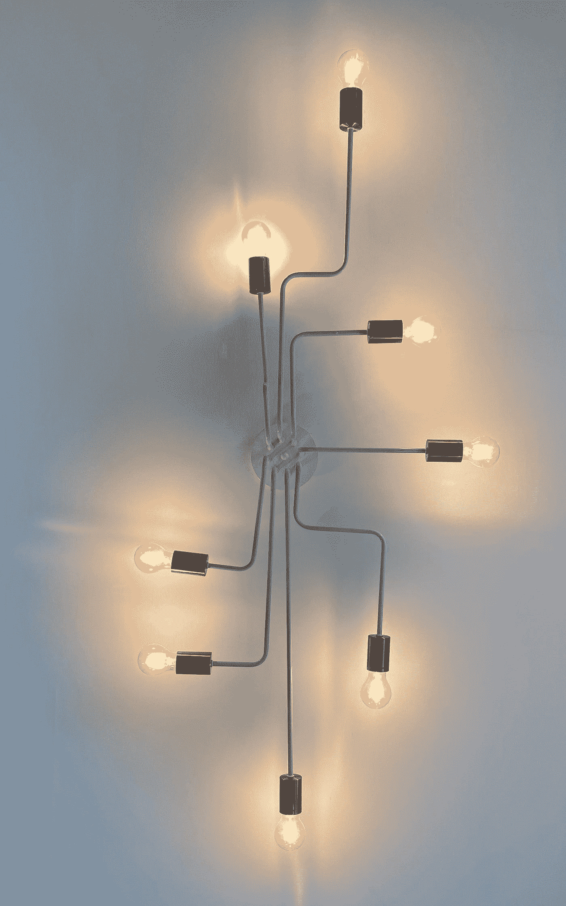

# Shorts:为什么我们不能使用多层感知器进行物体检测？？

> 原文：<https://medium.com/mlearning-ai/shorts-why-we-cant-use-a-multi-layer-perceptron-for-object-detection-3d158220f69f?source=collection_archive---------4----------------------->

Photo by [Fabio Bracht](https://unsplash.com/@bracht?utm_source=medium&utm_medium=referral) on [Unsplash](https://unsplash.com?utm_source=medium&utm_medium=referral)

普通的香草神经网络也被称为多层感知器，它是在人脑上模拟的，其中神经元通过连接节点来刺激，并且只有当达到某个阈值时才被激活。

1.  多层感知器**对输入图像的反应**不同，对输入图像的小位移版本的反应也不同，因为它们**不是平移不变量**。因此，即使我们将图像移动几微米或几毫米，我们也必须进行训练。

Photo by [Taylor Vick](https://unsplash.com/@tvick?utm_source=medium&utm_medium=referral) on [Unsplash](https://unsplash.com?utm_source=medium&utm_medium=referral)

1.  我们必须为每个像素发送一个**平的图像**，作为输入。但是当图像被展平时，会有空间信息的损失。【空间信息:与物体的地形、几何、参照物等相关的信息。]
2.  处理如此多的像素作为权重和偏差将会出现**消失梯度**的问题，这将在处理图像数据时造成重大麻烦。
3.  即使我们用 MLP 生成了一张特征地图，但小小的翻译会毁了一切。在美国有线电视新闻网，我们有像**池**的选项，我们使用

a.缩减采样特征图

b.模型对局部平移的不变性

由于这些原因，我们不能直接使用 MLPs 进行对象检测。

这个简短的系列是关于简单的概念，我们只需要 1-2 分钟就能理解。关注我获取更多此类内容！

谢谢大家！！

 [## Mlearning.ai 提交建议

### 如何成为 Mlearning.ai 上的作家

medium.com](/mlearning-ai/mlearning-ai-submission-suggestions-b51e2b130bfb)