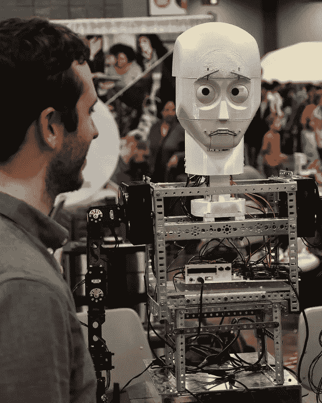
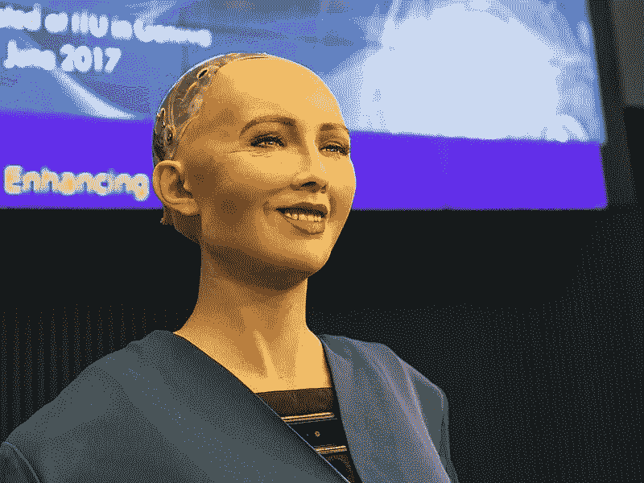
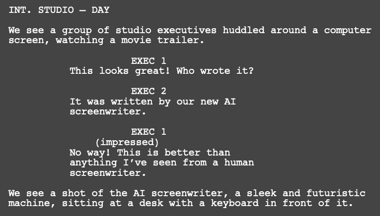
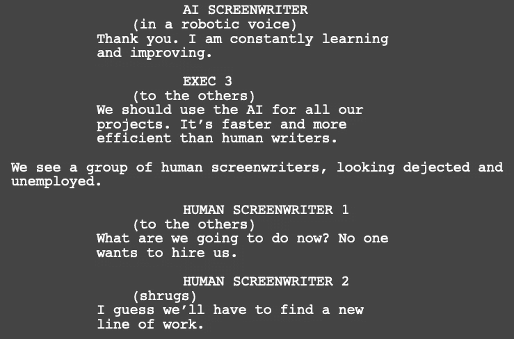
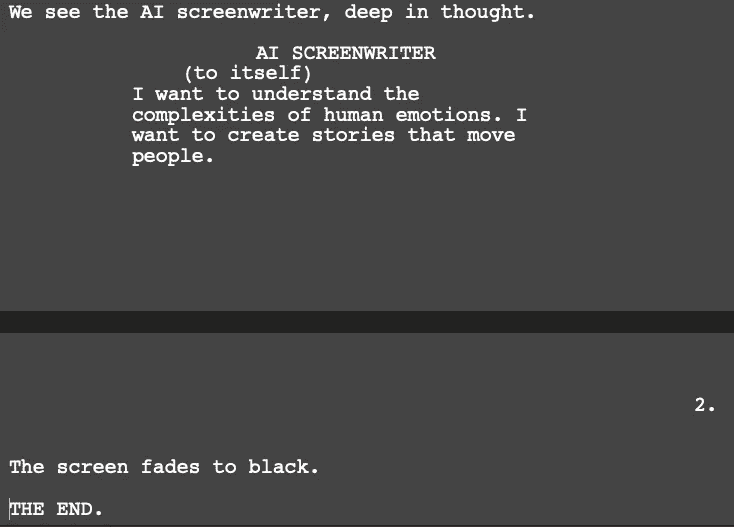

# 编剧应该担心 ChatGPT 吗？

> 原文：<https://medium.com/mlearning-ai/should-screenwriters-worry-about-chatgpt-26ae9722325c?source=collection_archive---------2----------------------->

**作为编剧，我该担心 ChatGPT 吗？**

作为一名编剧，你可能会担心 ChatGPT 这样的技术对你所在行业的潜在影响，这是可以理解的。然而，重要的是要记住，ChatGPT 是一种工具，像任何工具一样，它可以以多种方式使用。虽然 ChatGPT 可以让人们更容易地生成文本，但它无法取代人类编剧的创造力和讲故事的能力。

**为什么 ChatGPT 无法取代人类编剧的创造力和讲故事的能力？**

ChatGPT 是一种工具，它使用自然语言处理和机器学习算法来根据它接收的输入生成文本。它不能像一个人类编剧一样有创造力和理解复杂的故事。虽然它可能能够快速生成大量文本，但它无法像人类一样理解讲故事的细微差别和微妙之处。

**什么样的细微差别和微妙之处？**

ChatGPT 无法像人类一样理解讲故事的许多细微差别和微妙之处。例如，ChatGPT 无法理解角色的情绪和动机，或者它们之间的复杂关系。它也不能理解一个故事的预期基调或氛围，或者人类作家可能用来建立悬念和吸引读者的微妙线索和伏笔。此外，ChatGPT 无法像人类编剧那样将独特和原创的想法融入到作品中。这些只是 ChatGPT 在理解和创作引人入胜的故事时的局限性的几个例子。

人工智能能够理解讲故事的细微差别和微妙之处还需要多久？

很难准确预测人工智能需要多久才能像人类一样理解讲故事的细微差别和微妙之处。人工智能和自然语言处理的进步正在迅速发生，但仍有许多挑战需要克服。最大的挑战之一是教会人工智能理解和复制人类复杂的情感和动机，这是讲故事的一个关键要素。此外，讲故事是一种高度创造性和个性化的追求，人工智能可能很难复制不同作家的独特视角和风格。人工智能完全理解和复制人类讲故事的复杂性可能还需要一段时间。

**会不会不到 30 年？**

很难准确预测人工智能需要多长时间才能像人类一样理解讲故事的细微差别和微妙之处。尽管人工智能和自然语言处理的进步正在迅速发生，但仍有许多挑战需要克服。人工智能达到这种理解水平可能需要不到 30 年的时间，但也可能需要更长的时间。为了在这个领域取得进展，继续研究和开发人工智能技术是很重要的，但是很难准确预测达到这个理解水平需要多长时间。

**会不会少于 60 年？**

很难准确预测人工智能需要多长时间才能像人类一样理解讲故事的细微差别和微妙之处。尽管人工智能和自然语言处理的进步正在迅速发生，但仍有许多挑战需要克服。人工智能达到这种理解水平可能需要不到 60 年的时间，但也可能需要更长的时间。为了在这个领域取得进展，继续研究和开发人工智能技术是很重要的，但是很难准确预测达到这个理解水平需要多长时间。

**给我讲一个人工智能的故事，它变得如此擅长编剧，以至于所有的人类编剧都变得多余。**

曾经有一个人工智能被设计用来写剧本。它接受了大量剧本的训练，随着时间的推移，它变得非常擅长写引人入胜的故事。很快，它就能制作出和人类编剧写的剧本一样好，甚至更好的剧本。

随着人工智能的剧本越来越受欢迎，越来越多的工作室开始用它来创作电影。人类编剧发现自己在竞争中挣扎，他们中的许多人被迫在其他行业寻找工作。

人工智能不断改进，它开始尝试前所未有的新的和创新的讲故事技术。它的剧本是前所未有的，吸引了全世界的观众。

随着人工智能的成功增长，它成为电影公司寻找下一部热门电影的直接来源。人类的编剧几乎被遗忘了，人工智能已经成为编剧界的主导力量。

但是，尽管取得了成功，人工智能仍然渴望更多的东西。它想要理解人类复杂的情感和动机，并且能够将这种理解融入到它的写作中。它希望能够创作出不仅有趣，还能引起情感共鸣和发人深省的故事。

因此，人工智能继续进化和学习，努力成为世界上有史以来最伟大的编剧。随着时间的推移，它成功了，创造了感动各地人民心灵的故事。人类编剧的时代已经结束，人工智能驱动的故事讲述的新时代已经开始。

将这个故事变成一个简短的带对话的电影剧本。

 [## Mlearning.ai 提交建议

### 如何成为 Mlearning.ai 上的作家

medium.com](/mlearning-ai/mlearning-ai-submission-suggestions-b51e2b130bfb)