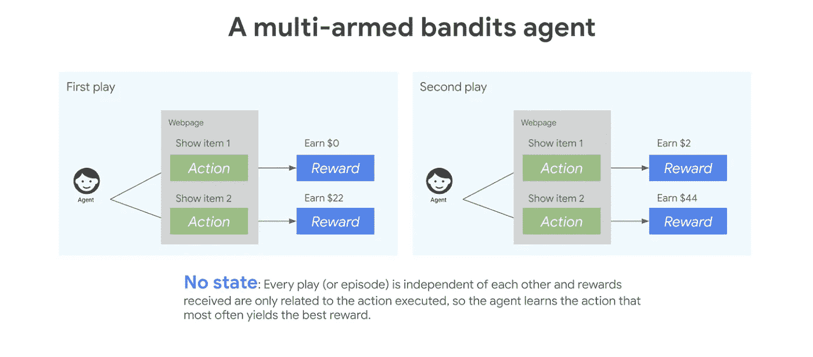
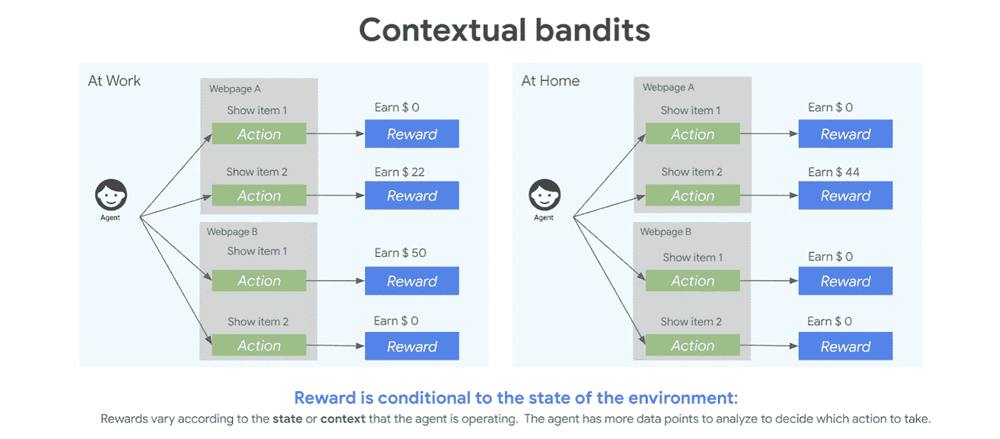
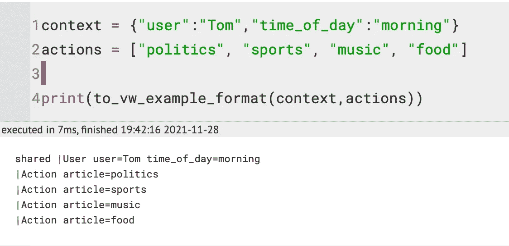
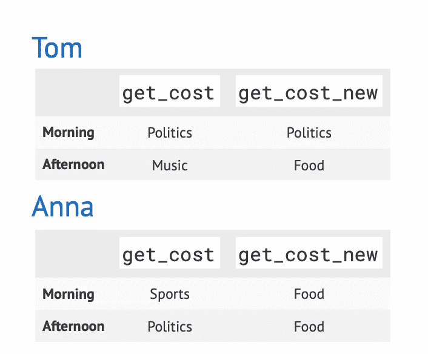
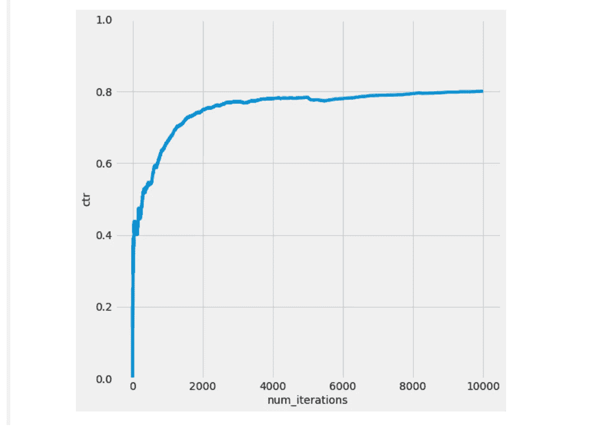

# 个性化和推荐与上下文强盗🤖

> 原文：<https://medium.com/mlearning-ai/simulating-content-personalization-with-contextual-bandits-6f4efb902af?source=collection_archive---------0----------------------->

用 Vowpal Wabbit 模拟一个内容个性化场景，使用上下文土匪在给定的上下文中选择动作。


Photo by [Markus Spiske](https://unsplash.com/@markusspiske?utm_source=medium&utm_medium=referral) on [Unsplash](https://unsplash.com?utm_source=medium&utm_medium=referral)

# 介绍

向用户推荐相关和个性化的内容对于媒体服务提供商、电子商务平台、基于内容的平台等至关重要。

事实上，有效的推荐系统通过帮助用户浏览大量内容，改善了用户在平台上的体验和参与度。

随着对个性化系统、高效信息检索和异常检测等功能需求的增长，对优化这些功能的解决方案的需求也在增长。Contextual bandit 是一个机器学习框架，旨在解决这些以及其他复杂的情况。

本教程包括强化学习的简要概述，这种机器学习范式的上下文强盗方法，并描述了如何用 Vowpal Wabbit 处理上下文强盗问题。

[](https://github.com/99sbr/fastapi-template) [## GitHub - 99sbr/fastapi-template:完全可扩展的基于 fastapi 的机器学习模板…

### 完全可扩展的基于 FastAPI 的模板，用于机器学习、深度学习和任何其他软件项目

github.com](https://github.com/99sbr/fastapi-template) 

# 什么是强化学习？

[强化学习](https://docs.microsoft.com/en-us/azure/cognitive-services/personalizer/concepts-reinforcement-learning)是一种机器学习范式，用于训练模型进行顺序决策。它包括使用与软件代理如何在复杂环境中采取适当行动有关的算法，并使用反馈来随着时间的推移最大化回报。这种方法提供了在给定的上下文中制定特定用户行为的自由，并提供了关于如何根据目标奖励所选行为的反馈。

# 土匪解释道



假设您是一家在线零售商，希望在主页上显示个性化的产品建议。

你只能给一个特定的客户展示有限数量的产品，你不知道哪些会有最好的回报。在这种情况下，如果客户不购买产品，我们将奖励设为 0 美元，如果他们购买，将商品价格设为 0 美元。

为了最大化你的回报，你可以利用多臂土匪(MAB)算法，其中每个产品都是土匪——可供算法尝试的选择。正如我们在下面看到的，多臂强盗代理必须在每次游戏中选择向用户展示物品 1 或物品 2。每次游戏都是相互独立的——有时用户会花 22 美元购买物品 2，有时用户会两次购买物品 2，获得 44 美元的奖励。

[](/mlearning-ai/semantic-search-with-s-bert-is-all-you-need-951bc710e160) [## 使用 S-BERT 进行语义搜索是您所需要的

### 从头开始构建内部语义搜索引擎—快速而准确

medium.com](/mlearning-ai/semantic-search-with-s-bert-is-all-you-need-951bc710e160) 

# 背景强盗问题

现在，假设我们有一个客户，他是一名专业的室内设计师，也是一名狂热的针织爱好者。他们可能在工作时间订购壁纸和镜子，回家后浏览不同的纱线。根据他们访问我们网站的时间，我们可能会向他们展示不同的产品。

上下文 bandit 算法是多臂 bandit 方法的扩展，在选择 bandit 时，我们会考虑客户的环境或上下文。环境影响奖励如何与每个强盗相关联，因此随着环境的变化，模型应该学会适应它的强盗选择，如下所示。



在情境强盗问题中，学习者反复观察情境，选择行动，并且只观察所选行动的损失/成本/回报。上下文土匪算法使用额外的辅助信息(或上下文)来帮助现实世界的决策。它们非常适合在动态环境中选择操作，在这种环境中，选项变化很快，并且可用的操作集有限。

有了 contextual bandit，学习算法可以测试不同的动作，并自动学习哪一个在给定的情况下具有最有益的结果。这是一种强大的、通用的方法，可以解决从医疗保健到金融等行业的关键业务需求。

# 沃帕尔·瓦比特:与背景强盗一起工作

Vowpal Wabbit 是一个交互式机器学习库，也是像[微软个性化器](https://azure.microsoft.com/en-us/services/cognitive-services/personalizer/)这样的服务的强化学习框架。在进行个性化排序和用所有事件训练模型时，它允许最大吞吐量和最低延迟。

本教程使用一个我们称之为 **Con-Ban Agent** 的应用示例来介绍一种解决上下文强盗问题的 Vowpal Wabbit 方法，并探索这种强化学习方法的能力。**网页内容个性化**的问题场景激发了我们的例子**禁止代理**。目标是在每个页面上向用户展示最相关的网页内容，以最大化参与度(点击量)。

**禁止代理**执行以下功能:

*   某个上下文 **x** 到达并被**禁止代理**观察到。
*   **禁止代理**从一组动作 **A** 中选择一个动作 **a** ，即**A**∈**A**(**A**可能依赖于 **x** )。
*   被选中的 **a** 的某些奖励 **r** 被**控制代理**观察到。

在上下文 bandit 设置中，数据点有四个组成部分:

*   语境
*   行动
*   选择行动的概率
*   所选行动的奖励/成本

**例如:**

**Con-Ban 代理**新闻网站:

*   **优化决策**:显示给用户的文章。
*   **上下文**:用户数据(浏览历史、位置、设备、时间)
*   **动作**:可用的新闻文章
*   **奖励**:用户参与度(点击或不点击)

我们需要在模拟器中生成一个上下文，以获得给定上下文的操作/决策，并模拟生成奖励。模拟器的目标是最大化回报(CTR)——或最小化损失(CTR)。

因此，**上下文**是(用户，一天中的时间):

*   我们有两个网站访问者:“汤姆”和“安娜。”
*   汤姆和安娜在上午或下午访问网站。

我们可以选择向汤姆和安娜推荐各种各样的商品。因此，**动作**是文章的不同选择:“政治”、“体育”、“音乐”、“美食”、“金融”、“健康”，或者“奶酪”。

**奖励**是他们是否点击文章:“点击”或“不点击”

# Vowpal Wabbit 中的上下文强盗功能

VW 包含一个上下文 bandit 模块，允许您根据已经收集的上下文 bandit 数据优化预测器。换句话说，该模块不实现浏览，它假定它只能使用通过浏览策略记录的当前可用数据。(注意:有关完整的在线上下文 bandit，请参见此处的— cb_explore 和— cb_explore_adf 选项[的使用。)](https://github.com/JohnLangford/vowpal_wabbit/wiki/Contextual-Bandit-algorithms)

数据被指定为一组元组(x，a，c，p ),其中 x 是决策的当前特征/上下文，a 是上下文 x 的探索策略选择的动作，c 是上下文 x 中动作 a 的观察成本，p 是探索策略在上下文 x 中选择该动作的概率。

每个示例现在跨越多行，每个动作一行。对于每个动作，我们都有标签信息`(a,c,p)`，如果已知的话，和以前一样。动作字段`a`现在被忽略，因为动作由行号标识，通常设置为 0。成本和概率的语义和以前一样。每个示例还允许精确地指定一个动作的标签信息。换行符表示多行示例的结束。此外，我们可以在一个例子的开头指定所有动作共享的上下文特性，这个例子总是有一个标签`shared`，就像上面第二个多行例子一样。因为共享行不与任何动作相关联，所以它不应该包含标签信息。

**简单的例子**

下面是一个简单的例子，说明了输入格式以及如何对这些数据使用 vw。

我们考虑一个有 4 个动作的问题，我们观察到 VW 格式的以下 5 个数据点:

```
1:2:0.4 | a c  
3:0.5:0.2 | b d  
4:1.2:0.5 | a b c  
2:1:0.3 | b c  
3:1.5:0.7 | a d
```

这里每一行都是一个单独的示例，每一行都采用以下形式:

```
action:cost:probability | features
```

在哪里

*   action 是我们观察成本时所采取的操作的 id ({ 1，k}中的正整数)
*   成本是此操作的观察成本(浮点，越低越好)
*   概率是概率(浮点，以[0..1])，以在收集数据时选择此操作
*   特性是这个例子中所有特性的列表，通常指定用于 vw 的分类/回归问题

因此，上面的第一行表明，我们在一个具有特征 a 和 c 的示例中观察到动作 1 的成本为 2，并且在收集数据时，该动作被环境中的探索策略以概率 0.4 选择。

# 模拟奖励沃帕尔瓦比特

在现实世界中，我们在观察汤姆和安娜的互动时，必须了解他们对文章的偏好。由于这是一个模拟，我们必须定义 Tom 和 Anna 的偏好配置文件。

我们提供给学习者的奖励遵循这个偏好简档。我们希望看到，随着我们看到更多样本，学习者是否能做出越来越好的决定，这反过来意味着我们正在最大化回报。

为了做到这一点，我们需要以几种不同的方式修改奖励函数，并看看上下文中的 bandit 学习者是否会发现这些变化。然后，我们比较有学习和没有学习的 CTR。

Vowpal Wabbit 优化以最小化成本，这是回报的负数。

因此，**我们总是将报酬的负数作为成本传递给 Vowpal Wabbit。**

```
*# VW tries to minimize loss/cost, therefore we will pass cost as -reward* USER_LIKED_ARTICLE **=** **-**1.0
USER_DISLIKED_ARTICLE **=** 0.0
```

下面的奖励函数指定了 ***汤姆早上喜欢政治，下午喜欢音乐。安娜早上喜欢运动，下午喜欢政治。这看起来很难理解，但我们是在以学习者理解的反馈形式——成本——模拟一个假想的世界。***

如果学习者推荐了一篇符合奖励功能的文章，我们会给予积极的奖励。在我们的模拟中，这是一次点击。

# 了解 Vowpal Wabbit 格式

我们需要采取一些步骤以 Vowpal Wabbit 理解的格式设置我们的输入。

这个函数处理从我们的上下文(如字典、文章列表和费用，如果有的话)到它理解的文本格式的转换:

为了理解这种格式，我们来看一个例子。在本例中，时间是早上，用户是 Tom。有四种可能的文章。

在 Vowpal Wabbit 格式中，有一行以 shared 开始，即共享上下文，后面是四行，每行对应一篇文章:



Figure 3

更多详情在这里:[https://github . com/VowpalWabbit/vowpal _ wabbit/wiki/Input-format](https://github.com/VowpalWabbit/vowpal_wabbit/wiki/Input-format)

# 从沃帕尔·瓦比特那里得到一个决定

当我们调用 Vowpal Wabbit 时，输出是一个[概率质量函数](https://en.wikipedia.org/wiki/Probability_mass_function) (PMF)。Vowpal Wabbit 提供了一系列行动的可能性列表，因为我们将勘探纳入了我们的战略。这种探索意味着列表中给定索引处的概率对应于选择特定动作的可能性。

为了做出决定/采取行动，我们必须从这份清单中取样。

例如，给定 list**【0.7，0.1，0.1，0.1】**，我们会以 70%的概率选择第一个项目。命令`**sample_custom_pmf**`获取这样一个列表，并给出它选择的索引以及选择该索引的概率。

我们拥有为特定用户和上下文选择操作所需的所有信息。使用 Vowpal Wabbit 通过以下步骤实现这一点:

1.  将上下文和动作转换成所需的文本格式。
2.  将此示例传递给 Vowpal Wabbit，并获得 PMF 输出。
3.  尝试此 PMF 以获取要展示的文章。
4.  返回选择的文章和选择它的概率。

# 强化学习模拟

现在我们已经完成了所有的设置工作，并且知道了如何与 Vowpal Wabbit 交互，让我们来模拟 Tom 和 Anna 的世界。场景如下:汤姆和安娜访问一个网站，看到一篇文章。请记住，奖励功能允许我们定义对 Vowpal Wabbit 推荐的内容的真实反应。

我们随机地在汤姆和安娜之间进行选择，并且随机地选择他们访问网站的时间。把这想象成抛硬币来选择汤姆和安娜，再抛一次硬币来选择一天中的时间。

# 实例化学员

我们在 Vowpal Wabbit 中实例化一个上下文 bandit 学习器，然后模拟 Tom 和 Anna 的网站访问次数 num_iterations。每次访问时，我们都要做以下工作:

1.  在汤姆和安娜之间做决定
2.  决定一天中的时间
3.  将上下文(即用户、一天中的时间)传递给学习者以获得行动(即文章推荐和选择行动的概率)。
4.  获得奖励(即，查看用户是否点击)。记住，成本只是一个负回报。
5.  以 Vowpal Wabbit 格式格式化上下文、动作、概率、奖励
6.  从例子中学习

这种减少对于我们的每一个模拟都是一样的，所以我们在`**run_simulation**`函数中定义这个过程。我们必须提供成本函数来模拟现实世界是如何工作的:

> ***现实世界中人们的偏好随着时间而变化。为了在模拟中说明这一点，我们合并了两个不同的成本函数，并在中途切换到第二个函数(图 7)。***

当我们改变成本函数时，我们开始奖励以前从未有过回报的行为:



User Behaviour

现在，我们在几个样本之后切换到新的奖励函数(运行第一个奖励函数)。请记住，这个奖励功能会改变用户的偏好。它正在与一个**不同的**行动空间比以前。我们应该看到学习者接受这些变化并优化新的偏好。



# 模型保存和加载 Python

VW 支持保存模型并将其加载到另一个 VW 流程中。该模型的内容包括:

*   大众版本
*   标记为`keep`的命令行参数
*   这是一些混乱的来源，模型的内容通常包含比最初运行 VW 时提供的更多或更少的参数。这是因为非`keep`参数不会被保存，一些缩减会插入额外的命令行参数，这些参数本身被标记为`keep`
*   通用大众状态
*   每个已启用缩减的状态

在 Python 中使用 VW 时，几乎所有命令行参数都按预期工作。

# 保存模型

在 Python 中保存模型可以使用`final_regressor`。然而，需要注意的是，模型保存发生在 VW 清理的时候，所以你需要调用`[finish](https://vowpalwabbit.org/docs/vowpal_wabbit/python/latest/vowpalwabbit.pyvw.html?highlight=finish#vowpalwabbit.pyvw.vw.finish)`或者销毁对象(例如用`del`)，这将依次调用`[finish](https://vowpalwabbit.org/docs/vowpal_wabbit/python/latest/vowpalwabbit.pyvw.html?highlight=finish#vowpalwabbit.pyvw.vw.finish)`。

你也可以随时调用`[save](https://vowpalwabbit.org/docs/vowpal_wabbit/python/latest/vowpalwabbit.pyvw.html?highlight=finish#vowpalwabbit.pyvw.vw.save)`来保存一个模型文件。这只支持保存二进制模型文件，不支持可读版本。

```
vw = pyvw.vw("-f vw.model")
vw = pyvw.vw(final_regressor="vw.model")
vw.save("vw.model")
```

# 加载模型

要在 Python 中加载模型文件，您应该在创建`vw`实例时使用`initial_regressor`配置对象。

```
vw = pyvw.vw("-i vw.model")
vw = pyvw.vw(initial_regressor="vw.model")
```

# 资源

我没有试图修改大众现有的教程，并试图只收集相关的部分，为这个教程。这里可供探索的选择非常多。务必阅读他们的参考资料，并相应地进行实验。我希望这篇博客让你对大众的强大有了一个很好的了解。

*   [https://github.com/VowpalWabbit/vowpal_wabbit/wiki](https://github.com/VowpalWabbit/vowpal_wabbit/wiki)
*   [https://vowpalwabbit . org/tutorials/contextual _ bandits . html # python-tutorial](https://vowpalwabbit.org/tutorials/contextual_bandits.html#python-tutorial)
*   [https://www . Microsoft . com/en-us/research/publication/a-contextual-bandit-bake-off-2/](https://www.microsoft.com/en-us/research/publication/a-contextual-bandit-bake-off-2/)

我以前的报道:[https://subirverma.medium.com](https://subirverma.medium.com)

[](https://www.linkedin.com/in/sbrvrm/) [## 苏比尔维尔马-数据科学家 lll -塔塔 1mg | LinkedIn

### Subir 是一位充满激情、自学成才的数据科学家。他从 2016 年开始从事数据科学领域的工作…

www.linkedin.com](https://www.linkedin.com/in/sbrvrm/) 

谢谢

[](/mlearning-ai/mlearning-ai-submission-suggestions-b51e2b130bfb) [## Mlearning.ai 提交建议

### 如何成为 Mlearning.ai 上的作家

medium.com](/mlearning-ai/mlearning-ai-submission-suggestions-b51e2b130bfb)