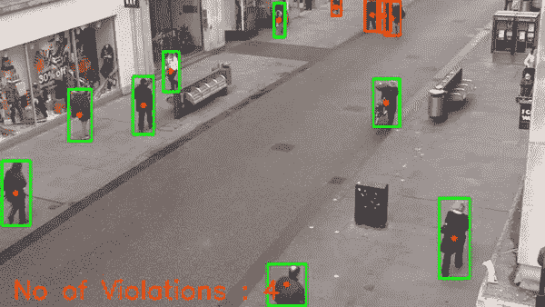
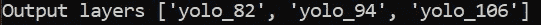

# 使用 YOLOv3 的社交距离——对象检测——带源代码

> 原文：<https://medium.com/mlearning-ai/social-distancing-using-yolov3-object-detection-with-source-code-fca11d9156ff?source=collection_archive---------4----------------------->

所以伙计们，伙计们，最期待的项目之一来了，**使用 YOLOv3 和 OpenCV** 的社交距离。

在这个项目中，我们要做的是，我们将检查在某个特定的地方，社会距离是否被遵循。

**在这里阅读全文并附带源代码—**[https://machine learning projects . net/social-distanding-using-yolov 3/](https://machinelearningprojects.net/social-distancing-using-yolov3/)



social distancing

# 让我们开始吧…

## 社会距离项目代码…

```
import cv2
import numpy as np
import random
import os
from PIL import Image
import time

net = cv2.dnn.readNet("yolov3.weights", "yolov3.cfg")
net.setPreferableBackend(cv2.dnn.DNN_BACKEND_CUDA)
net.setPreferableTarget(cv2.dnn.DNN_TARGET_CUDA)

distance_thres = 50

cap = cv2.VideoCapture('data/humans.mp4')

def dist(pt1,pt2):
    try:
        return ((pt1[0]-pt2[0])**2 + (pt1[1]-pt2[1])**2)**0.5
    except:
        return

layer_names = net.getLayerNames()
output_layers = [layer_names[i[0] - 1] for i in net.getUnconnectedOutLayers()]
print('Output layers',output_layers)

_,frame = cap.read()

fourcc = cv2.VideoWriter_fourcc(*"MJPG")
writer = cv2.VideoWriter('output.avi', fourcc, 30,(frame.shape[1], frame.shape[0]), True)

ret = True
while ret:

    ret, img = cap.read()
    if ret:
        height, width = img.shape[:2]

        blob = cv2.dnn.blobFromImage(img, 0.00392, (416, 416), (0, 0, 0), True, crop=False)

        net.setInput(blob)
        outs = net.forward(output_layers)

        confidences = []
        boxes = []

        for out in outs:
            for detection in out:
                scores = detection[5:]
                class_id = np.argmax(scores)
                if class_id!=0:
                    continue
                confidence = scores[class_id]
                if confidence > 0.3:
                    center_x = int(detection[0] * width)
                    center_y = int(detection[1] * height)

                    w = int(detection[2] * width)
                    h = int(detection[3] * height)
                    x = int(center_x - w / 2)
                    y = int(center_y - h / 2)

                    boxes.append([x, y, w, h])
                    confidences.append(float(confidence))

        indexes = cv2.dnn.NMSBoxes(boxes, confidences, 0.5, 0.4)

        persons = []
        person_centres = []
        violate = set()

        for i in range(len(boxes)):
            if i in indexes:
                x,y,w,h = boxes[i]
                persons.append(boxes[i])
                person_centres.append([x+w//2,y+h//2])

        for i in range(len(persons)):
            for j in range(i+1,len(persons)):
                if dist(person_centres[i],person_centres[j]) <= distance_thres:
                    violate.add(tuple(persons[i]))
                    violate.add(tuple(persons[j]))

        v = 0
        for (x,y,w,h) in persons:
            if (x,y,w,h) in violate:
                color = (0,0,255)
                v+=1
            else:
                color = (0,255,0)
            cv2.rectangle(img,(x,y),(x+w,y+h),color,2)
            cv2.circle(img,(x+w//2,y+h//2),2,(0,0,255),2)

        cv2.putText(img,'No of Violations : '+str(v),(15,frame.shape[0]-10),cv2.FONT_HERSHEY_SIMPLEX,1,(0,126,255),2)
        writer.write(img)
        cv2.imshow("Image", img)

    if cv2.waitKey(1) == 27:
        break

cap.release()
cv2.destroyAllWindows()
```

*   第 1–6 行—导入所需的库。
*   第 8–10 行—读取 Yolo 文件并启用 Cuda。
*   第 12 行—将距离阈值设置为 50 像素。
*   第 14 行——实例化 [VideoCapture](https://docs.opencv.org/3.4/d8/dfe/classcv_1_1VideoCapture.html) 对象，它将帮助我们从视频文件中读取帧。
*   第 16–20 行—一个简单的距离函数，用于计算平面上两个坐标之间的距离。
*   第 22 行-获取网络中所有图层名称的列表。
*   第 23 行-获取输出图层。



*   第 26 行——从视频中读取一帧，以获得它的高度和宽度。
*   第 28–29 行—我们将使用 [VideoWriter](https://docs.opencv.org/3.4/dd/d9e/classcv_1_1VideoWriter.html) 将我们的结果保存在视频输出中，如下所示。
*   第 32–33 行—让我们开始循环。
*   第 35 行—从输入视频开始读取。
*   第 36 行——如果 cam 对象返回一些东西，那么 ret 将为真。
*   第 37 行—提取图像的高度和宽度。
*   第 38 行—从图像中创建一个形状为 416X416 的斑点。
*   第 41 行——使用 [cv2.dnn.blobFromImage](https://docs.opencv.org/4.5.2/d6/d0f/group__dnn.html#ga29f34df9376379a603acd8df581ac8d7) 将该斑点作为网络的输入。
*   第 42 行-从输出图层获取输出。
*   第 47 行—遍历该帧的所有输出。
*   第 48 行—现在遍历所有检测。
*   第 49 行——检测阵列中有 85 个点。前四个索引用于盒子的坐标，从 5 到 85 的索引用于类别置信度。
*   第 50 行—通过获取得分最高的元素的索引来获取类 id。
*   第 51–52 行—如果 class_id 不为 0(个人)，请继续。因为我们在这个用例中的主要目的只是检测人。
*   第 53 行—获得信心得分。
*   第 54 行—如果置信度大于 30%，则继续进行。
*   第 55–56 行-计算中心 x 和中心 y 点。
*   第 58–61 行-计算边界框的 x，y，w，h。
*   第 63 行——将这个边界框添加到我们的框列表中。
*   第 64 行——在机密列表中附加机密。
*   第 66 行——这里我们使用[cv2 . dnn . NMS box](https://docs.opencv.org/4.5.2/d6/d0f/group__dnn.html#ga9d118d70a1659af729d01b10233213ee)执行边界框的非最大抑制。它将返回一个索引列表，包含我们必须考虑的那些索引的列表。
*   第 72–76 行——现在遍历所有的框，只选择那些索引在索引列表中的框。并且仅在人员列表中附加这些相关的框。另外，在 person_centres 数组中追加框中心。
*   第 79–83 行——现在遍历 person_centres 数组，找到所有违反 50 像素社交距离标准的 person centers。我们将通过距离函数中的这些人中心点，并检查所有人之间的距离。我们将把这些违规者添加到违规数组中。
*   第 85–93 行——简单地在违反社交距离规范的人周围画一个红框，在没有违反的人周围画一个绿框。
*   第 95 行—在屏幕上显示违规次数。
*   第 96 行—以视频形式保存输出。
*   第 97 行—显示了输出。
*   第 99–100 行—如果有人按 ESC 键，破解密码。
*   第 102–103 行—释放 VideoCapture 对象并销毁所有打开的窗口。


social distancing

***注意——虽然最好的方法是使用 3D 投影进行最佳预测，但为了简单起见，我简单地使用了欧几里德距离。***

***探索更多机器学习、深度学习、计算机视觉、NLP、Flask 项目访问我的博客。***

[](https://machinelearningprojects.net/) [## 家庭机器学习项目

### 机器学习(ML)是对计算机算法的研究，它通过经验和使用自动改进

machinelearningprojects.net](https://machinelearningprojects.net/) 

**如需进一步的代码解释和源代码，请访问此处** —

[](https://machinelearningprojects.net/social-distancing-using-yolov3/) [## 社交距离使用 YOLOv3 -对象检测-带源代码-最简单的解释-有趣…

### 所以伙计们，伙计们，这是最期待的项目之一，使用 YOLOv3 和 OpenCV 的社交距离。没有任何…

machinelearningprojects.net](https://machinelearningprojects.net/social-distancing-using-yolov3/) 

*这就是我写给这个博客的全部内容，感谢你的阅读，我希望你在阅读完这篇文章后，能有所收获，直到下一次👋…*

[](/mlearning-ai/mlearning-ai-submission-suggestions-b51e2b130bfb) [## Mlearning.ai 提交建议

### 如何成为 Mlearning.ai 上的作家

medium.com](/mlearning-ai/mlearning-ai-submission-suggestions-b51e2b130bfb)