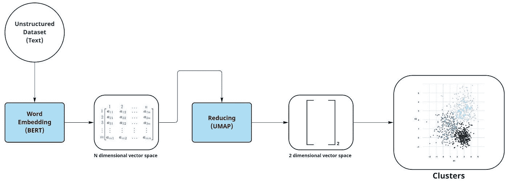

# 使用聚类加速数据标注:增强数据标注的工具和技术。

> 原文：<https://medium.com/mlearning-ai/speedup-data-labeling-using-clustering-tools-and-techniques-for-enhanced-data-labeling-9b19e473b19b?source=collection_archive---------4----------------------->


Clustering for enhanced data labeling (Source: [Freepik](https://www.freepik.com/free-vector/sorting-thoughts-concept-illustration_12780668.htm#query=sorting&position=0&from_view=search))

如果您处理的数据集很大程度上是非结构化和未分类的，那么注释初看起来可能是不可能的，但幸运的是，有一些工具和技术可以帮助我们实现这一目标。

1.  概念
2.  数据标签的重要性
3.  分类与聚类
4.  拟议解决方案
5.  一个自动化的解决方案:用 UBIAI 自动标记
6.  一些相关的商业案例
7.  结论

> 本文可供技术读者(数据科学家、ML 工程师……)和非技术读者(产品经理、项目经理、业务负责人……)阅读，将为您提供优化工作流程的解决方案。

# 概念

在讨论解决方案之前，让我们首先定义几个可以帮助我们更好地理解这种情况的概念。

## 什么是监督学习？

监督学习是模式识别和机器学习方法中的一项任务，其目标是从标记的数据点训练模型。然后，将学习到的模型应用于未知的测试集，并基于该方法在将测试数据分配给不同类别方面的成功程度来验证该方法。

## **什么是无监督学习？**

无监督学习是模式识别和机器学习方法中的一项任务，其中初始数据集是大量未标记的数据，这些数据可以被分析并聚类成具有相似属性的聚类。

## 什么是数据标注？

数据标注(也称为数据注记、标记或分类)是为算法准备数据集的过程，该算法学习识别标注数据中的重复模式。一旦算法处理了足够多的标记数据，它就可以开始识别数据集中尚未标记的相同模式。随着你冲洗和重复这个过程，人工智能和机器学习解决方案背后的算法变得更加智能和高效。简而言之，标记的主要目的是用一个或多个描述数据的标签来标记一组样本。
标记通常采用一组未标记的数据，并用称为标签的附加信息来增强每一部分。

# **数据标注的重要性**

鉴于未标记数据集是非结构化的，并且包含较少的描述性信息，它们显然更容易获取或生成，并且与更昂贵但也更可靠的标记数据集相反，创建它们需要更少的人力。

然而，由于提供给无监督技术的数据是未标记的，因此没有明确的方法来验证这种方法的质量，这影响了训练模型的可靠性。
另一方面，人工智能(AI)的好坏取决于训练它的数据；人工智能算法训练数据的质量与其成功直接相关。

现在，考虑到每种类型数据的规格，以便在现实世界的应用程序中有效地部署人工智能模型，应用程序的利益相关者知道一个模型对它所做的预测有多有信心是很重要的。这可以一直追溯到数据贴标阶段，因此确保参与贴标过程的工人接受质量保证评估至关重要。

有了一个强大的质量保证过程，人工智能模型就有更大的机会通过一个称为“垃圾输入，垃圾输出”的过程来学习和实现它的设计目标——这个概念是说输出的质量由输入的质量决定。

# **分类 vs 聚类**

聚类和分类都是机器学习中使用的模式识别方法，用于根据对象的特征将对象分类到不同的类别中。
这两种数据科学分组技术有相似之处，但主要区别在于，分类方法使用对象被分配到的预定义类，而聚类方法基于识别它们之间的相似性/不相似性将对象分组到非预定义类中。分类用于有标签的数据，适合监督学习，而聚类用于无标签的数据，适合无监督学习。

# 选哪个？

对于较小的数据集，手动注释和组织是可行的，甚至是最佳的。然而，随着您的数据开始扩展，注释、分类和归类变得更加困难。聚类(取决于您使用的算法)可以减少您的注释和分类时间，因为它对特定的结果不太感兴趣，而更关心分类本身。例如，语音识别**算法产生数百万个数据点，需要数百个小时才能完全注释完。聚类算法可以减少总的工作时间，更快地给你答案**。因此**聚类**在某些情况下是最佳解决方案。

# **提议的解决方案**

作为一种解决方案**来加快标注过程，并使其成本更低、耗时更少**，**让我们从一个大型的非结构化数据集开始，并使用聚类来帮助我们完成标注过程**。

对大型数据集进行聚类可能是这种分析工具的最佳应用，因为它减轻了您的工作量。与其他无监督学习工具一样，聚类可以获取大型数据集，并且在没有指导的情况下，快速将它们组织成更有用的东西。最好的一点是，如果您不打算执行大规模分析，聚类可以为您提供有关数据的快速答案。

**所提出的解决方案给出了一种利用单词嵌入来执行文本聚类的独特方式**。该技术以其自己的方式解决了文本挖掘的最大问题之一，即所谓的维数灾难，从而给出更有效的文本数据聚类，尤其适用于大文本数据集的情况。

## ***解释数据流:嵌入和聚类如何加速标注？**

因此，该解决方案背后的主要思想可以从该图中看出:



Embedding and clustering speed up annotation. (Source: By Author)

最近提出的一个用于生成上下文嵌入的模型对我们非常有帮助，称为使用转换器的双向编码器表示(BERT)。BERT 是一个复杂的神经网络架构，它是在大量书籍和英语维基百科上训练的。

## ***后续步骤:**

*   首先，让我们用 pip 安装必要的包:

```
!pip install -U sentence-transformers
!pip install -U umap
```

*   其次，我们应该导入我们需要的库:

```
import pandas as pd 
from sentence_transformers import SentenceTransformer 
import umap
```

*   现在我们应该加载句子编码器。SentenceTransformers 是一个 Python 框架，用于最先进的句子、文本和图像嵌入。最初的工作描述在他们的论文“句子-伯特:使用暹罗伯特网络的句子嵌入”

```
model = SentenceTransformer('paraphrase-MiniLM-L6-v2')
```

*   现在让我们加载初始数据集:

```
dataset = pd.read_csv("dataset.csv")[['text']] 
sentences = dataset['text']
```

*   现在使用 SentenceTransformer，我们可以计算嵌入来创建 N 维表示:

```
sentence_embeddings = model.encode(sentences)
```

*   使用 UMAP，我们可以将之前的结果简化为二维结果:

```
var_umap = umap(n_components=2) 
var_tfm = var_umap.fit_transform(sentence_embeddings)
```

*   现在我们应用坐标并将结果保存到一个 CSV 文件中:

```
dataset['x'] = var_tfm[:, 0] 
dataset['y'] = var_tfm[:, 1] 
dataset.to_csv("ready.csv")
```

*   最后，在将所有单词(字符串格式)转换成数字向量格式之后，测量单词之间的相似性(或不相似性)变得非常容易和准确。这种词与词之间的语义比较，在 BERT 这样的模型出现之前，并不是很准确。
    **现在我们可以使用聚类对相似的数据进行分组，这使得标记过程变得非常简单和准确**。

# 一个自动化的解决方案:用 UBIAI 自动标记

**幸运的是**[**ubiai . tools**](https://ubiai.tools/)**为我们提供了一个神奇的棒来帮助我们自动化所有的手工工作，感谢他们强大的工具** [**自动贴标**](https://ubiai.tools/features/r1-auto-labeling) **。**

UBIAI 具有自动贴标功能，可减少数据贴标的人力，节省时间和金钱。该工具通过使用 ML 模型、字典和基于规则的方法为文档自动注释提供了一个选项。它很容易允许自动标注实体，如时间、地点、日期、产品、人员等。，从本地文件上传文本后。


UBIAI Auto-Labeling tool (Source: [UBIAI](https://ubiai.tools/features/r1-auto-labeling))

# **一些相关的商业案例**

## **客服数据标注**

在一个案例中，一家大公司拥有大量多年前与其客户服务相关的数据。
每个客户请求可能包含一个不同的主题，但所有请求都可以分为一些通用主题。
现在，通过标记这些数据，产生的数据集可以帮助公司分析和了解他们客户的需求，训练一个可以取代人工协助的虚拟助理，甚至可以用于制定未来的决策。

## 电子邮件标签

在某个专业人员收到大量电子邮件的情况下，如果他使用下面提出的解决方案来标记每封电子邮件，那么他可以将他的电子邮件转换为结构化的带标签的数据集，这将非常有帮助。

# **结论**

在本文中，我们讨论了数据科学家和机器学习工程师之间非常常见的问题，即数据标记，然后我们使用聚类技术提出了一个最佳解决方案。

可能没有完美的工具或技术可以确保 100%可靠的结果，但我们认为提出的解决方案可以使过程更快、更便宜。

[](/mlearning-ai/mlearning-ai-submission-suggestions-b51e2b130bfb) [## Mlearning.ai 提交建议

### 如何成为 Mlearning.ai 上的作家

medium.com](/mlearning-ai/mlearning-ai-submission-suggestions-b51e2b130bfb)