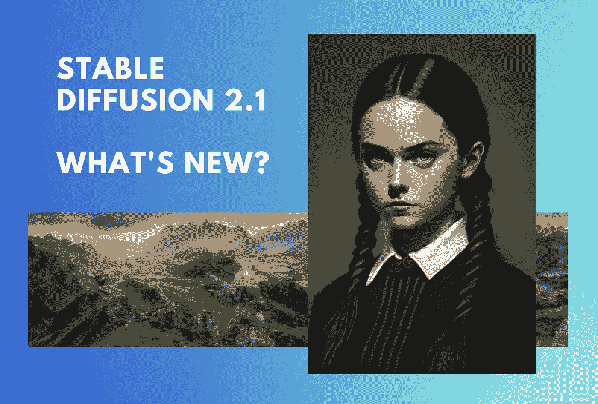

# 稳定扩散 2.1 版发布— NSFW 图像生成又回来了

> 原文：<https://medium.com/mlearning-ai/stable-diffusion-2-1-released-nsfw-image-generation-is-back-8bcc5c069d60?source=collection_archive---------0----------------------->

Image by [Jim Clyde Monge](https://medium.com/u/819323b399ac?source=post_page-----8bcc5c069d60--------------------------------)

S 稳定性 AI 前几天发布了[稳定扩散 2.1](https://stability.ai/blog/stablediffusion2-1-release7-dec-2022) 。这是 2.0 版本的一个小后续，2.0 版本受到了用户的一些小批评，特别是人脸和 NSFW(不安全工作)图像的生成。

## 有什么新鲜事？

*   调整过滤器以允许名人的产生