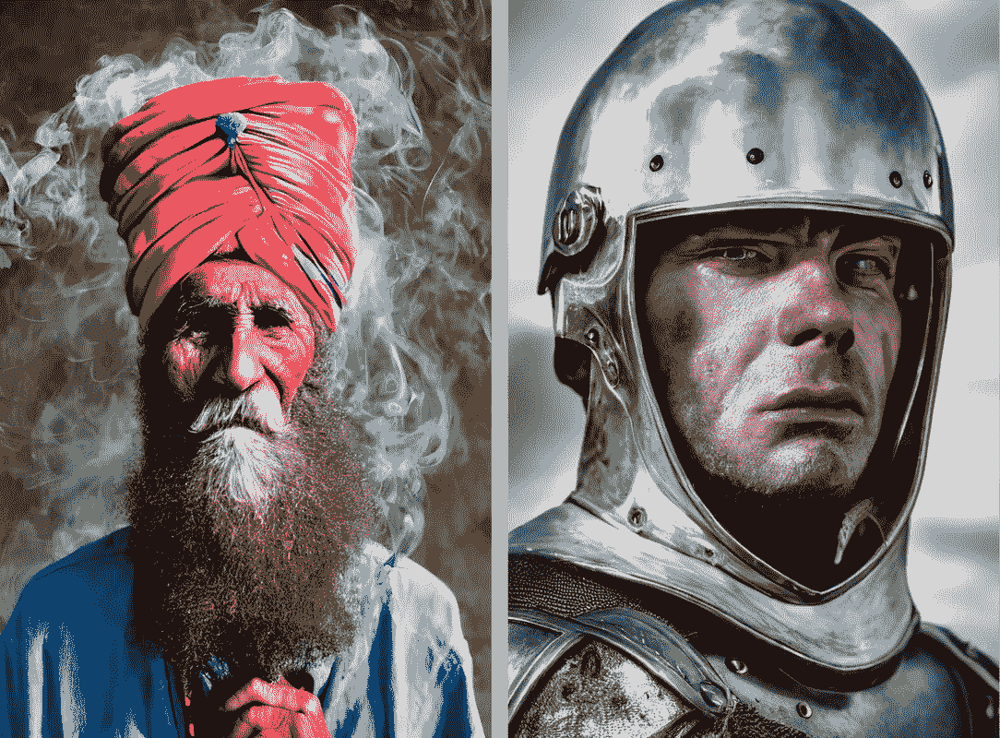
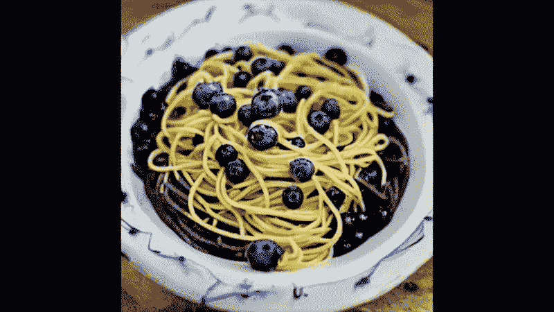
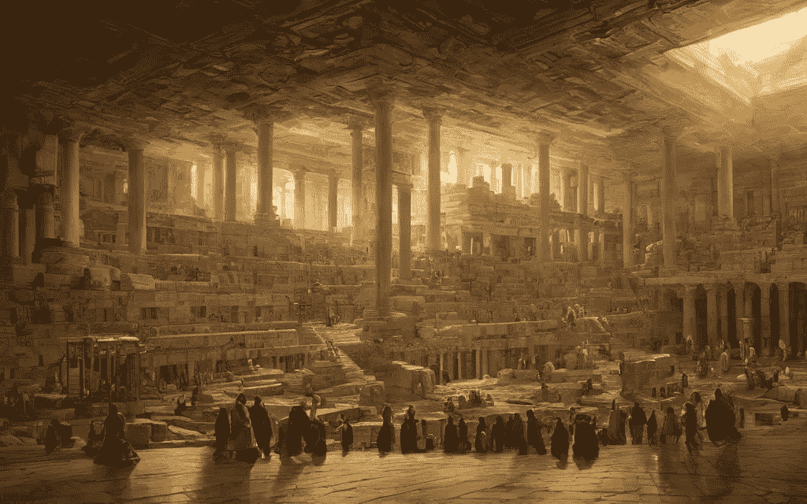

# 稳定扩散:新的开源人工智能图像生成器

> 原文：<https://medium.com/mlearning-ai/stable-diffusion-new-open-source-ai-image-generator-3c0720b9f740?source=collection_archive---------2----------------------->

*User-generated image using Stable Diffusion. Photo by* [*Stable Diffusion*](https://stability.ai/blog/stable-diffusion-public-release)

就像 Dall-E & Midjourney 一样， [Stable Diffusion](https://stability.ai/blog/stable-diffusion-public-release) 越来越受欢迎，因为它是免费和开源的。正如我们所知，在 Dall-E &的中途，我们无法访问源代码，但现在有了稳定的扩散，模型权重和完整的源代码可供公众使用。

> 稳定扩散是一种文本到图像的模式，将使数十亿人能够在几秒钟内创作出令人惊叹的艺术作品。这是速度和质量上的突破，意味着它可以在消费级 GPU 上运行。您可以在此页面上看到一些由该模型创建的惊人输出，无需预处理或后处理。—稳定扩散

顺便说一句，公共展示空间可以在 [**这里找到**](https://huggingface.co/spaces/stabilityai/stable-diffusion) 。

我们现在可以调整内部参数，这是我们在 Dall-E & Midjourney 等封闭解决方案中无法做到的。让我们来看看它能做的一些事情！

> 安全地浏览互联网，但最重要的是，自由地浏览。虚拟专用网是那些最好拥有的东西之一。我推荐 NordVPN。”— PewDiePie

👉 [**了解更多关于 NordVPN 的信息**](https://go.nordvpn.net/aff_c?offer_id=15&aff_id=75170&url_id=2661) **🛡**

# 梦幻期

由于内部参数现在已经公开，我们可以对它们进行一些小的修改，并创建几个输出，将它们拼接成一个视频。

> 稳定扩散是疯狂的
> 
> 这里，我们在文本提示“蓝莓意大利面”和“草莓意大利面”之间转换。
> 
> lol 在 [@karpathy](https://twitter.com/karpathy) 的要点基础上建立了一个多么好的世界啊，使用了我在 Twitter 上看到的[@ xsteenbrugge](https://twitter.com/xsteenbrugge)-Nate Raw 提到的方法

[Nate Raw on Twitter @_naterw](https://twitter.com/_nateraw/status/1560320480816545801)

# 插入文字

我们可以通过输入几个提示来创作一部精美的视觉小说。第一个图像的结果现在可以变形为下一个，创建这些惊人的过渡。

[andreasjansson/stable-diffusion-animation](https://replicate.com/andreasjansson/stable-diffusion-animation?prediction=wsdaibdifnhlnptfyeyq6dgm4q)

# 幻想艺术

稳定扩散非常擅长创造这样的幻想艺术:

“The library of alexandria”. [**@DiffusionPics**](https://twitter.com/DiffusionPics/status/1569344365104975875) on Twiter

# 动画

这个视频是用 StableDiffusion 制作的，在一个无缝的视频变形中结合了 36 个提示，带你进行一次进化之旅。

Voyage through Time — a Generative AI journey. Video by [Neural Synesthesia](https://www.youtube.com/c/NeuralSynesthesia)

当一个工具最终向公众开放时，我认为我们将在未来几年看到疯狂的创造力。

***披露*** *:本文中的部分链接可能是附属链接，如果您决定购买付费计划，可以免费向我提供补偿。*

*原载于 2022 年 9 月 15 日*[*https://shakiroslann . digital press . blog*](https://www.shakiroslann.com/)*。*

 [## Mlearning.ai 提交建议

### 如何成为 Mlearning.ai 上的作家

medium.com](/mlearning-ai/mlearning-ai-submission-suggestions-b51e2b130bfb)