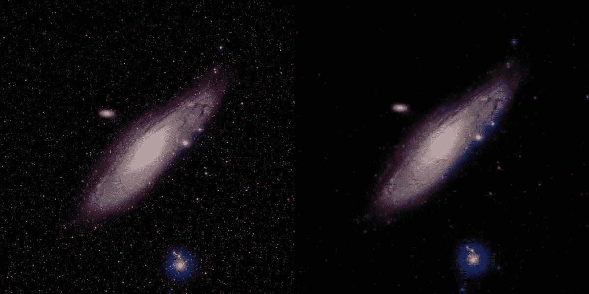
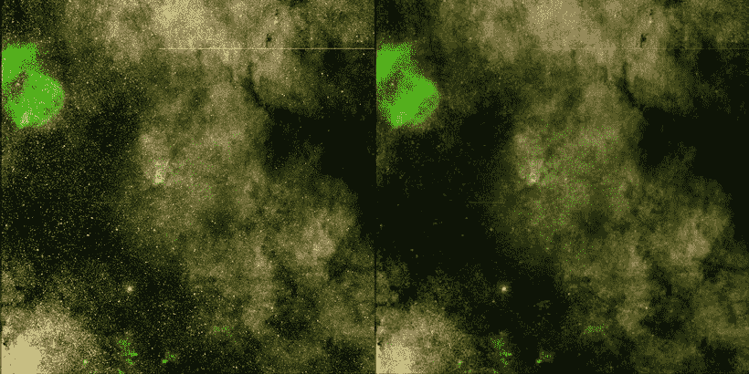
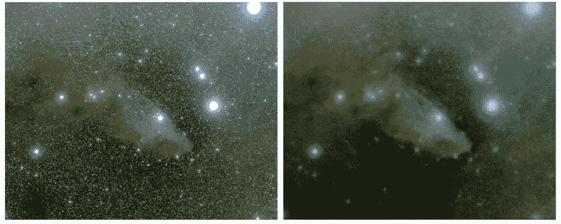
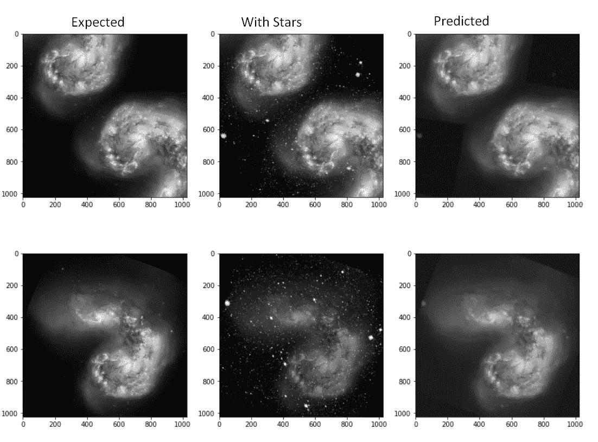

# 基于神经网络的天文摄影恒星约简

> 原文：<https://medium.com/mlearning-ai/star-reduction-for-astrophotography-using-neural-networks-1c6d15be3f38?source=collection_archive---------1----------------------->



*Image of Andromeda galaxy on left, the same image after star removal (on right) using my tool !*

📥在这里下载工具:[https://github.com/code2k13/starreduction](https://github.com/code2k13/starreduction)

当你在网上看星系和星云的图像时，你不会意识到恒星普遍不存在或非常暗淡。事实并非如此。这些物体周围有数以吨计的恒星。特殊的工具被用来去除这些星星，使图像看起来很漂亮。 [Starnet](https://github.com/nekitmm/starnet) 是网上流行的摘星工具之一。由于熟悉 AI/ML，我决定编写自己的基于神经网络的工具来去除星星。你可以在这里下载工具:【github.com/code2k13/starreduction 

以下是我的工具生成的更多示例:



*Original and starless image of area around WR 102*



*Original and starless image of Blue Horsehead Nebula*

这些天我为自己找到了一个新的爱好“天文图像后处理”。我一直喜欢天文学。事实上，我甚至拥有一架小型望远镜，但我没有时间去开阔的地方用一架真正的望远镜做任何事情。所以我订阅了 [https://telescope.live](https://telescope.live/) ，从这里我可以选择我想要观察的对象，并从望远镜中获得高质量的原始数据。后处理指的是将看起来“几乎是黑色”的原始望远镜图像转变成彩色图像的活动。

有很多工具可用于后期处理，我最喜欢的是 [GIMP](https://www.gimp.org/) 和 [G'MIC](http://gmic.eu/) (GREYC 的图像计算魔术)，因为它们是开源的，有很多很棒的特性。

我在编写去除星星工具时面临的一个大挑战是缺少训练数据。我简单地使用了两个免费提供的图像，一个用于背景，一个用于明星面具，创建了数百个假的训练图像。我仍在努力改进我的训练数据生成逻辑和训练过程，但即使以我目前的水平，结果看起来也很有希望。下图显示了几幅训练数据图像:



*Samples from training data*

“预期的”图像是通过将无星光图像和星光蒙版(带透明度)的随机裁剪叠加在一起生成的。训练代码可以在 Kaggle 上作为 python 笔记本获得:[https://www . ka ggle . com/final epoch/star-removal-from-astronomical-images-with-pix 2 pix](https://www.kaggle.com/finalepoch/star-removal-from-astronomical-images-with-pix2pix)

我还可以将我的工具 docker 化，这样你就可以在任何支持 docker 的平台上运行它。您可以使用下面的命令简单地运行该工具

```
docker run   -v $PWD:/usr/src/app/starreduction/data  \
-it code2k13/starreduction \
/bin/bash -c "./removestars.py ./data/example.jpg  ./data/example_starless.jpg"
```

> $PWD 指的是你当前的工作目录。在上面的例子中，假设文件 example.jpg 位于你当前的工作目录中。这个目录被挂载为一个卷，路径为 docker 容器中的/usr/src/app/star reduction/data。输出图像 example_starless.jpg 也将被写入同一目录。

如果你对天体摄影感兴趣，请查看我的工具并分享你的反馈。github 上免费提供应用程序、训练脚本和模型权重的源代码。

[](/mlearning-ai/mlearning-ai-submission-suggestions-b51e2b130bfb) [## Mlearning.ai 提交建议

### 如何成为 Mlearning.ai 上的作家

medium.com](/mlearning-ai/mlearning-ai-submission-suggestions-b51e2b130bfb)