# 星巴克顶点挑战

> 原文：<https://medium.com/mlearning-ai/starbucks-capstone-challenge-51cb5053db29?source=collection_archive---------6----------------------->

## 数据科学家纳米学位计划

the image is royalty-free

# 定义

## 项目概述

我们有一个模拟数据集，模拟星巴克奖励移动应用程序上的客户行为。每隔几天，星巴克就会向手机应用程序的用户发出一次报价。优惠可以仅仅是饮料的广告，也可以是实际的优惠，如折扣或 BOGO(买一送一)。某些用户可能在特定的几周内收不到任何优惠。

我们正在尝试将交易、人口统计和优惠数据结合起来，以确定哪些人口统计群体对哪种优惠类型做出最佳回应。除此之外，我们将使用机器学习算法来提供一个模型，预测每个用户将完成多少给定的报价。

在要约到期之前，每个要约都有一个有效期。例如，BOGO 的报价可能只有 5 天的有效期。信息优惠有一个有效期，即使这些广告只是提供有关产品的信息；例如，如果信息性报价有 7 天的有效期，您可以假设客户在收到广告后的 7 天内感受到了报价的影响。

并非所有用户都收到相同的报价，这是这个数据集要解决的挑战。

# 问题陈述:

这里的目标是:

*   检查和处理数据，将其转换为更易理解的格式
*   创建优惠用户数据以访问优惠回应者统计数据。
*   可视化并确定哪个人口统计群体对哪种优惠类型反应最好。
*   预处理和合并每个用户的所有数据，并为模型训练准备一个完整和干净的用户提供的数据集
*   选择一种机器学习方法，并建立一个模型来预测每个用户对给定优惠的回应数量。

# 韵律学

对于我们的模型，我们可以使用微观平均和宏观平均精度/召回作为我们的度量，因为它适合于我们的多类分类器:

这里的东西是根据标签来做的。对于每个标签，先计算指标，然后再进行汇总。因此，在这种情况下，您最终会计算整个数据集上每个标签的精度/召回率，就像您对二进制分类所做的那样(因为每个标签都有一个二进制赋值)，然后对其进行聚合。

这只是标准多类等价的扩展。

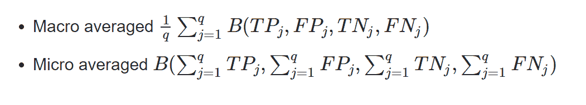

TPj、FPj、TNj、FNj 分别是仅第 j 个标签的真阳性、假阳性、真阴性和假阴性计数。

b 代表任何基于混淆矩阵的度量

# 分析

## 数据探索

数据包含在三个文件中:

*   portfolio.json —包含报价 id 和关于每个报价的元数据(持续时间、类型等)。)
*   profile.json —每个客户的人口统计数据
*   transcript.json 记录交易、收到的报价、查看的报价和完成的报价

以下是文件中每个变量的模式和解释:

**投资组合**

*   id(str)-报价 id
*   offer_type (str) —优惠类型，即 BOGO、折扣、信息
*   难度(int)——完成一项提议所需的最低花费
*   奖励(int) —为完成一项提议而给予的奖励
*   duration(int)-报价开放的时间，以天为单位
*   频道(字符串列表)

**简介**

*   年龄(整数)—客户的年龄
*   成为会员日期(整数)—客户创建应用程序帐户的日期
*   性别(str) —客户的性别(请注意，有些条目包含“O”代表其他，而不是 M 或 F)
*   id (str) —客户 id
*   收入(浮动)—客户的收入

**成绩单**

*   事件(str) —记录描述(即交易、收到的报价、查看的报价等。)
*   人员(字符串)—客户 id
*   time (int) —测试开始后的时间，以小时为单位。数据开始于时间 t=0
*   value —(字符串字典)—报价 id 或交易金额，具体取决于记录

## 检查“个人资料”数据集的洞察力:

检查年龄、性别和收入的分布:

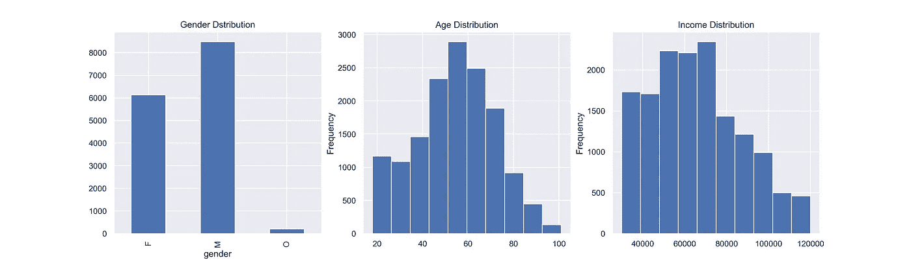

## 处理和清理“抄本”数据集:

快速浏览一下，我们可以很容易地理解，最难清理和处理的数据集是“抄本”。正如您在下面看到的，这个数据集中有多标签列、字典值和多类型数据。

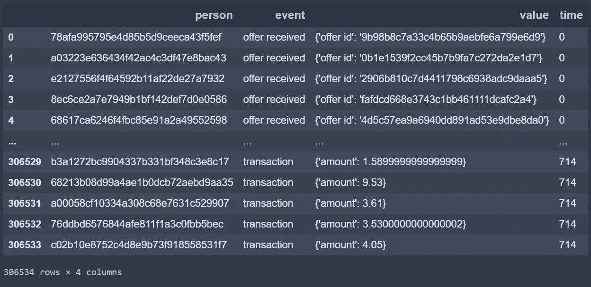

Transcript data set

显然，我们必须清理这个数据集，以便进行进一步的分析和处理。首先，我们需要将“值”列中的字典解包，并将它们堆叠在不同的列中。之后，我们可以将该表分成 3 个单独的表:offers、transaction 和 reward，每个表都有不同类型的“value”列。

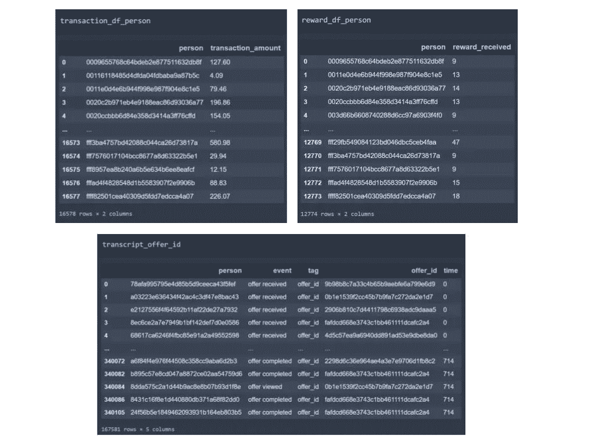

3 more Analyzable data sets derived from ‘transcript’

## 确定哪个人群对哪种优惠类型反应最好:

为了更好地了解每个报价响应者的特征，我们需要创建一个数据集，该数据集按唯一的报价 id 分组，并包含该报价响应者的详细统计信息。

对于这个问题，我们可以将我们的个人资料数据(包含每个用户的所有详细信息)与我们在上一节中处理的 script_offer_id 数据集合并。通过按优惠 id 对数据集进行分组，并对出生日期和年龄列进行一些更改，我们可以更容易地分析人口统计组。

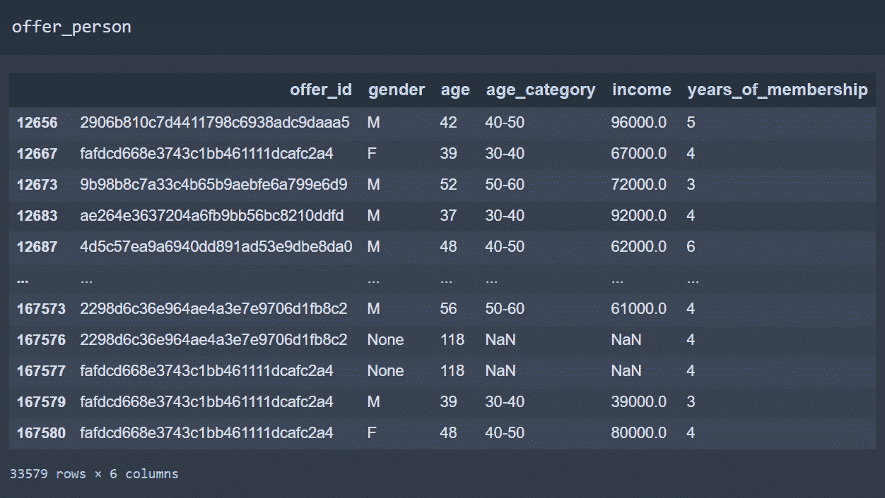

使用这个数据集，我定义了一个函数，该函数接受(' offer_person '，' offer_id ')作为参数，并返回一个数据帧，该数据帧由年龄类别和给定 offer id 的响应者的性别以及他们在整个样本中所占的百分比组成。现在，我们可以遍历每个要约 id，并获得该要约的响应者的人口统计细节。

例如，我们可以看一下展示“2906 b 810 c7d 4411798 c 6938 ad C9 da aa 5”统计数据的图表之一:

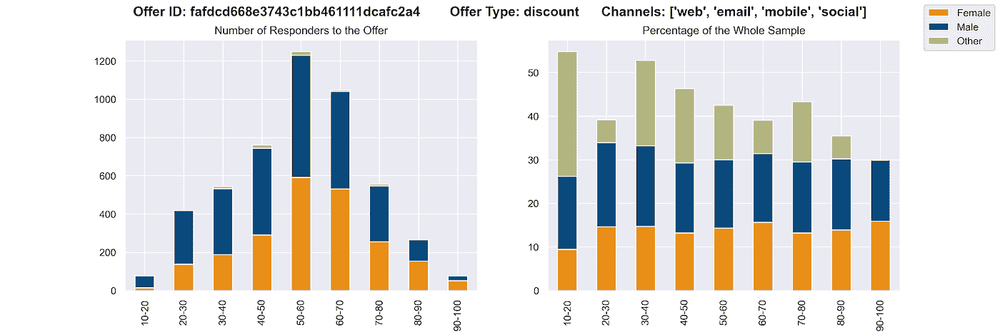

下面是另一张显示“fafdcd 668 e 3743 C1 bb 461111 dcafc 2 a 4”详细信息的图表:

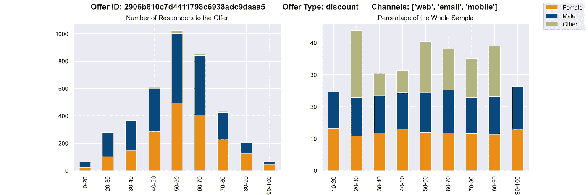

通过快速比较这两个图表，我们可以注意到，在 20-30 岁年龄组的男性用户中，大约 20%的人对第一次报价做出了回应，只有 10%的人对第二次报价做出了回应。当我们查看这两个报价的“渠道”数据时，我们注意到除了第二个报价渠道之外，第一个报价还使用了“社交媒体”,这可能是年轻群体在社交媒体上更活跃的原因之一。总之，对于这个群体来说，最好是多发二次报价，少发一次报价。(您可以在我的 Github 存储库中的 image 文件夹中找到所有报价 id 的图表)

我们注意到在 offer_person 数据集中只有 8 个唯一的 offer ids。在使用 portfolio 和 offer_person 数据集进行调查后，我们可以很容易地看到，这两个丢失的优惠是“信息性”优惠，我们没有关于它们的已完成优惠数量的任何数据。

# 预处理和建模

## 非参与用户挑战:

该数据集的主要挑战之一是考虑到一些用户即使没有收到报价也会购买。从商业的角度来看，如果一个顾客在没有报价的情况下购买了 10 美元的商品，你不会想要发送一个购买 10 美元的商品来获得 2 美元的折扣。

为了从我们的最终数据集中过滤掉这些用户，我定义了一个 get_times()函数，它接受(person_id，df=transcript_offer_id)作为参数，并返回每个 person id 的 view_time_mean 和 action_time_mean 列表，我们可以将它们添加到 person_offer 数据集中。

这个函数最具挑战性的部分是在计算平均值时处理 NaN 和负值，我实现了一些 Try-Except 块来解决这个问题。

我这样做的原因是，通过这种方式，我们可以轻松地指出具有负时差的报价。这些是在查看之前完成的报价，因此与这些值相关的数据(如交易)可能会误导我们的模型训练。

此外，还有一些报价已经完成，但从未被查看过。与这些值相关的数据也必须删除。

在我们的清理过程中，我们应该知道我们删除的数据部分，因为它不应该超过整个数据集的 25%。

## 清理最终数据集并为建模做准备

我们希望创建一个模型，在给定优惠类型、用户详细信息和其他指标的情况下，预测用户将完成多少优惠。因此，我们应该完成数据清理，计算所有分类值，并为建模做准备。

我们的数据清理和转换在以下章节中进行了介绍:

*   合并从转录数据中提取和转换的所有三个数据集。
*   通过合并“person”将用户的配置文件数据添加到主数据集。
*   将“性别”列更改为虚拟变量，并为缺失值添加“未知”列
*   “年龄”列缺少值的估算平均值，因为这些行包含有关优惠、交易和奖励的有价值的信息。
*   “收入”列缺少值的估算平均值，因为这些行包含有关优惠、交易和奖励的有价值的信息。
*   “已收到报价”、“已查看报价”、“已完成报价”、“已收到奖励”和“交易金额”的估算值为零，因为它们都意味着在我们的数据集中，该用户在这些类别下的计数或金额为零。
*   将“became _ member _ on”值类型更改为时间戳，计算成员资格年数并用旧列替换它。
*   删除所有包含这些用户的已完成要约数量多于已接收要约数量的数据的行，显然已经完成了他们甚至没有查看过的一些要约。
*   将每个用户收到的每个 offer id 的编号添加到我们的数据中，并将所有缺失的值输入零，因为它们实际上意味着没有收到该特殊职位的 offer。

通过对所有功能进行排序来完成数据清理，如下所示:

*   *‘人’，*
*   *所有报价 id 栏目，*
*   *‘性别 _ 男性’*
*   *'性别 _ 其他'*
*   *‘性别 _ 未知’，*
*   *‘年龄’，*
*   *“收入”*
*   *‘会员资格年限’，*
*   *“报价已收到”，*
*   *‘已查看报价’，*
*   *‘交易 _ 金额’，*
*   *‘收到奖励’，*
*   *“报价完成”*

## 检查异常值:

为了有一个平滑的模型训练，我们必须尽可能地避免异常值。最有可能出现异常值的列是“transaction”:

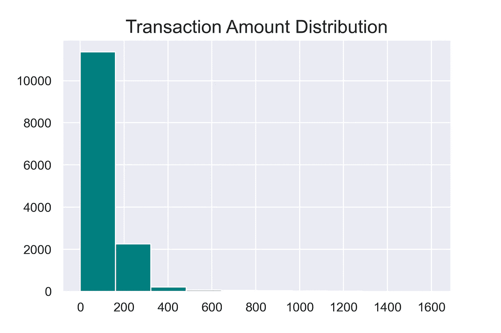

很明显,“交易”列有相当多的异常值，需要进行一些处理。

我们可以去掉上面 3%的数据来解决这个问题。让我们看看会发生什么:

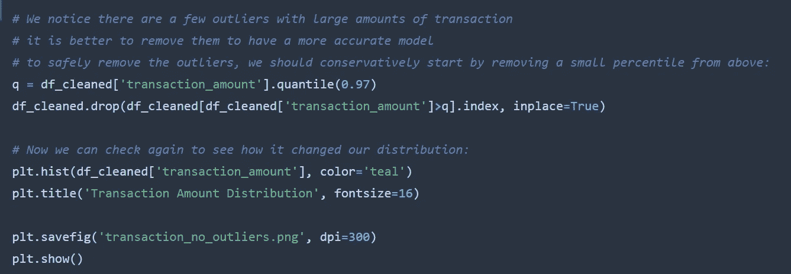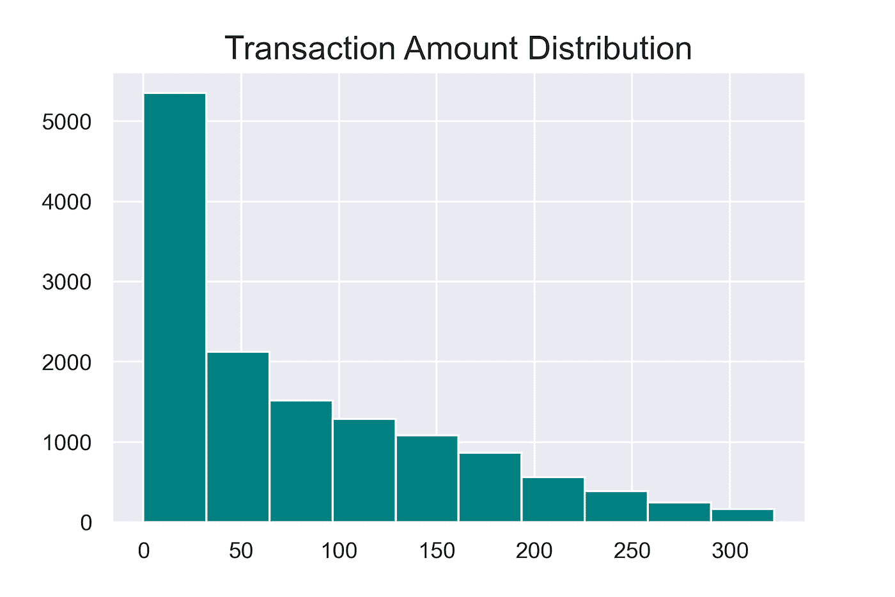

看起来我们已经成功地移除了异常值，我们可以继续了。

这里，重要的是跟踪我们从整个样本集中删除的数据量，并确保我们仍然是安全的。

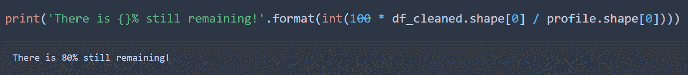

## 拆分数据并训练模型

现在，我们应该选择所有的特征作为输入(除了“person”和“offer completed”之外的所有列)，并将“offer completed”作为目标。

我们还需要将我们的数据分成训练和测试子集，以便我们可以训练和评估我们的模型。

本节最具挑战性的部分是选择最适合的分类器和调整超参数。经过一些试验和错误，我发现“随机森林分类器”是一个合适的选择。

随机森林分类器是一组决策树，每个决策树为一个类投票，然后这些投票将被汇总并决定最终的类。当我们有不同类型的特征时，这个分类器是有用的，如果我们很好地处理超参数，我们可以避免过度拟合问题。

## 拟合模型和调整超参数:

在拟合我们的模型后，我们觉得有必要进行一些调整，因为分数有点太高，我们可能过度拟合了。我在这里选择的方法是使用“GridSearch”进行多重交叉验证。

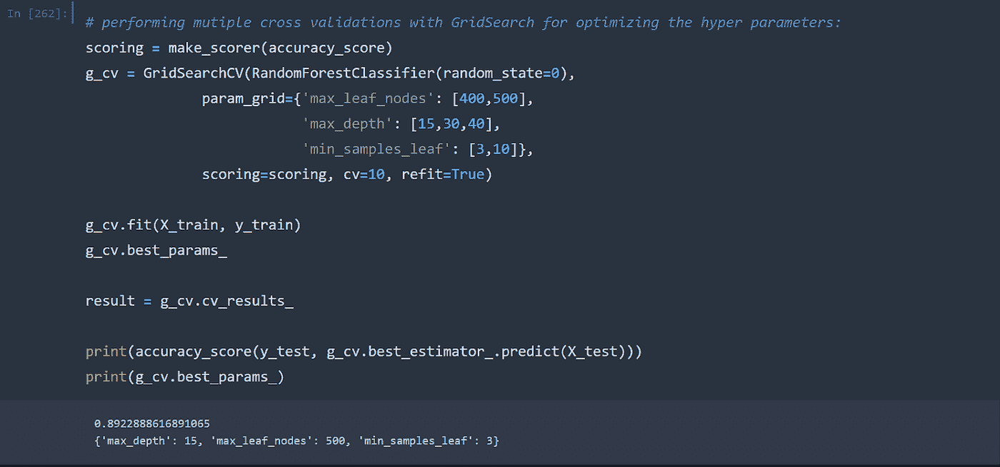

在对 hyper parameters 输入进行了大量的试验和不同的量之后，我得出了一些数字，这些数字在训练集上给了我 0.97 的准确度分数，在测试集上给了我 0.89 的准确度分数。

这是一个完全可以接受的分数，我们可以继续检查该模型的更多结果

## 检查评估指标和混淆矩阵:

由于我们使用的是分类器，因此除了我们的主要指标(即微观和宏观平均的精度/召回分数)之外，我们还需要检查混淆矩阵来评估结果:

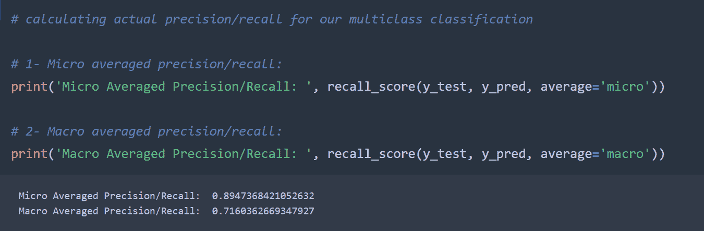

在第一次查看混淆矩阵时，看起来模型在较低的值上表现良好，在较大的值上表现不佳，但这可能是由于较低数量中的大量数据造成的。我们可以通过检查我们的数据来确认这一点。

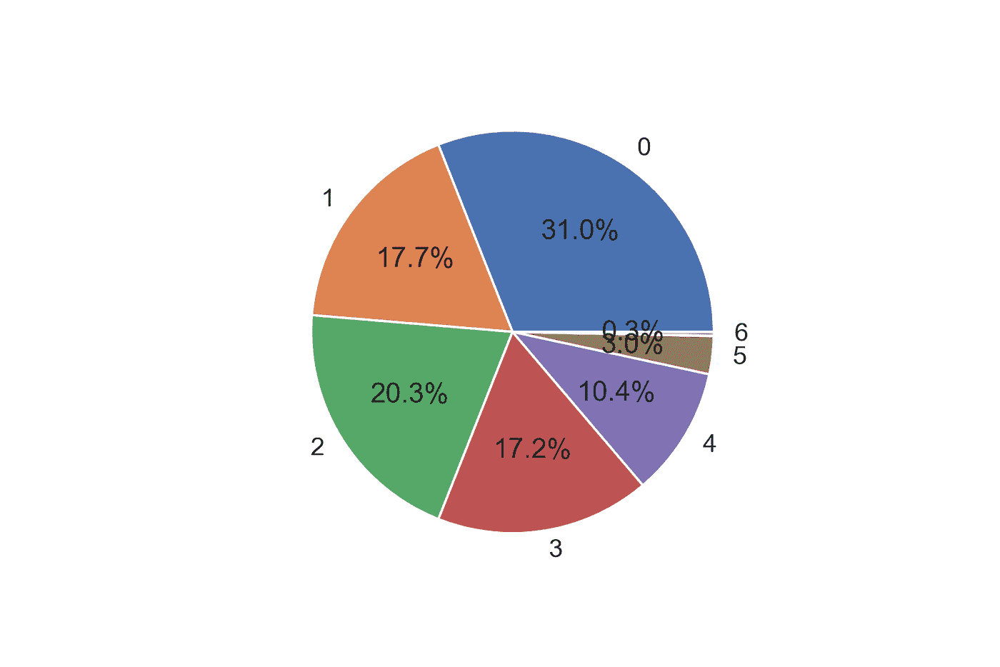

这表明我们的猜测是正确的！分布在较大的值上更集中，在较小的值上更少，但是在较大的值上我们有更多的假阴性和假阳性。这是因为数据较少，因此这方面的培训不够准确。

现在我们可以部署我们的模型以备将来使用，或者在我们的 web 应用程序中使用它。

# 结论

我们分析并处理了来自星巴克的模拟数据集，该数据集模拟了顾客在他们的 rewards 移动应用上的行为。

*   我们预测了每个提议的响应者的人口统计数据，并讨论了原因
*   我们转换了我们的数据集，并基于用户创建了一个完整的数据框架，其中包含我们拥有的每个用户的所有数据
*   我们清理并计算了数据集，为模型训练做准备
*   我们根据我们的数据训练了一个分类器，以预测在给定要约的类型和数量以及他们到达用户的渠道的情况下，每个用户将完成的要约数量
*   我们调整了我们的模型，并用评估指标和混淆矩阵检查了结果
*   我们部署了我们的模型以供进一步使用

绝对有其他方法来提高我们模型的准确性和精确度。其中之一是在我们的交叉验证过程中涉及更多的超参数，并以更高的准确性为目标。

[我的 Github 库](https://github.com/Nemozone/Starbucks-Project)