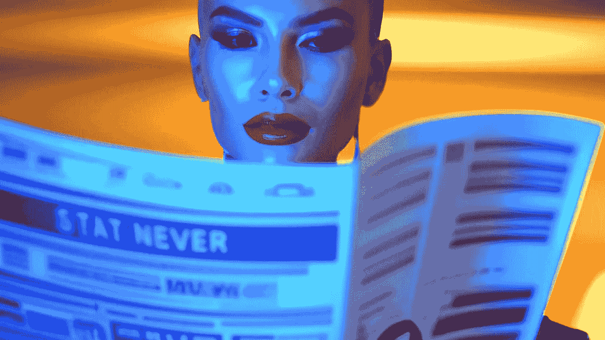

# 人工智能技术的现状

> 原文：<https://medium.com/mlearning-ai/state-of-the-ai-art-5dcf9d6c9d77?source=collection_archive---------3----------------------->

## 【2022 年 9 月

## [你应该知道的 AI 艺术发生器](https://mlearning.substack.com) [ [更新 2023](https://open.substack.com/pub/mlearning/p/state-of-the-ai-art-march-2023-3d-video-text?r=z7zu8&utm_campaign=post&utm_medium=web) ]

the best [AI art generator Is Now Publicly Accessible — Don’t Miss It](https://mlearning.substack.com/p/run-your-private-ai-art-generator?r=z7zu8&s=w&utm_campaign=post&utm_medium=web)

我们从 2020 年的第一期开始发布这份时事通讯

## 🟠 [艺术能为 AI](/mlearning-ai/what-art-can-do-for-ai-623374538d1b) 做些什么？

2022 年的答案:艺术已经把它所有的价值都留在了人工智能未来的祭坛上

> [**我们都成了艺术家**](/mlearning-ai/we-are-all-ai-artists-f4c16c28712c) **多亏了** …