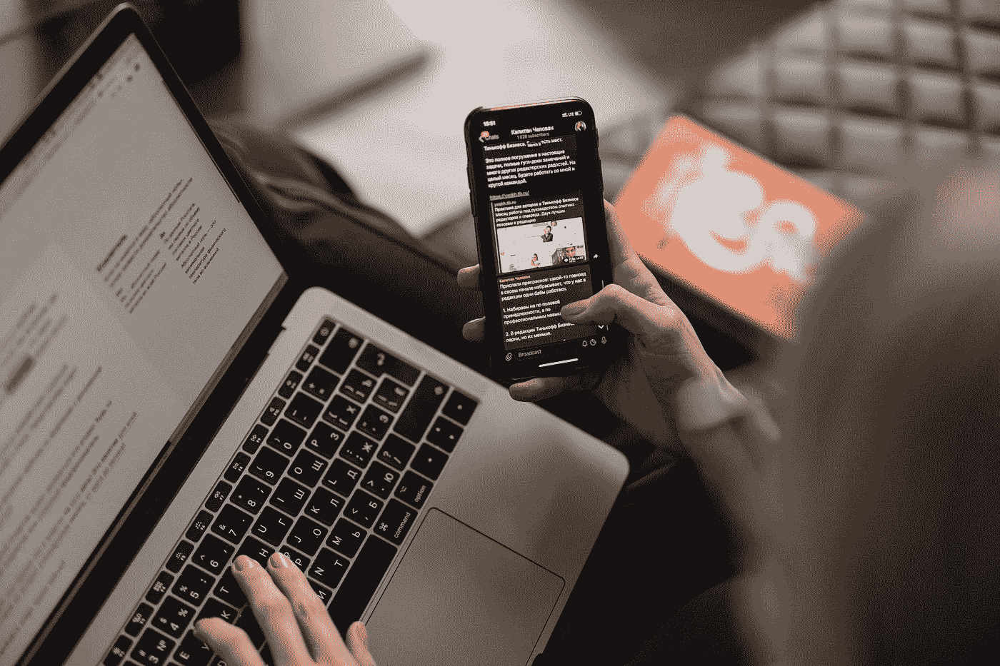
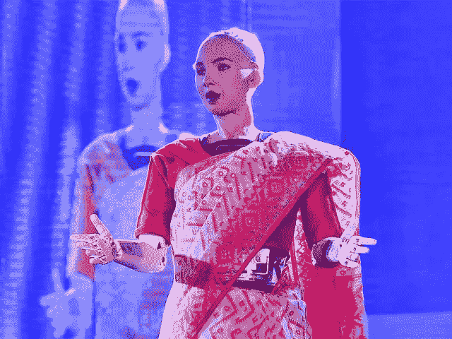

# 与学习 ML 保持一致

> 原文：<https://medium.com/mlearning-ai/stay-consistent-with-learning-ml-11effacad615?source=collection_archive---------5----------------------->

## 你已经不再拖延了！

Photo by [Maxim Ilyahov](https://unsplash.com/@glvrdru?utm_source=medium&utm_medium=referral) on [Unsplash](https://unsplash.com?utm_source=medium&utm_medium=referral)

> 机器学习在过去十年里创造了如此巨大的宣传，以至于没有其他技术创造过。

嗯，我可以清楚地预见到，AI 的时间肯定会比我们想象的要长一些。随着这个领域的发展，竞争也在加剧。

不管个人背景如何，每个人都准备好学习 ML。我认为，这是一件好事**，除非**这个人开始感到害怕，害怕中途离开球场。有几个原因导致这种情况发生，这是很常见的，它确实发生在我身上，导致不断拖延。

这里有几件事帮助我在学习 ML 时保持一致和动力，

# 1.你的动机是什么？

4 年前，在我开始本科学习之前，我一直在尝试新的东西，比如编程、游戏开发，当然还有网页开发。问题是，我无法一次坚持做一件事。我的思想总是围绕着新事物。

Sophia the robot(Image by [Economic Times](https://economictimes.indiatimes.com/news/science/meet-sophia-worlds-first-humanoid-robot-citizen-in-kolkata/worlds-first-robot-citizen/slideshow/74254514.cms))

直到**机器人索菲亚**发布。看到机器人表现得像人一样，我非常着迷。我第一次听到人工智能这个术语，这个术语本身是如此的吸引人，以至于我忍不住想要学习它。虽然那时没有像现在一样的课程，除了吴君如的，但这并没有阻止我学习它。

我可能无法造出像索菲亚一样强大的机器人，但我相信有一天我能做到。这是我的动力，并让我继续学习更多，建立更多。

所以问问自己，**你学习 ML 的动力是什么？**

# 2.提问

> 我过去很害羞，甚至在论坛上也不敢提出疑问。😅

我曾经觉得，人们可能会认为我的怀疑太站不住脚、太笼统或太愚蠢。但那都是我脑子里想的(想多了)。相信我，人们总是忙于考虑自己。

因此，你停止学习，带着你未解决的疑问，永远不会前进。
这里有几个论坛，我认为你可以在那里发表你的疑问，不管你认为它们有多傻，但人们会很友好地为你回答它们，
-[https://community.wandb.ai/](https://community.wandb.ai/)
-[https://datascience.stackexchange.com/](https://datascience.stackexchange.com/)
(在你发表之前，确保检查你的问题是否已经被其他人回答过)
-[https://www.kaggle.com/discussion](https://www.kaggle.com/discussion)

# 3.奖励自己一个项目

> 好吧，你学了一个新算法，但是现在呢？是时候实施了。

学完一个算法实现起来更有乐趣。不仅仅是算法，而是利用它来执行某项任务。为什么好玩？因为，那是你学它的目的，对吗？
你现在完全能够实现你所学的任何算法来执行给定的任务。
它确实比你想象的更有价值。✨
参加黑客马拉松或 OSS(开源软件)项目来测试你的能力。这里有几个你绝对应该尝试的黑客马拉松和 OSS 项目，首先是
，
-[GSSoC](https://gssoc.girlscript.tech/)
-[GWoC](https://gwoc.girlscript.tech/)
-[SWoC](https://swoc.scriptindia.org/#/)
-[MLH](http://fellowship.mlh.io)
-[GSoC](http://summerofcode.withgoogle.com)
上面列出的是一些你绝对应该参与的 OSS 项目。你最终会学到很多东西！

- [机器黑客](https://machinehack.com/hackathon)
-[Kaggle](http://Kaggle.com)
-[Analytics vid hya](https://datahack.analyticsvidhya.com/)
以上是一些进行黑客马拉松相当频繁的社区。这些黑客马拉松总有相关的讨论组，欢迎提问。

继续寻找和从事独特的项目，并*发布它们*，这是我们接下来要讨论的！

# 4.公开学习🔥

> 就像我说的，我是一个非常害羞的人，这个任务也令人生畏。😂(不过不用担心，不是的。)

不管你的工作是大是小，都要谈论它。一定要分享。我的意思不是在 Instagram 上分享迷因。不要！
在 [Medium](/) 、 [WandB](https://community.wandb.ai/) 、 [Dev](http://dev.to) 等社区平台上发布你的作品

关于你的帖子，确保它符合以下类别中的任何一个，
-一个 ML 问题的获奖黑客马拉松解决方案
-一个东西的简洁实现
-一个你发现有用的新技术
-一个你喜欢谈论的新研究
-最后，帮助你帮助社区的提示/技术。(就像这个一样😉)

*这样做，会让你成为社区中的积极成员，并为你打开无数机会之门。*🤩🤩

# 结论

因此，这几件事帮助我无论做什么都保持一致。希望它们也能帮助你。请在下面的评论中分享你的想法，我很乐意听到它们。

最重要的是，

> 不要着急，一步一步来😉

可以在这里联系我，
-[Linkedin](http://linkedin.com/in/adityanikhil)
-[Github](http://github.com/adityanikhil)
-[中型](/@cracksunday.com)
- [投资组合](https://adityanikhil.github.io/main/)

 [## Mlearning.ai 提交建议

### 如何成为 Mlearning.ai 上的作家

medium.com](/mlearning-ai/mlearning-ai-submission-suggestions-b51e2b130bfb)