# 卒中预测:Julia 的逻辑回归分析🚑

> 原文：<https://medium.com/mlearning-ai/stroke-prediction-logistic-regression-with-julia-523f90eb5ae?source=collection_archive---------3----------------------->


Photo by DS stories: [https://www.pexels.com/photo/photograph-of-pink-brains-on-a-blue-surface-9228390/](https://www.pexels.com/photo/photograph-of-pink-brains-on-a-blue-surface-9228390/)

本文旨在用*茱莉亚语言*展示如何使用*逻辑回归*预测中风。

我选择了来自 Kaggle 的[中风预测数据集](https://www.kaggle.com/fedesoriano/stroke-prediction-dataset)。

那么，我们会在这里看到什么？

*   数据导入
*   不适用，用平均值代替
*   字符串到浮点 64 转换
*   删除列
*   标签编码
*   Smote 技术平衡我们的数据
*   训练/测试分割
*   逻辑回归模型
*   混淆矩阵
*   ❗Bonus:如何处理朱丽亚·❗️的一个具体错误

首先，我**导入必要的包:**

```
using Pkg
using DataFrames
using CSV
using StatsBase
using GLM
using Lathe
using MLBase
using ClassImbalance
using ScikitLearn
```

我想**启用 1000 列**的打印，这样我就可以看到数据框的所有列:

```
ENV["COLUMNS"] = 1000
```

让我们**加载数据并打印数据帧的前 5 行**:

```
df=CSV.read("C:\\Users\\olgak\\Documents\\df.csv", DataFrame)#write your own path
first(df,5)
```

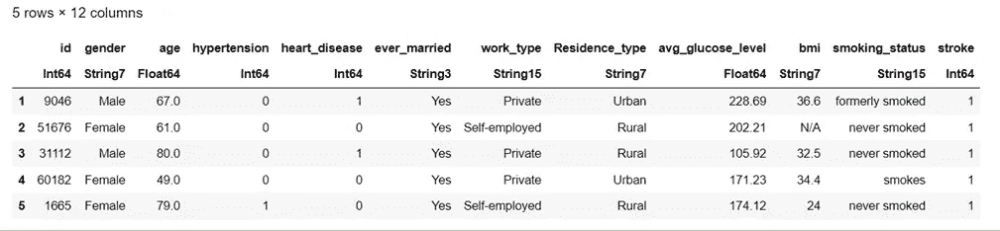

要查看**变量的名称:**

```
names(df)
```

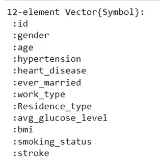

如我们所见，我们有 12 个变量。

检查**变量的类型:**

```
eltype.(eachcol(df))
```

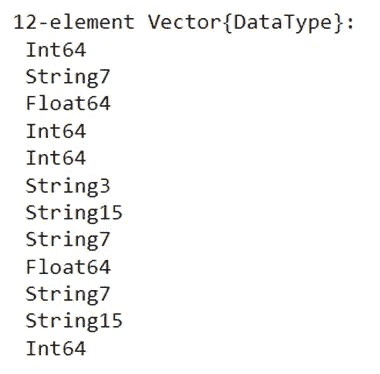

bmi 是字符串变量吗？不，它是一个浮点数 64，因为 bmi 是一个数字(连续变量)。

我们是否有任何**缺失值**？

```
[count(ismissing,col) for col in eachcol(df)]
```

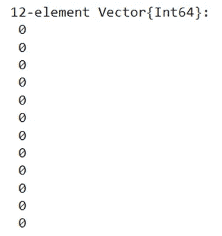

我们没有像“缺失”或空单元格这样的缺失值，但我们在 bmi 变量的某些单元格中有 N/A。N/A 也是我们的 bmi 变量是字符串的原因。

我们的目的是移除 N/A 值并将 bmi 变量转换为 Float64。(如果我们不把 bmi 转换成 Float64，我们就有问题了。)

我选择用 0 代替 N/A(BMI 仍然是字符串)。N/A 是一个字符，所以我们也选择写 0 作为一个字符。

```
bmi=replace(df.bmi, "N/A" => "0")
```

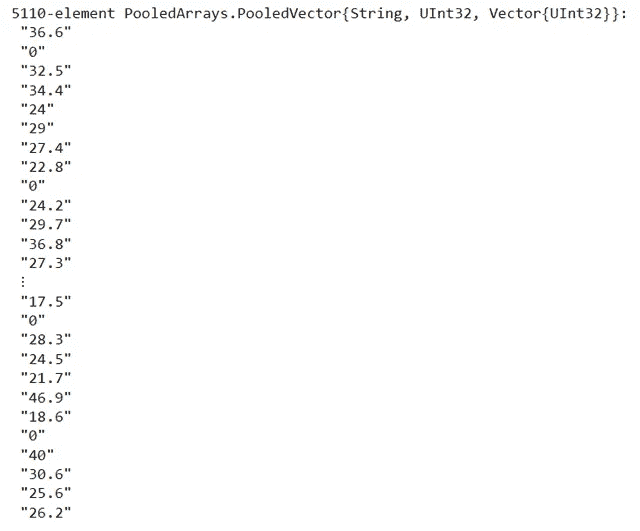

我们到处都有数字，所以我们可以简单地将所有这些数字转换成浮点 T21，没有任何问题。

```
df.bmi=parse.(Float64, bmi)
```

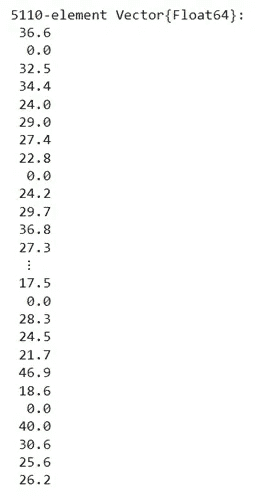

我们将 bmi 转换为 Float64，但是对于零值我们需要做什么呢？删除它们(结果我们删除了数据，留下的数据更少)？

我更喜欢用 bmi 的平均值代替零值(缺失数据)。

请注意，如果我们按原样计算 bmi 的平均值，我们将得到错误的结果，因为我们的 bmi 值为 0。bmi 为 0 并不是一个真实值。

因此，我们需要删除零值，计算平均值，最后，用我们找到的平均值替换零值。

我创建了一个名为“nm”的新变量(我不想破坏我新的漂亮的 bmi 变量😎).此变量不包含零值。

```
nm=deleteat!(bmi, findall(bmi->bmi==0.0,df.bmi))
```

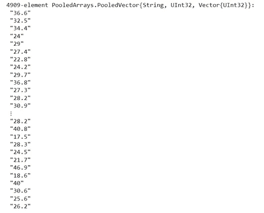

我不能计算字符串变量的平均值。

我再次创建了一个新变量(与 Float64 相同):

```
nmm=parse.(Float64, nm)
```

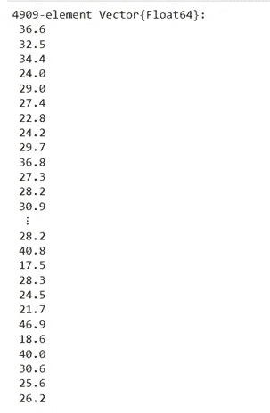

此外，我创建了包含平均值的变量:

```
m=mean(nmm)
```

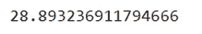

bmi 变量保持不变(Float64 用零值代替 N/A)。让我们确认一下:

```
df
```

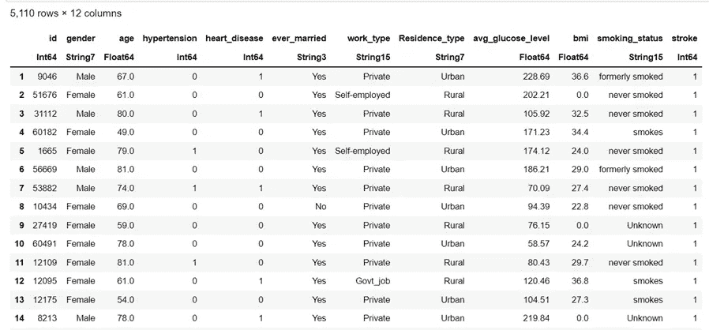

现在，我将**用平均值代替零:**

```
df.bmi=replace(df.bmi, 0.0 => m)
```

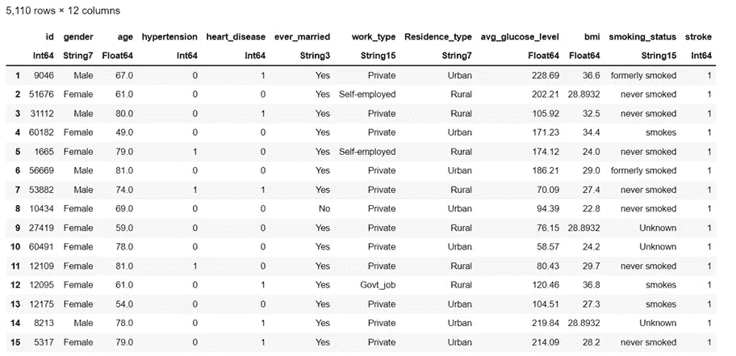

准备好了。

是时候对我们的分类变量应用标签编码器了。

我想将**标签编码器**应用于以下各列:

2(性别)、6(曾经结过婚)、7(工作类型)、8(居住类型)、11(吸烟状况)

```
[@sk_import](http://twitter.com/sk_import) preprocessing: LabelEncoderlabelencoder = LabelEncoder() 
categories = [2 6 7 8 11] 
for col in categories 
     df[col] = fit_transform!(labelencoder, df[col]) 
end
```

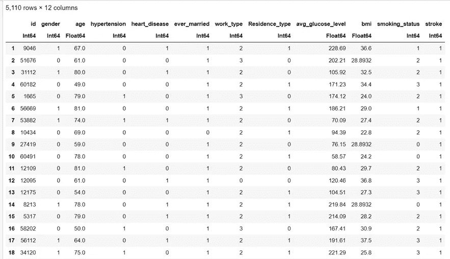

但是，我们需要 id **列**吗？不。让我们把**删掉**吧！

```
deletecols!(df, 1)
```

此外，我将**检查不平衡:**

```
countmap(df.stroke)
```

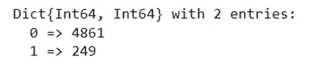

我们有不平衡的数据，我们需要处理它。

我们将使用 **smote** 技术来处理职业不平衡。

```
X2, y2 =smote(df[!,[:gender,:age ,:hypertension, :heart_disease, :ever_married, :work_type, :Residence_type, :avg_glucose_level, :bmi , :smoking_status]], df.stroke, k = 5, pct_under = 150, pct_over = 200)df_balanced = X2df_balanced.stroke = y2
```

让我们看看我们的平衡数据:

```
df = df_balanced
```

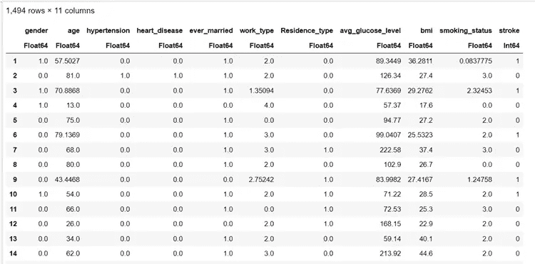

再次计算类别:

```
countmap(df.stroke)
```

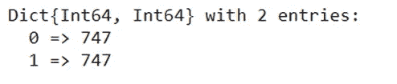

我们现在没事了！

让我们将**拆分为**进行训练和测试:

```
using Lathe.preprocess: TrainTestSplit
train, test = TrainTestSplit(df,.70)
```

并训练**逻辑回归模型:**

```
fm = [@formula](http://twitter.com/formula)(stroke ~ gender+age+hypertension+heart_disease+ever_married+work_type+Residence_type+avg_glucose_level+bmi+smoking_status)logit = glm(fm, train, Binomial(), ProbitLink())
```

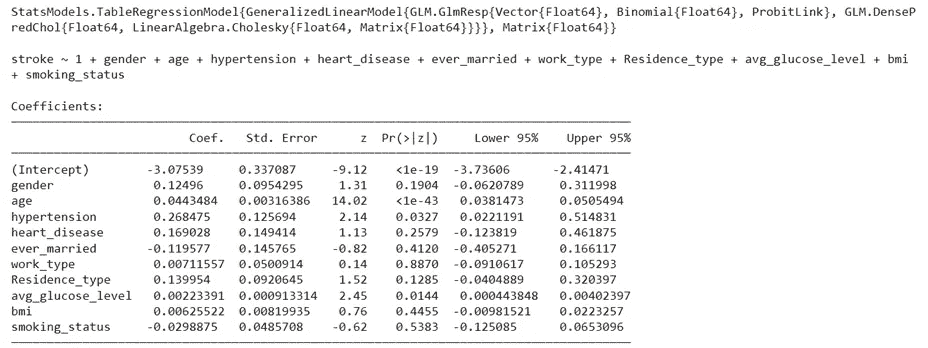

```
using MLBase: predict #look at the end of the article if you want to avoid headacheprediction=predict(logit,test)
```

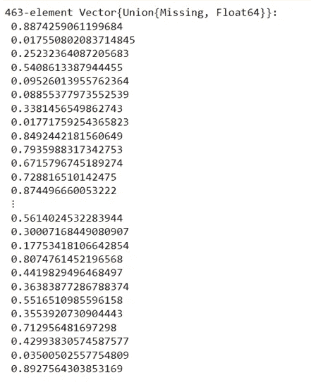

我们将**将概率分数转换为类:**

```
prediction_class = [if x < 0.5 0 else 1 end for x in prediction]prediction_df = DataFrame(y_actual = test.stroke, y_predicted = prediction_class, prob_predicted = prediction)prediction_df.correctly_classified = prediction_df.y_actual .== prediction_df.y_predicted
```

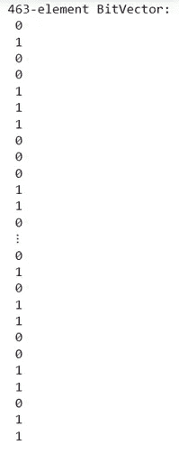

还有……我们的**准确率得分**？

```
accuracy = mean(prediction_df.correctly_classified)
print("Accuracy of the model is : ",accuracy)
```

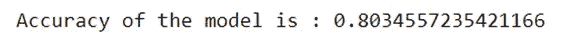

还不错！

最后，让我们创建**混淆矩阵:**

```
confusion_matrix = MLBase.roc(prediction_df.y_actual, prediction_df.y_predicted)
```

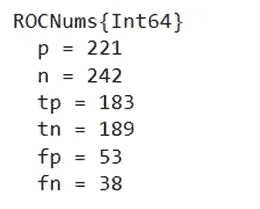

❗️It's 写下了极其重要的代码:

```
using MLBase: predict
```

如果你不写这个，你可能要处理这个错误:

```
UndefVarError: predict not defined
```

这是因为我们加载了另一个导出预测的包(在我们的例子中是 GLM 包),它与 MLBase 的预测相冲突。所以我们需要指定从哪里使用 predict。

查看我的笔记本[这里](https://github.com/OlgaEle/My_Notebooks/blob/main/Julia/JuliaStrokePredictionLogisticRegression.ipynb)。

**收尾**

在本文中，我们看到了如何在 Julia 中训练逻辑回归模型！

当然，我们的分析还可以更好。

敬请关注更新！

感谢您的阅读！🤗

[](/mlearning-ai/mlearning-ai-submission-suggestions-b51e2b130bfb) [## Mlearning.ai 提交建议

### 如何成为 Mlearning.ai 上的作家

medium.com](/mlearning-ai/mlearning-ai-submission-suggestions-b51e2b130bfb)