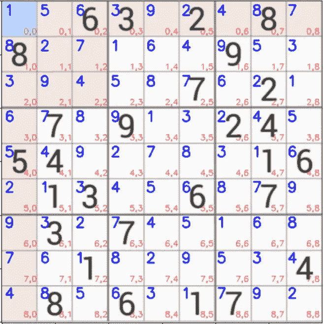
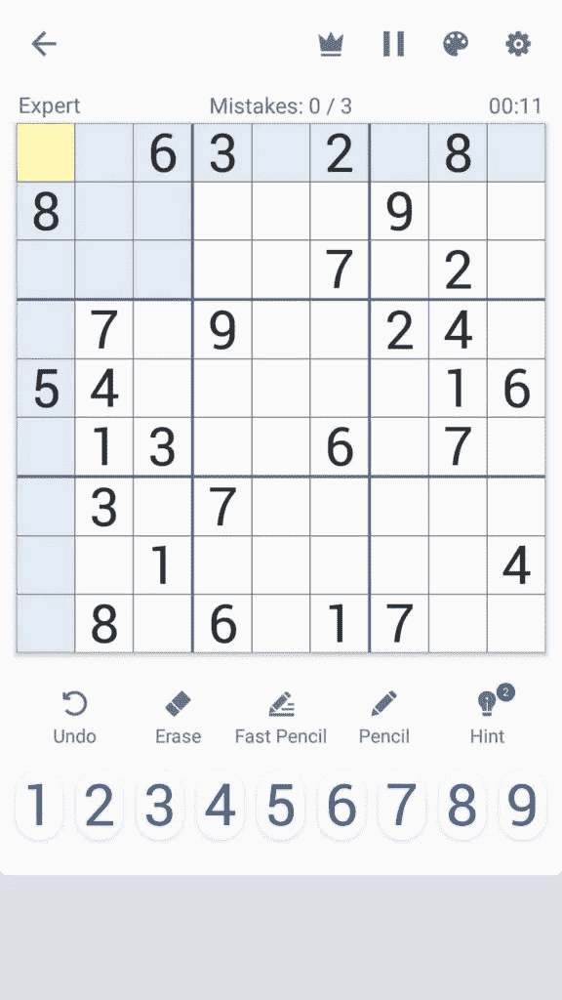
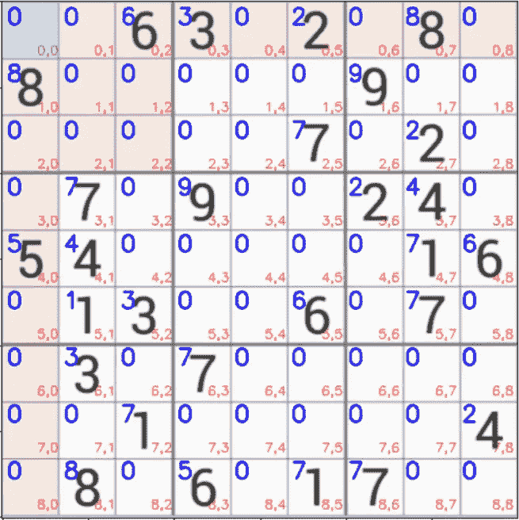
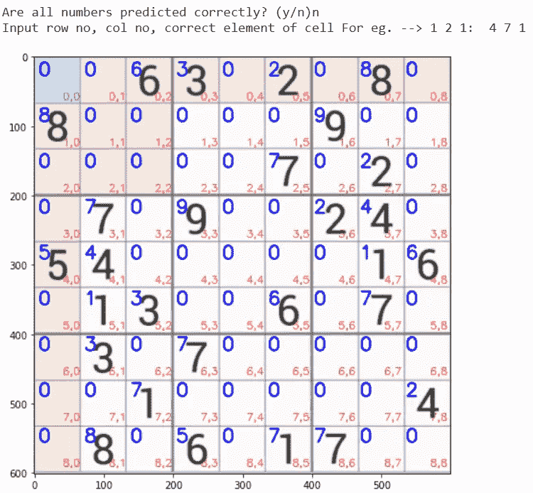

# 数独求解器-带源代码-有趣的项目-最简单的方法

> 原文：<https://medium.com/mlearning-ai/sudoku-solver-with-source-code-fun-project-easiest-way-40c46ad4bc09?source=collection_archive---------2----------------------->

所以，伙计们，在今天的博客中，我们将看到如何使用计算机视觉和图像处理技术实现数独求解器。所以没有任何进一步的原因。

**点击此处阅读带源代码的整篇文章—**【https://machinelearningprojects.net/sudoku-solver/ 



SUDOKU SOLVER

# 让我们开始吧…

## 数独求解器的代码…

```
import cv2
import imutils
from imutils.perspective import four_point_transform
from skimage.segmentation import clear_border
from tensorflow.keras.models import load_model
import numpy as np
from Sudoku import solveSudoku
from tensorflow.keras.preprocessing.image import img_to_array
import matplotlib.pyplot as plt

# Sudoku Solver
model = load_model('model/model_mnist/')
img_path = 'sudoku images/6.png'
img_shape = [28,28]

def find_puzzle(img):
    real = img.copy()
    gray = cv2.cvtColor(img,cv2.COLOR_BGR2GRAY)
    blur = cv2.GaussianBlur(gray,(7,7),1)

    thresh = cv2.adaptiveThreshold(blur,255,cv2.ADAPTIVE_THRESH_GAUSSIAN_C,cv2.THRESH_BINARY,11,2)
    thresh = cv2.bitwise_not(thresh)

    cnts = cv2.findContours(thresh.copy(),cv2.RETR_EXTERNAL,cv2.CHAIN_APPROX_SIMPLE)
    cnts = imutils.grab_contours(cnts)
    cnts = sorted(cnts,key=cv2.contourArea,reverse=True)

    puzzle_cnt = None

    for c in cnts:
        peri = cv2.arcLength(c,True)
        approx = cv2.approxPolyDP(c,0.02*peri,True)
        if len(approx)==4:
            puzzle_cnt=approx
            break

    if puzzle_cnt is None:
        raise Exception(("Could not find Sudoku puzzle outline.Try debugging your thresholding and contour steps."))

    cv2.drawContours(real, [puzzle_cnt], -1, (0, 255, 0), 2)

    puzzle = four_point_transform(img, puzzle_cnt.reshape(4, 2))
    warped = four_point_transform(gray, puzzle_cnt.reshape(4, 2))

    return puzzle,warped

def extract_digit(cell):
    thresh = cv2.threshold(cell,0,255,cv2.THRESH_BINARY_INV|cv2.THRESH_OTSU)[1]
    thresh = clear_border(thresh) #just clear the extra white pixels along the border

    cnts = cv2.findContours(thresh.copy(), cv2.RETR_EXTERNAL,cv2.CHAIN_APPROX_SIMPLE)
    cnts = imutils.grab_contours(cnts)

    # if no contours were found than this is an empty cell
    if len(cnts) == 0:return None

    # otherwise, find the largest contour in the cell and create a mask for the contour
    c = max(cnts, key=cv2.contourArea)
    mask = np.zeros(thresh.shape, dtype="uint8")
    cv2.drawContours(mask, [c], -1, 255, -1)

    (h, w) = thresh.shape
    percentFilled = cv2.countNonZero(mask) / float(w * h)

    # if less than 3% of the mask is filled then we are looking at noise and can safely ignore the contour
    if percentFilled < 0.03:return None

    # apply the mask to the thresholded cell
    digit = cv2.bitwise_and(thresh, thresh, mask=mask)
    kernel = np.ones((1,1),np.uint8)
    digit = cv2.dilate(digit,kernel,iterations=1)

    # return the digit to the calling function
    return digit

def display_numbers_on_board(board,puzzle):
    x = puzzle.copy()
    k = 0
    for i in range(9):
        for j in range(9):
            startX,startY,endX,endY = cell_locs[k]
            testX = int((endX - startX) * 0.33)
            testY = int((endY - startY) * -0.2)
            testX += startX
            testY += endY
            cv2.putText(x,str(board[i][j]),(testX,testY),cv2.FONT_HERSHEY_SIMPLEX,0.9,(0,0,255),2)
            k+=1
    plt.figure(figsize=(10,8))
    plt.imshow(x)
    plt.xticks([])
    plt.yticks([])
    plt.show()
    return x

img = cv2.imread(img_path)
img = imutils.resize(img,width=600)

puzzle,warped = find_puzzle(img)
puzzle = imutils.resize(puzzle,width=600)
warped = imutils.resize(warped,width=600)

step_x = warped.shape[1]//9
step_y = warped.shape[0]//9

board = np.zeros(shape=(9,9),dtype='int')
cell_locs = []

for i in range(9):
    for j in range(9):
        topleftx = j*step_x
        toplefty = i*step_y
        rightendx= (j+1)*step_x
        rightendy = (i+1)*step_y
        cell = warped[toplefty:rightendy, topleftx:rightendx]
        digit = extract_digit(cell)
        if digit is not None:
            roi = cv2.resize(digit,tuple(img_shape))
            roi = roi.astype('float')/255.0
            roi = img_to_array(roi)
            roi = np.expand_dims(roi,axis=0)
            pred = model.predict(roi).argmax(axis=1)[0]
            board[i,j] = pred
        cell_locs.append([topleftx,toplefty,rightendx,rightendy])

_=display_numbers_on_board(board,puzzle)

while 1:
    res = input('Are all numbers predicted correctly? (y/n)')
    if res=='n':
        cx,cy,ele = input('Input row no, col no, correct element of cell For eg. --> 1 2 1:  ').split()
        try:
            board[int(cx),int(cy)] = int(ele)
        except:
            print('out of range...')
        _ = display_numbers_on_board(board,puzzle)
    elif res=='y':
        break
    else:
        print('Wrong choice!!!')

solved = solveSudoku(board)

x = display_numbers_on_board(board,puzzle)
cv2.imshow('solved',x)

cv2.waitKey(0)
cv2.destroyAllWindows()
```

*   第 1–10 行-导入数独求解器所需的库。
*   第 12–14 行—加载 mnist 模型和数独图像。还要声明一个常量 img_shape，它将是调整大小后数独图像的大小。



*   第 16–45 行—该函数将通过图像处理技术找到图像中的谜题。
*   读取图像，将其转换为灰度，然后应用[高斯模糊](https://en.wikipedia.org/wiki/Gaussian_blur#:~:text=In%20image%20processing%2C%20a%20Gaussian,image%20noise%20and%20reduce%20detail.)去除高斯噪声。
*   阈值的图像，并将其逆转。意味着将白色转换为黑色，将黑色转换为白色。
*   然后找到轮廓，提取图像中最大的轮廓。这大概就是我们的数独吧。
*   应用[四点变换](https://www.pyimagesearch.com/2014/08/25/4-point-opencv-getperspective-transform-example/)获得拼图的直视图并返回。
*   第 49–77 行——该函数将从难题中提取数字单元格并返回它，以便 mnist 模型可以识别其中的数字。
*   第 80–97 行—该功能将简单地把数字放在图像/板上。
*   第 99–100 行—只需读取图像并调整其大小。
*   第 102–104 行——提取拼图并调整大小。
*   第 106–107 行——这将告诉我们在 x 和 y 方向必须采取的步长。这一步基本上就是分别在 x 和 y 方向上的单元格大小。
*   第 109 行—创建电路板，所有值都用 0 初始化。
*   第 110 行—创建数组 *cell_locs* ，它将包含单元位置/坐标。
*   第 112–127 行—遍历 9*9 循环，其中第一个 9 代表电路板的 9 行，第二个 9 代表电路板的 9 列。遍历时，它将提取单元格图像，使用 mnist 预测数字，并将该数字放入我们在第 109 行创建的板数组中。此外，我们将继续在 cell_loc 数组中存储单元格位置。
*   第 133–145 行——如果 mnist 偶然错误地预测了任何数字，请纠正它。



**注意—蓝色数字是该单元格的预测数字。红色文本是该单元格的地址。如果任何数字被 mnist 错误地分类，纠正它。比如第一个错误的分类编号在(4，7)。原来的数字是 1，但 mnist 说是 7，所以我们将首先纠正它。**



*   第 147 行—使用我们从 ***Sudoku.py*** 导入的 solveSudoku 函数求解数独。这个 ***Sudoku.py*** 也是我写的，我用回溯来解数独。
*   第 149–150 行—在最终图像上显示解出的数独数字并显示出来。
*   第 152–153 行—破坏所有窗口。

# 数独求解器的最终结果…


SUDOKU SOLVER

如果有任何关于数独求解器的疑问，请通过电子邮件或 LinkedIn 联系我。你也可以在下面评论任何问题。

***探索更多机器学习、深度学习、计算机视觉、NLP、Flask 项目访问我的博客—*** [***机器学习项目***](https://machinelearningprojects.net/)

**如需进一步的代码解释和源代码，请访问此处—**[https://machinelearningprojects.net/sudoku-solver/](https://machinelearningprojects.net/sudoku-solver/)

这就是我写给这个博客的全部内容，感谢你的阅读，我希望你在阅读完这篇文章后会有所收获，直到下次👋…

***看我以前的帖子:*** [***人体分割使用 U-NET***](https://machinelearningprojects.net/human-segmentation-using-u-net/)

[](/mlearning-ai/mlearning-ai-submission-suggestions-b51e2b130bfb) [## Mlearning.ai 提交建议

### 如何成为 Mlearning.ai 上的作家

medium.com](/mlearning-ai/mlearning-ai-submission-suggestions-b51e2b130bfb)