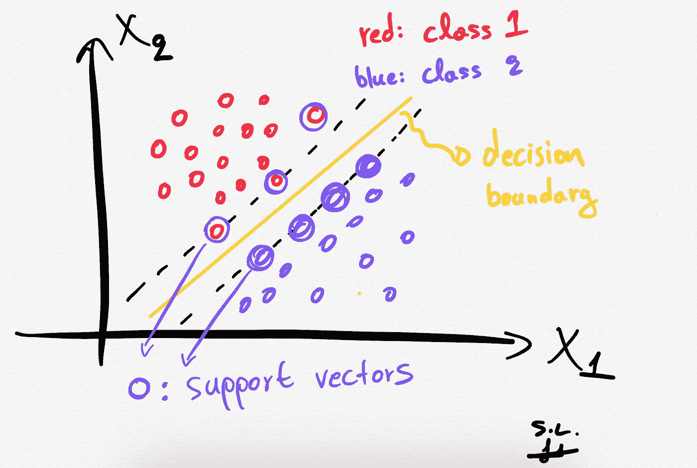

# 支持向量机(SVM)清楚地解释:一个 python 教程的分类问题与三维绘图

> 原文：<https://medium.com/mlearning-ai/support-vector-machines-svm-clearly-explained-a-python-tutorial-for-classification-problems-with-f373a3b439ab?source=collection_archive---------0----------------------->

## 在这篇文章中，我解释了支持向量机的核心，为什么以及如何使用它们。此外，我还展示了如何在 2D 和 3D 中绘制支持向量和决策边界。

**Handmade** sketch made by the **author**. An SVM illustration.