# 将您的餐桌视觉色标提升到一个新的高度(包括无障碍替代方案)

> 原文：<https://medium.com/mlearning-ai/take-your-table-visual-colour-coding-to-the-next-level-with-accessibility-in-mind-15a9f76e7961?source=collection_archive---------3----------------------->

Power BI 中表格视觉效果的条件格式非常好。它允许美国数据分析师快速引导用户找到最相关的数字，并快速评估性能。

例如，一个项目的实际支出和预算支出用绿色表示可能意味着你的支出比预期的少；相反，红色意味着你花费太多。在其他情况下，你甚至可以使用图标来通知用户:❌代表你落后于截止日期，⚠代表你接近截止日期，✔代表已经完成/正在进行的任务。

今天，我想向您展示条件格式的另一种用法，让用户知道他们应该更多地关注哪些数据点。

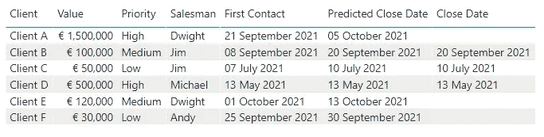

Original table visual

在这个例子中，我将使用一个客户表。这样做的目的是突出显示交易尚未结束的客户，同时考虑他们的优先级和结束日期，如下所示:

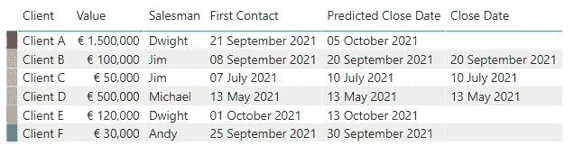

Table visual with colour-coding column

我没有使用之前提到的技术，比如文本格式化或者使用图标，而是在代码客户端的开始添加了一个细的彩色栏。灰色客户端已关闭，红色为高优先级，橙色为中优先级，绿色为低优先级。此外，请注意这个细栏是如何消除了保留优先级栏的需要，从而缩短了视觉效果的宽度。

这是通过新列上的两个度量和条件格式实现的。第一个度量是一个占位符，用于显示列中的值:

```
Placeholder Column = 0
```

*占位符列*为所有数据点返回零。想法是让所有数据点都有任何数据，但要尽可能少地占用空间，这样列可以很细，而不会因为换行而增加行高。

第二个衡量标准是基于两个规则选择颜色:客户优先级，以及客户是否已经关闭，即它有一个关闭日期。

```
Client Cond Format =
VAR _Priority = SELECTEDVALUE( Clients[ Priority] )
VAR _CloseDate = SELECTEDVALUE( Clients[ Close Date] )
VAR _IsClosed = _CloseDate <> BLANK()RETURN SWITCH(
    TRUE(),
    _IsClosed = TRUE(), "#b2b2b2",
    _Priority = "Low", "#3bc734",
    _Priority = "Medium", "#e3a83b",
    _Priority = "High", "#c72828"
)
```

首先，我基于优先级和结束日期定义了三个变量来促进切换情况下的条件。然后，该度量将返回十六进制颜色字符串:灰色表示关闭的客户端，绿色表示低优先级，橙色表示中优先级，红色表示高优先级。这个想法是，灰色会吸引用户较少的注意力，因为它属于封闭的客户端，所以他们可以根据开放客户端的优先级来分散他们的注意力。

因此，有了这两个度量，我将*占位符列*添加到表格视图中，并删除了优先级。此时，该列只显示零，并且有一个包含空白的流氓行。

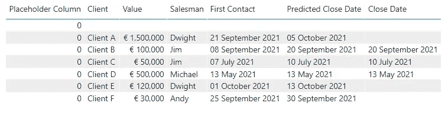

Placeholder column result

第一件事是添加一个可视级别的过滤器以不显示空白客户端，并将占位符列重命名为一个点(。).

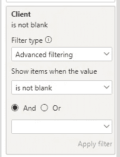

Remove rows without Client name

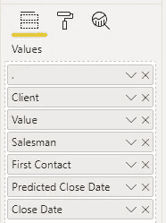

Double click on Placeholder Column and rename it to a dot

哦，要完全“隐藏”新列的名称，请使用字段格式选项。条件格式将覆盖字段格式，但不会影响标题。

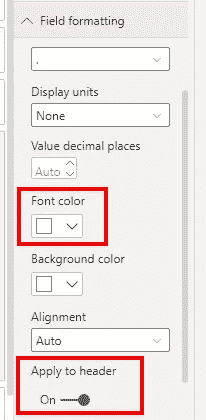

“Hide” column header

现在，要着色的列已经就位，它缺少条件格式规则。

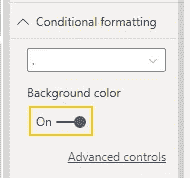

Conditional formatting for the coloured column

在高级控件中


Conditional formatting rules for background colour

规则是使用我之前展示的*客户端 Cond 格式*度量。度量本身决定了哪种颜色应该用作背景色。

不要忘了对字体颜色重复这个规则，这样*占位符列*测量的零使用与完美伪装的背景相同的颜色。


Finalised table visual with coloured column

您甚至可以添加一个在切片器中使用的计算列，以便用户可以隐藏已关闭的客户端，即灰色行。

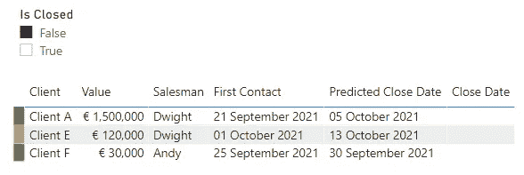

Slicer to hide closed clients

现在德怀特知道他应该优先考虑客户 A(如果他不知道已经基于他们的价值！).

这就是第一个版本。这个彩色编码栏的唯一问题是可访问性，而不是缺乏可访问性。不同的颜色对色盲用户来说毫无意义。这可以用形状而不是颜色来减弱。

在使用图标的情况下，您可以重写度量以返回一个数字而不是一种颜色。然后，编辑条件格式规则，根据返回的数字使用不同的图标。

```
Client Cond Format (Accessible) =
VAR _Priority = SELECTEDVALUE( Clients[ Priority] )
VAR _CloseDate = SELECTEDVALUE( Clients[ Close Date] )
VAR _IsClosed = _CloseDate <> BLANK()RETURN SWITCH(
    TRUE(),
    _IsClosed = TRUE(), -1,
    _Priority = "Low", 1,
    _Priority = "Medium", 2,
    _Priority = "High", 3
)
```

现在，条件格式规则将如下所示:

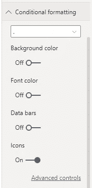

Conditional formatting rules for icons (1)

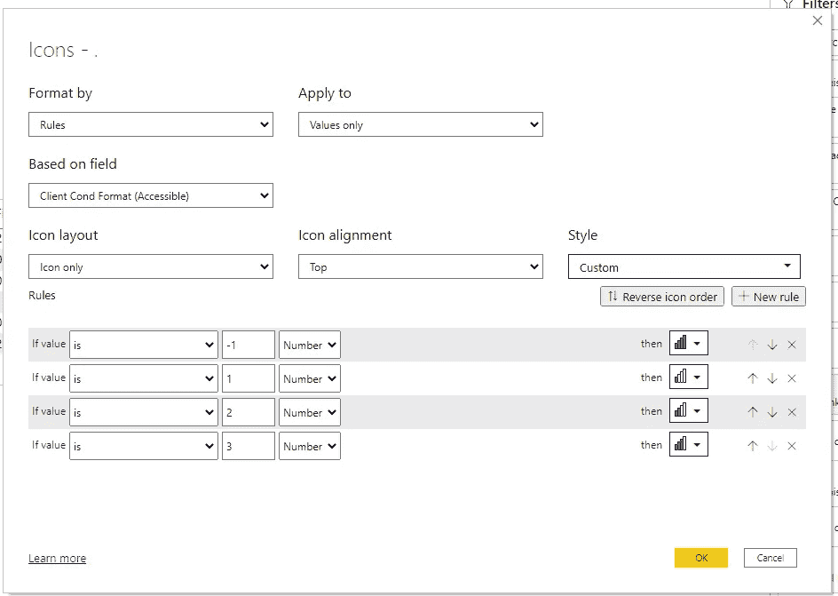

Conditional formatting rules for icons (2)

注意:Power BI 中的默认图标集可能不是这个特定场景的最佳选择:(如果你想使用自定义图标，看看[这个线程](https://community.powerbi.com/t5/Desktop/How-to-add-Custom-icons-for-conditional-formatting/td-p/1254808)。

和修改后的视觉效果:

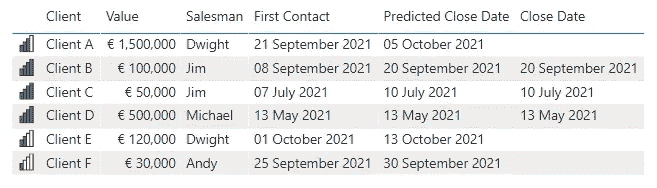

Revised table visual

优先级由图标中实心条的数量表示，而不是颜色，其中实心图标表示关闭的客户。这样，即使用户不能区分颜色，他们仍然可以根据图标的形状来区分他们正在查看的客户端类型！

最后，这里有三个表格可以直接对比。

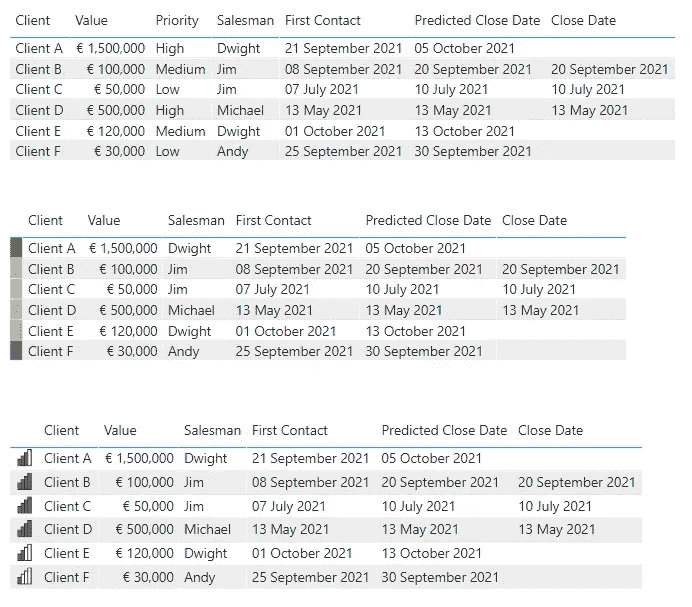

Comparison of table visuals

附:如果你在找。pbix 文件来使用这些表，它们可以在我的 GitHub 存储库中找到。