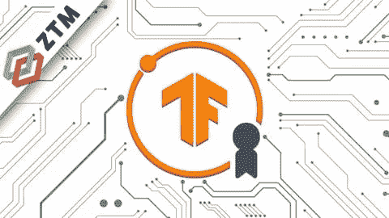

# “2022 年 TensorFlow 开发者证书”——又一个很棒的课程？

> 原文：<https://medium.com/mlearning-ai/tensorflow-developer-certificate-in-2022-another-great-course-2db4272c0ed9?source=collection_archive---------9----------------------->

[Course thumbnail](https://www.udemy.com/course/tensorflow-developer-certificate-machine-learning-zero-to-mastery/)

作为我上一篇关于[零到精通的机器学习&数据科学训练营](/mlearning-ai/zero-to-masterys-machine-learning-data-science-course-the-best-course-22ae7edf4935)的文章的后续，我也考虑过复习这门课程。事实上，当我决定购买数据科学训练营时，我也参加了 TensorFlow 课程，因为我不知道它是干什么的，但我多次听到这个名字，我想尝试一下。

 [## 零到精通的“机器学习&数据科学”课程——最好的课程？

### 丹尼尔·布克做的这个课程值得吗？诚实的评论

medium.com](/mlearning-ai/zero-to-masterys-machine-learning-data-science-course-the-best-course-22ae7edf4935) 

事实上，这是个好主意。首先，因为 Tensorflow 是与 Pytorch 一起使用最多的通用深度学习库之一，还因为 TensorFlow 开发者证书是启动你在 AI 领域职业生涯的一个很好的认证(我还没有通过，但我已经阅读了很多关于人们解释这个认证对他们有多么有益的文章)。

如果你看一下 [Tensorflow 证书考生手册](https://www.tensorflow.org/extras/cert/TF_Certificate_Candidate_Handbook.pdf)，你会注意到课程内容正是你为了通过考试所需要知道的。所以我们来复习一下内容。

# 课程结构

## 深度学习和张量流基础知识

学习新的东西总是好的，但是如果你甚至不知道你为什么要这样做又有什么意义呢？这一部分可以让你理解让人工智能成长的利害关系，以及为什么深度学习越来越重要。

因此，丹尼尔(导师)从一个非常高的角度给了你关于为什么深度学习是必要的以及深度学习如何工作的直觉。此外，您将学习如何使用 Tensorflow 执行基本操作。正如我在以前的文章中谈到 Numpy & Pandas 时所说，它可能不是最有趣的学习内容，但如果你想更舒适地使用 Tensorflow，它是至关重要的。

## 基本原则

该课程有许多章节声称是张量流 X 场的基础。事实上，丹尼尔在用简单明了的方式解释这些概念方面做得很好。至于数据科学训练营，他没有深入挖掘细节。相反，他会花更多的时间问你如何手工解决当前的问题，这样你就可以对所用的算法有一个直觉。当你想到这一点时，当你开始深度学习时，你不需要更多:你需要对你使用的算法有一个基本的了解，这样你就可以调整它们，但你不需要知道准确的公式才能使用它们。

在这些章节中，您可以找到:

*   **神经网络回归**(如何用神经网络估算价值，即根据房屋特征来估算价格)
*   **神经网络分类**(根据其特征标记数据，即判断一个人是否患有乳腺癌)
*   **计算机视觉**(执行上面提到的同类任务，但是使用图像而不是表格数据)
*   **迁移学习**(当你想解决一个涉及 AI 的问题时，有人做过类似的问题也不是不可能。然后，您可以根据自己的需要微调他们的模型，而不必从头开始制作模型)
*   **自然语言处理**(与文本相同)
*   **时间序列**(估计未来某事物的价值)

Daniel 将向您介绍在执行这些章节的任务时可以使用的良好实践和完整工作流程。

## 里程碑项目

项目是伟大的:它们是你能够将一个概念应用于具体问题的证明。在本课程中，里程碑项目更像是演练，而不是实际的项目，但我不确定我是否会独自完成这些项目。但幸运的是，丹尼尔让它看起来非常简单，你做这些项目时不会感到任何痛苦，因为他解释了你正在编码做什么，以及你如何自己找到解决方案。

在这些项目中，您可以找到:

*   **Food101** (复制一张真实的纸，使模型能够识别 101 种食谱中的一道菜)
*   Skimlit (将一篇科学文章的介绍作为输入，并将其分成不同的段落，如背景、上下文…所以你可以浏览一下)
*   **BitPredict** (创建一个模型，从理论上预测比特币的价值。显然，他提到这是一个有趣的项目，预测价格并不容易，而且他不是财务顾问。

## 附录

如果您对课程中使用的特定库或概念不熟悉，这些是额外的部分，例如:

*   机器学习
*   sci kit-学习
*   熊猫
*   Numpy

这些有点不那么令人兴奋(在我看来)，但如果你想在数据科学领域使用 Python，它们被认为是基础。幸运的是，丹尼尔像往常一样使用相同的(有效的)教学法，并给你布置任务，这样你就可以确保你理解了所教的内容。

# 结论

作为一门关于深度学习和 Tensorflow 的入门课程(同时为你准备 Tensorflow 开发者证书考试)，我一定会推荐这门课程。这种教学方式既有活力又易于掌握，内容以任何初学者都能理解的方式讲授，你很难在一个地方找到这么多内容的课程。

除此之外，本课程还允许您了解一些关于编码的良好实践，例如正确准备数据的方法。作为一名专业人员，如果你能够将这些好的实践整合到你的代码中，它们将会有所不同。

在我看来，这个课程 100%物有所值。当然，你可以查看其他评论，以便做出可靠的决定，但至少我会感谢你阅读我的评论。

祝你在学习道路上好运:)

 [## Mlearning.ai 提交建议

### 如何成为 Mlearning.ai 上的作家

medium.com](/mlearning-ai/mlearning-ai-submission-suggestions-b51e2b130bfb)