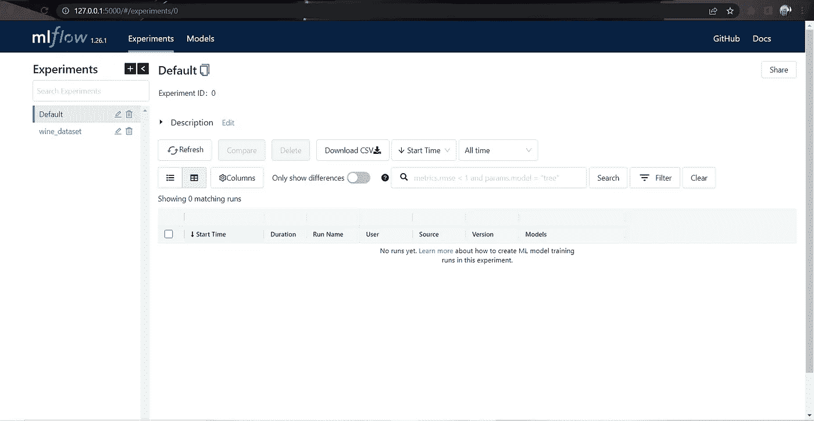
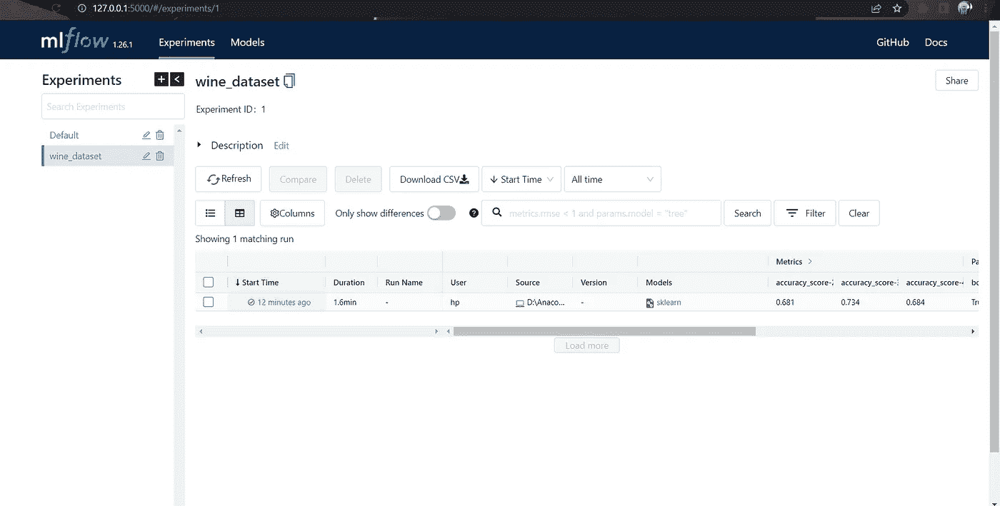

# Mlflow 所需的全部指南

> 原文：<https://medium.com/mlearning-ai/the-all-you-need-guide-for-mlflow-904b25b32a49?source=collection_archive---------2----------------------->

## 这是比赛的最后一周，你已经跑了近 30 个模型，在这一点上，它到处都是，你不能找到你表现最好的模型。你的 excel 表格是不完整的，几乎不能提供任何帮助。你现在做什么？😥

lflow 向你问好。Mlflow 基本上是一个开源平台，可以有效地处理和跟踪机器学习管道的端到端生命周期。最好的一点是，它可以与任何库压缩，您所需要的只是几行代码！

在进入具体示例之前，让我们先熟悉一下
ml flow 的组件。

1.**跟踪**——你得到了一个整洁的 UI 和 API 来跟踪你的代码
的各种
参数、度量、pickle 文件、代码版本等，你以后可以用它们来可视化。您可以将它们放在您的本地端，或者甚至将它们记录到数据库服务器中！

2.**项目** —用于打包代码。一个项目将
包含代码文件、使用的依赖列表和运行文件的
指令。

3.**模型** —用于包装不同口味的模型
。这很重要，因为不同的模型有不同风格的工件
,我们不能对每个模型使用相同的
约定

4.**注册中心** —它管理项目的整个生命周期
，从模型沿袭、版本控制、阶段转换等等。

# 设置

1.安装 mlflow

> **pip 安装 mlflow**

2.转到代码文件所在的目录并运行

> **物流界面**

这将启动 mlflow 仪表板，您必须在本地端记录这些内容。在这种情况下，您不能使用模型注册表

> **ml flow ui—back end-store-uri SQLite:///ml flow . db**

这将做同样的事情，但是我使用一个 sqlite3 后端来存储我所有的工件。当您想要在不同的团队成员之间共享您的结果时，这尤其有用

When you first launch the dashboard, you will only see the default experiment

3.该编码了！

现在，回到你的仪表盘，想象你创建的跑步记录。

在这里，您可以找到该实验的所有运行，然后您可以轻松地跟踪和可视化该模型的所有可用指标/参数。这是不是太酷了！

暂时就这样了，下一集再见。也可以寻求任何疑问/帮助，我很乐意帮忙

领英—[https://www.linkedin.com/in/jino-rohit-6032541b5/](https://www.linkedin.com/in/jino-rohit-6032541b5/)

 [## Mlearning.ai 提交建议

### 如何成为 Mlearning.ai 上的作家

medium.com](/mlearning-ai/mlearning-ai-submission-suggestions-b51e2b130bfb)