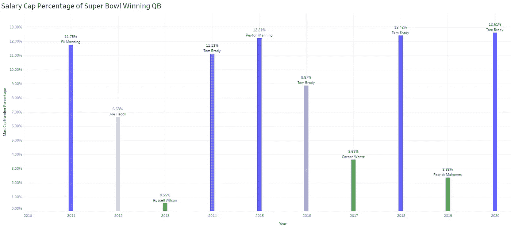
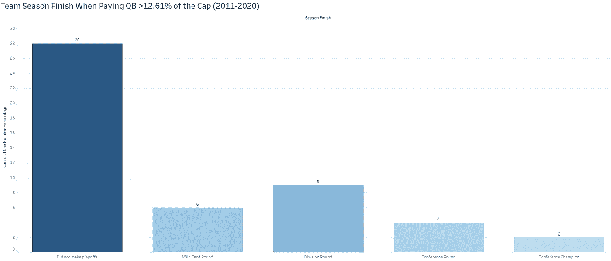
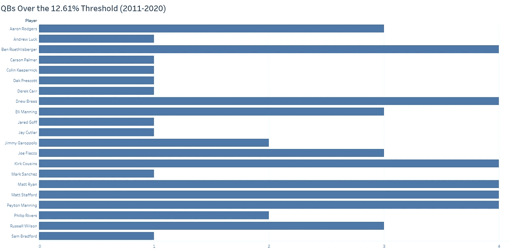
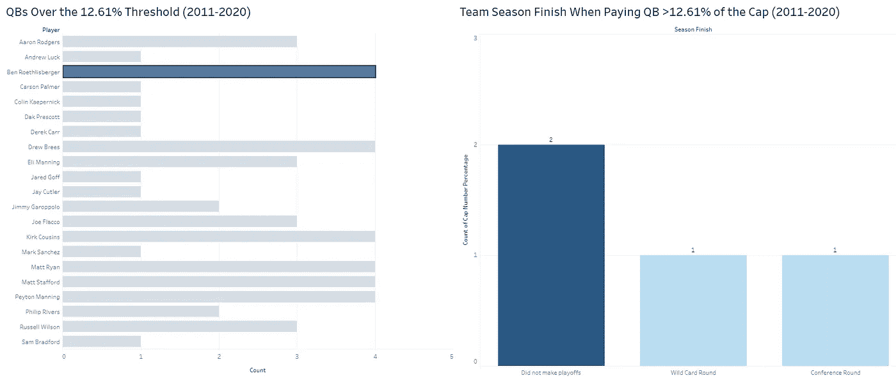
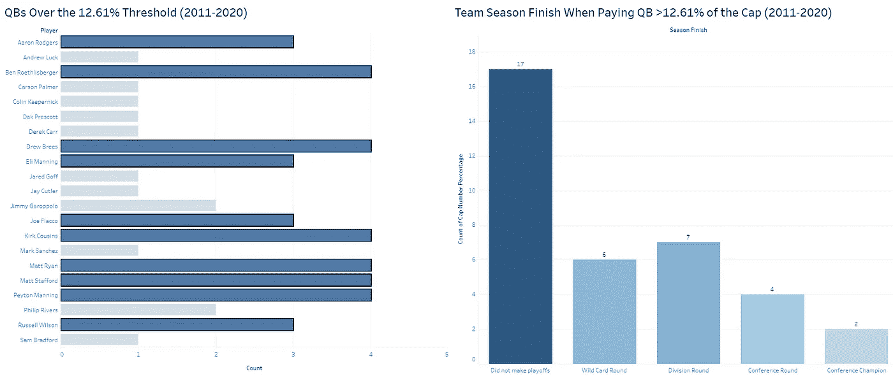
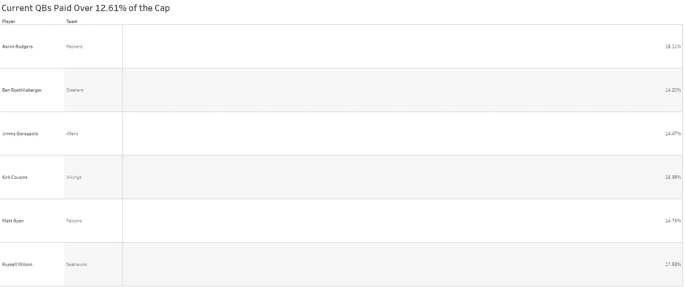

# 底线:NFL QB 工资帽版(免费版)

> 原文：<https://medium.com/mlearning-ai/the-bottom-line-nfl-qb-salary-cap-edition-free-edition-9ad80e0ddcc6?source=collection_archive---------3----------------------->

“你不会想看到我写的支票的金额，如果它肯定能让达拉斯牛仔队赢得超级碗的话。”—达拉斯牛仔队老板杰里·琼斯

去年，关于杰里·琼斯打算付给他的明星四分卫达克·普雷斯科特多少钱，人们议论纷纷。关于普雷斯科特合同谈判的报告将他的目标工资定在 4000 万美元左右，这将使他成为 NFL 中收入最高的四分卫之一。为什么这个消息如此重要？首先，我们在这里谈论的是达拉斯牛仔队(世界上最有价值的体育专营权！)，所以尽管牛仔队最近缺乏成功，但他们总是主宰体育新闻。此外，NFL 是一个工资帽体育联盟，相对于棒球或篮球而言，它有更多的硬帽，这反过来又会在一名球员的工资帽份额“太大”时产生机会成本，因为它可能会给其他位置的人才带来挑战。那么，向普雷斯科特支付 4000 万美元就一定会损害牛仔队赢得另一场超级碗的机会吗？我决定做一个工资帽分析，以确定四分卫的工资帽对球队在球场上的成功有多大影响。

为了开始我的分析，我建立了一个数据表，其中包括 2011 年至 2021 年四分卫的工资帽信息(数据来源:[https://overthecap.com/](https://overthecap.com/))。一旦建立了表格，我就过滤了赛季结束列，以查看超级碗冠军 QB 的最大工资帽百分比。事实证明，自 2011 年以来，没有一支球队在四分卫占工资帽比例超过 12.61%的情况下赢得过超级碗:

[https://public.tableau.com/app/profile/charlie.colato/viz/SalaryCapWinningQBs/WinningQBs](https://public.tableau.com/app/profile/charlie.colato/viz/SalaryCapWinningQBs/WinningQBs)

从这张图表中可以看出:

*   汤姆·布拉迪确实赢了很多。也许这与他通常拿的薪水低于四分卫市场最高水平有关，而且他还以一种对团队友好的方式来组织他的合同，为他的团队提供了灵活性，以增加更多的人才？我相信嫁给世界上收入最高的超级名模也会有所帮助，对吗？
*   有一个新秀合同的四分卫似乎有所帮助。由于新秀合同中的四分卫倾向于消耗更少的工资帽空间，所以更容易用更多的天才来包围新秀。

有了 12.61%的盖帽指标，我决定看看盖帽率超过 12.61%的四分卫如何结束他们的赛季。这是我的发现:

[https://public.tableau.com/app/profile/charlie.colato/viz/QBsSeasonFinish/SeasonFinish](https://public.tableau.com/app/profile/charlie.colato/viz/QBsSeasonFinish/SeasonFinish)

我发现有趣的是，超过一半(57.14%)的四分卫消耗超过 12.61%的工资帽的情况导致没有进入季后赛。这一发现明确支持了为四分卫支付额外费用会给四分卫带来问题的观点。现在，警告(尽管是一个相当小的警告)是，有几个高薪四分卫进入了联盟冠军赛或超级碗，但这些赛季结束只占数据的 12.24%。

那么这些霸占工资帽的四分卫是谁呢？我很高兴你问了:

[https://public.tableau.com/app/profile/charlie.colato/viz/QBsoverthresholddrillthrough/QBsOverThreshold](https://public.tableau.com/app/profile/charlie.colato/viz/QBsoverthresholddrillthrough/QBsOverThreshold)

我决定使用最后两个数据视觉效果来创建一个具有钻取效果的仪表板。在 Tableau 中，这可以通过动作过滤器函数来创建。创造这种效果可以让用户点击一个球员，看看他们如何结束他们的赛季。由于本·罗特利斯伯格是违反工资帽百分比最高的人之一，让我们以他为例进行研究:

[https://public.tableau.com/app/profile/charlie.colato/viz/SalaryCapDashboard/Dashboard1](https://public.tableau.com/app/profile/charlie.colato/viz/SalaryCapDashboard/Dashboard1)

在这里我们可以看到，有一半的时间“大本”消耗了他的球队未能进入季后赛的工资帽的 12.61%以上，这与整个数据集的早期发现是一致的。

选择出现三次或三次以上封顶百分比超过 12.61%的四分卫得出以下结果:

[https://public.tableau.com/app/profile/charlie.colato/viz/SalaryCapDashboard/Dashboard1](https://public.tableau.com/app/profile/charlie.colato/viz/SalaryCapDashboard/Dashboard1)

尽管有帽子戏法，但仍有两名孤独的四分卫进入了超级碗，他们是培顿·曼宁和马特·莱恩。曼宁遭受了西雅图海鹰队传奇的“繁荣军团”防守的重击。瑞安几乎赢得了超级碗，但尽管在第三节瑞安和亚特兰大猎鹰队以 28 比 3 领先，但在汤姆·布拉迪和新英格兰爱国者队的历史性反击中，他们还是输了。

那么，这一切对杰里·琼斯寻求看到牛仔队赢得另一个超级碗意味着什么？没什么。感谢工资帽魔术师普雷斯科特今年的工资帽百分比只有 9.42%。然而，他们确实有一个不同的问题，这将是**底线的主题:NFL RB 工资帽版**。在那之前，我会给你一份本赛季工资帽百分比高于 12.61%的四分卫名单:

[https://public.tableau.com/app/profile/charlie.colato/viz/CurrentSeason/CurrentSeason](https://public.tableau.com/app/profile/charlie.colato/viz/CurrentSeason/CurrentSeason)