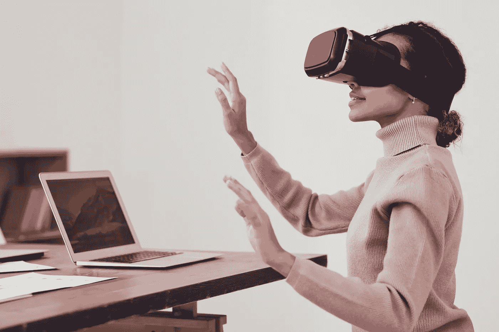

# 虚拟现实和增强现实的区别

> 原文：<https://medium.com/mlearning-ai/the-difference-between-virtual-reality-and-augmented-reality-10d027823667?source=collection_archive---------3----------------------->

Photo by fauxels on Pexels

虚拟现实和增强现实是当今最流行的两种技术。但是它们之间有什么区别呢？各有什么好处？

## 什么是虚拟现实？

虚拟现实是一种创造身临其境的环境的技术，在这种环境中，用户可以与数字对象进行交互…