# 基于深度学习的森林火灾预测实验

> 原文：<https://medium.com/mlearning-ai/the-experiment-of-forest-fires-prediction-using-deep-learning-d537e8c8e3a2?source=collection_archive---------0----------------------->

森林火灾是重要的灾害性事件之一，对环境、基础设施和人类生活都有很大影响。针对森林火灾预警探测系统的需求，已经采用了多种方法，包括:基于物理的模型、统计模型、机器学习模型和深度学习模型。


本文旨在通过深度学习，根据发现火灾的空间、时间和天气变量，进行超参数调整实验，以预测葡萄牙东北部地区森林火灾的烧毁面积。

我们使用来自 UCI 机器学习资源库的公共数据集:[http://archive.ics.uci.edu/ml/datasets/Forest+Fires](http://archive.ics.uci.edu/ml/datasets/Forest+Fires)。这一预测可用于计算派往事故现场的部队，并确定局势的紧迫性。我们将使用的方法是具有分类问题的人工神经网络/深度学习来预测森林火灾。

**人工神经网络概述:**
人工神经网络由具有输入和输出维度的层组成。后者由**神经元**(也称为“节点”)的数量决定，计算单元通过**激活函数**连接加权输入(帮助神经元打开/关闭)。与大多数机器学习算法一样，**权重和**权重在训练期间被随机初始化和优化，以最小化损失函数。

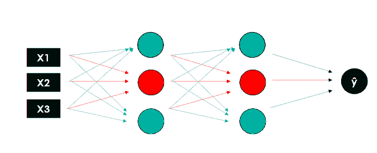

[Deep Learning with Python: Neural Networks (complete tutorial)](https://towardsdatascience.com/deep-learning-with-python-neural-networks-complete-tutorial-6b53c0b06af0)

以下是进行实验的步骤:

# 第 1 步:理解数据集

在导入数据集之前，必须导入所需的库。

```
import numpy as np
import pandas as pd
import matplotlib.pyplot as plt
plt.style.use('seaborn')
import seaborn as sns
from sklearn.preprocessing import LabelEncoder, StandardScaler, MinMaxScalerfrom sklearn.model_selection import train_test_split
from sklearn.metrics import r2_score
import tensorflow as tensorflow
from keras.models import Sequential
from keras.layers import Dense, Dropout
from tensorflow import keras
from tensorflow.keras import layers
from tensorflow.keras.optimizers import SGD
from tensorflow.keras.utils import to_categorical
from keras.callbacks import EarlyStopping
from keras.callbacks import ModelCheckpoint
from keras.utils.vis_utils import plot_model
```

本文使用的数据集来自 UCI 机器学习资源库:[http://archive.ics.uci.edu/ml/datasets/Forest+Fires](http://archive.ics.uci.edu/ml/datasets/Forest+Fires)

要导入数据集，请执行以下步骤:

```
df = pd.read_csv('dataset.csv')
df.head(10)
```

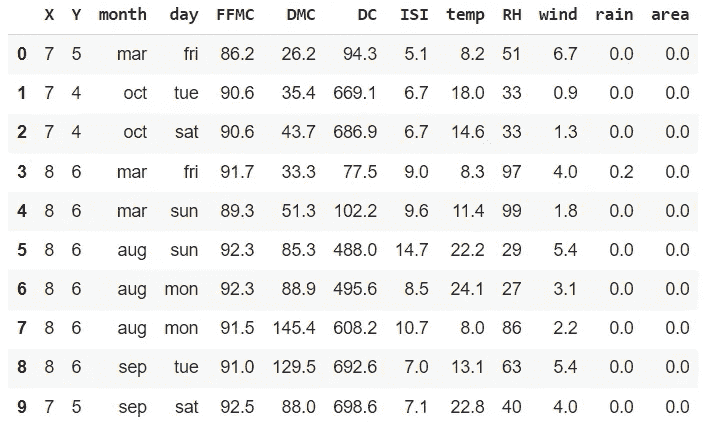

**属性信息:**

*   **X** :蒙特辛霍公园地图内 X 轴空间坐标:1-9
*   **Y** :蒙特辛霍公园地图内的 Y 轴空间坐标:2-9
*   **月**:一年中的月份:“1 月”至“12 月”
*   **日**:周一至周日
*   **FFMC**:FWI 系统 FFMC(精细燃料水分代码)指数:18.7 ~ 96.20
*   **DMC** :来自 FWI 系统的 DMC(Duff weather Code)指数:1.1 至 291.3
*   **DC**:FWI 系统 DC(旱情代码)指数:7.9 ~ 860.6
*   **ISI**:FWI 系统 ISI(初始利差指数)指数:0.0 ~ 56.10
*   **温度**:摄氏温度:2.2 至 33.30 度
*   **相对湿度**:相对湿度百分比:15.0 至 100
*   **风**:风速以千米/小时为单位:0.40 至 9.40
*   **雨**:室外雨，单位为毫米/平方米:0.0 至 6.4
*   **面积**:森林过火面积(公顷):0.00-1090.84

# 步骤 2:数据预处理

## 1)添加新列= size_category

对于分类问题，我们尝试添加一个新列，即`size_category`来将数据分为两类:

*   如果`area` <的值为 6 那么`size_category`将被标记为 0(小火)
*   如果`area`的值≥ 6，那么`size_category`将被标记为 1(宽火)

```
df['size_category'] = np.where(df['area']>6, '1', '0')
df['size_category']= pd.to_numeric(df['size_category'])
df.tail(10)
```

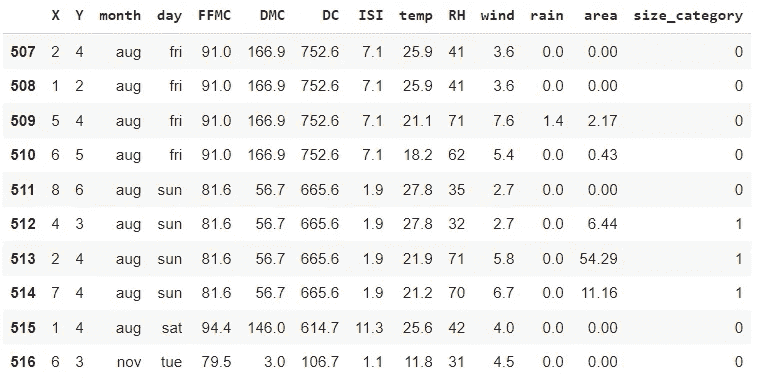

## 2)数天的数据预处理

`day`的分布看起来很漂亮。我们将不编码 7 个变量，而是将它们分成周末(`True`)或非周末(`False`)。假设火灾中燃烧的面积也与消防员对火焰的反应有关。在周末，消防队员的数量或总体反应可能与工作日不同。

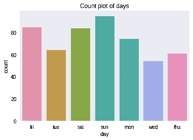

```
**# converting to is weekend**
df['day'] = ((df['day'] == 'sun') | (df['day'] == 'sat'))**# renaming column**
df = df.rename(columns = {'day' : 'is_weekend'})**# visualizing**
sns.countplot(df['is_weekend'])
plt.title('Count plot of weekend vs weekday')
```

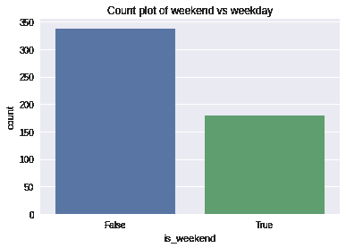

偏斜不是太大，所以我们对这种转换很满意。

## 3)结垢区域和雨水

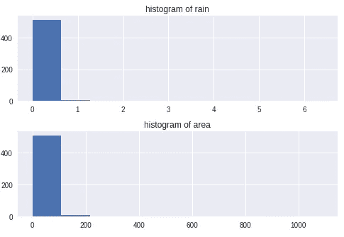

`rain`和`area`的分布过于倾斜，有很大的异常值，因此我们将对其进行缩放，以使分布均匀。

```
**# natural logarithm scaling (+1 to prevent errors at 0)**
df.loc[:, ['rain', 'area']] = df.loc[:, ['rain', 'area']].apply(lambda x: np.log(x + 1), axis = 1)**# visualizing**
fig, ax = plt.subplots(2, figsize = (5, 8))
ax[0].hist(df['rain'])
ax[0].title.set_text('histogram of rain')
ax[1].hist(df['area'])
ax[1].title.set_text('histogram of area')
```

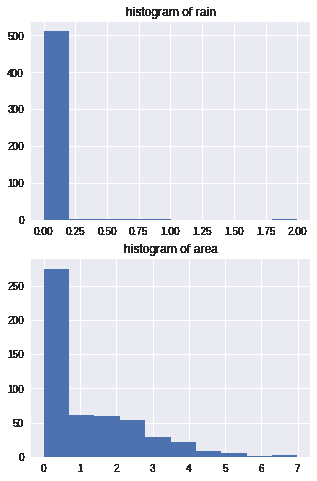

`rain`的分布不好，但`area`的分布有很大改善。现在我们缩放整个数据集。请注意，我们计划在数据集上测试一个神经网络，因此我们将缩放该区域，作为应对爆炸梯度的预防措施。

首先，我们将数据分割成**训练和测试分割**，这样我们可以缩放训练集，然后基于训练集缩放测试集。然后我们将扩展一切。

## **4)列车试分裂**

数据被随机分成训练数据(80 %)和测试数据(20%)。

```
features = df.drop(['size_category'], axis = 1)
labels = df['size_category'].values.reshape(-1, 1)X_train, X_test, y_train, y_test = train_test_split(features,labels, test_size = 0.2, random_state = 42)
```

## 5)特征缩放:标准缩放器

对数据应用特征缩放:标准缩放器

```
**# fitting scaler**
sc_features = StandardScaler()**# transforming features**
X_test = sc_features.fit_transform(X_test)
X_train = sc_features.transform(X_train)**# features**
X_test = pd.DataFrame(X_test, columns = features.columns)
X_train = pd.DataFrame(X_train, columns = features.columns)**# labels**
y_test = pd.DataFrame(y_test, columns = ['size_category'])
y_train = pd.DataFrame(y_train, columns = ['size_category'])X_train.head()
```

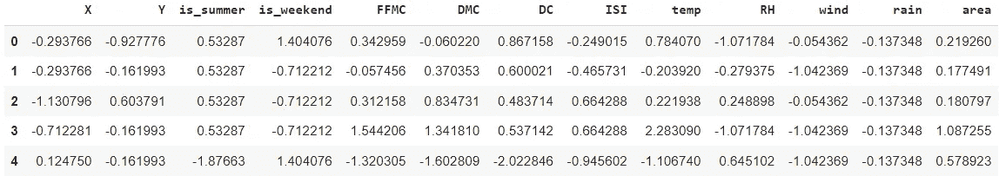

# 步骤 3:超参数/实验结果

# 1)实验 1:基础模型

在这里，我们将通过使用某个名为 Sequential 的 Keras 类来创建我们的 ANN 对象。一旦我们初始化我们的人工神经网络，我们现在要创建层。在这里，我们将创建一个基础模型网络，它将具有:

*   1 个输入层
*   2 个隐藏层
*   1 个脱落层
*   1 个输出层

在这里，我们已经创建了我们的第一个隐藏层，使用的是层模块中的密集类。该类接受 2 个输入:

*   **单位**:将出现在相应层中的神经元数量
*   **激活**:指定使用哪个激活功能

我们创建一系列层来定义神经网络，并通过初始化权重、定义激活函数和选择每个隐藏层的节点来定义每一层。

```
model = Sequential()**# input layer + 1st hidden layer**
model.add(Dense(6, input_dim=13, activation='relu'))**# 2nd hidden layer**
model.add(Dense(6, activation='relu'))**# output layer**
model.add(Dense(6, activation='sigmoid'))
model.add(Dropout(0.2))
model.add(Dense(1, activation = 'relu'))model.summary()
```

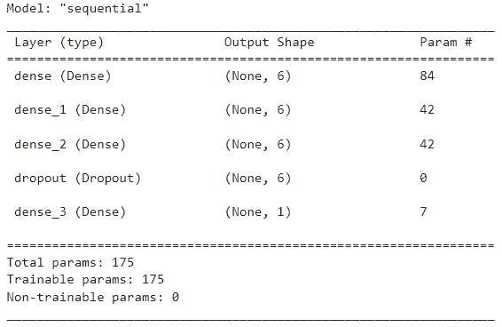

下一步，我们将使用下面的超参数编译我们的 ANN:

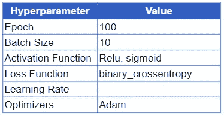

*   **纪元**:神经网络将被训练多少次
*   **批次大小**:批次中应该有多少个观察值。
*   **激活函数**:激活函数的主要作用是将来自节点的总加权输入转换成输出值，以馈送到下一个隐藏层或作为输出。
*   **损失函数**:损失函数用于确定我们算法的输出与给定目标值之间的误差。
*   **学习率:**学习率是一个超参数，它控制每次更新模型权重时，根据估计误差改变模型的程度。
*   **优化器**:优化器是用于最小化误差函数(损失函数)或最大化生产效率的算法或方法。

为了检查这些方法的性能，我们计算了精度度量。

```
**# Compile Model**
model.compile(optimizer = 'adam', metrics=['accuracy'], loss ='binary_crossentropy')**# Train Model** history = model.fit(X_train, y_train, validation_data = (X_test, y_test), batch_size = 10, epochs = 100)
```

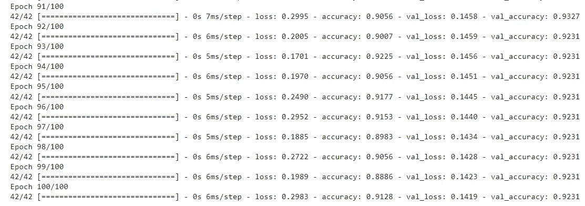

```
_, train_acc = model.evaluate(X_train, y_train, verbose=0)
_, valid_acc = model.evaluate(X_test, y_test, verbose=0)
print('Train: %.3f, Valid: %.3f' % (train_acc, valid_acc))
```

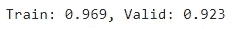

基于使用基础模型的超参数的实验 1 的结果，训练数据的准确度分数是 96%，有效或测试数据的准确度分数是 92%。

```
plt.figure(figsize=[8,5])
plt.plot(history.history['accuracy'], label='Train')
plt.plot(history.history['val_accuracy'], label='Valid')
plt.legend()
plt.xlabel('Epochs', fontsize=16)
plt.ylabel('Accuracy', fontsize=16)
plt.title('Accuracy Curves Epoch 100, Batch Size 10', fontsize=16)
plt.show()
```

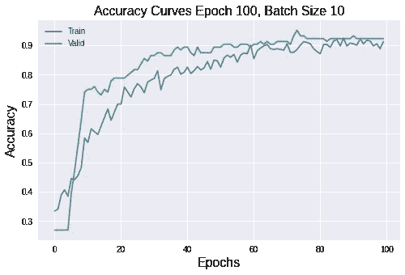

基于准确度图的输出，模型开始显示在时期 60 到 100 的稳定性。

# 2)实验二:批量:4，6，10，16，32，64，128，260

对于实验 2，我们将使用如下超参数细节进行人工神经网络建模:

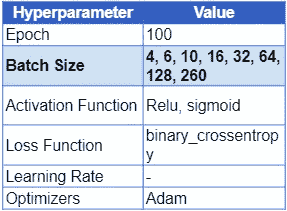

```
**# Fit a model and plot learning curve** def fit_model(X_train, y_train, X_test, y_test, n_batch):**# Define Model** model = Sequential()
model.add(Dense(6, input_dim=13, activation='relu'))
model.add(Dense(6, activation='relu'))
model.add(Dense(6, activation='sigmoid'))
model.add(Dropout(0.2))
model.add(Dense(1, activation = 'relu'))**# Compile Model**
model.compile(optimizer = 'adam',
metrics=['accuracy'],
loss = 'binary_crossentropy')**# Fit Model**
history = model.fit(X_train, y_train, validation_data=(X_test, y_test), epochs=100, verbose=0, batch_size=n_batch)**# Plot Learning Curves** plt.plot(history.history['accuracy'], label='train')
plt.plot(history.history['val_accuracy'], label='test')
plt.title('batch='+str(n_batch))
plt.legend()**# Create learning curves for different batch sizes** batch_sizes = [4, 6, 10, 16, 32, 64, 128, 260]plt.figure(figsize=(10,15))
for i in range(len(batch_sizes)):**# Determine the Plot Number** plot_no = 420 + (i+1)
plt.subplot(plot_no)**# Fit model and plot learning curves for a batch size** fit_model(X_train, y_train, X_test, y_test, batch_sizes[i])**# Show learning curves**
plt.show()
```


根据上面的精度图，足以显示稳定性的型号是 **batch = 6 的型号。**

# 3)实验 3:批量= 6，时期= 20，50，100，120，150，200，300，400

对于实验 3，我们将使用如下超参数细节进行人工神经网络建模:

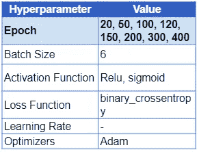

```
**# fit a model and plot learning curve** def fit_model(trainX, trainy, validX, validy, n_epoch):**# define model** model = Sequential()
model.add(Dense(6, input_dim=13, activation='relu'))
model.add(Dense(6, activation='relu'))
model.add(Dense(6, activation='sigmoid'))
model.add(Dropout(0.2))
model.add(Dense(1, activation = 'relu'))**# compile model** model.compile(optimizer ='adam', metrics=['accuracy'], loss = 'binary_crossentropy')**# fit model** history = model.fit(X_train, y_train, validation_data=(X_test, y_test), epochs=n_epoch, verbose=0, batch_size=6)**# plot learning curves** plt.plot(history.history['accuracy'], label='train')
plt.plot(history.history['val_accuracy'], label='test')
plt.title('epoch='+str(n_epoch))
plt.legend()**# Create learning curves for different batch sizes** epochs = [20, 50, 100, 120, 150, 200, 300, 400]plt.figure(figsize=(10,15))
for i in range(len(batch_sizes)):**# Determine the Plot Number**
plot_no = 420 + (i+1)
plt.subplot(plot_no)**# Fit model and plot learning curves for a batch size**
fit_model(X_train, y_train, X_test, y_test, epochs[i])**# Show learning curves**
plt.show()
```

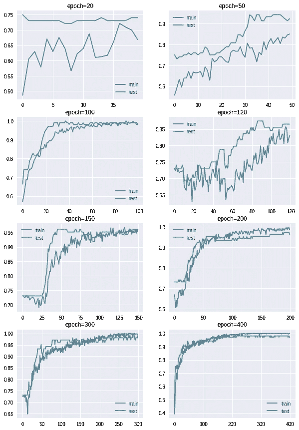

根据上面的精度图，足以显示稳定性的模型是 epoch = 200、300 和 400 **的模型。**

# 4)实验四

## 批量= 6，**提前停止(耐心，模型检查点)**

对于实验 4，我们将使用如下超参数细节进行人工神经网络建模:


```
def init_model():**# define model** model = Sequential()
model.add(Dense(6, input_dim=13, activation='relu'))
model.add(Dense(6, activation='relu'))model.add(Dense(6, activation='sigmoid'))
model.add(Dropout(0.2))
model.add(Dense(1, activation = 'relu'))
model.compile(optimizer ='adam',
metrics=['accuracy'],
loss = 'binary_crossentropy')return model**# init model**
model = init_model()**# simple early stopping** es = EarlyStopping(monitor='val_loss', mode='min', verbose=1, patience=150)**# model checkpoint** mc = ModelCheckpoint('best_model.h5', monitor='val_accuracy', mode='max', verbose=1, save_best_only=True)**# fitting model** history = model.fit(X_train, y_train, validation_data=(X_test, y_test), epochs=250, verbose=0, batch_size=6, callbacks=[es, mc])
```

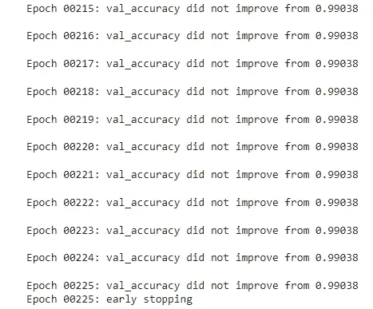

```
**# plot training history**
plt.plot(history.history['loss'], label='train')
plt.plot(history.history['val_loss'], label='valid')
plt.legend()
plt.xlabel('Epochs', fontsize=14)
plt.ylabel('Loss', fontsize=14)
plt.title('Loss Curves', fontsize=16)
plt.show()
```

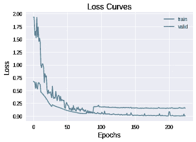

```
plt.figure(figsize=[8,5])
plt.plot(history.history['accuracy'], label='Train')
plt.plot(history.history['val_accuracy'], label='Valid')
plt.legend()
plt.xlabel('Epochs', fontsize=16)
plt.ylabel('Accuracy', fontsize=16)
plt.title('Accuracy Curves', fontsize=16)
plt.show()
```

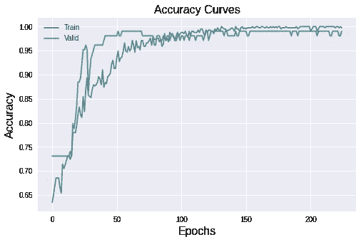

```
_, train_acc = model.evaluate(X_train, y_train, verbose=0)
_, valid_acc = model.evaluate(X_test, y_test, verbose=0)
print('Train: %.3f, Valid: %.3f' % (train_acc, valid_acc))
```

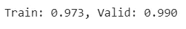

基于实验 4 的结果，使用有耐心的早期停止和模型检查点方法，训练数据的准确度分数是 97%，有效或测试数据的准确度分数是 99%。

# 结论和讨论

控制森林火灾的关键成功之一是早期发现火灾。在本文中，我们进行了超参数调整实验，以预测葡萄牙东北部地区的森林火灾燃烧面积，基于使用深度学习发现火灾的空间、时间和天气变量。

为了找到另一种最佳方法，我们建议使用数据预处理的其他选项，并尝试使用机器学习算法，如支持向量机(SVM)、决策树、随机森林分类器、朴素贝叶斯分类器等。

# 参考资料:

[http://archive.ics.uci.edu/ml/datasets/Forest+Fires](http://archive.ics.uci.edu/ml/datasets/Forest+Fires)

[](https://github.com/psohn/Only-You-Can-Prevent-Forest-Fires/blob/master/1.0_prs_preprocessing_eda.ipynb) [## 只有你能预防森林火灾/1.0 _ PRS _ preprocessing _ EDA . ipynb at master…

### 葡萄牙森林火灾回归模型预测火灾损失…

github.com](https://github.com/psohn/Only-You-Can-Prevent-Forest-Fires/blob/master/1.0_prs_preprocessing_eda.ipynb) [](https://github.com/psohn/Only-You-Can-Prevent-Forest-Fires/blob/master/3.0_prs_artificial_neural_network.ipynb) [## 只有你能预防森林火灾/3.0 _ PRS _ artificial _ neural _ network . ipynb at master…

### 葡萄牙森林火灾回归模型预测火灾损失…

github.com](https://github.com/psohn/Only-You-Can-Prevent-Forest-Fires/blob/master/3.0_prs_artificial_neural_network.ipynb) [](https://www.kaggle.com/psvishnu/forestfire-impact-prediction-stats-and-ml) [## 森林火灾影响预测(统计和 ml)

### 使用 Kaggle 笔记本探索和运行机器学习代码|使用来自森林火灾数据集的数据

www.kaggle.com](https://www.kaggle.com/psvishnu/forestfire-impact-prediction-stats-and-ml) [](https://towardsdatascience.com/deep-learning-with-python-neural-networks-complete-tutorial-6b53c0b06af0) [## Python 深度学习:神经网络(完整教程)

### 用 TensorFlow 建立、绘制和解释人工神经网络

towardsdatascience.com](https://towardsdatascience.com/deep-learning-with-python-neural-networks-complete-tutorial-6b53c0b06af0) [](https://www.analyticsvidhya.com/blog/2021/10/implementing-artificial-neural-networkclassification-in-python-from-scratch/) [## 从零开始用 Python 实现人工神经网络

### 神经网络。21 世纪蓬勃发展的技术突破之一。你有兴趣创造…

www.analyticsvidhya.com](https://www.analyticsvidhya.com/blog/2021/10/implementing-artificial-neural-networkclassification-in-python-from-scratch/) [](/mlearning-ai/mlearning-ai-submission-suggestions-b51e2b130bfb) [## Mlearning.ai 提交建议

### 如何成为 Mlearning.ai 上的作家

medium.com](/mlearning-ai/mlearning-ai-submission-suggestions-b51e2b130bfb) 

🟠在 MLearning.ai 成为 [**作家**](/mlearning-ai/mlearning-ai-submission-suggestions-b51e2b130bfb)