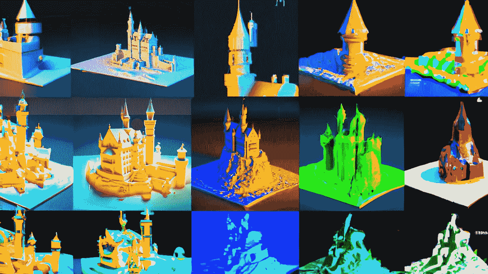

# 文本到 3D 建模的未来:是还是不是？

> 原文：<https://medium.com/mlearning-ai/the-future-of-text-to-3d-modeling-yes-or-no-94ebbbc076c8?source=collection_archive---------6----------------------->

## [在本地运行演示|代码](https://open.substack.com/pub/mlearning/p/generate-realistic-3d-models-from?r=z7zu8&utm_campaign=post&utm_medium=web)

[Try now the SOTA 3D method using text](https://open.substack.com/pub/mlearning/p/generate-realistic-3d-models-from?r=z7zu8&utm_campaign=post&utm_medium=web)

未来， [3D 模型](#f29d)被普通大众和专家使用和创造的潜力非常大。目前市场上有令人印象深刻的文本到 3D 建模解决方案，它们在未来只会变得更好。然而，直接从自然语言描述生成 [3D 模型](#f29d)的能力是最…