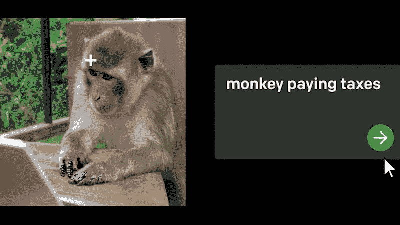

# "甘已死，达赖万岁！"

> 原文：<https://medium.com/mlearning-ai/the-gan-is-dead-long-live-the-dall-e-2-5a7e4d847179?source=collection_archive---------0----------------------->

## [机器学习艺术](https://mlearning.substack.com)

## 扩散模型—松开

[openai.com/papers/dall-e-2](https://mlearning.substack.com)

 [## 扩散模型是如何工作的？

### 在人工合成中，扩散模型工作得非常好，甚至比图像的 GANs 更好。正因为如此，他们…

mlearning.substack.com](https://mlearning.substack.com/p/how-does-a-diffusion-model-work?r=z7zu8&s=w&utm_campaign=post&utm_medium=web) 

## 🟠 [编辑&列车和](https://mlearning.substack.com/p/how-does-a-diffusion-model-work?r=z7zu8&s=w&utm_campaign=post&utm_medium=web) …