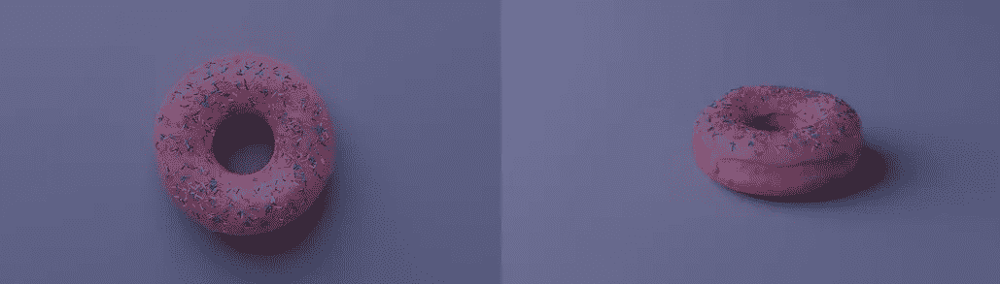
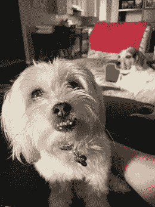
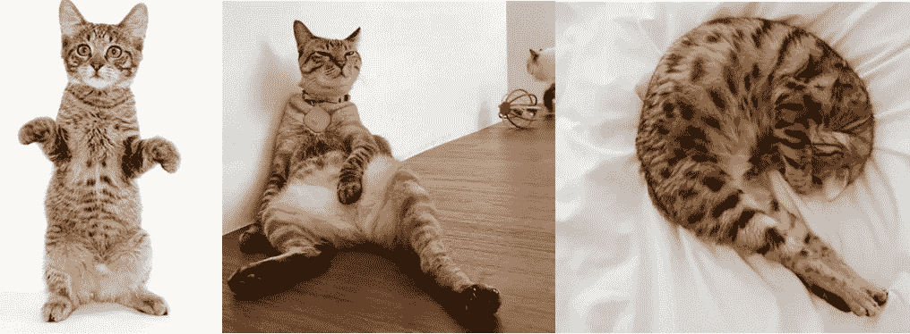
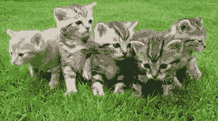
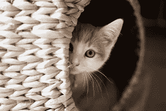
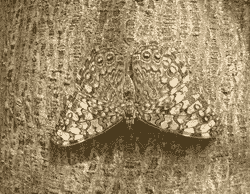
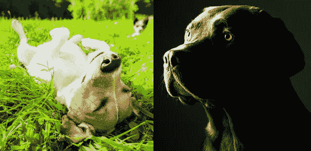
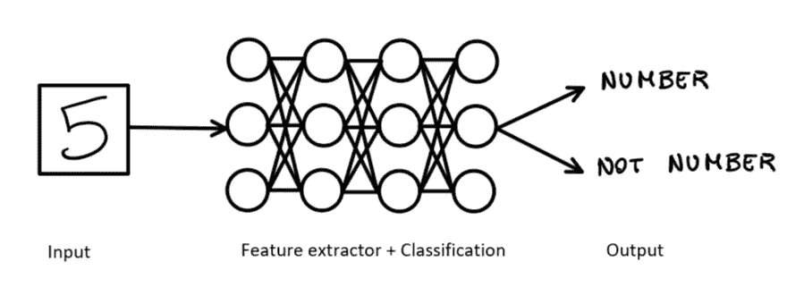

# 卷积的重要性

> 原文：<https://medium.com/mlearning-ai/the-importance-of-convolutions-45d16210f15?source=collection_archive---------6----------------------->

## 为什么全连接神经网络是不够的

# 介绍

在[之前的文章](/mlearning-ai/a-more-complex-neural-network-4d05d2fabf1)中，我所做的是通过向神经网络输入原始像素来建立图像识别模型。凭借 97.6%的准确率，数字识别器在数字正好位于图像中间的简单图像上确实工作得很好，但当数字没有完全位于图像中心时，**识别器*无法*工作。**

# 图像识别挑战

哪怕是最轻微的位置变化都会毁掉一切。换句话说，**模型学会了识别居中的数字，而不是组成数字的特征。**

> 这就是卷积非常强大的地方。卷积是一种过滤器，它通过图像，对图像进行处理，并提取显示图像共性的特征。

事实上，在处理图像识别时，我们需要记住许多挑战以及常规神经网络在这种情况下的一些局限性。

下面是我们在处理图像识别时需要面对的一些问题的例子:

V 视点变化:当我们给一个物体拍照，然后移动相机再拍另一张照片时，尽管显示的是同一个物体，图像却完全不同，这给图像识别带来了挑战。

[Example of viewpoint variation](http://1.	https://www.cgtrader.com/free-3d-models/food/miscellaneous/pink-donut-7cdb99fe-2cb7-4648-ba4c-2cda56848266)

尺度变化:将相机移近或移远物体，我们分别看到它们变大或变小，这影响了物体的分类。

[Example of scale variation](https://imgur.com/r/doggos/z1JiBQq)

D 变形:许多物体都可以变形，例如猫，但是即使它们的形状或位置不同，我们仍然能够识别它们是猫，但是这给图像识别增加了额外的难度。

Example of object deformation. ([1](http://42\. https://i.pinimg.com/originals/86/0a/5b/860a5b5371765d1a58b75a8c088fa602.jpg)–[2](http://43.	https://i.redd.it/c81is2uhwl921.jpg)–[3](http://44.	https://www.ilmiogattoeleggenda.it/wp-content/uploads/2020/03/paul-hanaoka-L5dmylYG6qc-unsplash-1.jpg))

类间差异:属于同一个类的一些对象可能有不同的颜色、形状或大小，但仍然代表同一个类。

[Example of inter-class variation](http://45.	https://www.maxpixel.net/Cat-Kittens-Free-Float-Kitten-Rush-Cat-Puppy-555822)

O 结论:某些物体阻碍了图像的完整视图，导致输入系统的信息不完整。有必要设计一种对这些变化敏感的算法，并由大范围的数据样本组成。

[Example of object occlusion](http://46.	https://images6.fanpop.com/image/photos/41400000/cute-kittens-playing-hide-and-seek-cute-kittens-41404247-760-506.jpg)

背景混乱:有时前景物体，比如下图中的猫，看起来与背景非常相似，因此它们的像素值可能也非常相似。然而，我们人类仍然能够认出它们。

[Example of background Clutter](http://47.	https://3.bp.blogspot.com/-1n2y5eYuuB4/W0trCMvVzfI/AAAAAAAADb8/WyAxdQiGNwEI-u9tuxrMNlb3SzlprIjiACLcBGAs/s750/mimetismo_.jpg)

I 照明:当我们拍照时，我们通常不会总是有相同的照明条件。照明对像素级别的影响非常大。

Example of different illumination in images([1](http://49.	https://hips.hearstapps.com/hmg-prod.s3.amazonaws.com/images/dog-siesta-at-park-royalty-free-image-589958398-1551392720.jpg)–[2](http://50.	https://www.dogster.com/wp-content/uploads/2015/05/can-dogs-see-in-the-dark-4.jpg))

# 图像识别中常规神经网络的局限性

因为传统的神经网络使用完全连接的架构，所以当处理图像数据时，它变得低效，事实上，对于具有数百个像素的平均 RGB 图像，网络将生成数百万个神经元，这可能导致过拟合，并且将需要高度密集的计算工作。

## 卷积神经网络拯救世界

卷积神经网络是解决这些问题不同类型的神经网络。在完全连接的层中，一层中的神经元连接到下一层中的所有神经元，而在卷积神经网络中，图像首先被分成一组更小的图像，然后这些图像中的每一个被小尺寸的滤波器分成小的部分，以这种方式，每组神经元连接到这些部分中的一个。

因此，与传统的神经网络相比，CNN 降低了计算能力要求，并且能够处理大尺寸图像。

# 下一步是什么？

在下一篇文章中，我将解释卷积是如何工作的。