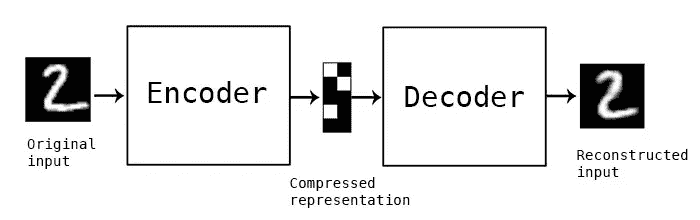

# 自动编码器的魔力

> 原文：<https://medium.com/mlearning-ai/the-magic-of-autoencoders-73162e9bd43f?source=collection_archive---------1----------------------->

自动编码器是一个顺序神经网络，由两个组件组成，**编码器**和**解码器**。

假设我们在处理图像。我们的编码器将从图像中提取特征，这将减少一些组件，如其高度和宽度，但为图像制作一个**潜在表示**。这种潜在的表现形式只是意味着神经网络只捕捉输入的最相关的特征。

解码器是神经网络的一部分，它学习如何从编码版本中重建数据。以尽可能接近原始输入的方式重构数据。

我们还有一个**重建损失**，用于衡量解码器的性能以及输出数据与原始输入数据的接近程度。为了最小化损失，自动编码器使用**反向传播**来最小化神经网络的重建损失。

自动编码器允许我们以最佳方式压缩数据，以减少维度并忽略数据中的噪声。

下面是如何使用自动编码器对来自 MIST 数据集(手写数字)的图像进行编码和解码的示例。如您所见，原始输入和重构输入非常相似。



Image from google images.

## 构建自动编码器

我已经用 PyTorch 构建了一个自动编码器，我将一步一步地向您展示如何构建一个自动编码器。

首先，让我们对整个代码做一个概述:

```
import torch
import torch.nn as nn
from torchvision import datasets
from torch.autograd import Variable
from torchvision.transforms import transforms

#transform data to pytorch tensors
transforms = transforms.ToTensor()

fashion_data = datasets.FashionMNIST(root='./data',  download=True, transform=transforms) #train=True,

data_loader = torch.utils.data.DataLoader(fashion_data, batch_size=64, shuffle=True)

#iterating through our data
dataiter = iter(data_loader)
images, labels = dataiter.next()

#output will get the minimum tensor and the maximum tensor in the dataset --> important for our last activation
print(torch.min(images), torch.max(images))

class autoencoder(nn.Module):
    def __init__(self, epochs=10, batchSize=128, learningRate=1e-3, weight_decay=1e-5):
        super(autoencoder, self).__init__()
        self.epochs = epochs
        self.batchSize = batchSize
        self.learningRate = learningRate
        self.weight_decay = weight_decay

        #encoder
        self.encoder = nn.Sequential(
            nn.Linear(28 * 28, 128),  # reduces from n * 724 to 128
            nn.ReLU(),
            nn.Linear(128, 64),
            nn.ReLU(),
            nn.Linear(64, 12),
            nn.ReLU(),
            nn.Linear(12, 3)
        )

        #decoder
        self.decoder = nn.Sequential(
            nn.Linear(3, 12),
            nn.ReLU(),
            nn.Linear(12, 64),
            nn.ReLU(),
            nn.Linear(64, 128),
            nn.ReLU(),
            nn.Linear(128, 28 * 28),
            nn.Sigmoid()  # cause tensors are 0, 1
        )

        self.optimizer = torch.optim.Adam(self.parameters(), lr=self.learningRate, weight_decay=self.weight_decay)
        self.loss = nn.MSELoss()

    #feed data through network
    def forward(self, x):
        encoder = self.encoder(x)
        decoder = self.decoder(encoder)
        return decoder

    #training loop
    def train(self):
        for epoch in range(self.epochs):
            for data in data_loader:
                img, _ = data
                img = img.view(img.size(0), -1)
                img = Variable(img)

                #predict
                output = self(img)

                # find loss
                loss = self.loss(output, img)

                # perform back propagation
                self.optimizer.zero_grad()
                loss.backward()
                self.optimizer.step()

            print(f'epoch {epoch + 1}/{self.epochs}, loss: {loss.data:.4f}')

model = autoencoder()
model.train()
```

为了打破僵局，让我们从我们的进口开始:

```
import torch
import torch.nn as nn
from torchvision import datasets
from torch.autograd import Variable
from torchvision.transforms import transforms
```

导入 torch → PyTorch 模块。

导入 torch.nn 作为 nn →用于我们的神经网络类。

从 torchvision 导入数据集→允许我们在 PyTorch 中使用预加载的数据集。

from torch.autograd 导入变量→我们使用变量来存储由损失函数计算的值。变量有许多与张量和反向传播相关的函数。

from torchvision.transforms 导入转换→用于图像预处理。

好了，现在我们有了导入，我们可以开始获取和浏览我们的数据了:

```
#transform data to pytorch tensors
transforms = transforms.ToTensor()

fashion_data = datasets.FashionMNIST(root='./data',  download=True, transform=transforms) #train=True,

data_loader = torch.utils.data.DataLoader(fashion_data, batch_size=64, shuffle=True)

#iterating through our data
dataiter = iter(data_loader)
images, labels = dataiter.next()
```

首先，我们将初始化一个名为 transforms 的变量，当它被传递给 transform 参数时，会将一个图像转换成 PyTorch 张量。

```
transforms = transforms.ToTensor()
```

接下来，我们将创建我们的 fashion_data 变量，它将使用数据集。FashionMNIST 获取预先加载在 PyTorch 中的 FashionMNIST 数据。我们还将把 transforms 变量传递给 transform 参数，因为我们想把我们的图像转换成张量。

```
fashion_data = datasets.FashionMNIST(root='./data', train=True, download=True, transform=transforms)
```

PyTorch 有一个漂亮的类，叫做 DataLoader，它允许我们加载数据，并迭代元素，与手动输入所有数据相比，它的效率提高了 10 倍。

下面，我们创建了一个 data_loader 变量，它使用 PyTorch 的 DataLoader 迭代我们的 fashion_data，给它一个 64 的批处理大小，并对数据进行混排。

```
data_loader = torch.utils.data.DataLoader(fashion_data, batch_size=64, shuffle=True)
```

最后，我们将遍历 data_loader，遍历每张图片和标签。

```
#iterating through our data
dataiter = iter(data_loader)
images, labels = dataiter.next()
```

我们将打印图像的 torch.min()来查找输入张量中所有元素的最小值，并打印 torch.max()来查找输入张量中所有元素的最大值。

```
#output will get the minimum tensor and the maximum tensor in the dataset --> important for our last activationprint(torch.min(images), torch.max(images))
```

这最后一句话很重要，因为返回的张量值将决定我们在解码器的最后一层需要使用什么函数。因为输出显示我们的最小张量是张量(0。)并且最大张量是张量(1。)，这意味着所有的张量都在这些数之间，所以我们必须使用 Sigmoid 激活。

记住 sigmoid 激活函数是连续的，所有点上的导数总是产生数字 0 和 1 之间的输出。

现在，我们已经准备好了数据，并了解了一些有用的信息，我们可以开始构建我们的自动编码器神经网络。

以下是我们整个代码的概述:

```
class autoencoder(nn.Module):
    def __init__(self, epochs=10, batchSize=128, learningRate=1e-3, weight_decay=1e-5):
        super(autoencoder, self).__init__()
        self.epochs = epochs
        self.batchSize = batchSize
        self.learningRate = learningRate
        self.weight_decay = weight_decay

        #encoder
        self.encoder = nn.Sequential(
            nn.Linear(28 * 28, 128),  # reduces from n * 724 to 128
            nn.ReLU(),
            nn.Linear(128, 64),
            nn.ReLU(),
            nn.Linear(64, 12),
            nn.ReLU(),
            nn.Linear(12, 3)
        )

        #decoder
        self.decoder = nn.Sequential(
            nn.Linear(3, 12),
            nn.ReLU(),
            nn.Linear(12, 64),
            nn.ReLU(),
            nn.Linear(64, 128),
            nn.ReLU(),
            nn.Linear(128, 28 * 28),
            nn.Sigmoid()  # cause tensors are 0, 1
        )

        self.optimizer = torch.optim.Adam(self.parameters(), lr=self.learningRate, weight_decay=self.weight_decay)
        self.loss = nn.MSELoss()

    #feed data through network
    def forward(self, x):
        encoder = self.encoder(x)
        decoder = self.decoder(encoder)
        return decoder

    #training loop
    def train(self):
        for epoch in range(self.epochs):
            for data in data_loader:
                img, _ = data
                img = img.view(img.size(0), -1)
                img = Variable(img)

                #predict
                output = self(img)

                # find loss
                loss = self.loss(output, img)

                # perform back propagation
                self.optimizer.zero_grad()
                loss.backward()
                self.optimizer.step()

            print(f'epoch {epoch + 1}/{self.epochs}, loss: {loss.data:.4f}')

model = autoencoder()
model.train()
```

好了，这是一个很大的进步，所以让我们把它一部分一部分的分解吧:)

```
class autoencoder(nn.Module):
    def __init__(self, epochs=10, batchSize=128, learningRate=1e-3, weight_decay=1e-5):
        super(autoencoder, self).__init__()
        self.epochs = epochs
        self.batchSize = batchSize
        self.learningRate = learningRate
        self.weight_decay = weight_decay

        #encoder
        self.encoder = nn.Sequential(
            nn.Linear(28 * 28, 128),  # reduces from n * 724 to 128
            nn.ReLU(),
            nn.Linear(128, 64),
            nn.ReLU(),
            nn.Linear(64, 12),
            nn.ReLU(),
            nn.Linear(12, 3)
        )

        #decoder
        self.decoder = nn.Sequential(
            nn.Linear(3, 12),
            nn.ReLU(),
            nn.Linear(12, 64),
            nn.ReLU(),
            nn.Linear(64, 128),
            nn.ReLU(),
            nn.Linear(128, 28 * 28),
            nn.Sigmoid()  # cause tensors are 0, 1
        )

        self.optimizer = torch.optim.Adam(self.parameters(), lr=self.learningRate, weight_decay=self.weight_decay)
        self.loss = nn.MSELoss()
```

我们将调用我们的类 autoencoder，它将继承 nn。模块类。这通常是 PyTorch 中所有神经网络的基类。

为了简单地解释这个模块，它使用张量和自动微分模块(计算函数导数的技术)来训练和构建层(输入、隐藏、输出等)。

在我们的 __init__ 中，我们将传入我们的纪元、批量大小和学习率，并对它们进行初始化。你可以摆弄这些数字，但是，这些是我发现效果最好的数字。

```
class autoencoder(nn.Module):
    def __init__(self, epochs=10, batchSize=128, learningRate=1e-3, weight_decay=1e-5):
        super(autoencoder, self).__init__()
        self.epochs = epochs
        self.batchSize = batchSize
        self.learningRate = learningRate
        self.weight_decay = weight_decay
```

初始化之后，我们可以开始构建我们的编码器。

我们将使用一个简单的顺序结构，一个线性层后面跟着一个 relu 激活。请注意，我们传入的图像大小为 28 x 28，因为时尚 MNIST 数据集的图像为 784 像素。每一层，我们都会减少投入。

你可以把我们的输入想象成 N，784，编码器的输出将会显著地减少到 N，3。

```
#encoder
self.encoder = nn.Sequential(
    nn.Linear(28 * 28, 128),  # reduces from n * 724 to 128
    nn.ReLU(),
    nn.Linear(128, 64),
    nn.ReLU(),
    nn.Linear(64, 12),
    nn.ReLU(),
    nn.Linear(12, 3)
)
```

我们的解码器与我们的编码器结构相似，但是，我们的方向相反，即→ N，3 到 N，784。

对于我们的最后一层，注意我们使用了 sigmoid 激活(前面解释过)。

```
#decoder
self.decoder = nn.Sequential(
    nn.Linear(3, 12),
    nn.ReLU(),
    nn.Linear(12, 64),
    nn.ReLU(),
    nn.Linear(64, 128),
    nn.ReLU(),
    nn.Linear(128, 28 * 28),
    nn.Sigmoid()  # cause tensors are 0, 1
)
```

现在我们可以初始化优化器和标准了。一定要确保在你的自动编码器下面定义它，否则你将不能传递任何东西。

记住→优化器是改变属于你的神经网络的属性的算法，比如权重和学习率，以减少损失。

对于我们的网络，我们将使用 Adam 优化器。我们将需要传入 self.parameters、我们的学习率和我们的 weight_decay(这是我们之前在网络中初始化的)。

记住→学习率控制着网络适应问题的速度。

记住→正则化是一种约束我们的网络精确拟合我们的数据，避免过度拟合的方法。Weight_decay 是一种在神经网络上执行正则化的方法。

此外，我们将使用 MSELoss。

```
self.optimizer = torch.optim.Adam(self.parameters(), lr=self.learningRate, weight_decay=self.weight_decay)
self.loss = nn.MSELoss()
```

好了，现在我们可以把数据输入网络了。我们将接受 x，将它传入我们的编码器，将我们的编码器传入解码器，最后返回我们的解码器的结果。

```
#feed data through network
def forward(self, x):
    encoder = self.encoder(x)
    decoder = self.decoder(encoder)
    return decoder
```

现在我们已经建立了我们的网络，我们可以创建一个函数来训练我们的模型。

我们将在每个时期迭代我们的数据集，并增加我们的图像以适应网络。我们将调用预测，计算损失，然后执行反向传播。在每一个时代之后，我们将输出损失。

```
#training loop
def train(self):
    for epoch in range(self.epochs):
        for data in data_loader:
            img, _ = data
            img = img.view(img.size(0), -1)
            img = Variable(img)

            #predict
            output = self(img)

            # find loss
            loss = self.loss(output, img)

            # perform back propagation
            self.optimizer.zero_grad()
            loss.backward()
            self.optimizer.step()

        print(f'epoch {epoch + 1}/{self.epochs}, loss: {loss.data:.4f}')
```

最后，为了运行我们的模型，我们需要创建一个 autoencoder 类的对象，我们将这个对象称为模型。为了训练模型，我们将在对象上调用我们的训练函数。

```
model = autoencoder()
model.train()
```

我希望你喜欢这篇关于如何在 PyTorch 中构建自动编码器的解释和教程！这个模型训练得很好，几乎没有损失，您可以通过从时尚 MNIST 中选取一个特定的图像来测试结果，将它输入到模型中，并绘制出之前和之后的结果。

# 如有任何疑问，请联系我🚀

嗨，我是 Ashley，一个 16 岁的编程呆子，也是一个人工智能和神经科学爱好者！

我希望你喜欢阅读我的文章，如果你喜欢，请随时查看我在 Medium 上的其他作品:)

这段代码的仓库在我的 GitHub 上，在我的“Pytorch”仓库下。

如果你读了这篇文章，你会喜欢的:

💫[py torch 中的 MNIST 数字分类](https://ashleyy-czumak.medium.com/mnist-digit-classification-in-pytorch-302476b34e4f)

💫[卷积神经网络概述](/swlh/an-overview-on-convolutional-neural-networks-ea48e76fb186)

💫[公司需要减轻人工智能偏见](/swlh/companies-need-to-mitigate-a-i-bias-830e7cae8149)

如果您有任何问题，想了解更多关于我的信息，或者想要任何人工智能或编程相关的资源，您可以通过以下方式联系我:

💫电子邮件:ashleycinquires@gmail.com

💫 [Github](https://github.com/ashthedash2k)