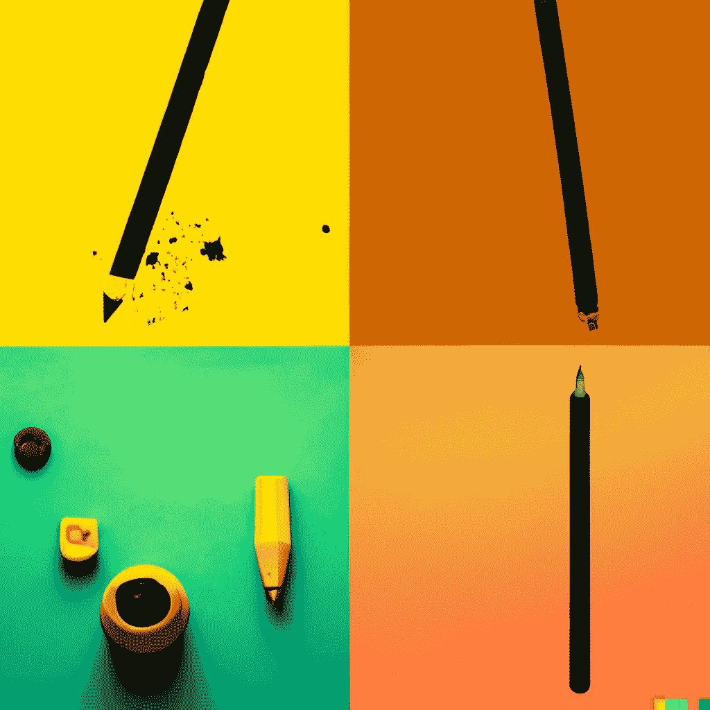

# 人工智能艺术的新规则

> 原文：<https://medium.com/mlearning-ai/the-new-rules-of-ai-art-by-dall-e-2-284ecd2be44c?source=collection_archive---------1----------------------->

## [机器学习艺术](https://mlearning.substack.com)

## 每个用户 50 代— 24H

[*“If you search for knowledge, you might find it here”*](https://mlearning.substack.com)Created with DALL·E, by OpenAI

没有人能否认 [**机器学习**](https://mlearning.substack.com) 的威力，而且它还在不断增长。我们是一个越来越由 AI 驱动的社会，从语音助手到机器人，再到虚拟现实。人工智能艺术家可以在一句话内创造任何风格的图像。这是一个新世界，一个完全不同于…