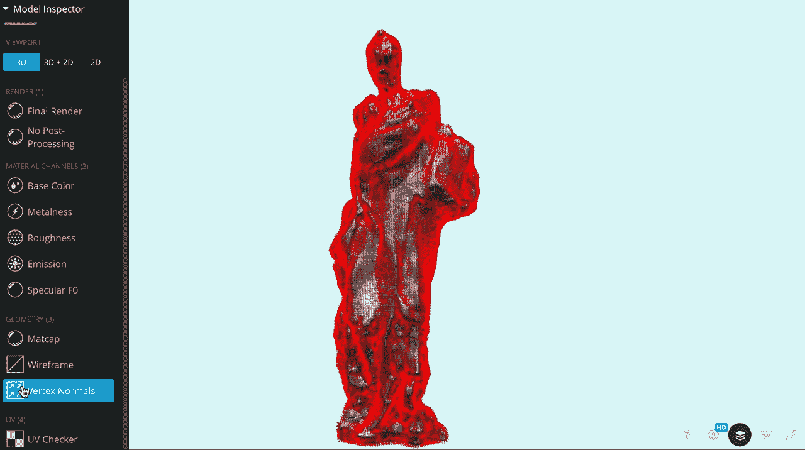

# 🔵人工智能艺术的下一个层次

> 原文：<https://medium.com/mlearning-ai/the-next-level-of-ai-art-9e0a3153d0b8?source=collection_archive---------4----------------------->

## 机器学习艺术

## [虚拟画廊](https://mlearning.substack.com/p/how-to-take-ai-art-to-the-next-level?r=z7zu8&utm_campaign=post&utm_medium=web)

[video generated by MLearning.ai](https://mlearning.substack.com/p/how-to-take-ai-art-to-the-next-level?r=z7zu8&utm_campaign=post&utm_medium=web)

我们生活在一个超加速技术的人工智能时代，我们总是与某种设备相连。连通性让我们更加紧密，增加了我们对彼此的了解，但同时，它也对人们的感受产生了影响。我们消费的艺术品比以往任何时候都多，也从未像现在这样多…